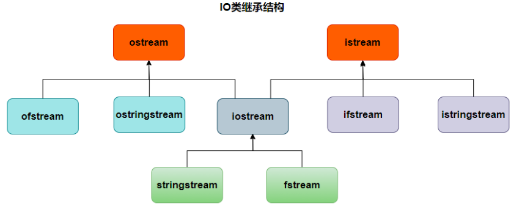

# 一、C++流介绍

## 1、基本概念

> **流（Stream）**：在C++中，IO操作是通过流来完成的。流被看作是从源（如文件、键盘、网络连接等）到目标（如内存、磁盘等）的数据传输通道。

这种通道可以是单向的（如输入流或输出流）或双向的（如支持读写的文件流）。通过流可以实现程序与文件、网络套接字等进行数据交互。

## 2、C++  中的流类库

C++中I/O（输入/输出）标准类定义在`iostream`，`fstream`，`strstream`3个头文件中，对应的是**标准I/O流**、**文件I/O流**、**字符串I/O流**。



### （1）标准I/O流

涉及到与程序的标准输入（`cin`，通常关联着键盘）和标准输出（`cout`，通常关联着屏幕）设备的交互。此外，还包括错误输出流（`cerr`）和日志输出流（`clog`）等。

### （2）文件I/O流

用于读写外部文件。C++提供了如`ifstream`（用于读取文件）、`ofstream`（用于写入文件）和`fstream`（既能读也能写）等类来处理文件操作。

**文件模式：** 文件I/O流默认以覆盖模式打开（ifstream是in、ofstream是out），如果需要追加，要在打开文件`open()`的时候设置相应的模式

| 方式          | 作用                           | ifstream | ofstream | fstream |
| ----------- | ---------------------------- | -------- | -------- | ------- |
| ios::in     | 用输入方式打开，只能读不能写               | √        | ×        | √       |
| ios::out    | 用输出方式打开，只能写不能读               | ×        | √        | √       |
| ios::app    | 以追加的方式打开文件，打开后文件指针在文件尾部，可以改写 | ×        | √        | √       |
| ios::binary | 以二进制方式打开文件                   | √        | √        | √       |

上述参数可以结合运算符`|`一起使用，例如：

`ios::in | ios::out 以读写方式打开文件，对文件可读可写`

`ios::in | ios::binary 以二进制方式打开文件，可以进行读操作`

### （3）字符串I/O流
允许程序将数据读取到或写入到字符串中，主要通过`istringstream`（读取字符串）、`ostringstream`（写入字符串）和`stringstream`（可读写字符串）类实现。

### （4）头文件

- 进行标准I/O操作时使用`iostream`头文件，它包含ios、iostream、istream、ostream等类
- 进行文件I/O操作时使用`fstream`头文件，它包含fstream、ifstream、ofstream和fstreambase等类
- 进行字符串I/O操作时使用`sstream`头文件，它包含istringstream、ostringstream、stringstream等类

# 二、ifstream流

> `ifstream` 是 C++ 标准库中的一个类，用于从文件中读取数据。它是 `istream` 类的派生类，因此继承了所有用于输入操作的功能。使用 `ifstream` 可以打开文件、读取数据，并在完成操作后关闭文件。

## 1、打开文件

首先包含头文件：

```cpp
#include <fstream>
```

### （1）构造函数

方式一：可以直接在创建 `ifstream` 对象时指定文件路径。

```cpp
std::ifstream fd("test.txt") // 输入流默认打开方式就是ios::in
```

### （2）open()函数

方式二：先创建对象，然后使用 `open` 函数指定文件路径和文件打开模式。

```cpp
ifstream inputFile;
inputFile.open("example.txt"); // open函数除了选择路径还可以选择文件的打开模式
```

### （3）状态检查

`fail()` 成员函数用来检查流是否处于失败状态，这包括读取或写入错误、格式匹配错误等情况。如果之前的操作导致流进入失败状态（比如文件打开失败，或者读写操作遇到不可恢复的错误），则`fail()`将返回`true`。此检查广泛用于确定是否出现了任何类型的错误。

```cpp
int main()
{
    ifstream inputFile("data.txt");
    if (inputFile.fail()){
        cerr << "无法打开文件!" << endl;
        return 0;
    }
}
```

**或者用下面这种方法：**

```cpp
if (!inputFile) {
	cerr << "无法打开文件!" << endl;
	return 0;
}
```

这种用法利用了流对象可以直接作为布尔条件表达式的特性。当流对象用作条件时，它会隐式转换为其内部的`bool`值。如果打开成功就是`true`，打开失败就是`false`

## 2、读取数据

### （1）字符读取

`get(ch)`函数用于读取一个字符。其中，`ch` 是一个字符变量，用来接收从文件中读取的字符。如果成功读取到字符，该字符会被存储到 `ch` 中。

```cpp
#include <fstream>
#include <iostream>
using namespace std;

int main()
{
	ifstream inputFile;
	inputFile.open("test.txt");
	if (inputFile.fail())
	{
		cout << "打开文件失败" << endl;
	}
	
	//读取一个字符
	char c;
	inputFile.get(c);
	cout << c << endl;
	
	//连续读取字符，只要还能读取到字符就会一直读
	while (inputFile.get(c))
	{
		cout << c;
	}
	return 0;
}
```

### （2）读取一行

`getline` 函数来自 `<string>` 头文件，专门用于处理 `std::string` 类型。其原型为：

```cpp
std::istream& getline(std::istream& is,std::string& str,chardelim ='\n');
```

读取的文本将存储到字符串中，`delim`：默认分隔符是换行符（`\n`）。

```cpp
#include <fstream>
#include <iostream>
#include <string>
using namespace std;

int main()
{
	ifstream inputFile;
	inputFile.open("test.txt");
	if (inputFile.fail())
	{
		cout << "打开文件失败" << endl;
	}
	
	//读取一行（string库提供的函数）
	string str;
	getline(inputFile, str);
	cout << str << endl;
	
	//连续读取多行
	string str;
	while (getline(inputFile, str))
	{
		cout << str << endl;
	}	
	return 0;
}
```

## 3、提取运算符 (`>>`)

用于输入操作，从流中提取数据。例如，`cin >> variable`会从标准输入设备读取数据并存储到变量中。提取运算符可以**连续使用**，用于从流中顺序读取多个数据项。

**空白跳过**：默认情况下，`>>` 会自动跳过前导空白字符（如空格、制表符、换行符）。

```cpp
//提取运算符（C++中以空白隔开）
string str;
int num;
float test;
inputFile >> num >> test >> str;
```

## 4、关闭流

- **显式关闭**：

```cpp
intputFile.close();
```

- **自动关闭**：当 `ifstream` 对象离开作用域时，流会自动关闭。

# 三、ofstream流

> `ofstream` 类，是 `std::ostream` 的派生类，用于处理文件的输出操作，即写入数据到文件中。

`ofstream` 可以创建新文件或覆盖现有文件并向其写入数据。`ofstream` 在 `<fstream>` 头文件中。

## 1、创建流对象

创建一个 `ofstream` 类型的对象，可以在构造函数中指定文件名，或者先声明后使用 `open()` 函数指定文件。

```cpp
std::ofstream fd("test.txt");//输出流默认打开方式就是ios::out
```

## 2、检查状态

使用 `is_open()` 成员函数检查文件是否成功打开。

```cpp
if (!outputFile.is_open()) {
     std::cerr << "无法打开文件!" << std::endl;
     return 0;
}
```

## 3、写入数据

使用插入运算符 `<<` 向文件写入各种类型的数据，如字符串、数字等。

```cpp
#include <fstream>
#include <iostream>
using namespace std;

int main()
{
	//向文件中写入数据
	std::ofstream outputFile;
	outputFile.open("output.txt", ios::app);
	outputFile << "hello world" << endl;
	
	//利用输出流，复制一个图片文件出来
	ofstream fd,fd2;
	fd.open("aaa.png", ios::binary);
	fd2.open("bbb.png", ios::binary);
	fd2 << fd.rdbuf();//把fd流的数据插入到fd2流里面
	return 0;
}
```

## 4、关闭流

操作完成后，可以通过调用 `close()` 方法手动关闭，也可以在对象生命周期结束时也会自动关闭。

```cpp
outputFile.close();
```


