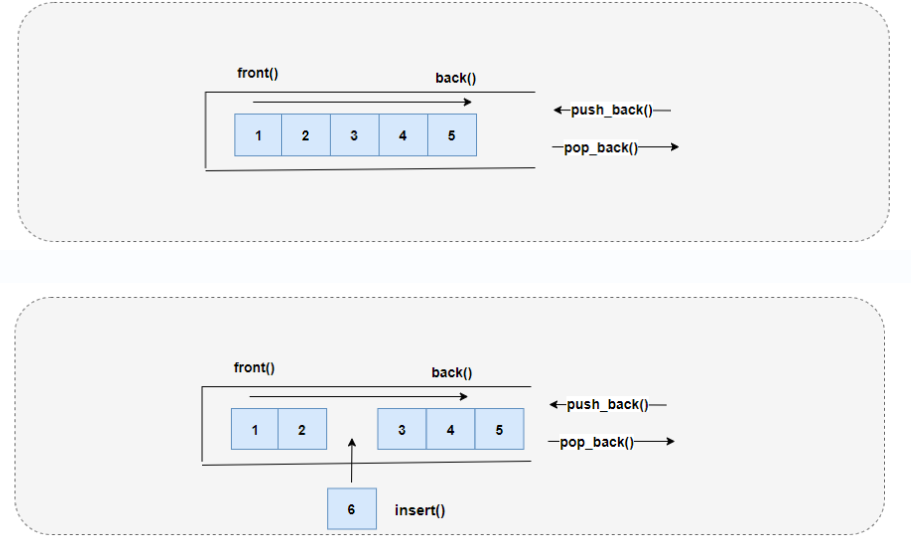
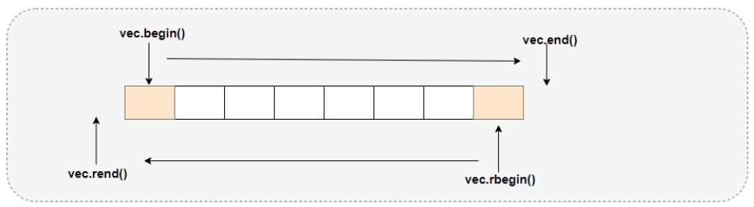
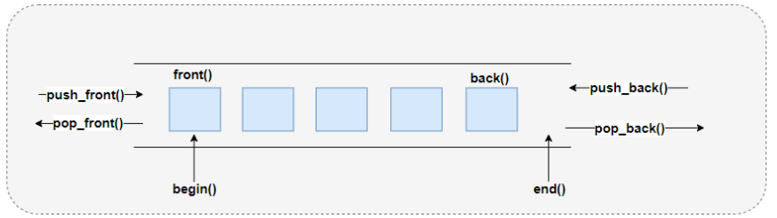

# STL标准模版库

> C++的STL（Standard Template Library，标准模板库）程序库，包含了一系列容器（containers）、迭代器（iterators）、算法（algorithms）、函数对象（function objects）等模板类和函数，用于实现各种常见的数据结构和算法，为程序开发提供了高效、灵活且易于使用的工具。

**STL的特点：**

- **泛型编程**: STL通过模板实现，使代码不依赖于特定的数据类型，大大提高了代码的通用性和复用性。
- **效率**: STL组件设计精良，很多实现都针对性能进行了优化，能提供高效的内存管理和算法执行。

**STL的三大核心组件：**

1. **容器(Container)**: 提供用于存储数据的数据结构，如`vector`、`list`、`deque`、`set`、`map`等。这些容器有不同的特性和用途，比如连续内存分配的`vector`适合随机访问，而双向链表`list`则擅长插入和删除操作。
2. **算法(Algorithm)**: 提供了一系列独立于容器的通用算法，如排序（`sort`）、查找（`find`）、复制（`copy`）等。这些算法通过迭代器（Iterators）与容器交互，使得它们可以在任何支持迭代器的容器上工作。
3. **迭代器(Iterator)**: 是表示容器中元素的指针。迭代器提供了对容器内元素的访问方式，可以分为不同类别，如前向迭代器、双向迭代器和随机访问迭代器。

# 一、vector

> `std::vector`（向量）是C++中最常用的容器之一，是一个**动态数组**容器，它提供了数组的便利性，同时又具备动态调整大小的能力。

`vector`通过向其后端（通过`push_back`方法）进行元素的添加，并且可以通过索引或迭代器进行随机访问元素。适合于需要快速访问元素且主要在容器尾部进行插入和删除操作的场景。



关键特性：

1. **动态扩展**: `vector`在内部管理一块连续的内存空间，用于存储元素。当向`vector`添加元素超出当前容量时，它会自动重新分配内存，从而允许更多的元素插入。
2. **随机访问**: 由于`vector`中的元素是连续存储的，因此可以通过下标直接访问任意元素，就像操作普通数组一样。
3. **迭代器**: `vector`支持向前和向后迭代器，可以用于遍历容器中的元素。
4. **不高效的中间/头部插入和删除**：`vector`可以动态添加和删除元素，在`vector`中间或头部插入和删除元素相对低效，因为需要移动大量元素来保持内存连续性。

## 1、创建vector对象

使用`std::vector`容器，包含`<vector>`头文件。

`vector`是模版类型，在创建的时候需要指定泛型参数：`std::vector<类型> 容器名字;`

```cpp
std::vector<int> test1;//创建一个空容器，不指定大小就是0
std::vector<int> test2(10);//创建一个大小为10的空容器
std::vector<int> test3(10,1);//创建一个大小为10的容器，里面全部初始化为1
std::vector<int> test4{1,2,3,4,5};//创建一个根据放进去的元素，自动推导出大小的容器
```

## 2、添加元素

```cpp
//利用push_back成员函数在容器末尾添加元素
test1.push_back(666);
```

## 3、访问元素

### （1）`at()` 成员函数

```cpp
std::cout << test1.at(0) << std::endl;//利用at函数访问指定偏移位置的元素
```

### （2）`front()` 和 `back()` 成员函数

`front()`返回第一个元素的引用，而`back()`返回最后一个元素的引用。这两种方式不需要传入下标，适用于访问`vector`的首尾元素。

```cpp
std::cout << test1.front() << std::endl;//利用front函数访问头元素
std::cout << test1.back() << std::endl;//利用back函数访问尾元素
```

### （3）下标运算符 `[]`

下标运算符是最直接的访问元素的方式，提供随机访问。

```cpp
std::cout << test1[0] << std::endl;//利用下标访问指定偏移位置的元素
```

### （4） 使用范围for循环遍历

```cpp
//手动指定类型的范围for循环
for (int num : test4)
{
	std::cout << num << "\t";
}

//自动推导类型的范围for循环
std::cout << std::endl;
for (auto num : test4)
{
	std::cout << num << "\t";
}
```

### （5）使用常规下标方式遍历

```cpp
//用下标方式遍历
std::cout << std::endl;
for (int i = 0;i < test4.size();i++)
{
	std::cout << test4[i] << "\t";
}
std::cout << std::endl;
```

## 4、容量大小

- `size()`返回当前存储在`vector`中的元素数量。
- `capacity()`返回`vector`当前分配的内存能容纳多少元素。容量是指vector在不需要重新分配内存的情况下可以容纳的元素数量。

```cpp
std::vector<int> test1;//创建一个空容器，不指定大小就是0
std::vector<int> test2(10);//创建一个大小为10的空容器
std::vector<int> test3(10,1);//创建一个大小为10的容器，里面全部初始化为1
std::vector<int> test4{1,2,3,4,5};//创建一个根据手动放进去的元素，自动推导出大小的容器

//利用size函数查看容器大小
std::cout << test1.size() << std::endl;
std::cout << test2.size() << std::endl;
std::cout << test3.size() << std::endl;
std::cout << test4.size() << std::endl;
```

## 5、迭代器

> 迭代器是访问容器元素的工具，能够遍历容器中的元素。迭代器是模板类型，它类似于一个指针。

每个标准容器（如vector、list、map等）都定义了自己的迭代器类型，并通过成员函数`begin()`和`end()`提供对这些迭代器的访问。

```cpp
//使用手动指定类型std::vector<int>::iterator创建一个迭代器，并为其提供访问地址
std::vector<int>::iterator it1 = test4.begin();

//使用自动推导类型auto创建一个反向迭代器，并为其提供访问地址
auto it2 = test4.rbegin();
```

`begin()`返回指向容器第一个元素的迭代器，`end()`返回指向容器`末端`的迭代器，即超出最后一个元素的位置（所以不要对end解引用，会报错）。



### （1）使用迭代器

使用迭代器访问元素时，需要解引用迭代器。

- `++it` 和 `it++`：前置和后置递增操作，使迭代器指向容器中的下一个元素
- `--it` 和 `it--`：前置和后置递减操作，使迭代器指向容器中的上一个元素
- `*it`：解引用操作，获取迭代器当前指向的元素的值。

```cpp
//使用手动指定类型std::vector<int>::iterator创建一个迭代器
std::vector<int>::iterator it1 = test4.begin();

//通过解引用访问一下容器第一个位置的元素
std::cout << *it1 << std::endl;

//利用迭代器遍历容器
for (;it1 != test4.end();it1++)
{
	std::cout << *it1 << "\t";
}
std::cout << std::endl;
```

### （2）使用反向迭代器

从容器的末尾向前遍历，可以使用反向迭代器。

```cpp
//使用自动推导类型auto创建一个反向迭代器
auto it2 = test4.rbegin();

//通过解引用访问一下反向迭代器的初始元素（就是容器的最后一个位置的元素）
std::cout << *it2 << std::endl;

//利用反向迭代器遍历容器
for (;it2 != test4.rend();it2++)
{
	std::cout << *it2 << "\t";
}
std::cout << std::endl;
```

## 6、插入删除元素

- `insert()`和`erase()`方法可以用于在容器的任意位置添加或删除元素，但请注意，除了在末尾进行的插入和删除，这些操作涉及元素的移动，可能导致性能下降。

### （1）`insert()`函数

```cpp
//利用insert函数在指定位置前面插入元素
//例如begin()+1就是在第二个位置前面插入
test4.insert(test4.begin() + 1, 666);
```

### （2）`pop_back()`函数

```cpp
//利用pop_back函数在容器末尾删除元素
test4.pop_back();
```

### （3）`erase()`函数

用于`删除指定位置`的元素或`删除范围`内的元素。

```cpp
//利用erase删除指定位置元素
//例如begin()+1就是删除第二个
test4.erase(test4.begin() + 1);


//利用erase函数范围删除
//例如begin()到end()就是删除全部
test4.erase(test4.begin(),test4.end());
```

# 二、deque容器

> `std::deque`（发音为 “deck”），全称为 double-ended queue**双端队列**，是C++标准库中的另一种顺序容器，它提供了对序列两端元素的高效插入和删除操作。与`std::vector`相比，`deque`在设计上更侧重于在序列两端进行快速的插入和删除，同时也支持随机访问。



以下是关于`deque`容器的一些关键特点和操作：

**特点：**

1. **双向开口**：`deque`可在两端进行插入和删除操作。
    - `push_back()`和`pop_back()`在容器尾部操作。
    - `push_front()`和`pop_front()`在容器头部操作。
2. **动态大小**：`std::deque`不会预先分配所有可能的最大容量所需的内存，而是根据需要动态地分配和释放内存。
3. **随机访问**：`deque`支持随机访问，可以使用`下标操作符[]和成员函数at()`访问任何元素。

## 1、创建deque

使用`std::deque`容器，包含`<deque>`头文件。

使用默认的构造函数可以创建一个空的`std::deque`容器，或者通过提供一个初始值列表来创建并初始化`std::deque`容器。

```cpp
std::deque<int> test1;//创建一个空的deque
std::deque<int> test2 = {1,2,3,4,5};//创建一个有初始元素的deque
```

## 2、添加元素

使用`push_front()`和`push_back()`成员函数在`std::deque`的前端和后端添加元素。

```cpp
test2.push_front(0);// 在deque的前端添加元素0
test2.push_back(6);// 在deque的后端添加元素6
```

## 3、删除元素

使用`pop_front()`和`pop_back()`成员函数删除`std::deque`的前端和后端的元素

```cpp
test2.pop_front();
test2.pop_back();
```

## 4、访问元素

使用`front()`和`back()`成员函数访问`std::deque`的前端和后端元素，或者使用`下标[]`或`at()`进行随机访问（通常不建议在`deque`上进行随机访问，效率不如`vector`）。

```cpp
std::cout << test2.front() << std::endl;// 访问deque的前端元素
std::cout << test2.back() << std::endl;// 访问deque的后端元素

// 注意：随机访问不是deque的强项，但在需要时可以使用
std::cout << test2.at(2) << std::endl;// 用at()访问中间元素
std::cout << test2[2] << std::endl;//用下标[]访问中间元素
```

## 5、迭代器

使用迭代器来遍历`std::deque`中的元素。

```cpp
std::deque<int>::iterator it1;//手动指定类型方式创建迭代器
it1 = test2.begin();//给迭代器指向deque的头部

//常规for循环方式遍历
for (;it1 != test2.end();it1++)
{
	std::cout << *it1 << "\t";//用解引用拿到数据
}
```

或者使用基于范围的for循环（C++11及以后）：

```cpp
for (auto num : test2)
{
	std::cout << num << "\t";
}
```

## 6、插入和删除特定位置的元素

使用`insert()`和`erase()`成员函数在`std::deque`的特定位置插入或删除元素。

```cpp
test2.insert(test2.begin() + 1, 666);// 在第二个元素前面插入元素666
for (auto num : test2)
{
	std::cout << num << "\t";
}
intDeque.erase(intDeque.begin() + 2); // 删除第二个位置的元素
```

# 三、list容器

> `std::list`是一种**双向链表**容器，它提供了高效地在序列的任何位置进行插入和删除操作的能力。

`std::list`容器适用于频繁进行插入和删除操作，特别是在序列的中间位置，而对随机访问的需求不高的场景。


以下是关于`std::list`的几个关键特性：

- **双向链表结构**：`list`中的每个元素都存储在独立的节点中，每个节点包含数据和两个指针，分别指向前一个节点和后一个节点，形成双向链表结构。这种结构支持插入和删除操作，但不支持随机访问。
- **动态内存管理**：`list`在需要时动态地分配和释放内存，当插入新元素时，只需改变相邻节点的指针即可，无需移动元素，使得在序列中间插入和删除元素非常高效。
    
- **迭代器**：由于链表的非连续内存布局，`list`提供了双向迭代器（而非随机访问迭代器），允许从任一方向遍历列表，但不能通过索引直接访问元素。
    
- **排序与合并**：虽然`list`不支持像`vector`那样的随机访问迭代器，因而不能直接使用`std::sort`，但它提供了自己的成员函数`sort()`进行排序。此外，`list`还提供了`merge()`函数，可以合并两个已排序的`list`。
    
- **空间效率**：相比连续内存的容器（如`vector`），`list`在插入和删除操作上更加高效，因为它不需要移动元素。但每个节点额外存储了指针，因此在内存使用上不如`vector`紧凑。
    

## 1、创建 list 容器

包含 `<list>` 头文件来使用 `std::list`。

创建一个空的 `std::list` 容器，或者用一个初始元素集来创建它：

```cpp
std::list<int> test;// 创建一个空的 list 容器
std::list<int> list = {1,2,3,4,5};// 创建一个包含初始元素的 list 容器
```

## 2、插入元素

使用 `push_front`、`push_back` 或 `insert` 方法添加元素：

```cpp
list.push_front(0);// 在列表前端插入元素
list.push_back(6);// 在列表后端插入元素

//用自动推导类型的方式创建一个迭代器，并传给它首地址
auto it = list.begin();

//list容器中让迭代器移动需要使用std::advance函数：移动一个位置，现在指向第二个元素
std::advance(it, 1);

//在第二个元素之前插入一个元素100
list.insert(it, 100);
```

`std::list<T>`容器的迭代器不支持随机访问操作，不能直接对迭代器使用算术运算符来进行位置的计算，比如 `myList.begin() + 1`。这是因为`std::list`内部是通过双向链表实现的，没有像数组那样的连续内存布局。

## 3、访问元素

使用迭代器或成员函数 `front()` 和 `back()` 来访问 `std::list` 中的元素：

```cpp
std::cout << list.front() << "\t" << list.back() << std::endl;
```

## 4、删除元素

使用 `pop_front()`、`pop_back()` 或 `erase()` 方法来从 `std::list` 中删除元素：

```cpp
list.pop_front();// 删除第一个元素
list.pop_back();// 删除最后一个元素

//让迭代器指向第一个元素
it = list.begin();

//删除迭代器指向的元素
list.erase(it);
```

## 5、遍历 list

用迭代器遍历list

```cpp
for (it = list.begin();it != list.end();it++)
{
	std::cout << *it << "\t";
}
```

范围for循环来遍历

```cpp
for (const auto& num : list)//常引用在提高效率的同时能避免引用修改实参
{
	std::cout << num << "\t";
}
```

## 6、排序和反转

```cpp
list.sort();//使用sort()成员函数排序默认是升序的

list.reverse();//反转链表，就变成降序排序了
```

**总结**

`std::list`容器因其动态内存管理和链表结构，擅长于频繁的插入和删除操作，尤其是在序列中间的操作，而不需要像`std::vector`那样移动大量元素。不支持随机访问。