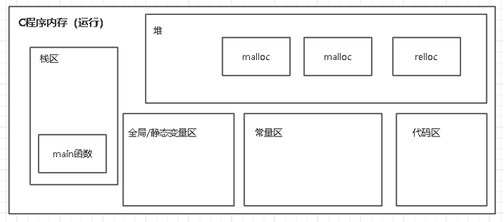

# 头文件
* 内存管理函数的头文件：
```c
#include <stdlib.h>
```
* **free（地址）释放后，纸指向该旧地址的指针并没有释放，要让旧指针=NULL，清除掉指向的位置！
* **memset(void \*str, 单元数量, 单元大小)** 用于将一段内存区域设置为指定的值。
* **新地址=realloc(旧地址,扩容后的大小)**：这里的新地址可以还用旧地址的名字，表示重新分配空间）
* **地址=calloc(单元数量, 单元大小)**：分配内存，内存可以释放，会直接初始化为0（必须手动释放）
* **地址=malloc(空间大小)**：分配内存，内存可以释放，不会初始化（必须手动释放）
* **所以在子函数内创建的变量等，结束后就会被释放掉，必须用malloc或者calloc分配的，然后返回指针才能继续在外面使用**
# 内存划分

## 栈（Stack）： 

**生命周期：** 函数调用时创建栈帧并进行入栈，函数调用结束时进行出 栈及释放函数调用所占内存。 用于存储局部变量和函数调用时的信息。 由编译器自动管理，当一个函数被调用时，其参数和局部变量会被推入栈中；当函数返回时，这些参数和变量会被清除（出栈）。 

**总结：** c程序运行时系统会分配一块空间（固定）来作为栈的数据结 构，栈的每一个数据（栈帧）都是保存函数调用一次要使用的局部变量、函数返回地址、参数等，当任意函数调用时，栈就会创建一个栈帧，该栈帧中就包含该次函数调用要使用的各种数据（局部变量、参数、返回地址），当函数调用完毕，该栈帧就会被释放（出栈），栈帧里面的内容也会被释放。 
## 堆（Heap）： 

**生命周期：** 动态分配时创建，分配的空间必须手动释放，直到程序结束。 用于动态内存分配，程序员可以在运行时使用 realloc 和 malloc , calloc , free 等函数来分配和释放内存。 管理不善会导致内存泄露或碎片化。
## 全局/静态存储区： 

**功能：** 用于存储全局变量和静态变量。 

**生命周期：** 程序启动时创建且大小固定，程序结束时销毁。具体大 小是由c程序的可执行文件来决定。 在程序的整个运行周期内都存在，直到程序结束。 根据全局变量或静态变量是否显性初始化将区域分为bss段和数据段 
* **bss（Block Started by Symbol）段：** 存放的是代码中未初始化的 变量。在程序启动时，操作系统负责将这些变量初始化为默认值 （通常是0或NULL）。 
* **数据段：** 存放的是代码中被初始化的变量
## 代码区（文本区域）： 

**功能：** 存储程序的二进制代码,比如函数等代码。 通常是只读的，尝试写入这部分内存通常会导致程序崩溃。 代码区的大小在程序编译时通常是固定的，因为它包含了程序的实际 可执行指令

**总结：** 程序中可能会用到的函数就会存放在这区域。当要执行某个函数时，程序会在该区域中找到要执行函数的代码，并封装成一个 帧，并给局部变量和参数分配空间（栈中），分配后就进行入栈并执 行函数里的代码。
## 常量区（只读数据段）： 

**功能：** 常量区存储常量数据，如字符串常量以及 用const定义的变量 。
* 尝试修改常量区的数据会导致错误。 
* 在程序运行时大小固定。
## 总结
* 相当于程序在运行的时候只有堆的大小是可以变的，其他的空间在编译完之后就已经确定了
# 内存优化
* 避免不必要的指针
* 动态分配的内存一定要用完释放，并且把指向他的指针设置为NULL
* 数据类型选择正确，不要搞一堆不必要大小的数组
* 考虑结构体字节对齐
* 避免大量递归，空间复杂度太大了
* 可以用sizeof检查一下大小