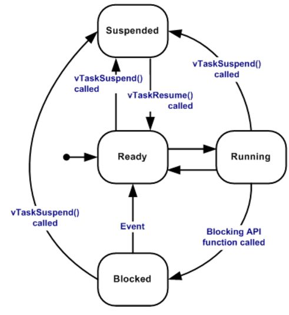

# FreeRTOS简介

是市场领先的面向微控制器和小型微处理器的实时操作系统 (RTOS)。FreeRTOS 通过 MIT 开源许可免费分发，包括一个内核和一组不断丰富的 IoT 库，适用于所有行业领域。FreeRTOS 的构建突出可靠性和易用性。

***
**[FreeRTOS™ - FreeRTOS™](https://www.freertos.org/zh-cn-cmn-s)**

***
## （1）FreeRTOS的特点

1. **任务调度：** FreeRTOS的内核支持抢占式，协同式和时间片调度。
2. **任务通信和同步：** 提供了队列、信号量等机制，支持任务之间的通信和同步，确保数据的
安全传递。
3. **内存管理：** 提供简单的内存管理机制，适用于嵌入式环境，有效利用有限的内存资源。
4. **定时器和中断处理：** 支持定时器功能，能够处理中断，提供了可靠的实时性能。
5. **开发社区：** 拥有庞大的用户社区，开发者可以在社区中获取支持、解决问题，并分享经
验。
6. **可移植性：** 设计注重可移植性，可以轻松地移植到不同的硬件平台，提高了代码的重用
性
## （2）滴答TICK
* 在 FreeRTOS 中，滴答（tick）是一个定时器中断信号，用于控制任务调度的时间基准。滴答是一个固定频率的中断，由系统定时器产生，通常以毫秒为单位（如 1 ms 或 10 ms），具体频率可以在 FreeRTOS 配置中设置。每次滴答发生时，FreeRTOS 的内核会更新内部的时间计数器，这个计数器用于触发任务切换和延时处理 **（因为FreeRTOS使用了系统滴答定时器，所以在使用FreeRTOS系统的时候，就不要用之前自己写的delay了）**
## （3）任务调度器
* 调度器是内核中负责决定在特定时间应执行什么任务的部分。内核可以在任务的生命周期内多次暂停并恢复该任务。

1. FreeRTOS 默认使用固定优先级的 抢占式调度策略 ，对同等优先级的任务执行 时间片轮询 调度：
	* “固定优先级”是指调度器不会永久更改任务的优先级， 但可能会因 优先级继承而暂时提高任务的优先级。
	* “抢占式”是指调度器始终运行优先级最高且可运行的 RTOS 任务。这确保了高优先级任务能够及时响应，并提高了系统的实时性。
	* “轮询调度”是指具有相同优先级的任务轮流进入运行状态。
2. “时间切片”是指调度器会在每个 tick 中断上在同等优先级任务之间进行切换， tick 中断之间的时间构成一个时间切片。（tick 中断是 RTOS 用来衡量时间的周期性中断。）
3. 需要注意的是高优先级的任务并不会一直执行，导致低优先级的任务无法得到执行。如果高优先级任务等待某个资源（延时或等待信号量等）而无法执行，调度器会选择执行其他就绪的高优先级的任务（但是你要搞一个while（1）里面一直在循环执行程序，那肯定是高优先级的一直在运行）

## （4）上下文切换

* 在 FreeRTOS 中，“上下文切换”指的是在运行不同任务之间切换 CPU 执行状态的过程。使得多个任务可以在单个处理器上“并发”执行，尽管实际上它们是交替运行的。
1. **上下文的含义：**
	**CPU 寄存器状态：** 当前任务的寄存器内容（如程序计数器、堆栈指针、通用寄存器等），它们定义了任务的执行位置和状态。
	**堆栈：** 任务的堆栈保存了任务的局部变量、函数调用记录等信息，帮助恢复任务的执行流程。
	**其他状态信息：** 如任务的优先级、任务状态（就绪、阻塞、挂起等）以及其他内核相关的信息。
2. **上下文切换：就是保存当前任务的执行上下文，并恢复下一个任务的执行上下文，以实现任务间的切换。**
3. **上下文切换的触发条件：**
	* **滴答中断：** 如上所述，滴答中断（tick interrupt）是 FreeRTOS 的时间基准。当滴答发生时，系统会检查是否需要切换到优先级更高的任务。
	* **任务延时或阻塞：** 当任务调用延时函数（如 vTaskDelay ）或因等待资源而阻塞（如xQueueReceive ），当前任务会被放入阻塞状态，调度器会切换到另一个就绪任务。
	* **任务优先级变更：** 如果任务的优先级被动态调整，或有新任务被创建、就绪，且其优先级比当前任务高，FreeRTOS 会立即触发上下文切换，以优先执行优先级更高的任务。
	* **其他中断：** 当其他中断（如外部硬件中断）发生时，如果该中断中唤醒了更高优先级的任务，也会触发上下文切换。
4. **上下文切换的步骤：**
	* **保存当前任务的上下文：** 将当前任务的寄存器内容、堆栈指针等状态信息保存到任务控制块（TCB）中，以便在下次调度到该任务时可以恢复它。
	* **调度器选择新任务：** FreeRTOS 的调度器根据任务的优先级和状态（如就绪、阻塞）选择下一个要运行的任务。
	* **恢复新任务的上下文：** 从新任务的任务控制块中加载寄存器内容、堆栈指针等信息，恢复新任务的执行状态。
5. **上下文切换的代价：**
	* 上下文切换会占用一定的 CPU 时间，因为它需要保存和恢复任务的状态，这会带来性能开销，尤其在频繁切换时。因此，FreeRTOS 的设计中注重优化上下文切换的效率，例如通过合理分配任务优先级 、 设置适当的滴答频率 等来减少不必要的切换
## （5）空闲任务
* RTOS 调度器启动时，自动创建空闲任务，以确保始终存在一个能够运行的任务。
* 空闲以最低优先级创建，以确保如果有更高的优先级应用程序任务处于准备就绪状态，空闲任务则不使用任何 CPU 时间。
 * 空闲任务负责释放被删除的任务的内存。
## （6）任务状态

- **运行**
    当任务实际执行时，它被称为处于运行状态。任务当前正在使用处理器。 如果运行 RTOS 的处理器只有一个内核， 那么在任何给定时间内都只能有一个任务处于运行状态。
- **准备就绪**
    准备就绪任务指那些能够执行（它们不处于阻塞或挂起状态）， 但目前没有执行的任务， 因为同等或更高优先级的不同任务已经处于运行状态。
- **阻塞**
    如果任务当前正在等待时间或外部事件，则该任务被认为处于阻塞状态。 例如，如果一个任务调用vTaskDelay()，它将被阻塞（被置于阻塞状态）， 直到延迟结束——一个时间事件。 任务也可以通过阻塞来等待队列、信号量、事件组、通知或信号量 事件。处于阻塞状态的任务通常有一个"超时"期， 超时后任务将被超时，并被解除阻塞， 即使该任务所等待的事件没有发生。“阻塞”状态下的任务不使用任何处理时间，不能 被选择进入运行状态。
- **挂起**
    与“阻塞”状态下的任务一样， “挂起”状态下的任务不能被选择进入运行状态，但处于挂起状态的任务 没有超时。相反，任务只有在分别通过 vTaskSuspend() 和 xTaskResume() API 调用明确命令时 才会进入或退出挂起状态。