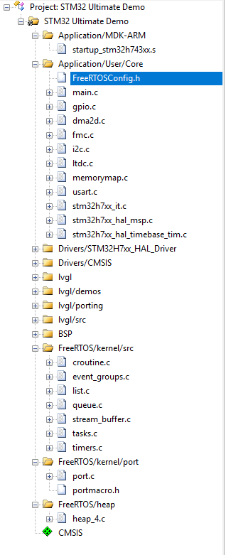
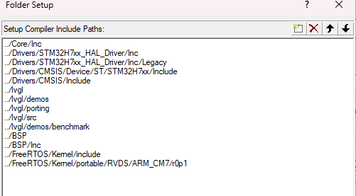

# FreeRTOS+STM32H7（HAL库）

0. 下载`FreeRTOS`源码

***

**[FreeRTOS/FreeRTOS](https://github.com/FreeRTOS/FreeRTOS)**

***

1. 在`FreeRTOS`的`github`仓库下载最新版的`FreeRTOS`源码，并解压
2. 在`FreeRTOS\Demo`目录下面找我们用的芯片的内核型号，比如我用的`STM32H743XIH6`是`Cortex-M7`内核的，我找到了一个文件夹`CORTEX_M7_STM32F7_STM32756G-EVAL_IAR_Keil`打开之后别的都不要，删掉就好，我们只需要一个`FreeRTOSConfig.h`配置文件，后面配置`FreeRTOS的`各项功能和参数都是在这里配置


3. 然后打开`FreeRTOS\Source\portable`目录下面，找到我们用的编译器和内存管理配置文件`MemMang`,我用的是`Keil`的`AC5`编译器，所以保留`RVDS`文件夹（保留`RVDS`是因为`RVDS`实际上就是`Keil`，你打开`Keil`会发现里面是空的）
4. 然后我们打开`RVDS`文件夹找到我们使用的架构`ARM_CM7`文件夹，把别的全删掉就行，打开`MemMang`文件夹然后把里面除了`heap_4.c`的文件全部删掉，因为我们只用这一种内存管理方法，要用别的自行调整
5. 整理后我们的文件夹结构如下，这就是我们需要移植到工程里的所有文件

```c
FreeRTOS
├─ FreeRTOSConfig.h
└─ Source
   ├─ croutine.c
   ├─ event_groups.c
   ├─ list.c
   ├─ queue.c
   ├─ stream_buffer.c
   ├─ tasks.c
   ├─ timers.c
   ├─ portable
   │  ├─ RVDS
   │  │  └─ ARM_CM7
   │  │     └─ r0p1
   │  │        ├─ port.c
   │  │        └─ portmacro.h
   │  └─ MemMang
   │     └─ heap_4.c
   └─ include
      ├─ atomic.h
      ├─ croutine.h
      ├─ deprecated_definitions.h
      ├─ event_groups.h
      ├─ FreeRTOS.h
      ├─ list.h
      ├─ message_buffer.h
      ├─ mpu_prototypes.h
      ├─ mpu_syscall_numbers.h
      ├─ mpu_wrappers.h
      ├─ newlib-freertos.h
      ├─ picolibc-freertos.h
      ├─ portable.h
      ├─ projdefs.h
      ├─ queue.h
      ├─ semphr.h
      ├─ StackMacros.h
      ├─ stack_macros.h
      ├─ stream_buffer.h
      ├─ task.h
      └─ timers.h
```

6. 打开Keil工程，添加组，然后将文件全部添加进去，其中`FreeRTOSConfig.h`属于配置文件，我丢到了`Core`里，放哪都可以



7. 配置完记得加上包含路径



8. 打开`FreeRTOSConfig.h`配置文件，然后将下面的几行中断回调函数注释掉，然后记得包含上`stm32h7xx_hal.h`这个`hal`库头文件，然后将没用的函数都注释掉

```c
/* Definitions that map the FreeRTOS port interrupt handlers to their CMSIS
standard names. */
// #define xPortPendSVHandler PendSV_Handler   //注释掉
// #define vPortSVCHandler SVC_Handler         //注释掉
// #define xPortSysTickHandler SysTick_Handler //注释掉 

/* Prevent the inclusion of items the assembler will not understand in assembly
files. */
#ifndef __IAR_SYSTEMS_ASM__

/* Library includes. */
#include "stm32h7xx_hal.h" //记得包含hal库头文件

// extern uint32_t SystemCoreClock;

/* Normal assert() semantics without relying on the provision of an assert.h
header file. */
// extern void vAssertCalled(uint32_t ulLine, const char *pcFile);
//  #define configASSERT( x ) if( ( x ) == 0 ) vAssertCalled( __LINE__, __FILE__ )
// #define configASSERT(x)

#endif /* __IAR_SYSTEMS_ASM__ */

#endif /* FREERTOS_CONFIG_H */
```

9. 打开`stm32h7xx_it.c`我们要修改上一步注释掉的三个函数的位置，这三个函数是`FreeRTOS`实现调度的核心！！！首先要包含`FreeRTOS.h`的头文件，然后要在文件内找到它们对应的回调函数，把`FreeRTOS的`中断回调函数放进去

```c
#include "FreeRTOS.h"//添加头文件
#include "task.h"//添加头文件

void SVC_Handler(void)
{
  vPortSVCHandler();//将中断回调函数放入对应位置
}

void PendSV_Handler(void)
{
  xPortPendSVHandler();//将中断回调函数放入对应位置
}

void SysTick_Handler(void)
{
    xPortSysTickHandler();//将中断回调函数放入对应位置
}
```

10. 在`main()`函数内创建任务，打开调度器，然后编译运行

```c
int main(void)
{
  MPU_Config();
  SCB_EnableICache();
  SCB_EnableDCache();
  HAL_Init();
  SystemClock_Config();
  MX_GPIO_Init();
  MX_DMA2D_Init();
  MX_I2C1_Init();
  MX_LTDC_Init();
  MX_USART1_UART_Init();
  MX_FMC_Init();
  BSP_Init();

  //创建第一个任务
  xTaskCreate(
      MyLVGLFunction, // 任务函数
      "lvglTask",     // 任务名称
      4096,       // 栈大小
      NULL,           // 传入任务的参数
      2,              // 优先级
      NULL            // 任务句柄
  );

  //创建第二个任务
  xTaskCreate(
      MyDEBUGFunction, // 任务函数
      "debugTask",     // 任务名称
      128,         // 栈大小
      NULL,            // 传入任务的参数
      1,               // 优先级
      NULL             // 任务句柄
  );

  //打开调度器
  vTaskStartScheduler();
  while (1)
  {
  }
}
```

11. 编译运行后会发现两个任务都开始工作了，至此移植完成，如果编译不通过有可能是配置问题比如内存溢出这种问题，需要调整任务栈的分配和`FreeRTOSConfig.h`里面的内存堆的分配，内存不能超过单片机本身的最大`RAM`，如果单片机的`RAM`区域不连续，则要考虑内存的边界问题，下面这是配置文件各项配置的说明

*****

**[定制 - FreeRTOS™](https://www.freertos.org/zh-cn-cmn-s/Documentation/02-Kernel/03-Supported-devices/02-Customization)**

***

```c
#ifndef FREERTOS_CONFIG_H
#define FREERTOS_CONFIG_H

#define configUSE_PREEMPTION					1 /* 使能抢占式内核（1=抢占式，0=协作式） */
#define configUSE_PORT_OPTIMISED_TASK_SELECTION	1 /* 使用端口优化的任务就绪选择以降低调度开销 */
#define configUSE_QUEUE_SETS					1 /* 使能队列集合功能（可等待多个队列/信号量） */
#define configUSE_IDLE_HOOK						0 /* 空闲任务钩子（1=调用用户idle钩子） */
#define configUSE_TICK_HOOK						1 /* 系统节拍中断钩子（每个tick回调） */
#define configCPU_CLOCK_HZ						( SystemCoreClock ) /* CPU时钟频率（Hz） */
#define configTICK_RATE_HZ						( 1000 ) /* 每秒tick数（时间分辨率/功耗权衡） */
#define configMAX_PRIORITIES					( 5 ) /* 可用任务优先级数量（0~N-1） */
#define configMINIMAL_STACK_SIZE					( ( unsigned short ) 130 ) /* 最小任务栈（以栈单位计，端口相关） */
#define configTOTAL_HEAP_SIZE						( ( size_t ) ( 46 * 1024 ) ) /* 动态内存堆大小（字节） */
#define configMAX_TASK_NAME_LEN						( 10 ) /* 任务名最大长度（含'\0'） */
#define configUSE_TRACE_FACILITY					1 /* 使能跟踪设施（调试/分析，如任务列表与运行统计） */
#define configUSE_16_BIT_TICKS						0 /* tick计数是否使用16位（1）或32位（0） */
#define configIDLE_SHOULD_YIELD						1 /* 空闲任务是否在同优先级下让出CPU */
#define configUSE_MUTEXES							1 /* 使能互斥量（含优先级继承） */
#define configQUEUE_REGISTRY_SIZE					8 /* 队列注册表大小（便于调试命名） */
#define configCHECK_FOR_STACK_OVERFLOW				2 /* 栈溢出检查：0关闭，1/2为不同检查策略（需实现钩子） */
#define configUSE_RECURSIVE_MUTEXES					1 /* 使能递归互斥量 */
#define configUSE_MALLOC_FAILED_HOOK					1 /* 使能内存分配失败钩子 */
#define configUSE_APPLICATION_TASK_TAG				0 /* 任务应用标签（调试/跟踪） */
#define configUSE_COUNTING_SEMAPHORES					1 /* 使能计数型信号量 */

#define configUSE_TICKLESS_IDLE						0 /* 使能Tickless空闲（低功耗） */

#define configGENERATE_RUN_TIME_STATS	0 /* 生成运行时间统计（需提供高精度时基/回调） */

#define configUSE_STATS_FORMATTING_FUNCTIONS	1 /* 包含统计信息格式化函数（如vTaskList等） */

#define configUSE_CO_ROUTINES 			0 /* 使能协程功能 */
#define configMAX_CO_ROUTINE_PRIORITIES ( 2 ) /* 协程优先级数量 */

#define configUSE_TIMERS				1 /* 使能软件定时器 */
#define configTIMER_TASK_PRIORITY		( configMAX_PRIORITIES - 1 ) /* 定时器服务任务优先级 */
#define configTIMER_QUEUE_LENGTH		5 /* 定时器命令队列长度 */
#define configTIMER_TASK_STACK_DEPTH	( configMINIMAL_STACK_SIZE * 2 ) /* 定时器服务任务栈深度 */

#define INCLUDE_vTaskPrioritySet		1 /* 是否包含vTaskPrioritySet API */
#define INCLUDE_uxTaskPriorityGet		1 /* 是否包含uxTaskPriorityGet API */
#define INCLUDE_vTaskDelete				1 /* 是否包含vTaskDelete API */
#define INCLUDE_vTaskCleanUpResources	1 /* 是否包含vTaskCleanUpResources API */
#define INCLUDE_vTaskSuspend			1 /* 是否包含vTaskSuspend API */
#define INCLUDE_vTaskDelayUntil			1 /* 是否包含vTaskDelayUntil API */
#define INCLUDE_vTaskDelay				1 /* 是否包含vTaskDelay API */
#define INCLUDE_eTaskGetState			1 /* 是否包含eTaskGetState API */
#define INCLUDE_xTimerPendFunctionCall	1 /* 是否包含xTimerPendFunctionCall API */

#ifdef __NVIC_PRIO_BITS
	#define configPRIO_BITS        		__NVIC_PRIO_BITS /* NVIC优先级位数（来自CMSIS） */
#else
	#define configPRIO_BITS       		4        /* 15 priority levels */ /* NVIC优先级位数=4（16级） */
#endif

#define configLIBRARY_LOWEST_INTERRUPT_PRIORITY				15 /* 库尺度最低中断优先级（数值大=优先级低） */

#define configLIBRARY_MAX_SYSCALL_INTERRUPT_PRIORITY	4 /* 可调用内核安全API的最高中断优先级（数值更小=更高优先级） */

#define configKERNEL_INTERRUPT_PRIORITY 		( configLIBRARY_LOWEST_INTERRUPT_PRIORITY << (8 - configPRIO_BITS) ) /* 内核中断优先级（写入寄存器的实际值） */

#define configMAX_SYSCALL_INTERRUPT_PRIORITY 	( configLIBRARY_MAX_SYSCALL_INTERRUPT_PRIORITY << (8 - configPRIO_BITS) ) /* 可调用内核API的最高中断优先级（实际值） */

#define xPortPendSVHandler PendSV_Handler /* 将端口的PendSV处理函数映射到CMSIS名称 */
#define vPortSVCHandler SVC_Handler /* 将端口的SVC处理函数映射到CMSIS名称 */
#define xPortSysTickHandler SysTick_Handler /* 将端口的SysTick处理函数映射到CMSIS名称 */

#ifndef __IAR_SYSTEMS_ASM__
	#include "stm32f7xx_hal.h" /* STM32F7 HAL头文件（平台相关） */
	extern uint32_t SystemCoreClock; /* 系统核心时钟频率（Hz） */
	extern void vAssertCalled( uint32_t ulLine, const char *pcFile ); /* 断言失败时的回调（行号/文件） */
	#define configASSERT( x ) if( ( x ) == 0 ) vAssertCalled( __LINE__, __FILE__ ) /* 运行时断言（失败则调用vAssertCalled） */
#endif

#endif
```


