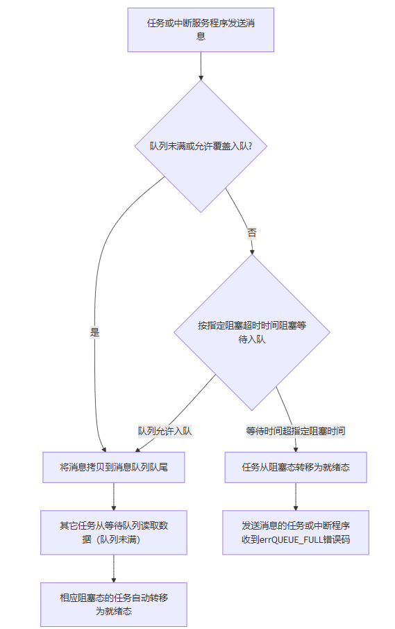

# 队列简介
队列又称**消息队列**， 是一种常用于任务间通信的数据结构，队列可以在任务与任务间、 中断和任务间传递信息， 实现了任务接收来自其他任务或中断的不固定长度的消息。

* 消息支持先进先出的方式排队，支持异步读写的工作方式；
* 读写队列均支持超时机制；
* 消息支持后进先出方式排队，即直接往队首发送消息（LIFO）；
* 允许不同长度（不超过队列节点最大值）的任意类型消息；
* 一个任务能够与任意一个消息队列接收和发送消息的操作；
* 多个任务能够与同一个消息队列接收和发送消息的操作；
* 当队列使用结束后，可以通过删除队列函数进行删除函数；
* 消息队内存大小=消息队列控制块大小加上+（单个消息空间大小\*消息队列长度的乘积）
* 假如有多个任务阻塞在一个消息队列中，那么这些阻塞的任务将按照任务优先级进行排序， 优先级高的任务将优先获得队列的访问权

# 队列流程图



# 头文件

```c
#include "queue.h"
```

# 创建队列
```c
//创建队列句柄
QueueHandle_t xSerialMesQueue1;

//消息队列创建函数  
QueueHandle_t xQueueCreate
( 
UBaseType_t uxQueueLength, // 队列的最大长度（即队列中可容纳的最大项数） UBaseType_t uxItemSize // 每个队列项的大小（以字节为单位） 
);
//如果成功创建，则返回队列句柄 (QueueHandle_t)；如果失败，则返回 NULL。
```
# 发送数据到队列
```c
BaseType_t xQueueSend
( 
QueueHandle_t xQueue, // 队列句柄 
const void *pvItem, // 指向要发送的数据项的指针 
TickType_t xTicksToWait // 等待时间（0表示不等待，portMAX_DELAY 表示无限期等待） 
);
//返回值：pdTRUE：成功发送。pdFALSE：在指定时间内未能发送。
```
# 在中断中发送数据到队列
```c
BaseType_t xHigherPriorityTaskWoken = pdFALSE;

BaseType_t xQueueSendFromISR
( 
QueueHandle_t xQueue, // 队列句柄 
const void *pvItem, // 指向要发送的数据项的指针 
BaseType_t *pxHigherPriorityTaskWoken 
/* 推荐设置为 pdfalse,由系统接管该参数; 
如果没有更高优先级的任务被唤醒，则该参数保持为 pdFALSE。
如果有更高优先级的任务被唤醒，则 FreeRTOS系统会 将其设置为 pdTRUE（通常定义为 1）
*/
);
//返回值：pdTRUE：成功发送。pdFALSE：在指定时间内未能发送。
```
## 中断中发送示例代码（演示pxHigherPriorityTaskWoken参数）
```c
#include "FreeRTOS.h"
#include "queue.h"
#include "semphr.h"

// 假设我们有一个全局队列句柄 xQueue 已经创建

void 中断服务程序(void) {
    BaseType_t xHigherPriorityTaskWoken = pdFALSE;
    UBaseType_t data = 42;

    // 尝试将数据发送到队列
	if (xQueueSendFromISR(xQueue, &data, &xHigherPriorityTaskWoken) != pdPASS)     {
        // 发送失败处理
    }
    // 检查是否有更高优先级的任务被唤醒，如果有的话系统会将他设置为pdTRUE的
    if (xHigherPriorityTaskWoken == pdTRUE) 
    {
        // 请求从中断返回时进行上下文切换（请求系统调度）
        portYIELD_FROM_ISR();
    }
}
```
# 从队列接收数据
```c
BaseType_t xQueueReceive
( 
QueueHandle_t xQueue, // 队列句柄 
void *pvBuffer, // 指向接收缓冲区的指针 
TickType_t xTicksToWait // 等待时间（0表示不等待，`portMAX_DELAY` 表示无限期等待） );
//返回值：pdTRUE：成功接收。pdFALSE：在指定时间内未能接收。
```
# 在中断中从队列接收数据
```c
BaseType_t xQueueReceiveFromISR
( 
QueueHandle_t xQueue, // 队列句柄 
void *pvBuffer, // 指向接收缓冲区的指针 
BaseType_t *pxHigherPriorityTaskWoken // 如果设置为 pdTRUE，则唤醒更高优先级的任务 );
//返回值：pdTRUE：成功接收。pdFALSE：在指定时间内未能接收。
```
# 删除队列
```c
void vQueueDelete( QueueHandle_t xQueue // 队列句柄 );
```
