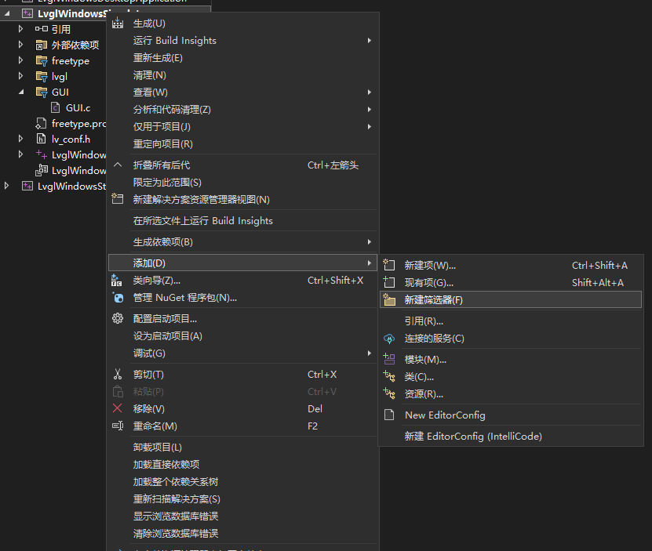

# 一、Windows模拟器安装

> LVGL是一个嵌入式图形库，为了方便开发LVGL，我们可以先在Windows上面搭建模拟器环境来开发，然后把写好的代码复制到嵌入式环境下，省去烧录环节，提高开发效率

1. **下载安装 `Visual Studio Community 2022`，安装的时候要把 `使用C++的桌面开发` 勾选上，其余的看个人需求，随意，记得安装位置不要选C盘，自己换个合适的位置**


2. **安装完之后在开始菜单找到 `Visual Studio Installer` ，新增组件，搜索 `2019`，安装如下几个组件（因为官方的模拟器是基于VS2019开发的，需要把环境配置好才行）**


3. **在LVGL官方仓库下载VS模拟器`源码`**

* [https://github.com/lvgl/lv_port_pc_visual_studio](https://github.com/lvgl/lv_port_pc_visual_studio)

* 直接下载压缩包然后解压到想要的文件夹就好


* 解压后可以发现在压缩包的 LvglPlatform 文件夹内部的 freetype 和 lvgl 文件夹里面是空的，需要在 github 仓库下载下来

* lvgl 源码可以在 lvgl 官方仓库下载自己要使用的版本的**`发行版`**，然后解压后复制文件夹里的内容到模拟器对应的文件夹里就好
* [https://github.com/lvgl/lvgl](https://github.com/lvgl/lvgl)
* freetype 需要在官方仓库下载**`源码`**的压缩包，然后解压后直接复制文件夹里的内容到模拟器对应的文件夹里就好
* [https://github.com/freetype/freetype](https://github.com/freetype/freetype)

4. **点击模拟器文件夹内的 LVGL.sln 然后用 VS2022 打开这个工程**


5. **把架构改成自己电脑的 x64 架构，把显示屏的 800*480 尺寸也改成自己要使用的尺寸**


6. **点击运行**


# 二、添加用户代码GUI文件

1. **在模拟器文件夹里新建一个GUI文件夹，建立自己的 .h .c 文件**


2. **在VS里新建筛选器，名字随意就叫GUI就好了**



3. **建立好筛选器后右键筛选器添加现有项或者新建项，然后把自己建立的文件添加进来**


4. **注意：`如果添加的是C语言文件一定要加条件编译！！！否则会出错`**

```c
#ifndef _GUI_H
#define _GUI_H

#include "lvgl/lvgl.h"
#include "lvgl/examples/lv_examples.h"
#include "lvgl/demos/lv_demos.h"

#ifdef __cplusplus
extern "C" {
#endif

void GUI_Init();

#ifdef __cplusplus
}
#endif

#endif

```

5. **在模拟器项目处右键属性，添加VC++包含目录，利用相对路径的方式把刚刚添加的文件夹包含进去**


6. **最后把GUI.h文件按相对路径的方式包含到模拟器的.CPP文件里，然后把GUI入口函数放到main里面，编译运行即可**

   ```c
   #include "../GUI/GUI.h"
   ```


