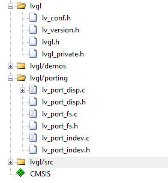
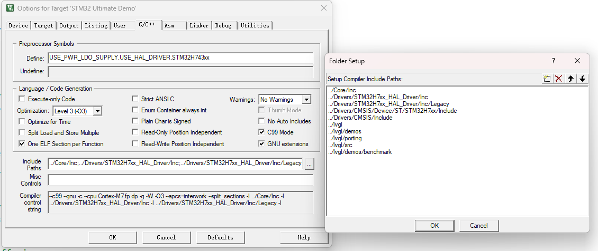

# 一、关键点

> LVGL在STM32上的的移植在主要需要实现的API接口如下，可以根据自己需要实现的功能自行选择：
>
> * `lv_port_disp`里的显示适配
> * `lv_port_indev`里的输入设备适配
> * `lv_port_fs`里的文件系统适配


# 二、移植方法

> 由于STM32对于屏幕的驱动方式有各种各样，有用LTDC直接驱动RGBLCD屏的，也有用FSMC/FMC模拟并口时序驱动的LCD屏，也有通过SPI甚至I2C驱动的MCU屏。而且MCU有没有图形加速GPU，有没有外置的SDRAM，综上所述这些因素都会影响到移植，所以不同的硬件移植方法略有差异,但是需要实现的核心是不变的，那就是实现三个关键点的显示适配:`lv_port_disp``lv_port_indev` `lv_port_fs`

## 1.LTDC+DMA2D+SDRAM(FMC)

> 本节介绍:
>
> * STM32H7通过LTDC驱动的RGBLCD屏，通过FMC总线驱动的SDRAM，如何来移植LVGL
> * 并且借助图形加速器DMA2D加速渲染，并且启用H7的MPU还有Cache达到较高帧率的优化方法
> * 采用LVGL局部双缓冲+LTDC双显存的方案，达到运行效率、内存占用、显示效果的平衡点

1. 根据自己的硬件平台，配置好LTDC的参数以及图层的参数与色彩格式，然后配置好DMA2D的参数与色彩格式，最后要配置好FMC总线的时序，确保能成功驱动起来SDRAM，这一步属于STM32的外设配置，不在此赘述。
2. 从LVGL官网下载想选用的LVGL的发行版，我这里用的是LVGL 9.4版，解压后删除没用的文件夹和文件，只留下以下文件（带有_template的是官方给的模版文件，记得去掉文件名里的_template，并且在源码里的包含路径里凡是涉及到的位置全部做出修改）

```c
lvgl
├─ lvgl.h
├─ lvgl_private.h
├─ lv_conf.h
├─ lv_version.h
├─ src	//完整文件夹
├─ porting	//只留下以下文件
│  ├─ lv_port_disp.c
│  ├─ lv_port_disp.h
│  ├─ lv_port_fs.c
│  ├─ lv_port_fs.h
│  ├─ lv_port_indev.c
│  └─ lv_port_indev.h
└─ demos	//完整文件夹
```

3. 打开MDK，添加如下四个组，并将对应文件夹里的的文件全部添加到组里
   * lvgl 
   * lvgl/demos 
   * lvgl/src 
   * lvgl/porting



4. 添加包含路径，我这里使用到了benchmark的demo，所以也要添加，不用的话不添加



5. 在定时器中断或者systick中断中每隔1毫秒调用一次lvgl时基函数lv_tick_inc(1)，用来给LVGL图形库提供时间

```c
void HAL_TIM_PeriodElapsedCallback(TIM_HandleTypeDef *htim)
{

  if (htim->Instance == TIM6)
  {
    HAL_IncTick();
    lv_tick_inc(1);//LVGL图形库时基函数
  }
}
```

6. 在主程序初始化环境调用lv_init()，用来初始化LVGL图形库，然后在循环内调用lv_timer_handler()，用来处理LVGL的定时器系统。记得添加头文件以及添加接口函数。

```c
#include <stdio.h>//添加头文件
#include "dma2d.h"//添加头文件
#include "lvgl.h"//添加头文件
#include "lv_port_disp.h"//添加头文件
#include "lv_port_indev.h"//添加头文件
#include "lv_demo_benchmark.h"//添加头文件
int main(void)
{
  MPU_Config();
  SCB_EnableICache();
  SCB_EnableDCache();
  HAL_Init();

  SystemClock_Config();

  MX_GPIO_Init();
  MX_DMA2D_Init();
  MX_I2C1_Init();
  MX_LTDC_Init();
  MX_USART1_UART_Init();
  MX_FMC_Init();

  lv_init();//初始化LVGL图形库
    
  lv_port_disp_init();//添加显示接口初始化函数
  lv_demo_benchmark();//添加跑分demo

  while (1)
  {

    lv_timer_handler();//处理LVGL的定时器系统
  }
}
```

7. 修改文件，把两个文件的#if 0改成#if 1启用文件，然后把相关的头文件添加进来，然后根据自己屏幕修改分辨率和色彩格式，然后添加几个我们需要的变量
   * lv_port_disp.c
   * lv_port_disp.h

```c
/**
 * @file lv_port_disp.c
 *
 */

/*Copy this file as "lv_port_disp.c" and set this value to "1" to enable content*/
#if 1//#if 0 改成#if 1

/*********************
 *      INCLUDES
 *********************/
#include "lv_port_disp.h"
#include <stdbool.h>//添加头文件
#include <string.h>//添加头文件
#include "lvgl.h"//添加头文件
#include "ltdc.h"//添加头文件
#include "dma2d.h"//添加头文件

/*********************
 *      DEFINES
 *********************/
#ifndef MY_DISP_HOR_RES
#warning Please define or replace the macro MY_DISP_HOR_RES with the actual screen width, default value 320 is used for now.
#define MY_DISP_HOR_RES 800//屏幕的宽度
#endif

#ifndef MY_DISP_VER_RES
#warning Please define or replace the macro MY_DISP_VER_RES with the actual screen height, default value 240 is used for now.
#define MY_DISP_VER_RES 480//屏幕的高度
#endif

#define BYTE_PER_PIXEL (LV_COLOR_FORMAT_GET_SIZE(LV_COLOR_FORMAT_RGB888)) //色彩格式

/**********************
 *      TYPEDEFS
 **********************/

/**********************
 *  STATIC PROTOTYPES
 **********************/
static void disp_init(void);
static void disp_flush(lv_display_t *disp, const lv_area_t *area, uint8_t *px_map);

/**********************
 *  STATIC VARIABLES
 **********************/
lv_display_t *disp;//添加lv_display_t 全局变量，用于在别的文件中使用该接口 
volatile bool FirstFrameReady = false;//添加LTDC显存帧地址切换标志1，我们采用在垂直消隐期间双显存切换地址的方式来避免撕裂
volatile bool SecondFrameReady = false;//添加LTDC显存帧地址切换标志2，我们采用在垂直消隐期间双显存切换地址的方式来避免撕裂
uint32_t FrameBuffer = 0xC0000000;//添加显存地址变量，动态切换显存地址
```

8. 然后在lv_port_disp_init()函数中开始LVGL局部双缓冲，这是显示效果和内存占用运行效率的平衡点，如果想更高帧率就全屏双缓冲，但是会占用大量内存，而且渲染压力也会上升

```c
void lv_port_disp_init(void)
{
    disp_init();
    disp = lv_display_create(MY_DISP_HOR_RES, MY_DISP_VER_RES);//此处记得使用上面的全局变量，把原本的lv_display_t * 删掉
    lv_display_set_flush_cb(disp, disp_flush);

    LV_ATTRIBUTE_MEM_ALIGN
    static uint8_t buf_2_1[MY_DISP_HOR_RES * 80 * BYTE_PER_PIXEL] __attribute__((at(0x24000000)));//第一个缓冲区的起始地址要设置好，选择MCU内部的合适区域

    LV_ATTRIBUTE_MEM_ALIGN
    static uint8_t buf_2_2[MY_DISP_HOR_RES * 80 * BYTE_PER_PIXEL] __attribute__((at(0x24000000 + MY_DISP_HOR_RES * 80 * BYTE_PER_PIXEL)));//第二个缓冲区的起始地址要设置好，保证不与第一个重叠，总大小又不超出MCU内存区域
    lv_display_set_buffers(disp, buf_2_1, buf_2_2, sizeof(buf_2_1), LV_DISPLAY_RENDER_MODE_PARTIAL);
}
```

9. 修改初始化时候的清屏函数disp_init()

```c
static void disp_init(void)
{
    memset((uint8_t *)0xC0000000, 0x0000, MY_DISP_HOR_RES * MY_DISP_VER_RES * 3); // 开机清屏，全黑
}
```

10. 首先打开ltdc.c文件配置一个行中断使能，然后在lv_port_disp.c中添加一个LTDC行中断回调函数，我们配置的行中断要在垂直消隐期的开始时刻进入中断，然后我们就能在垂直消隐期中切换显存地址然后快速刷好屏幕了

```c
//首先记得在初始化函数中打开行中断，行数为垂直消隐期的开始行数，计算方法为：VSYNC_W + VBP + Height
HAL_LTDC_ProgramLineEvent(&hltdc, 515);
HAL_NVIC_SetPriority(LTDC_IRQn, 0, 0);
HAL_NVIC_EnableIRQ(LTDC_IRQn);
```

```c
//lv_port_disp.c中添加一个LTDC行中断回调函数
void HAL_LTDC_LineEvenCallback(LTDC_HandleTypeDef *hltdc)
{
    // 重新载入参数，新显存地址生效，此时显示才会更新
    // 每次进入中断才会更新显示，这样能有效避免撕裂现象
    __HAL_LTDC_RELOAD_CONFIG(hltdc);
    HAL_LTDC_ProgramLineEvent(hltdc, 515); // 重新设置中断
}
```

11. 修改disp_flush()函数，实现核心刷屏和显存切换逻辑

```c
static void disp_flush(lv_display_t *disp_drv, const lv_area_t *area, uint8_t *px_map)
{
    if (disp_flush_enabled)
    {
        //调用dma2d.c文件里定义的刷屏函数，利用DMA2D快速将缓冲区的内容刷到到显存里
        ltdc_color_fill(area->x1, area->y1, area->x2, area->y2, (uint32_t *)px_map, FrameBuffer);
    }

    //显存地址动态切换
    if (lv_disp_flush_is_last(disp))
    {
        //两个显存区域的首地址计算好，不能重叠，至少要相距一个帧（宽*高*色彩格式）的字节数：800*480*3（RGB888一个像素点占三个字节）
        if (FrameBuffer == 0xC0000000)
        {
            FirstFrameReady = true;
            LTDC_Layer1->CFBAR = FrameBuffer;
            FrameBuffer = 0xC0119400;
        }
        else if (FrameBuffer == 0xC0119400)
        {
            SecondFrameReady = true;
            LTDC_Layer1->CFBAR = FrameBuffer;
            FrameBuffer = 0xC0000000;
        }
    }
}
```

12. 首先在dma2d.h中声明刷屏函数，并在dma2d.c中实现，记得同时打开DMA2D中断

```c
//首先记得在初始化函数中启用DMA2D的中断
HAL_NVIC_SetPriority(DMA2D_IRQn, 0, 0);
HAL_NVIC_EnableIRQ(DMA2D_IRQn);

void ltdc_color_fill(uint16_t x1, uint16_t y1, uint16_t x2, uint16_t y2, uint32_t *px_map, uint32_t framebuffer)
{
  uint16_t offline;
  uint32_t addr;

  // 行偏移：按字节计算，RGB888每个像素3字节
  offline = (800 - (x2 - x1 + 1)) * 3;

  // 地址计算：RGB888每个像素3字节
  addr = ((uint32_t)framebuffer + 3 * (800 * y1 + x1));

  SCB_CleanInvalidateDCache(); /*打开MPU的Cache加速数据传输*/
  __HAL_RCC_DMA2D_CLK_ENABLE(); /* 使能DM2D时钟 */

  DMA2D->CR &= ~(DMA2D_CR_START);            /* 先停止DMA2D */
  DMA2D->CR = DMA2D_M2M;                     /* 存储器到存储器模式 */
  DMA2D->FGPFCCR = LTDC_PIXEL_FORMAT_RGB888; /* RGB888格式 */
  DMA2D->FGOR = 0;                           /* 前景层行偏移为0 */
  DMA2D->OOR = offline;                      /* 设置行偏移 */

  DMA2D->FGMAR = (uint32_t)px_map;                    /* 源地址 */
  DMA2D->OMAR = addr;                                 /* 输出存储器地址 */
  DMA2D->NLR = (y2 - y1 + 1) | ((x2 - x1 + 1) << 16); /* 设定行数寄存器 */
  DMA2D->CR |= DMA2D_CR_START;                        /* 启动DMA2D */

  __HAL_DMA2D_ENABLE_IT(&hdma2d, DMA2D_IT_TC);
  __HAL_DMA2D_ENABLE(&hdma2d);
}
```

13. 在stm32h7xx_it.c中添加头文件和声明外部全局变量，然后在DMA2D传输完成中断里再通知LVGL当前帧传输结束，可以开启下一帧的传输了

```c
#include "lv_port_disp.h"//添加头文件
extern lv_display_t *disp;//声明外部全局变量

void DMA2D_IRQHandler(void)
{
  if (DMA2D->ISR & (DMA2D_FLAG_TC)) //判断是否进入传输完成中断
  {
    lv_display_flush_ready(disp); //如果传输完成就通知LVGL开始下一帧传输
  }
}
```

14. 打开lv_refr.c注释掉LVGL只渲染脏区的代码，强制让LVGL全屏渲染，我们使用LVGL局部双缓冲加LTDC双显存的方式如果局部渲染会导致花屏

```c
void lv_inv_area(lv_display_t *disp, const lv_area_t *area_p)
{
    if (!disp)
        disp = lv_display_get_default();
    if (!disp)
        return;
    if (!lv_display_is_invalidation_enabled(disp))
        return;
    
    LV_ASSERT_MSG(!disp->rendering_in_progress, "Invalidate area is not allowed during rendering.");

    if (area_p == NULL)
    {
        disp->inv_p = 0;
        return;
    }

    lv_area_t scr_area;
    scr_area.x1 = 0;
    scr_area.y1 = 0;
    scr_area.x2 = lv_display_get_horizontal_resolution(disp) - 1;
    scr_area.y2 = lv_display_get_vertical_resolution(disp) - 1;

    lv_area_t com_area;
    bool suc;

    suc = lv_area_intersect(&com_area, area_p, &scr_area);
    if (suc == false)
        return;

    if (disp->color_format == LV_COLOR_FORMAT_I1)
    {
        com_area.x1 &= ~0x7;
        com_area.x2 |= 0x7;
    }

    // if(disp->render_mode == LV_DISPLAY_RENDER_MODE_FULL) {  /* 注释掉这个，关闭局部渲染 */
    disp->inv_areas[0] = scr_area;
    disp->inv_p = 1;
    lv_display_send_event(disp, LV_EVENT_REFR_REQUEST, NULL);
    return;
    // }  /* 注释掉这个，关闭局部渲染 */

    lv_result_t res = lv_display_send_event(disp, LV_EVENT_INVALIDATE_AREA, &com_area);
    if (res != LV_RESULT_OK)
        return;

    uint16_t i;
    for (i = 0; i < disp->inv_p; i++)
    {
        if (lv_area_is_in(&com_area, &disp->inv_areas[i], 0) != false)
            return;
    }

    lv_area_t *tmp_area_p = &com_area;
    if (disp->inv_p >= LV_INV_BUF_SIZE)
    {
        disp->inv_p = 0;
        tmp_area_p = &scr_area;
    }
    lv_area_copy(&disp->inv_areas[disp->inv_p], tmp_area_p);
    disp->inv_p++;

    lv_display_send_event(disp, LV_EVENT_REFR_REQUEST, NULL);
}
```

15. 打开lv_conf.c设置LVGL的图形库内存空间大小和地址，设置刷屏的帧率、设置色彩格式、使用benchmark例程要打开性能监视、使用benchmark例程还要打开例程的开启宏

```c
#define LV_COLOR_DEPTH 24 //设置色彩格式,24位色就是RGB888

#if LV_USE_STDLIB_MALLOC == LV_STDLIB_BUILTIN
    #define LV_MEM_SIZE (128 * 1024U)          //LVGL内存空间设置成128KB，一定要是可用空间，不然程序会卡死
    #define LV_MEM_POOL_EXPAND_SIZE 0
    #define LV_MEM_ADR (0x30000000)     //LVGL内存空间起始地址，一定要是可用空间，不然程序会卡死
    #if LV_MEM_ADR == 0
        #undef LV_MEM_POOL_INCLUDE
        #undef LV_MEM_POOL_ALLOC
    #endif
#endif

#define LV_DEF_REFR_PERIOD  10      //LV_DEF_REFR_PERIOD最高只能设置成10ms，如果需要更高帧率要开三缓冲，否则撕裂花屏

#define LV_USE_SYSMON   1  //使用benchmark例程要打开性能监视功能
#if LV_USE_SYSMON
    #define LV_SYSMON_GET_IDLE lv_os_get_idle_percent
    #define LV_SYSMON_PROC_IDLE_AVAILABLE 0
    #if LV_SYSMON_PROC_IDLE_AVAILABLE
        #define LV_SYSMON_GET_PROC_IDLE lv_os_get_proc_idle_percent
    #endif
    #define LV_USE_PERF_MONITOR 1  //使用benchmark例程要打开性能监视器
    #if LV_USE_PERF_MONITOR
        #define LV_USE_PERF_MONITOR_POS LV_ALIGN_BOTTOM_RIGHT
        #define LV_USE_PERF_MONITOR_LOG_MODE 0
    #endif
    #define LV_USE_MEM_MONITOR 1  //使用benchmark例程要打开内存监视器
    #if LV_USE_MEM_MONITOR
        #define LV_USE_MEM_MONITOR_POS LV_ALIGN_BOTTOM_LEFT
    #endif
#endif

#if LV_BUILD_DEMOS
    #define LV_USE_DEMO_WIDGETS 1  //使用benchmark例程要用到widgets例程
    #define LV_USE_DEMO_KEYPAD_AND_ENCODER 0
    #define LV_USE_DEMO_BENCHMARK 1  //使用benchmark例程要打开benchmark例程
    #if LV_USE_DEMO_BENCHMARK
        #define LV_DEMO_BENCHMARK_ALIGNED_FONTS 1 //使用benchmark例程要打开对应的字体
    #endif
    #define LV_USE_DEMO_RENDER 0
    #define LV_USE_DEMO_STRESS 0
    #define LV_USE_DEMO_MUSIC 0
    #if LV_USE_DEMO_MUSIC
        #define LV_DEMO_MUSIC_SQUARE    0
        #define LV_DEMO_MUSIC_LANDSCAPE 0
        #define LV_DEMO_MUSIC_ROUND     0
        #define LV_DEMO_MUSIC_LARGE     0
        #define LV_DEMO_MUSIC_AUTO_PLAY 0
    #endif
    #define LV_USE_DEMO_VECTOR_GRAPHIC  0
    #define LV_USE_DEMO_GLTF            0
    #define LV_USE_DEMO_FLEX_LAYOUT     0
    #define LV_USE_DEMO_MULTILANG       0
    #define LV_USE_DEMO_TRANSFORM       0
    #define LV_USE_DEMO_SCROLL          0
    #define LV_USE_DEMO_EBIKE           0
    #if LV_USE_DEMO_EBIKE
        #define LV_DEMO_EBIKE_PORTRAIT  0
    #endif
    #define LV_USE_DEMO_HIGH_RES        0
    #define LV_USE_DEMO_SMARTWATCH      0
#endif
```


