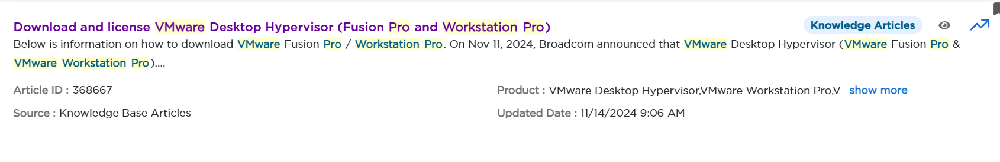
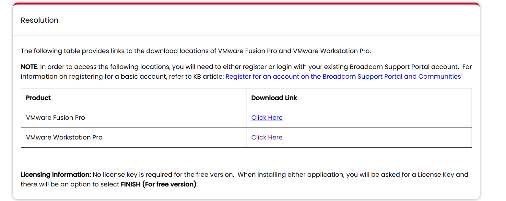
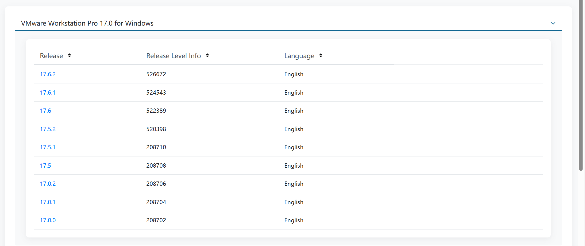
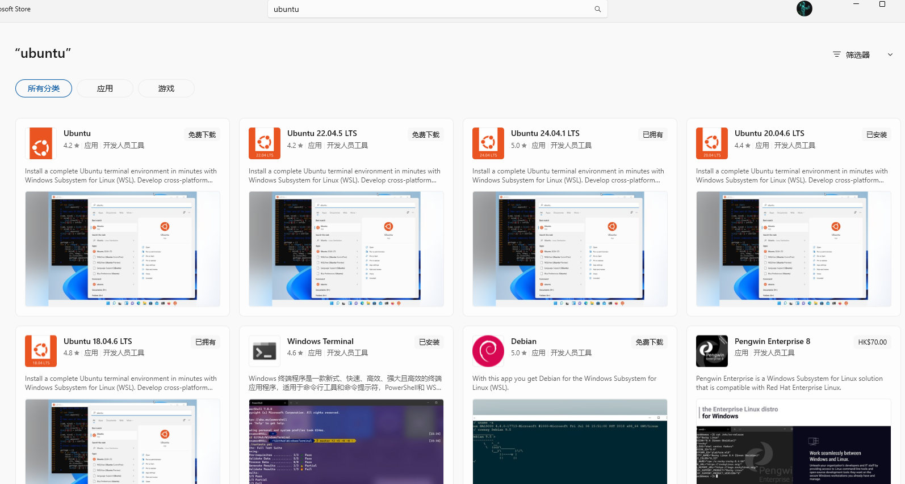

**开发板执行：**

scp wangzhitai@172.172.14.109:/aa/34-CMake /

nfs 80800000 172.172.14.109:/linux/uboot-zdyz/u-boot.imx

mount -t nfs -o nfsvers=3,nolock 172.172.14.109:/aa/ /mnt/

cd /mnt/rknn-toolkit2-master/rknpu2/examples/rknn_yolov5_demo/install/rknn_yolov5_demo_Linux

./rknn_yolov5_demo

insmod /mnt/my-work/00-leddriver/led-driver.ko

cd /sys/bus/platform/devices/ledctrl

sudo scp -r wangzhitai@172.172.14.108:/aa/07_plate_detection_recongnition /

sudo scp -r root@172.172.14.108:/opt/* /opt

./plate_detection_recongnition model/RK3568/yolov5n.rknn model/RK3568/best.rknn model/test.mp4

./plate_detection_recongnition model/RK3568/best.rknn model/RK3568/yolov5n.rknn model/test.mp4

**LED驱动控制：**

echo on > /sys/devices/platform/ledctrl/mode

echo off > /sys/devices/platform/ledctrl/mode

echo fastblink > /sys/devices/platform/ledctrl/mode

echo slowblink > /sys/devices/platform/ledctrl/mode

**Ubuntu执行：**

cd /aa/rknn-toolkit2-master/rknpu2/examples/rknn_yolov5_demo

rm -rf platform-tools/

./build-linux_RK3566_RK3568.sh

> ls /dev


# 一、Linux操作系统介绍

Linux 是一种开源且免费的操作系统内核，是由芬兰计算机科学家 Linus Torvalds 于 1991  年开始编写，并在其后的几年中不断完善和发展而来。最初是作为个人电脑使用的，但现在已经成为了许多服务器、移动设备、超级计算机等各种类型的硬件设备上的主要操作系统。

嵌入式Linux的应用领域非常广泛，主要的应用领域有信息家电、PAD 、机顶盒、Digital Telephone、Answering Machine、Screen Phone 、数据网络、Ethernet Switches、Router、Bridge、Hub、Remote access servers、ATM、Frame relay 、远程通信、医疗电子、交通运输计算机外设、工业控制、航空航天领域等。

**Linux的组成：uboot（引导加载程序），kernel（系统内核）， rootfs（root file system根文件系统）**


# 二、开发环境搭建

> 现在主流的操作系统开发方法：编译系统需要在Ubuntu环境下进行编译，所以要先装一个具有编译环境的Ubuntu虚拟机用来开发驱动


## （一）安装Ubuntu

> 现在主流的Linux环境有两个：
>
> * 一个是安装WSL，这个是用起来最方便且性能最好的方式，基本上和Windows无缝协同，但是可能会有一些兼容问题，不过大部分都是可以解决的，只是不太适合新手。
> * 另一个是安装VMware虚拟机，然后安装一个Ubuntu到里面，这样的Ubuntu和你在物理机上装一个Ubuntu是没有什么差别的，基本上是原生Ubuntu环境，但是缺点是性能会低一些，而且和Windows协同工作没有那么舒服。
>
> 当然，想用哪个自己选就行，都可以的。


### 1. VMware+Ubuntu虚拟机

#### （1）下载VMWare Workstation Pro

1. 进入VMware官网：[VMware by Broadcom - Cloud Computing for the Enterprise](https://www.vmware.com/)

2. 搜索产品：Desktop Hypervisor

3. 点击Products找到下载网址：[https://www.vmware.com/products/desktop-hypervisor/workstation-and-fusion](https://www.vmware.com/products/desktop-hypervisor/workstation-and-fusion)

4. 注册登录

5. 点击：DOWNLOAD FUSION OR WORKSTATION

6. 左侧导航栏选择：My Dashboard

7. 搜索：VMware Workstation Pro

8. 点击：Downloading and license VMware Desktop Hypervisor



9. 滚动到下面，点击下载 VMware Workstation Pro



10. 下载并安装最新版即可



11. 安装时选择用于个人用途，就是免费使用的
11. 打开Windows控制面板 → 程序和功能 → 添加或者删除Windows功能 ，使用VMware要开启虚拟机平台（Virtual Machine Platform）


#### （2）在VMware中安装Ubuntu系统

这一步没什么好说的，先不安装系统，配置好硬件信息后启动成功然后关机，然后挂载CD/DVD到自己下载的ISO文件，然后开机安装系统，安装成功后关机，把CD/DVD驱动器直接移除掉，再开机就是正常从自己配置的虚拟磁盘里启动了


### 2.Windows+WSL2

#### （1）安装WSL2

1. 首先要在BIOS里面打开虚拟化的支持，一般电脑都是打开的
2. 打开Windows控制面板 → 程序和功能 → 添加或者删除Windows功能 ，使用VMware要开启虚拟机平台（Virtual Machine Platform）和适用于Linux的Windows子系统


3. 打开windows的命令提示符，输入指令切换wsl的版本到wsl2

```powershell
wsl --set-default-version 2
```

4. 等待wsl2安装成功后输入指令查看是否成功，如果出现下图，则已经更新完成

```powershell
wsl --update
```


5. 然后安装Ubuntu，打开微软应用商店搜索Ubuntu，然后下载想要的版本即可



6. 安装完成ubuntu后我们点击开始菜单里的Ubuntu进入系统，一开始会显示正在安装，安装完成后会提示`Enter new UNIX username：`这个时候我们输入自己的用户名就好了，然后会提示``New password：`这个时候输入自己的密码，然后会提示`Retype new password：`然后我们重新输入一次密码就行

7. 我们需要先启用root账户

   * 设置root用户密码

   ```shell
   sudo passwd
   ```

   * 然后输入ubuntu的登录密码，接着输入两次Unix密码（Unix密码就是想要设置的root用户登录密码）

   * 输入以下命令来切换到root用户

   ```shell
   su root
   ```

   * 然后输入刚刚设置的Unix密码，可以看到用户名变成root说明已经启用成功了

8. 想让每次WSL的Ubuntu启动的时候都不使用root账户的话，需要修改配置文件`/etc/wsl.conf`

```shell
vim /etc/wsl.conf
```

* 然后新增一个配置项在后面,这里的wzt就是你想让每次自动启动的用户名

```shell
[user]
default = wzt
```


#### （2）将WSL2里的Ubuntu移动到D盘

1. 默认WSL2都会把Ubuntu安装在C盘，太乱了，我们给他搞到D盘里
2. 列出已安装的 WSL 分发版：在 CMD 或 PowerShell 中执行：

```powershell
wsl -l -v
```

* 你会看到类似这样的输出，确认你的 Ubuntu 名称（例如 `Ubuntu-22.04`）和它正在运行（状态为 `Running`），还有版本`2`代表了`WSL2`。

```powershell
  NAME            STATE           VERSION
* Ubuntu-20.04    Running         2
```

3. 关闭所有 WSL 实例：确保接下来操作无误，先关闭 WSL：

```powershell
wsl --shutdown
```

4. 再次运行 `wsl -l -v`，状态应该变为 `Stopped`
5. 导出分发版：我们将 Ubuntu 导出到一个压缩文件中。这里我们选择 D 盘根目录下的一个文件夹，例如 `D:\WSL`。

```powershell
wsl --export Ubuntu-20.04 D:\WSL\Ubuntu-20.04.tar
```

* `Ubuntu-20.04` 替换成你 `wsl -l -v` 列表中显示的确切名称。

- `D:\WSL\ubuntu-20.04.tar` 是导出的目标路径和文件名，你可以自定义。

6. 注销（删除）原来的分发版：（注意：这会删除 C 盘里的 Ubuntu 及其所有数据，请确保你已经完成了步骤 C 的导出！）

```powershell
wsl --unregister Ubuntu-20.04
```

7. 在 D 盘导入并安装分发版：现在，我们将导出的文件导入到 D 盘的一个新文件夹中，作为新的安装目录。

```powershell
wsl --import Ubuntu D:\WSL\Ubuntu-20.04 D:\WSL\Ubuntu-20.04.tar --version 2
```

- `Ubuntu-20.04`：这是你给新分发版起的名字，以后用 `wsl -d Ubuntu-20.04` 启动。
- `D:\WSL\Ubuntu-20.04`：这是 **Ubuntu 系统的根文件系统将要存放的物理位置**。这个文件夹会被自动创建。
- `D:\WSL\Ubuntu-20.04.tar`：这是你上一步导出的文件路径。
- `--version 2`：指定使用 WSL 2。

8. 现在WSL2就成功的运行在了D盘里


## （二） Ubuntu设置

### 1、 启用root用户

1. 设置root用户密码

```shell
sudo passwd
```

2. 然后输入ubuntu的登录密码，接着输入两次Unix密码（Unix密码就是想要设置的root用户登录密码）

3. 输入以下命令来切换到root用户

```shell
su root
```

4. 然后输入刚刚设置的Unix密码，可以看到用户名变成root说明已经启用成功了。


### 2、 修改系统时区

1. 使用命令查看当前时区

```shell
timedatectl
```

2. 修改时区到Asia/Shanghai

```shell
sudo timedatectl set-timezone Asia/Shanghai
```


### 3、 更换镜像源

***

**https://mirrors.huaweicloud.com/**

***

1. 备份配置文件

```shell
sudo cp -a /etc/apt/sources.list /etc/apt/sources.list.bak
```

2. 修改sources.list文件，将 http://archive.ubuntu.com 和 http://security.ubuntu.com 替换成 http://mirrors.huaweicloud.com

```shell
sudo sed -i "s@http://.*archive.ubuntu.com@http://mirrors.huaweicloud.com@g" /etc/apt/sources.list
sudo sed -i "s@http://.*security.ubuntu.com@http://mirrors.huaweicloud.com@g" /etc/apt/sources.list
```

3. 更新索引

```shell
sudo apt-get update
```


### 4、 安装VMware Tools

1. 安装软件包

```shell
sudo apt upgrade
sudo apt install open-vm-tools-desktop -y
sudo reboot
```

2. 检查软件安装状态

```shell
dpkg -l | grep open-vm-tools
systemctl status open-vm-tools
```


### 5、 安装vim

Ubuntu系统执行以下代码：

```shell
sudo apt-get install vim-gtk
```


### 6、 安装Samba服务

1. Samba最大的用途就是可以实现Linux与windows系统共享文件夹，他可以将Linux的目录挂载成网络硬盘的形式出现在Windows的文件资源管理器里

2. 搭建SMB服务首先要保证Windows和Ubuntu网络互通，然后在Ubuntu下载安装：

```shell
sudo apt-get install samba
```

3. 给需要共享的文件夹设置权限为777，修改配置文件：

```shell
sudo vim /etc/samba/smb.conf
```

4. 将下面的代码添加到配置文件的最后面

```c
[Ubuntu]
comment = Ubuntu-20.04.6
path = /home/wzt
public = yes
writeable = yes
valid users = wzt
create mask = 0777
directory mask = 0777
force user = wzt
force group = wzt
available = yes
unix charset = UTF-8
dos charset = cp936
```

5. 改完配置文件后保存，然后使用命令为SMB服务添加用户和密码

```shell
sudo smbpasswd -a wzt
```

6. 重启SMB服务:

```shell
sudo service smbd restart
```

7. 在 Windows 上输入“win+r”弹出运行窗口，然后输入Ubuntu 的 \\\IP 访问，然后右键Samba文件夹将他映射为网络驱动器


### 7、 安装依赖

安装一些用于编译Linux系统的工具软件包：

```shell
sudo apt-get install git ssh make gcc libssl-dev \
liblz4-tool expect expect-dev g++ patchelf chrpath gawk texinfo chrpath \
diffstat binfmt-support qemu-user-static live-build bison flex fakeroot \
cmake gcc-multilib g++-multilib unzip device-tree-compiler ncurses-dev \
bzip2 expat gpgv2 cpp-aarch64-linux-gnu libgmp-dev \
libmpc-dev bc python-is-python3 python2
```


### 8、 安装SSH

1. 安装SSH服务

```shell
sudo apt-get install openssh-server
```

2. 启动SSH服务

```shell
sudo systemctl start sshd
```

3. 修改配置文件，配置文件中 “ PermitRootLogin prohibit-password ” 修改成 “ PermitRootLogin yes ” （记得取消注释），允许root用户登录

```shell
sudo vim /etc/ssh/sshd_config
```

4. 重启SSH服务

```shell
sudo systemctl restart sshd
```


### 9、 安装NFS服务

>**功能：** 实现开发板（芯片）与Ubuntu互传文件
>
>**前提：** 开发板和Ubuntu在同一局域网

1. Ubuntu安装NFS服务

```shell
sudo apt-get install nfs-kernel-server
```

2. 修改配置文件

```shell
sudo vim /etc/exports
```

3. 在最后一行添加配置：

```c
/ *(rw,sync,no_root_squash)
    
/*
/：要共享的目录
*： 代表允许所有的网络段访问
w： 是可读写权限
sync：是资料同步写入内存和硬盘
no_root_squash：是 Ubuntu NFS 客户端分享目录使用者的权限，如果客户端使用的是root用户，那么对于该共享目录而言，该客户端就具有root权限
*/   
```

4. 重启rpcbind服务

```shell
sudo systemctl restart rpcbind
```

5. 重启NFS服务

```shell
sudo systemctl restart nfs-kernel-server
```

6. 查看是否成功挂载NFS目录（这里也可能要重启Ubuntu才会挂载目录）

```shell
showmount -e
```

7. 在开发板终端使用以下命令挂载到NFS服务器

```shell
mount -t nfs -o nfsvers=3,nolock 192.168.31.148:/home/wzt /mnt/
```

   *192.168.31.148：* 这个是Ubuntu的IP，要设置成自己的IP，这个经常会变动
   */home/wzt：* 这个是要挂载到服务器的远程目标目录
   */mnt/：* 这个是开发板的本地目录，用于挂载到目标NFS服务器

8. 挂载成功后，在开发板的/mnt/目录中就可以访问Ubuntu的/aa/目录里的所有文件了


### 10、 安装FTP服务（可选）

1. 开启Ubuntu下的 FTP 服务 

```shell
sudo apt-get install vsftpd
```

2. 安装完成以后使用vim命令打开/etc/vsftpd.conf

```shell
sudo vim /etc/vsftpd.conf
```

3. 打开vsftpd.conf 文件以后找到如下两行：

```c
local_enable=YES 
write_enable=YES 
//确保上面两行前面没有“#”，有的话就取消掉
```

4. 修改完vsftpd.conf保存退出，使用如下命令重启FTP服务：  

```shell
sudo systemctl restart vsftpd
```

5. Windows下载FTP客户端：

https://filezilla-project.org/

6. 文件→站点管理器→新建站点→选择FTP协议→加密方式选择明文传输→输入账号密码IP（端口不用输）→字符集选择强制使用UTF-8→连接


### 11、 安装TFTP服务（可选）

1. tftp 命令的作用和 nfs 命令一样，都是用于通过网络下载东西到 DRAM 中，只是 tftp 命令使用的 TFTP 协议，Ubuntu 主机作为 TFTP 服务器。因此需要在 Ubuntu 上搭建 TFTP 服务器， 
2. 需要安装 tftp-hpa 和tftpd-hpa，命令如下：

```shell
sudo apt-get install tftp-hpa tftpd-hpa 
sudo apt-get install xinetd 
```

3. 和 NFS 一样，TFTP 也需要一个文件夹来存放文件，在用户目录下新建一个目录，命令如下： 

```shell
mkdir /linux/tftpboot 
chmod 777 /linux/tftpboot 
```

4. 这样我就在我的电脑上创建了一个名为 tftpboot 的 目录( 文件夹 ) ，路径为 /linux/tftpboot。注意！我们要给 tftpboot 文件夹权限，否则的话 uboot 不能从 tftpboot 文件夹里面下载文件。 
5. 最后配置tftp，安装完成以后新建文件/etc/xinetd.d/tftp，如果没有/etc/xinetd.d 目录的话自行创建，然后在里面输入如下内容： 

```shell
server tftp 
2  { 
3 socket_type = dgram 
4 protocol = udp 
5 wait = yes 
6 user = root 
7 server = /usr/sbin/in.tftpd 
8 server_args = -s /linux/tftpboot/ 
9 disable = no 
10 per_source = 11 
11 cps = 100 2 
12 flags = IPv4 
13 } 
```

6. 完了以后启动 tftp 服务，命令如下

```shell
sudo service tftpd-hpa start 
```

7. 打开/etc/default/tftpd-hpa 文件，将其修改为如下所示内容： 

```shell
# /etc/default/tftpd-hpa 
2  
3 TFTP_USERNAME="tftp" 
4 TFTP_DIRECTORY="/linux/tftpboot"  
5 TFTP_ADDRESS=":69"                                 
6 TFTP_OPTIONS="-l -c -s" 
```

8. TFTP_DIRECTORY 就是我们上面创建的 tftp 文件夹目录，以后我们就将所有需要通过 TFTP 传输的文件都放到这个文件夹里面，并且要给予这些文件相应的权限。

9. 最后输入如下命令， 重启 tftp 服务器：

```shell
sudo service tftpd-hpa restart 
```

10. tftp 服务器已经搭建好了，接下来就是使用了。比如将要发送到开发板的 zImage 镜像文件拷贝到 tftpboot 文件夹中，并且给予 zImage 相应的权限，命令如下： 

```shell
cp zImage linux/tftpboot/ 
cd linux/tftpboot/ 
chmod 777 zImage 
```


### 12、 设置Ubuntu为中文（可选）

1. Ubuntu安装成功后，默认系统语言为英文，点击语言设置。
2. 选择对应的区域和语言。点击 `Manage Installed Languages` 按钮上面那个 `+` ，然后选择 `Chinese`。
3. 点击 `Manage Installed Languages`，进入界面后，点击 `Install/Remove Languages`。
4. 选择 `Chineses` 简体。
5. 下载完成后，将下载的 `汉语（中国）` 拖到最上方。
6. 重启Ubuntu系统，设置生效。 


## （三） SDK源码安装和编译

> **注意事项：**
>
> 1. 不要用root用户编译/解压SDK源码！
> 2. 不要用sudo权限来解压SDK源码！
> 3. 源码也不能解压至包含中文字符的路径下！

1. 将厂家提供的SDK利用Samba服务复制到Ubuntu里面
2. 解压SDK源码到目录

```shell
tar -xvf atk-dlrk3506_linux6.1_release_v1.2.0_20250718.tar.gz
```

3. RK的SDK需要用./repo.sh来检出源码（因为RK官方就是用repo来管理多个git仓库的，这里面的.repo是个隐藏文件，用ls -a指令可以看到）

```shell
./repo.sh
```

4. 根据不同的开发板选择不同的板级支持包

```shell
./build.sh lunch
# 然后根据不同的板子选择不同的板级支持包
```

4. 在选择好BSP后一定要先完整编译一次Linux源码

```shell
./build.sh
```


## （四） SDK源码目录介绍

> **瑞芯微提供的SDK目录如下：**
>
> SDK源码根目录下包含有 app、 buildroot、 device、 external、 tools、 u-boot 等多个目录，每个目录或其子目录会对应一个 git 工程；因为 SDK 的代码和相关文档被划分成了若干 git 仓库分别进行版本管理（所以 SDK 实际上包含有若干 git 仓库），它们按照功能、所属模块划分，分别组织到不同的目录下。
>
> * **app：**存放上层应用 app，以及其它的 C/C++应用程序。
> * **buildroot：**基于 buildroot 开发的根文件系统。device/rockchip：存放各芯片板级配置文件和 Parameter 分区表文件，以及一些编译与打包固件的脚本和预备文件。
> * **docs：**存放芯片模块开发指导文档、平台支持列表、芯片平台相关文档、 Linux开发指南等。
> * **external：**存放所需的第三方库，包括音频、视频、网络、 recovery 等。 
> * **kernel：**Linux 6.1 版本内核源码。
> * **prebuilts：**存放交叉编译工具链。
> * **rkbin：**存放 Rockchip 相关的 Binary 和工具。
> * **rockdev：**存放编译输出固件，编译 SDK 后才会生成该文件夹。
> * **tools：**存放 Linux 和 Windows 操作系统环境下常用的工具，包括镜像烧录工具、SD卡升级启动制作工具、批量烧录工具等，譬如RK的驱动 DriverAssitant 以及烧录工具 RKDevTool 以及 Linux_Upgrade_Tool 工具都存放在该目录。
> * **u-boot：**基于 v2017.09 版本进行开发的 uboot 源码。
> * **yocto：**基于 Yocto 开发的根文件系统。
> * **build.sh：**是RK提供的一个编译脚本，使用该脚本可以方便用户快速构建出各种镜像文件以及对镜像进行打包操作，既可以一键全自动编译整个 SDK，也可以单独编译 U-Boot、 Linux Kernel、 buildroot 等，非常方便  


## （五） SDK镜像文件目录介绍

**瑞芯微的SDK编译后生成的镜像文件夹rockdev的目录如下：**

| 镜像名称          | 作用                                                         |
| ----------------- | ------------------------------------------------------------ |
| uboot.img         | uboot.img 是一种 FIT 格式镜像，它由多个镜像合并而成，其中包括 trust 镜像（ARM Trusted Firmware + OP-TEE OS）、 u-boot镜像、 u-boot dtb；编译 U-Boot 时会将这些镜像打包成一个uboot.img。uboot.img 会烧录到开发板 uboot 分区 |
| boot.img          | boot.img 也是一种 FIT 格式镜像，它也是由多个镜像合并而成，其中包括内核镜像、内核 DTB、资源镜像 resource.img。boot.img 会烧录到开发板 boot 分区 |
| MiniLoaderAll.bin | 该镜像是运行在 RK3506 平台 U-Boot 之前的一段 Loader 代码（也就是比 U-Boot 更早阶段的 Loader）， MiniLoaderAll.bin 由TPL 和 SPL 两部分组成， TPL 用于初始化 DDR，运行在 SRAM；而 SPL 运行在 DDR，主要负责加载、引导 uboot.img。 |
| misc.img          | 包含 BCB（Bootloader Control Block）信息，该镜像会烧写到开发板 misc 分区。misc 分区是一个很重要的分区，其中存放了 BCB 数据块，主要用于 Android/Linux 系统、 U-Boot 以及 recovery 之间的通信 |
| oem.img           | 给厂家使用，用于存放厂家的 APP 或数据，该镜像会烧写至开发板 oem 分区，系统启动之后会将其挂载到/oem 目录。 注意由于 RK3506 NandFlash 大小限制，虽然编译出了 oem.img，但是不烧写 oem.img，也就是不会有/oem 挂载目录。所有 APP或者用户数据建议存放/userdata 分区下！ |
| parameter.txt     | 一个 txt 文本文件，是 RK3506 平台的分区表文件（记录分区名以及每个分区它的起始地址、结束地址）；烧写镜像时，并不需要将 parameter.txt 文件烧写到 Flash，而是会读取它的信息去定义分区。 |
| recovery.img      | recovery 模式镜像， recovery.img 用于进入 recovery 模式， recovery.img 会烧录到开发板 recovery 分区。recovery 模式是一种用于对设备进行修复、升级更新的模式。recovery.img 也是 FIT 格式镜像，也是由多个镜像合并而成，其中包括 ramdisk（进入 recovery 模式时挂载该根文件系统）、内核镜像（进入 recovery 模式时启动该内核镜像）、内核 DTB 以及resource.img。 |
| rootfs.img        | 正常启动模式下对应的根文件系统镜像，包含有大量的库文件、可执行文件等。rootfs.img 会烧录到开发板 rootfs 分区 |
| userdata.img      | 给用户使用，可用于存放用户的 App 或数据；该镜像会烧写至开发板 userdata 分区，系统启动之后，会将其挂载到/userdata 目录 |
| update.img        | uboot.img、 boot.img、 MiniLoaderAll.bin、 parameter.txt、misc.img、 rootfs.img、 oem.img、 userdata.img、 recovery.img 等打包成一个 update.img 固件。 |


# 三、镜像烧录与启动模式

**瑞芯微的启动模式有四种，有两种是支持烧录的：**

| 启动模式    | 是否支持烧录 | 描述                                                         |
| :---------- | :----------- | :----------------------------------------------------------- |
| Maskrom     | 支持         | Flash 在未烧录镜像时，芯片会引导进入 Maskrom 模式，可以进行初次镜像的烧写；开发调试过程中若遇到无法正常进入 Loader 模式的情况，也可进入 Maskrom 模式烧写镜像。 |
| Loader      | 支持         | Loader 模式下可以进行镜像烧写、更新升级，可以通过烧写工具单独烧写某一个分区镜像文件，方便调试。 |
| Recovery    | 不支持       | 通过引导 recovery 镜像进入 recovery 模式， recovery模式主要作用是升级、恢复出厂设置类操作。 |
| Normal Boot | 不支持       | 系统正常启动进入该模式，通过引导 rootfs 启动，加载 rootfs 根文件系统。 |

1. 安装驱动DriverAssitant，瑞芯微的驱动在SDK的tools文件夹里
2. 安装SDK的Tools文件夹内的烧录工具RKDevTool
3. 导入分区表配置文件，就是SDK编译后生成的parameter.txt，可以导出成cfg，下次烧写的时候直接导入成默认配置就好
4. 进入烧录模式

* **Maskrom模式：**
  * 未烧录的芯片初次启动会进入 Maskrom 模式
  * 烧录过的芯片按着 UPDATE 或者 MASKROM 按键或者 V-（音量减）然后上电或者复位就能进到 Maskrom 模式
  * 在 U-Boot 命令行下执行 rbrom 也可以
* **Loader模式：**
  * 烧录过的芯片按着 V+（音量+）或者 RECOVER 然后上电或者复位就能进到 Loader 模式
  * 在 U-Boot 下执行 download 或者在 Linux下通过串口或者ADB执行 reboot loader 也能进入
  * 连接到 RKDevTool 工具后会显示“发现一个 ADB 设备”，然后点击“切换”按钮，也能进入 Loader 模式

5. 然后可以选**下载镜像**能够单独烧录各个镜像，也能选**升级固件**一次性烧录整个update.img
6. 不推荐用 Ubuntu 对 RK 开发板进行烧录，不好用
