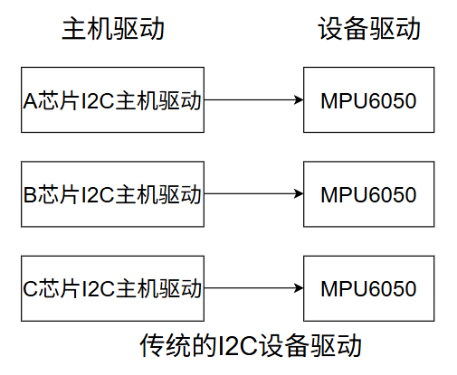
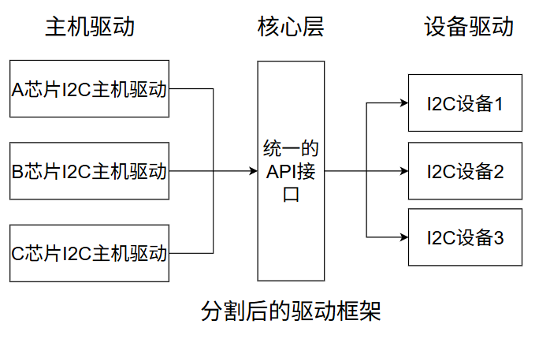

# platform设备驱动

# 1. 驱动的分离与分层

## 1.1 驱动的分离与分隔

1. 假如现在有三个SOC，分别是A、B、C三个厂家生产的，他们三个芯片的I2C控制器是不一样的，这个时候我们要在三个芯片上都接入一个I2C接口的MPU6050芯片，那么我们不但要写三个不同的I2C主机驱动去驱动SOC上面的I2C控制器，还要写三个I2C设备驱动驱动去控制MPU6050

2. 从图中可以看出每个SOC平台下的主机驱动是必须要写的，毕竟不同的平台I2C控制器不同。但是设备驱动只需要写一个就可以了，因为不管对于哪个SOC来说，I2C只需要实现读写就可以了。

3. 所以最好的方法就是每个平台的I2C控制器都提供一个统一的接口（也叫主机驱动）每个设备也只提供了一个驱动程序（也叫设备驱动）每个设备通过统一的I2C接口驱动来访问。

4. 这就是驱动的分割，也就是当将主机驱动和设备驱动分隔开来比如I2C、SPI等等都会采用驱动风格的方式来简化驱动的开发，一般I2C主机控制器驱动已经由SOC芯片厂家写好，而设备驱动一般由设备器件的厂家写好，我们只需要提供设备信息比如I2C设备提供连接到了哪个I2C接口上，速度是多少。

5. 驱动使用标准方法获得设备信息(比如从设备树中获取设备信息)然后根据获取到的设备信息初始化设备，这样就相当于驱动只负责驱动部分，设备树只负责设备，然后将两者匹配即可。这就用到了总线（bus）-驱动（driver）-设备（device）模型
