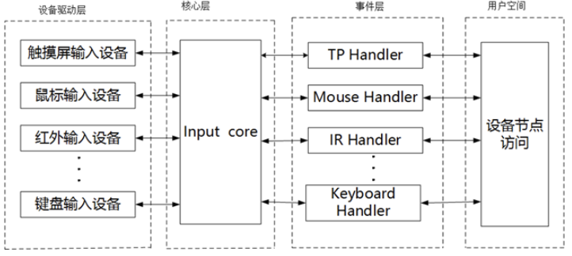

# platform设备驱动

# 1. 驱动的分离与分层

## 1.1 驱动的分离与分隔

1. 假如现在有三个SOC，分别是A、B、C三个厂家生产的，他们三个芯片的I2C控制器是不一样的，这个时候我们要在三个芯片上都接入一个I2C接口的MPU6050芯片，那么我们不但要写三个不同的I2C主机驱动去驱动SOC上面的I2C控制器，还要写三个I2C设备驱动驱动去控制MPU6050


2. 从图中可以看出每个SOC平台下的主机驱动是必须要写的，因为不同的SOC的I2C控制器不同。但是设备驱动只需要写一个就可以了，因为不管对于哪个SOC来说，I2C只需要实现读写就可以了。

3. 最好的方法就是每个SOC的I2C控制器都提供一个统一的接口（也叫主机驱动）每个设备也只提供了一个驱动程序（也叫设备驱动）每个设备通过统一的I2C接口驱动来访问。


4. 这就是驱动的分割，也就是当将主机驱动和设备驱动分隔开来比如I2C、SPI等等都会采用驱动分割的方式来简化驱动的开发，一般I2C主机控制器驱动已经由SOC芯片厂家写好，而设备驱动一般由设备器件的厂家写好，我们普通开发者只需要提供设备信息：比如I2C设备提供连接到了哪个I2C接口上，速度是多少。

5. 驱动使用标准方法获得设备信息(比如从设备树中获取设备信息)然后根据获取到的设备信息初始化设备，这样就相当于驱动只负责驱动部分，设备树只负责设备，然后总线负责将两者匹配即可。这就用到了总线（bus）-驱动（driver）-设备（device）模型


## 1.2 驱动的分层

Linux中驱动也是分层的，目的是为了在不同的层处理不同的内容。我们以input输入子系统为例，input子系统负责管理所有跟输入相关的驱动，比如说键盘、鼠标、触控等。最底层的就是设备原始驱动，负责获取输入设备的原始值，获取到的输入事件上报给input核心层，input核心层会处理各种io模型并且提供文件操作集。我们在编写输入设备驱动的时候只需要处理好输入设备事件的上报，即可至于如何处理这些上报的输入事件那是上层去考虑的，我们不需要管。




# 2. platform平台驱动模型

在SOC中有些外设是没有所谓的物理总线的，比如说GPIO、I2C控制器、SPI控制器、USB控制器等等，这些外设都是直接与SOC的CPU相连的，CPU可以直接访问这些外设，并没有通过所谓的物理总线与它们连接，我们想要使用总线设备驱动模型的话，就提出了一条 platform虚拟总线，相应的也有 platform driver 和 platform device

## 2.1 platform总线

1. Linux内核中使用 `bus_type` 结构体表示总见此结构体定义在 `include/linux/device.h` 中 `bus type` 结构体如下

```c
struct bus_type {
	const char		*name;           // 总线类型名称
	const char		*dev_name;       // 总线对应的设备名称
	const struct attribute_group **bus_groups;  // 总线属性组
	const struct attribute_group **dev_groups;  // 设备属性组
	const struct attribute_group **drv_groups;  // 驱动属性组

	int (*match)(struct device *dev, const struct device_driver *drv);  // 设备驱动匹配函数，总线用来对试图挂载到其上的设备与驱动执行的匹配操作
	int (*uevent)(const struct device *dev, struct kobj_uevent_env *env);  // 设备事件处理函数
	int (*probe)(struct device *dev);     // 设备探测函数
	void (*sync_state)(struct device *dev); // 设备状态同步函数
	void (*remove)(struct device *dev);   // 设备移除函数
	void (*shutdown)(struct device *dev); // 设备关闭函数
	const struct cpumask *(*irq_get_affinity)(struct device *dev,
			unsigned int irq_vec);  // 获取中断亲和性函数

	int (*online)(struct device *dev);    // 设备上线函数
	int (*offline)(struct device *dev);   // 设备下线函数

	int (*suspend)(struct device *dev, pm_message_t state);  // 设备挂起函数
	int (*resume)(struct device *dev);    // 设备恢复函数

	int (*num_vf)(struct device *dev);    // 获取虚拟功能数量函数

	int (*dma_configure)(struct device *dev);  // DMA配置函数
	void (*dma_cleanup)(struct device *dev);   // DMA清理函数

	const struct dev_pm_ops *pm;          // 电源管理操作集，用来对总线上的设备进行电源管理

	bool need_parent_lock;                // 是否需要父设备锁标志
};
```

2. `match()` 函数就是完成设备和驱动之间匹配的核心函数，每一条总线都必须实现此函数 `match()` 函数有两个参数 `dev` 和 `drv` 这两个参数分别表示 `device` 和 `device driver` 类型
3. `platform` 总线是 `bus_type` 的一个具体实例，定义在文件 `drivers/base/platform.c` 中具体定义如下

```c
const struct bus_type platform_bus_type = {
    .name        = "platform",           // 总线名称，用于sysfs展示
    .dev_groups  = platform_dev_groups,  // 设备默认属性组，用于sysfs创建文件
    .match       = platform_match,       // 设备驱动匹配函数，检查设备和驱动是否兼容
    .uevent      = platform_uevent,      // 热插拔事件处理函数，处理设备添加/移除事件
    .probe       = platform_probe,       // 驱动探测函数，设备匹配成功后执行初始化
    .remove      = platform_remove,      // 驱动移除函数，设备卸载时执行清理操作
    .shutdown    = platform_shutdown,    // 设备关机函数，系统关机时执行关闭操作
    .dma_configure = platform_dma_configure, // DMA配置函数，设置设备的DMA参数
    .dma_cleanup = platform_dma_cleanup, // DMA清理函数，释放DMA相关资源
    .pm          = &platform_dev_pm_ops, // 电源管理操作集，包含休眠/唤醒回调函数
};
```

4. `platform_match()` 函数的定义在文件 `drivers/base/platform.c` 中具体定义如下

```c
/**
 * platform_match - 将平台设备与平台驱动进行绑定匹配
 * @dev: 设备结构体
 * @drv: 驱动结构体
 *
 * 平台设备ID的编码格式通常为："<名称><实例号>"，其中<名称>是设备类型的简短描述
 *（如"pci"或"floppy"），<实例号>是设备的枚举实例（如'0'或'42'）。
 * 驱动程序ID则简化为"<名称>"。因此，从platform_device结构中提取<名称>，
 * 并与驱动程序的名称进行比较。返回两者是否匹配的结果。
 */
static int platform_match(struct device *dev, const struct device_driver *drv)
{
	struct platform_device *pdev = to_platform_device(dev);   // 转换为平台设备结构
	struct platform_driver *pdrv = to_platform_driver(drv);   // 转换为平台驱动结构

	/* 当设置了driver_override时，仅与指定的驱动进行匹配 */
	if (pdev->driver_override)
		return !strcmp(pdev->driver_override, drv->name);

	/* 首先尝试设备树（OF）风格的匹配 */
	if (of_driver_match_device(dev, drv))
		return 1;

	/* 然后尝试ACPI风格的匹配 */
	if (acpi_driver_match_device(dev, drv))
		return 1;

	/* 接着尝试与驱动ID表进行匹配 */
	if (pdrv->id_table)
		return platform_match_id(pdrv->id_table, pdev) != NULL;

	/* 最后回退到设备名与驱动名的直接比较 */
	return (strcmp(pdev->name, drv->name) == 0);
}
```

5. **驱动和设备的匹配有5种方法**：
	* **第1种方式**：当设置了 driver_override 时仅与指定的驱动进行匹配
	* **第2种方式**：`of` 类型的匹配也就是**设备树采用的方式** `of_driver_match_device()` 函数定义在文件 `linux/of_device.h` 中 `device_driver` 结构体中有一个名为 `of_match_table` 的成员变量此成员变量保存着驱动的 `compatible` 属性匹配表设备树中每个设备节点的 `compatible` 属性会与 `of_match_table` 表中的所有成员进行比较看是否有相同的条目如果有的话就使用设备和驱动匹配匹配成功后 `probe()` 函数就会执行
	* **第3种方式**：ACPI匹配方式
	* **第4种方式**：id_table 匹配每个 platform_driver 结构体中有个 id_table 成员变量保存了很多 id 信息
	* **第5种方式**：如果前面的方式都不存在的话就直接比较驱动和设备 name 字段看是不是相等如果相等的话就匹配成功


## 2.2 platform驱动

### 2.2.1 相关结构体

1. `platform_driver` 结构体表示 `platform` 驱动此结构体定义在文件 `include/linux/platform_device.h` 中，结构体内容如下：

```c
struct platform_driver {
	int (*probe)(struct platform_device *); // 设备探测函数，设备匹配成功后就会立刻执行，重要！！！
	void (*remove)(struct platform_device *); // 设备移除函数，执行清理和资源释放
	void (*shutdown)(struct platform_device *); // 设备关机函数，系统关机时执行
	int (*suspend)(struct platform_device *, pm_message_t state); // 设备挂起函数，进入低功耗状态
	int (*resume)(struct platform_device *); // 设备恢复函数，从低功耗状态唤醒
	struct device_driver driver; // 内嵌的标准设备驱动结构
	const struct platform_device_id *id_table; // 设备ID匹配表，支持多设备匹配
	bool prevent_deferred_probe; // 是否禁用延迟探测（避免探测失败后重试）
	/*
	 * 对于大多数设备驱动，只要所有DMA都通过内核DMA API处理，就不需要关心此标志。
	 * 对于一些特殊的驱动，例如VFIO驱动，它们知道如何自己管理DMA并设置此标志，
	 * 以便IOMMU层允许它们设置和管理自己的I/O地址空间。
	 */
	bool driver_managed_dma; // 标志：驱动是否自行管理DMA操作
};
```

2. `id_table` 是一个表，每个元素的类型为 `platform_device_id` ，结构体内容如下：

```c
struct platform_device_id {
	char name[PLATFORM_NAME_SIZE];      // 设备名称，用于与设备进行匹配
	kernel_ulong_t driver_data;         // 驱动私有数据，匹配时传递给驱动的信息
};
```

3. `device_driver` 结构体定义在 `include/linux/device.h` ，结构体内容如下：

```c
struct device_driver {
	const char		*name;           // 驱动名称
	const struct bus_type	*bus;    // 设备所属总线对象指针

	struct module		*owner;      // 驱动所属的内核模块
	const char		*mod_name;       // 内置模块名称

	bool suppress_bind_attrs;        // 禁用sysfs绑定/解绑属性
	enum probe_type probe_type;      // 设备探测类型

	const struct of_device_id	*of_match_table;     // 设备树匹配表
	const struct acpi_device_id	*acpi_match_table;   // ACPI匹配表

	int (*probe) (struct device *dev);      // 设备探测回调函数，当总线bus中将该驱动与设备绑定的时候，内核会首先调用peobe函数
	void (*sync_state)(struct device *dev); // 设备状态同步回调函数
	int (*remove) (struct device *dev);     // 设备移除回调函数
	void (*shutdown) (struct device *dev);  // 设备关机回调函数（电源管理）
	int (*suspend) (struct device *dev, pm_message_t state); // 设备挂起回调函数（电源管理）
	int (*resume) (struct device *dev);     // 设备恢复回调函数（电源管理）
	const struct attribute_group **groups;  // 驱动属性组
	const struct attribute_group **dev_groups; // 设备属性组

	const struct dev_pm_ops *pm;            // 电源管理操作集（电源管理）
	void (*coredump) (struct device *dev);  // 设备核心转储回调函数

	struct driver_private *p;               // 驱动私有数据指针
};
```

4. 从上面的结构体可以看出 `device_driver` 中的 `of_match_table` 就是使用设备树的时候驱动使用的匹配表，同样是数组，每个匹配项都为 `of_device_id` 结构体类型，此结构体定义在 `include/linux/mod_devicetable.h` 中，内容如下：

```c
struct of_device_id {
	char	name[32];           // 设备名称，用于描述设备类型（可选）
	char	type[32];           // 设备类型，进一步分类设备（可选）
	char	compatible[128];    // compatible属性，兼容性字符串，设备树中匹配设备的关键标识
	const void *data;          // 私有数据指针，匹配时可传递给驱动的额外数据
};
```

5. 数组中的 `compatible` 属性非常重要对于设备树而言就是通过设备节点的 `compatible` 属性和 `of_match_table` 中的每个项目的 `compatible` 成员变量进行比较，如果有相等的就表示驱动和设备匹配成功然后就会调用驱动的 `probe()` 函数


### 2.2.2 相关API

#### （1）平台驱动注册函数

当我们定义并初始化好 `platform driver` 结构体中需要在驱动入口函数里面调用 `platform_driver_register()` 函数向 Linux 内核注册一个 platform 平台驱动

```c
/**
 * platform_driver_register - 注册一个平台驱动到内核
 * @drv: 要注册的平台驱动结构体指针
 * 
 * 返回值：
 * 成功时返回 0，失败时返回负的错误码
 */
int platform_driver_register(struct platform_driver *drv);
```


#### （2）平台驱动注销函数

还需要在卸载函数中通过 `platform_driver_unregister()` 函数卸载 platform 平台驱动

```c
/**
 * platform_driver_unregister - 从内核注销一个平台驱动
 * @drv: 要注销的平台驱动结构体指针
 */
void platform_driver_unregister(struct platform_driver *drv);
```


#### （3）platform驱动框架（以字符设备举例）

```c
#include <linux/module.h>
#include <linux/fs.h>
#include <linux/cdev.h>
#include <linux/device.h>
#include <linux/platform_device.h>
#include <linux/uaccess.h>
#include <linux/slab.h>
#include <linux/errno.h>

/* 设备结构体 */
struct xxx_dev {
    struct cdev cdev;
    dev_t devno;            /* 设备号 */
    struct class *cls;      /* 设备类 */
    struct device *device;  /* 设备 */
    /* 设备结构体其他内容 */
    void *private_data;     /* 私有数据 */
};

struct xxx_dev xxxdev; /* 定义一个设备结构体变量 */


/* 打开设备 */
static int xxx_open(struct inode *inode, struct file *filp)
{
    struct xxx_dev *dev;
    
    /* 获取设备结构体指针 */
    dev = container_of(inode->i_cdev, struct xxx_dev, cdev);
    filp->private_data = dev; /* 将设备结构体保存到私有数据 */
    
    /* 设备打开初始化操作 */
    // ...
    
    return 0;
}

/* 释放设备 */
static int xxx_release(struct inode *inode, struct file *filp)
{
    /* 设备释放操作 */
    // ...
    
    return 0;
}

/* 读设备 */
static ssize_t xxx_read(struct file *filp, char __user *buf, 
                        size_t count, loff_t *f_pos)
{
    struct xxx_dev *dev = filp->private_data;
    ssize_t retval = 0;
    
    /* 从设备读取数据到用户空间 */
    // ...
    
    return retval;
}

/* 写设备 */
static ssize_t xxx_write(struct file *filp, const char __user *buf,
                         size_t count, loff_t *f_pos)
{
    struct xxx_dev *dev = filp->private_data;
    ssize_t retval = 0;
    
    /* 从用户空间写入数据到设备 */
    // ...
    
    return retval;
}

/* ioctl命令 */
static long xxx_ioctl(struct file *filp, unsigned int cmd, unsigned long arg)
{
    struct xxx_dev *dev = filp->private_data;
    
    switch (cmd) {
        case XXX_CMD1:
            /* 处理命令1 */
            break;
        case XXX_CMD2:
            /* 处理命令2 */
            break;
        default:
            return -ENOTTY;
    }
    
    return 0;
}

/* 字符设备文件操作结构体 */
static struct file_operations xxx_fops = {
    .owner = THIS_MODULE,
    .open = xxx_open,
    .release = xxx_release,
    .read = xxx_read,
    .write = xxx_write,
    .unlocked_ioctl = xxx_ioctl,
    .llseek = no_llseek,
};

/* platform驱动的 probe() 函数，驱动与设备匹配后就会执行 */
static int xxx_probe(struct platform_device *dev)
{
    // ...
    cdev_init(&xxxdev.cdev,&xxx_fops); /* 注册字符设备驱动 */
    // ...
    return 0;
}

/* 驱动移除函数 */
static int xxx_remove(struct platform_device *dev)
{
    // ...
    cdev_del(&xxxdev.cdev); /* 删除字符设备驱动 */
    // ...
    return 0;
}

/* 匹配列表 */
static const struct of_device_id xxx_of_match[] = {
    {.compatible = "xxx-gpio"}, /* 兼容属性 */
    { /* 此处必须留空，作为数组结束标记 */ }
};

MODULE_DEVICE_TABLE(of, xxx_of_match); /* 声明设备匹配表，告诉内核我的驱动支持哪些设备树兼容字符串 */

/* platform平台驱动结构体 */
static struct platform_driver xxx_driver = {
  .driver ={
      .name = "xxx",
      .of_match_table = xxx_of_match,
  },
  .probe = xxx_probe,
  .remove = xxx_remove,
};


/* 模块初始化 */
static int __init xxx_init(void)
{
    return platform_driver_register(&xxx_driver);
}

/* 模块退出 */
static void __exit xxx_exit(void)
{
    platform_driver_unregister(&xxx_driver);
}

module_init(xxx_init);
module_exit(xxx_exit);

MODULE_LICENSE("GPL");
MODULE_AUTHOR("WangZhitai");
MODULE_DESCRIPTION("xxx device driver");
MODULE_VERSION("1.0");
```

1. **platform驱动**：所谓的 `platform` 驱动并不是独立于字符设备驱动、块设备驱动和网络设备驱动之外的其他种类驱动，`platform 只是为了驱动的分离分层提出来的一种框架，具体的实现还是字符设备驱动、块设备驱动或者网络设备驱动`
2. **xxx_probe()函数**：总线将驱动和设备匹配匹配成功后 `probe()` 函数就会执行，以前在驱动入口 `init()` 函数里边写的字符设备驱动就全部放到了 `probe()` 函数里比如说注册字符设备驱动、添加cdev、创建类等等

3. **xxx_remove()函数**：`remove()` 函数当关闭 `platform`设备驱动的时候，此函数就会执行以前在驱动卸载 `exit()` 函数里边做的事情就要移到此函数中来，比如使用 `iounmap()` 释放内存、删除cdev、注销设备号等等
4. **xxx_of_match匹配表**：如果使用设备树的话将，通过此匹配表进行驱动和设备的 `compatible` 属性匹配，匹配表的最后一个匹配项必须是空的
5. **MODULE_DEVICE_TABLE**：声明设备匹配表，是一个**非常重要的宏**，它告诉内核模块系统你的驱动支持哪些设备树兼容字符串。
6. **platform_driver结构体**：该结构体代表 platform驱动，成员变量中的 `name` 和 `of_match_table` ，其中 `name 属性用于传统的驱动与设备匹配`也就是检查驱动和设备的 `name` 字段是不是相同，而 `of_match_table 属性就是用于设备树下的驱动与设备匹配`，对于一个完整的驱动程序**必须提供有设备树和无设备树两种匹配方法**
7. **驱动入口函数**：驱动入口函数调用 platform_driver_register() 函数向Linux内核注册 platform驱动
8. **驱动出口函数**：驱动出口函数调用 platform_driver_unregister() 函数卸载前面注册的 platform驱动


## 2.3 platform设备

**platform设备需要使用设备树去描述！**

1. 在设备树中创建设备节点，重点是设置好 `compatible` 属性，这样才能和驱动匹配成功：

```c
gpioled {
    #address-cells = <1>;
    #size-cells = <1>;
    compatible = "atkalpha-gpioled";
    pinctrl-names = "default";
    pinctrl-0 = <&pinctrl_led>;
    led-gpio = <gpio1 3 GPIO_ACTIVE_LOW>;
    status = "okay";
};
```

2. 编写的设备树节点中的 `compatible` 属性是 “`atkalpha-gpioled`”，因此在编写对应的 `platform` 驱动的时候， `of_match_table` 属性表中的兼容属性 `compatible` 也要包含 “`atkalpha-gpioled`”

```c
static const struct of_device_id leds_of_match[] = {
    {.compatible = "atkalpha-gpioled"}, /* 兼容属性 */
    {/* Sentinel */}
};

MODULE_DEVICE_TABLE(of,leds_of_match);

static struct platform_driver leds_platform_driver = {
    .driver = {
        .name = "imx6ull-led",
        of_match_table = leds_of_match,
    },
    .probe = leds_probe,
    .remove = leds_remove,
}
```

3. 一个驱动是可以跟多个设备匹配的，`of_device_id` 表也就是驱动的兼容表，每一个 `of_device_id` 数组元素都是一个兼容属性，在**编写兼容表的时候最后一个元素一定要留空**
4. 通过 `MODULE_DEVICE_TABLE` 声明设备匹配表，是一个**非常重要的宏**，它告诉内核模块系统你的驱动支持哪些设备树兼容字符串。


# 3. 示例程序

```c
```

