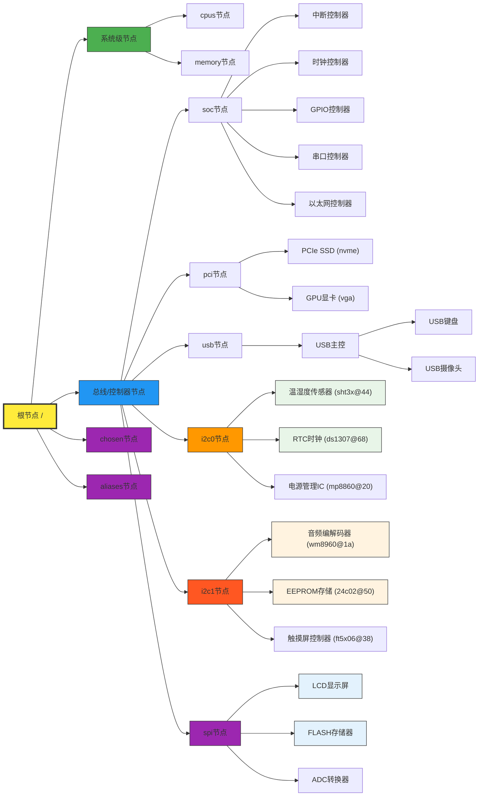
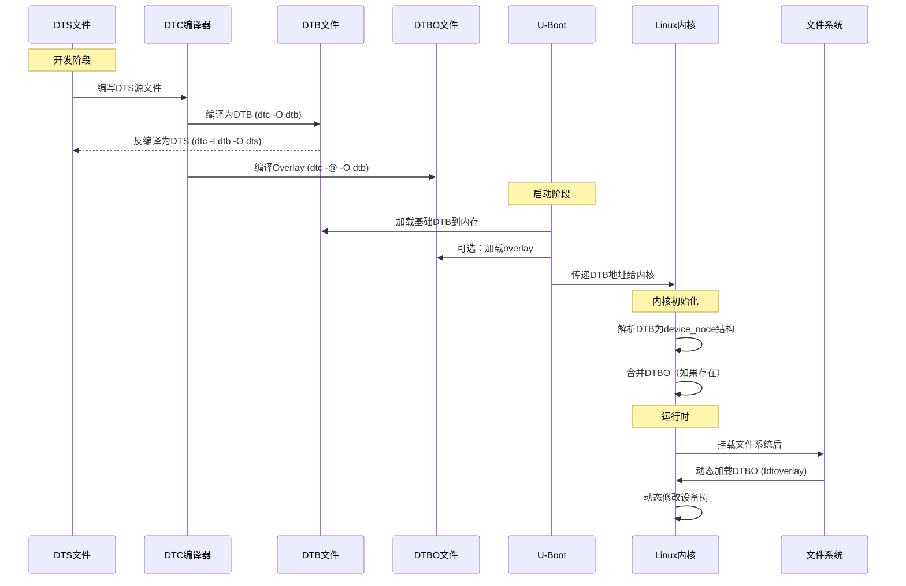

# 设备树

# 1. 什么是设备树

**设备树**：Device Tree，描述设备树的文件叫做DTS（Device Tree Source）， DTS文件的主要功能就是采用树形结构描述设备的信息，比如CPU数量、内存基地址、IIC设备、SPI设备等，如图所示：



一个SOC可以制造出很多不同的主板，但是这些主板都有共同的信息。将共同的信息作为一个通用的文件，这个通用的文件就是 `.dtsi` 文件（类似于C语言中的头文件）。**一般来说 `.dts` 文件描述板级信息（也就是主板上的一些 I2C、SPI、PCI设备等），每一个主板都有一个对应的 DTS 文件。`.dtsi` 文件描述 SOC 信息（也就是芯片有几个CPU、主频是多少，外设控制器信息等），但是也不一定如此，因为 DTS 语法是可以包含的，所以怎么写的都有。**


# 2. dts、dtb、dtbo、dtc

1. **DTS（Device Tree Source）**：
	* 文本格式的源文件，人类可读写，扩展名 `.dts` `.dtsi（包含文件）`
	* 支持 C 预处理器（`#include，#define等`）
2. **DTC(Device Tree Compiler)**：
	* 设备树编译器，将 DTS 转为 DTB
	* 也可以反编译，将 DTB 转为 DTS
3. **DTB（Device Tree Blob）**：
	* 二进制格式的设备树，可以被内核直接解析
4. **DTBO（Device Tree Blob Overlay）**：
	* 增量更新的DTB，用于动态修改设备树




# 3. DTS语法

## 3.1 .dtsi头文件

* 和 C 语言一样，设备树也支持头文件，设备树的头文件扩展名为 `.dtsi`。
* 使用 `#include "*******.dtsi"` 或者 `#include "*******.dts"` 或者 `#include "*******.h"`引入头文件
* 一般来说 `.dtsi` 文件描述的是SOC的信息，或者一些比较通用的信息，而 `.dts` 文件描述的是板级信息，但是也不一定如此，因为 DTS 语法是可以包含的，所以怎么写的都有

```c
// SPDX-License-Identifier: (GPL-2.0+ OR MIT)
/*
 * Copyright (c) 2020 Rockchip Electronics Co., Ltd.
 *
 */

/dts-v1/;

#include "rk3566-lubancat-1.dtsi"
#include "rk3566-android.dtsi"

// #include "rk3566-lubancat-hdmi.dtsi" //HDMI输出
// #include "rk3566-lubancat-dsi0-7.0-1024x600.dtsi" //野火7寸 600P
// #include "rk3566-lubancat-dsi0-10.1-800x1280.dtsi" //野火10.1寸 800P
#include "rk3566-lubancat-dsi0-ebf410125_1080p.dtsi" //野火5.5寸 1080P
// #include "rk3566-lubancat-dsi0-rpi.dtsi" //树莓派 5寸 800x480

// RTC
// #include "rk356x-lubancat-i2c3-m0-rtc.dtsi"
// #include "rk356x-lubancat-i2c3-m1-rtc.dtsi"
// #include "rk356x-lubancat-i2c5-m0-rtc.dtsi"
// #include "rk356x-lubancat-rk809-rtc.dtsi"

/ {
	model = "EmbedFire LubanCat-1";
	compatible = "embedfire,lubancat-1", "rockchip,rk3566";
};
```


## 3.2 设备节点

1. 设备树采用树形结构描述设备，每一个节点都代表了一个设备，叫做设备节点，每个节点都通过一些属性信息来描述设备信息，属性就是一个键值对。
2. 每个设备树只有一个根节点

```c
/ {
    /* ============ chosen节点 ============
     * chosen节点用于传递固件到内核的运行时配置参数
     * 它不是实际的硬件设备，而是配置容器
     */
    chosen: chosen {
        /* bootargs: 内核启动参数
         * - earlycon=uart8250,mmio32,0xfe660000: 早期控制台使用UART8250兼容设备
         *   内存映射I/O，32位访问，基地址0xfe660000
         * - console=ttyFIQ0: 系统控制台设置为ttyFIQ0设备
         */
        bootargs = "earlycon=uart8250,mmio32,0xfe660000 console=ttyFIQ0";
    };

    /* ============ aliases节点 ============
     * 为设备节点创建短名称（别名），方便通过短名引用设备
     * 格式: alias-name = &node-label;
     */
    aliases {
        mmc0 = &sdmmc0;      /* SD/MMC控制器0的别名 */
        mmc1 = &sdmmc1;      /* SD/MMC控制器1的别名 */
        mmc2 = &sdhci;       /* SDHCI控制器的别名 */
        mmc3 = &sdmmc2;      /* SD/MMC控制器2的别名 */
        ethernet1 = &gmac1;  /* 以太网控制器1的别名 */
        // 注: &sdmmc0, &sdmmc1等需要在设备树其他地方定义
    };

    /* ============ FIQ调试器节点 ============
     * FIQ(Fast Interrupt Request)调试器，用于系统调试
     * 这个节点没有单元地址，因为它不是一个内存映射设备
     */
    fiq-debugger {
        compatible = "rockchip,fiq-debugger";  /* 驱动匹配字符串 */
        rockchip,serial-id = <2>;              /* 使用的串口ID: 2 */
        rockchip,wake-irq = <0>;               /* 唤醒中断: 0表示禁用 */
        
        /* 如果启用，UART使用IRQ代替FIQ */
        rockchip,irq-mode-enable = <1>;        /* 1=启用IRQ模式, 0=使用FIQ */
        
        rockchip,baudrate = <1500000>;         /* 波特率: 仅支持115200和1500000 */
        
        /* 中断定义:
         * - GIC_SPI: SPI类型中断(共享外设中断)
         * - 252: 中断号
         * - IRQ_TYPE_LEVEL_LOW: 低电平触发
         */
        interrupts = <GIC_SPI 252 IRQ_TYPE_LEVEL_LOW>;
        
        /* 引脚控制 */
        pinctrl-names = "default";            /* 引脚状态名称 */
        pinctrl-0 = <&uart2m0_xfer>;          /* 使用uart2m0_xfer引脚配置 */
        
        status = "okay";                       /* 设备状态: okay=启用, disabled=禁用 */
    };

    /* ============ 调试子系统节点 ============
     * 调试控制器节点，标签为debug
     * 节点名: debug, 单元地址: 0xfd904000
     */
    debug: debug@fd904000 {
        compatible = "rockchip,debug";        /* Rockchip调试控制器 */
        
        /* 寄存器映射定义: 4个连续的1KB内存区域
         * 格式: <地址高位 地址低位 大小高位 大小低位>
         * 这里使用64位地址，高位为0
         * 1. 0xfd904000-0xfd904fff (1KB)
         * 2. 0xfd905000-0xfd905fff (1KB)
         * 3. 0xfd906000-0xfd906fff (1KB)
         * 4. 0xfd907000-0xfd907fff (1KB)
         */
        reg = <0x0 0xfd904000 0x0 0x1000>,
              <0x0 0xfd905000 0x0 0x1000>,
              <0x0 0xfd906000 0x0 0x1000>,
              <0x0 0xfd907000 0x0 0x1000>;
        
        /* 注意: 这个节点缺少status属性，通常应该有status = "okay"或"disabled" */
        /* 可能在其他地方通过&debug引用并添加属性 */
    };
};
```


### 3.2.1 节点命名

**节点命名**：label: node-name@unit-address

| 组件         | 语法           | 必需性   | 描述                                                 |
| :----------- | :------------- | :------- | :--------------------------------------------------- |
| **节点标签** | `label:`       | 可选     | 用于引用节点的标识符，可以通过 `&label` 直接访问节点 |
| **节点名**   | `node-name`    | 必需     | 描述节点功能的名称                                   |
| **分隔符**   | `@`            | 条件必需 | 分隔节点名和地址                                     |
| **单元地址** | `unit-address` | 可选     | 节点在总线上的地址                                   |
| **内容边界** | `{ }`          | 必需     | 节点属性的开始和结束                                 |


### 3.2.2 节点属性常用表示方法

每个节点都有不同的属性，不同的属性又有不同的内容，属性都是一个键值对，值可以是任意的，常用以下几种方式表示属性：

#### （1）字符串

```c
// 设置compatible属性的值为字符串“rockchip,debug”
compatible = "rockchip,debug";
```

#### （2）32位无符号整形

```c
// reg可以设置成一个值，也可以像示例一样设成一组值
reg = <0x0 0xfd90c000 0x0 0x1000>,
	  <0x0 0xfd90d000 0x0 0x1000>,
	  <0x0 0xfd90e000 0x0 0x1000>,
	  <0x0 0xfd90f000 0x0 0x1000>;
```

#### （3）字符串列表

```c
// 属性值也可以为字符串列表，之间用 "," 分开
compatible = "arm,cortex-a55-pmu", "arm,armv8-pmuv3";
```


## 3.3 标准属性

每个设备节点都是具体的设备，都有很多的属性组成，不同的设备需要的属性不同，用户可以自定义属性。也有很多的标准属性:

### 3.3.1 compatible属性

**`compatible` 也叫做“兼容性”属性，它的值是一个字符串列表，它用于将驱动和设备绑定起来**，字符串列表用于选择设备所使用的驱动程序，一般驱动程序文件都会有一个 `OF` 匹配表，匹配表保存这些 `compatible` 值如果设备节点的 `compatible` 属性和 `OF` 匹配表中的任何一个值相等，那么就表示设备可以使用这个驱动

```c
// 一般来说格式如下，前面的是制造商的名字，后面是模块对应的驱动名字
compatible = "rockchip,remotectl-pwm";
```


### 3.3.2 model属性

**`model` 属性，是一个字符串，一般用于描述设备模块信息的，比如名字等等：**

```c
model = "EmbedFire LubanCat-1";
```


### 3.3.3 status属性

**`status` 属性和设备状态相关，他的值是一个字符串，存放的是设备的状态信息：**

| 值               | 含义     | 内核行为                                                     |
| :--------------- | :------- | :----------------------------------------------------------- |
| **`"okay"`**     | 设备启用 | 内核会初始化和使用该设备                                     |
| **`"disabled"`** | 设备禁用 | 内核会忽略该设备，但是如果是热插拔设备，未来是可以变成启用的 |
| **`"reserved"`** | 设备保留 | 设备被保留给其他用途（如安全世界）                           |
| **`"fail"`**     | 设备故障 | 设备存在但无法正常工作，设备检测到了一系列错误               |
| **`"fail-sss"`** | 特定故障 | 带原因代码的故障状态,后面的 sss 部分是检测到的错误内容       |


### 3.3.4 #address-cells和#size-cells属性

* **这两个属性的值都是32位无符号整形，这两个属性`可以用在任何拥有子节点的设备中，用于描述子节点的地址信息`**
* **`#address-cells` 属性决定了字节点 reg 属性中地址信息所占用的字长（32位）**
* **`#size-cells` 属性值决定了子节点 reg 属性中长度信息所占的字长（32位）**

```c
// address+length 组合表示一个地址范围，address 是起始地址，length 是地址长度
reg = <address1 length1 address2 length2 address3 length3.......>
```

**举例：**

```c
cpus {
    #address-cells = <2>;          // <2>表示：地址用2个cell表示(64位)
    #size-cells = <0>;             // <0>表示：地址没有大小字段

    cpu1: cpu@100 {                // CPU1节点，标签cpu1，节点名cpu@100
        device_type = "cpu";       // 设备类型：CPU
        compatible = "arm,cortex-a55"; // 兼容ARM Cortex-A55内核
        reg = <0x0 0x100>;         // CPU标识：高位0，低位0x100（可能是特殊的CPU编号）
        enable-method = "psci";    // 使用PSCI接口启用CPU
        clocks = <&scmi_clk 0>;    // 时钟来自scmi_clk节点的第0个时钟
        operating-points-v2 = <&cpu0_opp_table>; // 引用频率电压表
        cpu-idle-states = <&CPU_SLEEP>; // 引用CPU空闲状态定义
    };
};

aips3: aips-bus@02200000 {        // AIPS总线3，标签aips3，基地址0x02200000
    compatible = "fsl,aip-bus", "simple-bus"; // 表示飞思卡尔公司生产，兼容AIPS总线和简单总线驱动
    #address-cells = <1>;          // 子节点地址用1个cell(32位)
    #size-cells = <1>;             // 子节点大小用1个cell(32位)
    
    dcp: dcp@02280000 {            // 数据协处理器，标签dcp，地址0x02280000
        compatible = "fsl,imx6sl-dcp"; // 飞思卡尔公司生产，兼容i.MX6SL-DCP驱动
        reg = <0x02280000 0x4000>; // 寄存器：基地址0x02280000，大小0x4000(16KB)
    };
};
```


### 3.3.5 reg属性

**`reg` 属性的值一般是<地址,长度>对，一般用于描述设备地址空间资源信息（比如某个外设的寄存器地址信息范围）**

```c
/{
	compatible = "rockchip,rk3568";            // 平台兼容性标识
	interrupt-parent = <&gic>;                 // 默认中断控制器为GIC
	#address-cells = <2>;                      // 地址用2个32位数cell（64位）
	#size-cells = <2>;                         // 大小用2个32位数cell（64位）
    
	uart0: serial@fdd50000 {                   // UART0串口，标签uart0，基地址0xfdd50000
			compatible = "rockchip,rk3568-uart", "snps,dw-apb-uart";  // 兼容性字符串
			reg = <0x0 0xfdd50000 0x0 0x100>;  // 寄存器：64位地址0xfdd50000，大小0x100(256字节)
			interrupts = <GIC_SPI 116 IRQ_TYPE_LEVEL_HIGH>;  // GIC SPI中断116，高电平触发
			clocks = <&pmucru SCLK_UART0>, <&pmucru PCLK_UART0>;  // 时钟源：波特率时钟和APB总线时钟
			clock-names = "baudclk", "apb_pclk";  // 时钟名称标识
			reg-shift = <2>;                    // 寄存器地址偏移2位（即寄存器间距为4字节）
			reg-io-width = <4>;                 // 寄存器IO宽度为4字节（32位）
			dmas = <&dmac0 0>, <&dmac0 1>;      // DMA通道：发送通道0，接收通道1
			pinctrl-names = "default";          // 引脚控制状态名称
			pinctrl-0 = <&uart0_xfer>;          // 默认引脚配置引用
			status = "disabled";                // 默认禁用，板级文件中启用
	};
}

/*
* reg = <0x0 0xfdd50000 0x0 0x100>;
*      │     │           │     │
*      │     │           │     └── 长度低位：0x100 = 256字节
*      │     │           └── 长度高位：0x0（32位系统通常为0）
*      │     └── 地址低位：0xfdd50000（物理地址低32位）
*      └── 地址高位：0x0（物理地址高32位，32位系统为0）
* 
* 实际物理地址：0x00000000 fdd50000（64位地址）
* 地址范围：0xfdd50000 - 0xfdd500ff（256字节）
* 每个寄存器占用4字节（reg-io-width=4），共有64个寄存器位置
* 寄存器访问地址 = 基地址 + 寄存器编号 × 4（因为reg-shift=2，即2²=4）
*/
```


### 3.3.6 ranges属性

* **`ranges` 属性可以为空，或者按照 `<child-bus-address parent-bus-address length>` 格式编写的数字矩阵，是一个地址映射/转换表，ranges 属性每个项目由子地址、父地址和地址空间长度这三部分组成**
* **`child-bus-address`：子总线地址空间的物理地址由父节点的 #address-cells 决定此物理地址所占用的字长**
* **`parent-bus-address`：父总线地址空间的物理地址由父节点的 #address-cells 决定此物理地址所占用的字长**
* **`length`：子地址空间的长度由父节点的 #size-cells 决定此地址空间所占用的字长**
* **如果 `ranges` 属性为空说明此地址空间和副地址空间完全相同不需要进行地址转换**

**举例：**

```c
/ {
	compatible = "rockchip,rk3568";
	interrupt-parent = <&gic>;
	#address-cells = <2>;  // 根节点地址用2个cell（64位系统）
	#size-cells = <2>;     // 根节点大小用2个cell（64位系统）

	sram: sram@fdcc0000 {  // SRAM控制器节点，标签sram，物理地址0xfdcc0000
		compatible = "mmio-sram";
		// SRAM物理地址范围：0xfdcc0000-0xfdccafff (45KB)
		// 格式：<地址高位 地址低位 大小高位 大小低位>
		// 地址：0x0(fdcc0000高位) 0xfdcc0000(低位) = 0x00000000_fdcc0000
		// 大小：0x0(大小高位) 0xb000(大小低位) = 45KB
		reg = <0x0 0xfdcc0000 0x0 0xb000>;

		#address-cells = <1>;  // 子节点地址用1个cell（32位相对地址）
		#size-cells = <1>;     // 子节点大小用1个cell（32位）
		
		// ranges：子地址到父地址的映射
		// 格式：<子地址 父地址高位 父地址低位 长度高位 长度低位>
		// 这里使用Rockchip简写：<子地址 父地址低位 长度低位>
		// 隐含条件：父地址高位=0，长度高位=0（32位系统）
		// 完整应为：<0x0 0x0 0xfdcc0000 0x0 0xb000>
		// 简写为：<0x0 0x0 0xfdcc0000 0xb000>
		ranges = <0x0 0x0 0xfdcc0000 0xb000>;
		// 映射含义：子地址0x0对应物理地址0xfdcc0000，映射长度0xb000

		/* start address and size should be 4k algin */
		rkvdec_sram: rkvdec-sram@0 {  // 视频解码SRAM分区，子地址0x0
			// 子节点地址：相对偏移0x0，大小0xb000
			// 对应物理地址：0xfdcc0000 + 0x0 = 0xfdcc0000
			reg = <0x0 0xb000>;
		};
	};
}
```


# 4. 匹配机制

Linux内核是调用 start_kernel 函数来启动内核， start_kernel 函数会调用 setup_arch 函数来匹配machine_desc


# 5. 向节点追加或者修改内容


# 6. 设备树在系统中的体现

在根文件系统的/proc/device-tree目录下根据节点名字创建不同的文件夹


# 7. 特殊节点

## 7.1 aliases子节点


## 7.2 chosen子节点


# 8. Linux内核解析DTB文件

Linux内核在启动的时候会解析 DTB 文件，然后在 `/proc/device-tree` 目录下生成相应的设备树节点文件


# 9. 绑定信息文档

设备树是用来描述板子上的设备信息的，不同的设备信息不同，反映到设备树中就是属性不同。**那么我们在设备树中添加一个硬件对应的节点的时候，该如何添加节点，从哪里查阅相关的说明呢？**

**在Linux内核源码中有详细的TXT文档描述如何添加节点**，这些TXT文档叫做**绑定文档**，路径在Linux源码目录的 **/Documentation/devicetree/bindings** 有些芯片厂商不提供这个，那么也可以看他们提供的参考的设备树来修改


# 10. 设备树常用OF操作函数


# 11. 编译与反编译设备树

**反编译设备树的用处：**

1. 有的设备树用了很多引用头文件，一个节点在好多文件中都引用了，但是编译的时候这些节点都会合并，通过反编译设备树，可以清晰的看到整个设备树的结构
2. 可以将很多的 .dtsi 和 .dts 编译后产生的 DTB 反编译成一整个 DTS 文件，便于排查问题

```bash
# 通过使用一下指令可以将设备树反编译成DTS源文件，将 xxx.dtb 还有 xxx.dts 替换成自己使用的文件即可
dtc -I dtb -O dts xxx.dtb -o xxx.dts
```


# 12. 设备树插件

**设备树插件（Device Tree Overlay）允许在运行时动态修改设备树的内容**，以便于添加修改或者删除设备节点和属性，设备树插件可以通过加载和解析设备树文件，将其合并到现有的设备树中，以实现对设备树的动态修改
