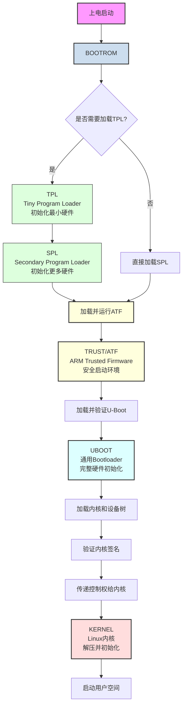

# 开机log分析

RK平台启动流程：

```mermaid
graph TD
    A[上电启动] --> B[BOOTROM]
    B --> C{是否需要加载TPL?}
    
    C -->|是| D[TPL<br/>Tiny Program Loader<br/>初始化最小硬件]
    D --> E[SPL<br/>Secondary Program Loader<br/>初始化更多硬件]
    
    C -->|否| F[直接加载SPL]
    
    E --> G[加载并运行ATF]
    F --> G
    
    G --> H[TRUST/ATF<br/>ARM Trusted Firmware<br/>安全启动环境]
    H --> I[加载并验证U-Boot]
    
    I --> J[UBOOT<br/>通用Bootloader<br/>完整硬件初始化]
    J --> K[加载内核和设备树]
    
    K --> L[验证内核签名]
    L --> M[传递控制权给内核]
    
    M --> N[KERNEL<br/>Linux内核<br/>解压并初始化]
    N --> O[启动用户空间]
    
    %% 样式定义
    style A fill:#f9f,stroke:#333,stroke-width:2px
    style B fill:#cde,stroke:#333,stroke-width:2px
    style D fill:#dfd,stroke:#333,stroke-width:1px
    style E fill:#dfd,stroke:#333,stroke-width:1px
    style G fill:#ffd,stroke:#333,stroke-width:2px
    style H fill:#ffd,stroke:#333,stroke-width:2px
    style J fill:#dff,stroke:#333,stroke-width:2px
    style N fill:#fdd,stroke:#333,stroke-width:2px
```

