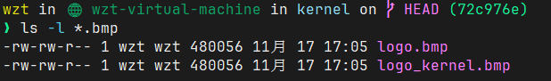
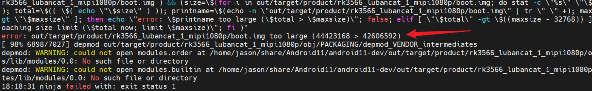

# 修改开机logo

# 1. RK通用修改方法

1. 一般来说，U-Boot 以及 kernel 阶段的 logo 都存放在 SDK 的内核源码目录下

2. 将自己修改好的logo图片直接覆盖掉原本的 `logo.bmp` 和 `logo_kernel.bmp` 然后重新编译内核即可
3. 编译内核的时候会将两个 `logo` 文件 `logo.bmp` 和 `logo_kernel.bmp` 打包到 `resource.img` 中，然后再将 `resource.img` 打包到 `boot.img` 中
4. U-Boot 启动的时候会把这两个bmp文件加载到内存中，`logo.bmp` 会在U-Boot阶段开始显示，`logo_kernel.bmp` 在内存中的地址会被 U-Boot 传给 Linux kernel ，在 Linux kernel 的 DRM 显示驱动初始化阶段显示

# 2. 图片格式

1. 图片**像素尺寸大小要求**和 SDK 里面原本的图片像素大小一致即可，也可以自己调整大小，但是最大不要大过你的显示器分辨率
2. 图片**格式要求**需要是`透明底色`、`24位色深`、`bmp格式`的图片，如果是32位色可能会编译时报错
3. 图片**大小要求**在4MB左右，如果编译时候报以下错误，可以修改：`device/rockchip/common/BoardConfig.mk` 文件，将其中的 42606592 改为 xxxxxxxx（对应自己报错的大小，有两处），然后重新编译即可

# 3. 修改安卓开机动画

如果需要修改安卓系统的开机动画，可参照正点原子的文档章节 6.2.5 修改：

[【正点原子】ATK-DLRK3568_Android系统开发手册V1.2](../核心参考文献库/【正点原子】ATK-DLRK3568_Android系统开发手册V1.2.pdf)