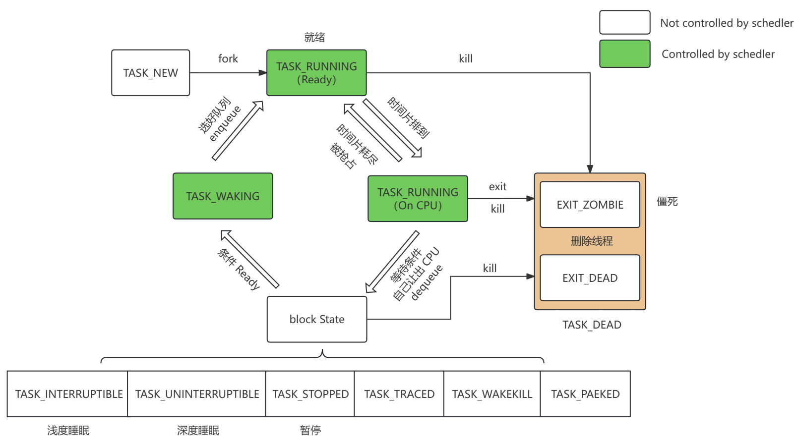

# Linux进程调度

# 1. 现代操作系统动态资源管理

## 1.1 调度

- **核心问题**：**哪个任务**来跑？在**哪个CPU核**上跑？
- **职能**：正如上一部分所述，在多个就绪任务之间分配CPU时间，选择下一个要执行的任务，并负责上下文切换、负载均衡等。
- **类比**：**足球教练**。决定哪个球员（任务）上场，踢哪个位置（在哪个CPU核上执行），并根据比赛情况换人。

## 1.2 调频

- **核心问题**：CPU核跑多**快**？（调节电压和频率）
- **负责子系统**：**CPUFreq** 或 **DVFS**。
- **职能**：
	- **动态电压频率调整**：根据CPU的当前负载，动态地提高或降低其工作频率和电压。
	- **策略**：
		- **性能模式**：负载高时，升至最高频率，追求最快处理速度。
		- **省电模式**：负载低时，降至最低频率，牺牲一些性能以大幅节省功耗（功耗与频率大致成线性关系，与电压的平方成关系）。
		- **按需调节**：最常见的策略，内核监视CPU使用率，动态调整频率以满足性能需求的同时尽量省电。
- **为什么重要**：CPU在高频下运行虽然性能强，但功耗（尤其是动态功耗）会显著增加，发热也更大。调频是平衡性能与能效的关键手段。
- **类比**：**汽车油门**。路况好、需要加速时深踩油门（提高频率）；匀速巡航时轻踩油门（降低频率）。

## 1.3 摆核

- **核心问题**：开**几个**CPU核？开**哪几个**CPU核？
- **负责子系统**：**CPUIdle** 和 **CPUHotplug**，通常由调度器或特定驱动（如**能量感知调度EAS**）触发。
- **职能**：
	- **CPU热插拔**：在系统运行时，动态地“关闭”或“开启”整个CPU核心。
	- **核心睡眠状态管理**：当核心空闲时，使其进入不同的低功耗休眠状态（C-states）。
	- **策略**：
		- 当系统负载很低时，**将任务集中到少数几个核心上运行，然后关闭完全空闲的核心**。关闭的核心几乎不消耗功耗。
		- 当负载升高时，**再按需开启更多核心**来分担负载。
- **为什么重要**：即使频率降到最低，一个开启的CPU核也会消耗**静态功耗**（ leakage power）。直接关闭整个核心可以彻底消除这部分功耗，是更深层次的省电手段，但对任务唤醒的延迟影响更大。
- **类比**：**工厂生产线**。订单少时，只开一条生产线，让工人集中作业，关掉其他生产线以节省水电。订单暴增时，再陆续开启其他生产线。

## 1.4 三者协同工作示例

1. **初始状态**：手机待机，只有一个后台任务在运行。
2. **摆核生效**：调度器发现只有一个任务，于是将所有任务集中到**CPU0**上运行，然后关闭**CPU1、CPU2、CPU3**。
3. **调频生效**：CPUFreq监控到**CPU0**的利用率很低（比如只有10%），于是将**CPU0**的频率从2.0GHz降至800MHz。
4. **用户操作**：你突然点开一个应用。
5. **触发调度**：该应用启动，产生多个高优先级线程。
6. **调频响应**：CPUFreq检测到**CPU0**利用率瞬间飙升到100%，立即将其频率拉升至最高2.0GHz以保证响应速度。
7. **负载均衡与摆核响应**：调度器发现**CPU0**已经满载，且新任务队列很长。
	- 首先，通过**负载均衡**将部分任务迁移到**CPU1**上（此时**CPU1**还处于关闭状态）。
	- 这个迁移请求触发**摆核**逻辑，**唤醒（开启）CPU1**。
8. **新的稳定状态**：调度器在**CPU0**和**CPU1**之间平衡任务负载；CPUFreq根据两个核心各自的利用率，独立地调节它们的频率；**CPU2**和**CPU3**仍处于关闭状态以省电。

## 1.5 总结

- **传统调度**：主要关注公平性和吞吐量。
- **现代调度 + 调频 + 摆核**：形成一个 **“性能-功耗联合优化”** 的闭环。特别是在ARM架构的移动设备（手机、平板）上，这三者的紧密集成至关重要。
- **EAS**：Linux内核的 **“能量感知调度”** 正是为了更紧密地整合**调度器**和**调频/摆核**子系统而设计的。它让调度器在做出“任务往哪里放”的决策时，就直接考虑到不同CPU核心的**能效差异**（比如大核性能强但耗电，小核性能弱但省电），以及**改变频率/开关核心带来的功耗成本**，从而做出全局最优的能效决策。

简单来说：

- **调度**是策略大脑，决定**任务的流向**。
- **调频**是油门和刹车，控制**每个核心的运行强度**。
- **摆核**是工厂的开关，控制**参与计算的核心数量**。

三者共同目标是在满足系统性能需求的前提下，**最大化能效**。

# 2. 任务状态图

