# Linux进程调度

# 1. 现代操作系统动态资源管理

## 1.1 调度

- **核心问题**：**哪个任务**来跑？在**哪个CPU核**上跑？
- **职能**：正如上一部分所述，在多个就绪任务之间分配CPU时间，选择下一个要执行的任务，并负责上下文切换、负载均衡等。


## 1.2 调频

- **核心问题**：CPU核跑多**快**？（调节电压和频率）
- **负责子系统**：**CPUFreq** 或 **DVFS**。
- **职能**：
	- **动态电压频率调整**：根据CPU的当前负载，动态地提高或降低其工作频率和电压。
	- **策略**：
		- **性能模式**：负载高时，升至最高频率，追求最快处理速度。
		- **省电模式**：负载低时，降至最低频率，牺牲一些性能以大幅节省功耗（功耗与频率大致成线性关系，与电压的平方成关系）。
		- **按需调节**：最常见的策略，内核监视CPU使用率，动态调整频率以满足性能需求的同时尽量省电。
- **为什么重要**：CPU在高频下运行虽然性能强，但功耗（尤其是动态功耗）会显著增加，发热也更大。调频是平衡性能与能效的关键手段。


## 1.3 摆核

- **核心问题**：开**几个**CPU核？开**哪几个**CPU核？
- **负责子系统**：**CPUIdle** 和 **CPUHotplug**，通常由调度器或特定驱动（如**能量感知调度EAS**）触发。
- **职能**：
	- **CPU热插拔**：在系统运行时，动态地“关闭”或“开启”整个CPU核心。
	- **核心睡眠状态管理**：当核心空闲时，使其进入不同的低功耗休眠状态（C-states）。
	- **策略**：
		- 当系统负载很低时，**将任务集中到少数几个核心上运行，然后关闭完全空闲的核心**。关闭的核心几乎不消耗功耗。
		- 当负载升高时，**再按需开启更多核心**来分担负载。
- **为什么重要**：即使频率降到最低，一个开启的CPU核也会消耗**静态功耗**（ leakage power）。直接关闭整个核心可以彻底消除这部分功耗，是更深层次的省电手段，但对任务唤醒的延迟影响更大。


## 1.4 三者协同工作示例

1. **初始状态**：手机待机，只有一个后台任务在运行。
2. **摆核生效**：调度器发现只有一个任务，于是将所有任务集中到**CPU0**上运行，然后关闭**CPU1、CPU2、CPU3**。
3. **调频生效**：CPUFreq监控到**CPU0**的利用率很低（比如只有10%），于是将**CPU0**的频率从2.0GHz降至800MHz。
4. **用户操作**：你突然点开一个应用。
5. **触发调度**：该应用启动，产生多个高优先级线程。
6. **调频响应**：CPUFreq检测到**CPU0**利用率瞬间飙升到100%，立即将其频率拉升至最高2.0GHz以保证响应速度。
7. **负载均衡与摆核响应**：调度器发现**CPU0**已经满载，且新任务队列很长。
  - 首先，通过**负载均衡**将部分任务迁移到**CPU1**上（此时**CPU1**还处于关闭状态）。
  - 这个迁移请求触发**摆核**逻辑，**唤醒（开启）CPU1**。
8. **新的稳定状态**：调度器在**CPU0**和**CPU1**之间平衡任务负载；CPUFreq根据两个核心各自的利用率，独立地调节它们的频率；**CPU2**和**CPU3**仍处于关闭状态以省电。


## 1.5 总结

- **传统调度**：主要关注公平性和吞吐量。
- **现代调度 + 调频 + 摆核**：形成一个 **“性能-功耗联合优化”** 的闭环。特别是在ARM架构的移动设备（手机、平板）上，这三者的紧密集成至关重要。
- **EAS**：Linux内核的 **“能量感知调度”** 正是为了更紧密地整合**调度器**和**调频/摆核**子系统而设计的。它让调度器在做出“任务往哪里放”的决策时，就直接考虑到不同CPU核心的**能效差异**（比如大核性能强但耗电，小核性能弱但省电），以及**改变频率/开关核心带来的功耗成本**，从而做出全局最优的能效决策。

简单来说：

- **调度**是策略大脑，决定**任务的流向**。
- **调频**是油门和刹车，控制**每个核心的运行强度**。
- **摆核**是工厂的开关，控制**参与计算的核心数量**。

三者共同目标是在满足系统性能需求的前提下，**最大化能效**。


# 2. 线程状态图


*绿色的三个状态是调度器可以调度到的，而阻塞（BLOCK）状态下是主动让出 CPU ，调度器无法调度到*

| State                  | 描述                                                         | 简写             |
| ---------------------- | ------------------------------------------------------------ | ---------------- |
| `TASK_RUNNING`         | 在 `runqueue` 中排队`（Runnable）`或者在 `CPU` 上面运行      | R                |
| `TASK_INTERRUPTIBLE`   | 进程因为等待一些条件而被挂起或阻塞所处的状态，但能够被中断或信号唤醒。 | S                |
| `TASK_UNINTERRUPTIBLE` | 只有它所等待的资源可用的时候，它才会被唤醒，不能够被中断或信号唤醒。 | D                |
| `TASK_STOPPED`         | 进程被停止，当进程接收到 `SIGSTOP、SIGTTIN、SIGTSTP 或者SIGTTOU`信号之后就会进入该状态，除非进程本身就属于 TASK_UNINTERRUPTIBLE 状态而不响应信号。 | T                |
| `TASK_TRACED`          | 进程被debugger等进程监视跟踪时。                             | t                |
| TASK_PAKED             | 这个状态主要是由 `kthread_park()` 和 `kthread_unpark()` 函数使用。主要为了解决 `CPU hotplug` 问题。 | P                |
| TASK_DEAD              | 收到 `single` 或者调用 `exit` 进程退出，分别为 `EXIT_ZOMBIE 或 EXIT_DEAD`。 | ZOMBIE:Z  DEAD:X |
| TASK_WAKEKILL          | `TASK_UNINTERRUPTIBLE + TASK_WAKEKILL 等于TASK_KILLABLE`，而 `TASK_WAKEKILL` 用于在接收致命信号时唤醒进程。 | K                |
| TASK_WAKING            | 正在被唤醒，是个短暂的状态。一旦放入 `runqueue` 中这个状态就结束转换为 `TASK_RUNNING` 状态。 | W                |
| TASK_NEW               | `fork` 时的状态，`TASK_NEW` 之后放到 `CPU` 的 `runqueue` 变成 `TASK_RUNNING`。 |                  |
| TASK_KILLABLE          | 可以被等到的资源唤醒，不能被常规信号唤醒，但是可以被致命信号唤醒。 `TASK_WAKEKILL 或 TASK_UNINTERRUPTIBLE`。 |                  |


# 3. 调度类和调度策略

[吐血整理 | 肝翻 Linux 进程调度所有知识点](https://mp.weixin.qq.com/s/-j7gPKUk1dkvzbP0ERdKVg)


**优先级（数字越小优先级越高）：**

[Linux调度器：进程优先级](http://www.wowotech.net/process_management/process-priority.html)

[一文搞懂linux进程调度框架 - 知乎](https://zhuanlan.zhihu.com/p/554149581)

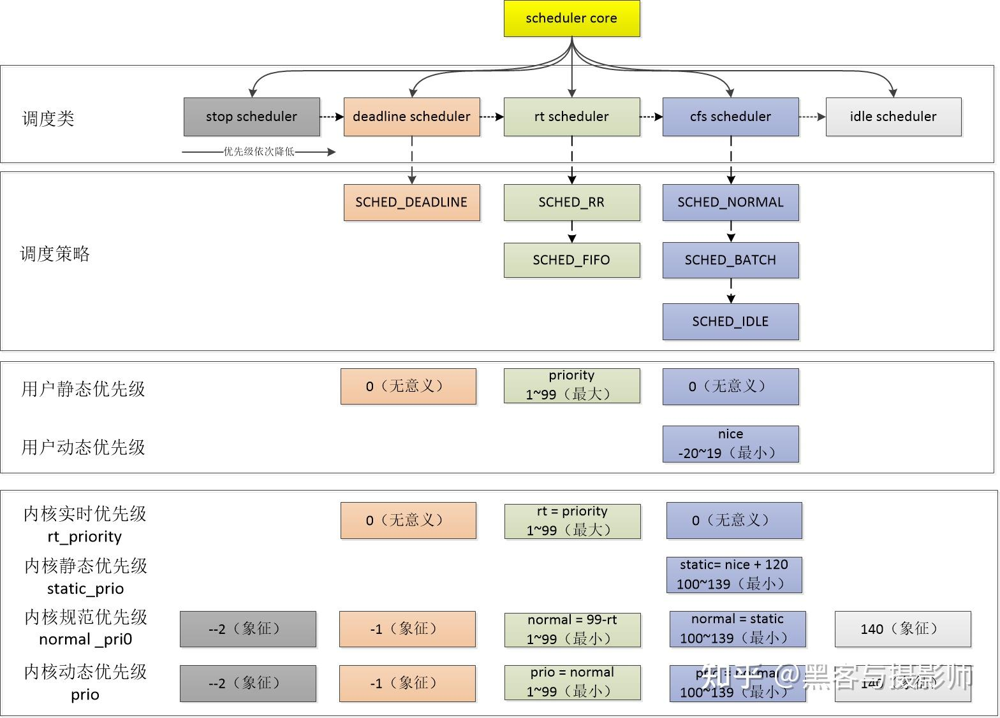


**用户空间看到的优先级和内核空间看到的不一样：**

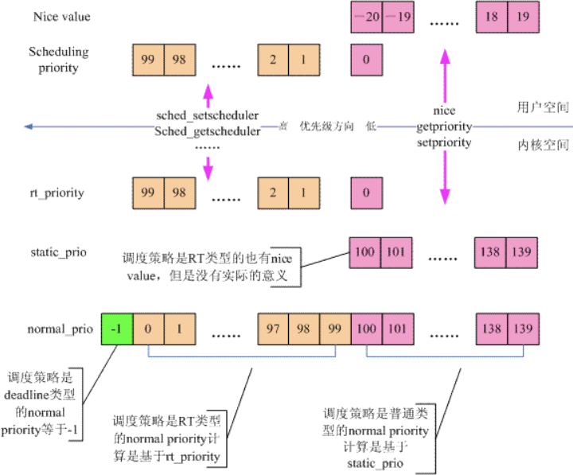


**虽然有五种调度，但是 stop 和 idle 调度没有队列，他们只有一个TASK。`每个CPU都有一个运行队列 runqueue，每个 runqueue 有三个调度队列，task 作为调度实体加入到各自的调度队列中`**

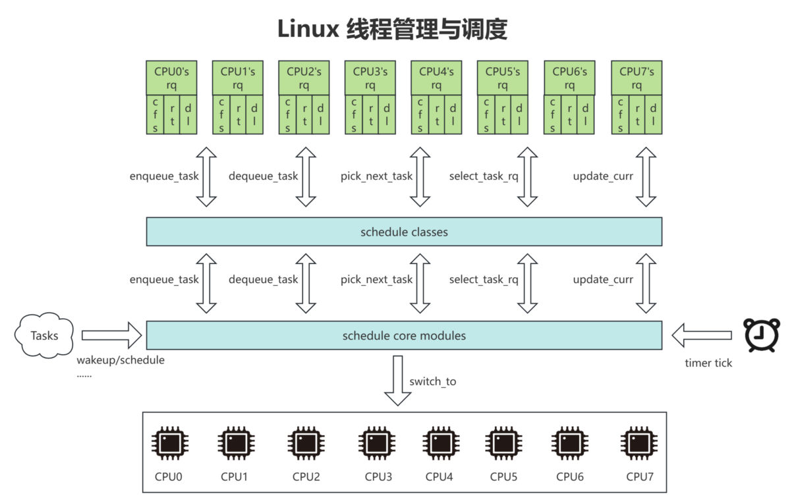


**在`调度器被触发调度时，由调度实体（task / task group）所属的调度器类`，按照预定的`调度器策略`调度 task 执行**

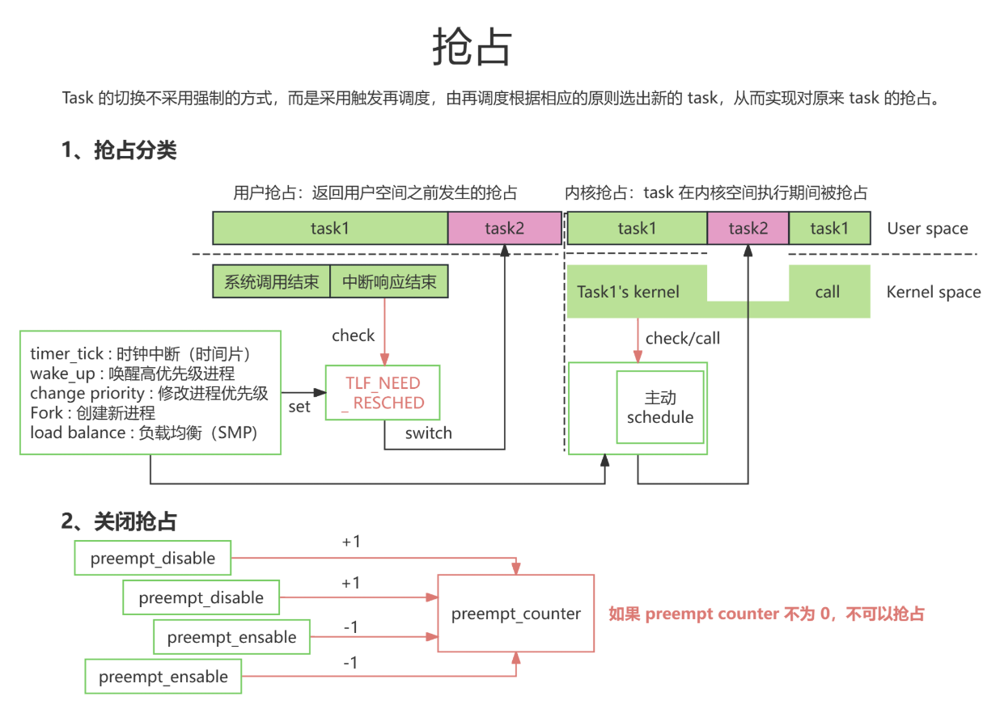

**调度器：实现task切换与排序的系统，主要有主调度器与周期性调度器**

| 调度器         | 描述                                                         |
| -------------- | ------------------------------------------------------------ |
| `主调度器`     | 直接的，比如进程打算睡眠或者等待信号主动放弃CPU              |
| `周期性调度器` | 系统预先设定的 timer tick，每隔一定周期 trigger，由调度器类决定是否更换新的 task 执行 |

**调度器类：**

| 调度器类           | 说明                                                         | 优先级 | 采用的调度策略                                     |
| ------------------ | ------------------------------------------------------------ | ------ | -------------------------------------------------- |
| `stop_sched_class` | **优先级最高**的线程，会中断其他所有的线程，且不会被其他任务打断：`1. 发生在 cpu_stop cpu_callback 进行 CPU 之间的任务 migration 2. HOTPLUG_CPU 的情况下关闭任务。` | 1      | 一个CPU，同一时刻只接受一个这样的任务，没有queue。 |
| `dl_sched_class`   | 按照 task 设定的 deadline 进行调度。（移动设备一般不使用，如安卓） | 2      | SCHED_DEADLINE                                     |
| `rt_sched_class`   | `实时调度器（常用）`                                         | 3      | SCHED_RR / SCHED_FIFO                              |
| `fair_sched_class` | `完全公平调度器（最常用，大多数task都属于这个，有时间片的概念）` | 4      | SCHED_NORMAL / SCHED_BATCH / SCHED_IDLE            |
| `idle_sched_class` | 系统进入空闲时候的调度器（很少用）                           | 5      | 刚开机的时候创建的 idle task，每个CPU上面有一个    |

**调度策略：设定给task供调度器类参考的调度原则或者方法**

| 调度策略         | 说明                                                         | 适用的调度类 |
| ---------------- | ------------------------------------------------------------ | ------------ |
| `SCHED_NORMAL`   | 完全公平调度                                                 | CFS          |
| `SCHED_FIFO`     | 当都是`RT线程且优先级相同时`，`enqueue`早的先执行且一直执行到主动或者被动放弃CPU。 | RT           |
| `SCHED_RR`       | 具有相同优先级的`RT TASK`，每个`TASK`执行分配给自己的时间片。 | RT           |
| `SCHED_BATCH`    | 是用`CPU`密集型`task`。完全公平调度的一种，只不过是尽可能的条件下多分配`CPU`执行。 | CFS          |
| `SCHED_IDLE`     | 比 `nice 19` 的任务优先级还要低，但它并非真正的空闲任务。    | CFS          |
| `SCHED_DEADLINE` | `deadline`调度器默认使用的调度策略。`EDF:early deadline task first` | DL           |

**调度实体：被调度的基本单位，可以是一个task，或者一组task。**

**API：**`手动设置进程的调度策略和参数 sched_setscheduler(),如果不设置的话默认是 SCHED_OTHER（完全公平调度CFS），默认的调度参数一般为0（实际上由nice值决定）`

```c
/**
 * sched_setscheduler - 设置进程的调度策略和参数
 * 
 * @pid: 目标进程的进程ID，用于标识要设置哪个进程的调度策略
 *       特殊值0表示当前调用进程自身
 *       pid > 0 表示设置指定PID的进程
 *       
 * @policy: 要设置的调度策略，决定进程如何被调度器处理
 *         可用的策略包括（定义在<sched.h>中）：
 *         - SCHED_OTHER: 默认的完全公平调度(CFS)，用于普通分时任务
 *         - SCHED_FIFO:  先进先出实时调度，无时间片限制
 *         - SCHED_RR:    轮转实时调度，有时间片限制
 *         - SCHED_BATCH: 批处理调度，适合非交互式后台任务
 *         - SCHED_IDLE:  极低优先级调度，仅当系统空闲时运行
 *         - SCHED_DEADLINE: 截止时间调度，用于有严格时间要求的任务
 *         
 * @param: 指向sched_param结构体的指针，包含调度参数
 *         struct sched_param {
 *             int sched_priority;  // 调度优先级
 *             // 注意：如果是SCHED_DEADLINE，这个结构体成员更多
 *         };
 *         对于不同策略，sched_priority的含义不同：
 *         - SCHED_FIFO/SCHED_RR: 实时优先级(1-99，1最低，99最高)
 *         - SCHED_OTHER/SCHED_BATCH/SCHED_IDLE: 必须设置为0
 *         - SCHED_DEADLINE: 不使用此字段，有专门的参数
 *         
 * 返回值:
 *   成功: 返回0
 *   失败: 返回-1，并设置errno为相应的错误码
 *         常见错误:
 *         - EINVAL: 参数无效（如policy不支持，priority超出范围）
 *         - EPERM:  权限不足（普通用户尝试设置实时调度）
 *         - ESRCH:  指定的pid不存在
 *         - EACCES: 调用者没有适当的权限
 *         
 * 注意事项:
 *   1. 设置实时调度策略(SCHED_FIFO/SCHED_RR)通常需要root权限
 *   2. 不当使用实时调度可能导致系统无响应
 *   3. 对于SCHED_DEADLINE，需要使用sched_setattr()函数
 *   4. 子进程会继承父进程的调度策略（除非设置了sched_reset_on_fork标志）
 *   5. 优先级数值范围：实时(1-99)，普通(100-139对应nice值-20到19)
 */
int sched_setscheduler(pid_t pid, int policy, const struct sched_param *param);
```


# 4. CFS和EEVDF

## 4.1 CFS

[吐血整理 | 肝翻 Linux 进程调度所有知识点](https://mp.weixin.qq.com/s/-j7gPKUk1dkvzbP0ERdKVg)

CFS是 Completely Fair Scheduler 简称，即完全公平调度器。CFS 调度器和以往的调度器不同之处在于没有固定时间片的概念，而是公平分配 CPU 使用的时间。比如：2个优先级相同的任务在一个 CPU 上运行，那么每个任务都将会分配一半的 CPU 运行时间，这就是要实现的公平。

但现实中，必然是有的任务优先级高，有的任务优先级低。CFS 调度器引入权重 weight 的概念，用 weight 代表任务的优先级，各个任务按照 weight 的比例分配 CPU 的时间。比如：2个任务A和B，A的权重是1024，B的权重是2048，则A占 1024/(1024+2048) = 33.3% 的 CPU 时间，B占 2048/(1024+2048)=66.7% 的 CPU 时间。

在引入权重之后，分配给进程的时间计算公式如下：

**实际运行时间 = 调度周期 \* 进程权重 / 所有进程权重之和**

CFS 调度器用nice值表示优先级，取值范围是[-20, 19]，nice和权重是一一对应的关系。数值越小代表优先级越大，同时也意味着权重值越大，nice值和权重之间的转换关系：

```c
const int sched_prio_to_weight[40] = {
 /* -20 */     88761,     71755,     56483,     46273,     36291,
 /* -15 */     29154,     23254,     18705,     14949,     11916,
 /* -10 */      9548,      7620,      6100,      4904,      3906,
 /*  -5 */      3121,      2501,      1991,      1586,      1277,
 /*   0 */      1024,       820,       655,       526,       423,
 /*   5 */       335,       272,       215,       172,       137,
 /*  10 */       110,        87,        70,        56,        45,
 /*  15 */        36,        29,        23,        18,        15,
};
```

数组值计算公式是：weight = 1024 / 1.25nice


### 4.1.1 虚拟运行时间

根据上面进程实际运行时间的公式，可以看出，权重不同的2个进程的实际执行时间是不相等的，但是 CFS 想保证每个进程运行时间相等，因此 CFS 引入了虚拟运行时间的概念。虚拟时间(vriture_runtime)和实际时间(wall_time)转换公式如下：

**vriture_runtime = (wall_time \* NICE0_TO_weight) / weight**

其中，NICE0_TO_weight 代表的是 nice 值等于0对应的权重，即1024，weight 是该任务对应的权重。

权重越大的进程获得的虚拟运行时间越小，那么它将被调度器所调度的机会就越大，所以，**CFS 每次调度原则是：总是选择 vriture_runtime 最小的任务来调度**。

为了能够快速找到虚拟运行时间最小的进程，Linux 内核使用红黑树来保存可运行的进程。CFS跟踪调度实体sched_entity的虚拟运行时间vruntime，将sched_entity通过enqueue_entity()和dequeue_entity()来进行红黑树的出队入队，vruntime少的调度实体sched_entity排列到红黑树的左边。

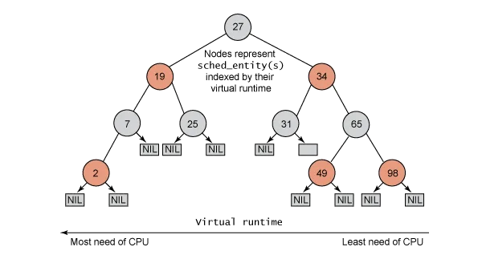

如上图所示，红黑树的左节点比父节点小，而右节点比父节点大。所以查找最小节点时，只需要获取红黑树的最左节点即可。

**相关步骤如下：**

1. 每个sched_latency周期内，根据各个任务的权重值，可以计算出运行时间runtime；
2. 运行时间runtime可以转换成虚拟运行时间vruntime；
3. 根据虚拟运行时间的大小，插入到CFS红黑树中，虚拟运行时间少的调度实体放置到左边；

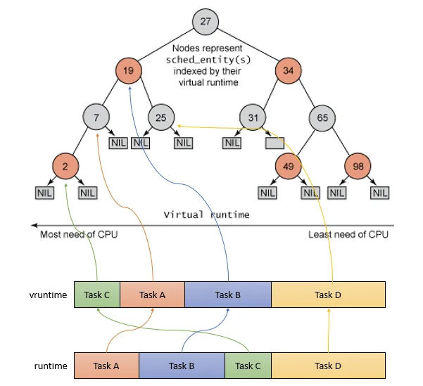

4. 在**下一次任务调度**的时候，选择虚拟运行时间少的调度实体来运行。pick_next_task 函数就是从就绪队列中选择最适合运行的调度实体，即虚拟时间最小的调度实体

	

### 4.1.2 时间片

[CFS调度时间片计算_cfs 调度周期-CSDN博客](https://blog.csdn.net/qq_23662505/article/details/127566718)

```c
/*
 * Targeted preemption latency for CPU-bound tasks:
 *
 * NOTE: this latency value is not the same as the concept of
 * 'timeslice length' - timeslices in CFS are of variable length
 * and have no persistent notion like in traditional, time-slice
 * based scheduling concepts.
 *
 * (to see the precise effective timeslice length of your workload,
 *  run vmstat and monitor the context-switches (cs) field)
 *
 * (default: 6ms * (1 + ilog(ncpus)), units: nanoseconds)
 */
unsigned int sysctl_sched_latency            = 6000000ULL;
static unsigned int normalized_sysctl_sched_latency    = 6000000ULL;

/*
 * Minimal preemption granularity for CPU-bound tasks:
 *
 * (default: 0.75 msec * (1 + ilog(ncpus)), units: nanoseconds)
 */
unsigned int sysctl_sched_min_granularity            = 750000ULL;
static unsigned int normalized_sysctl_sched_min_granularity    = 750000ULL;

/*
 * This value is kept at sysctl_sched_latency/sysctl_sched_min_granularity
 */
static unsigned int sched_nr_latency = 8;

```

kernel/sched/fair.c中定义了这三个值得默认值：

| 参数                                    | 默认值 |
| --------------------------------------- | ------ |
| sched_nr_latency                        | 8      |
| sched_latency（默认调度周期）           | 6ms    |
| sched_min_latency（最小调度时间片粒度） | 0.75ms |

其中，sched_nr_latency的初始值是8，是由另外两个参数计算得出：

**sched_nr_latency = sched_latency / sched_min_granularity**

sched_latency 和 sched_min_granularity 被导出到/proc接口，随系统的CPU配置变化而变化：
```bash
rk3566_lubancat_1_mipi1080p:/ # cat /proc/sys/kernel/sched_latency_ns
10000000 #默认调度周期10ms
rk3566_lubancat_1_mipi1080p:/ # cat /proc/sys/kernel/sched_min_granularity_ns
2250000 #最小调度时间片粒度2.25ms
```

**调度周期内，所有的task必须跑一遍**

**调度周期 = min(默认调度周期, nr_running * 最小调度粒度)**


### 4.1.3 选择下一个进程

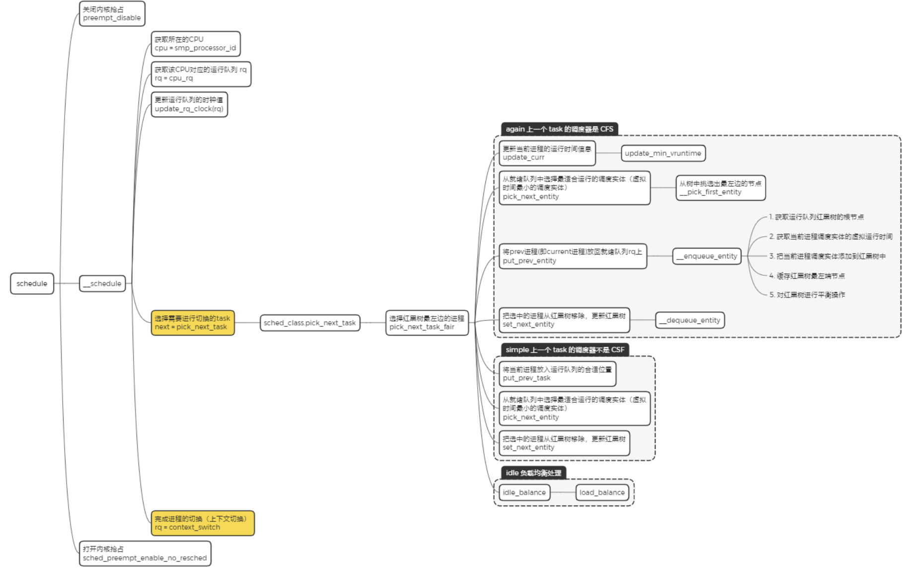


### 4.1.4 进程上下文切换

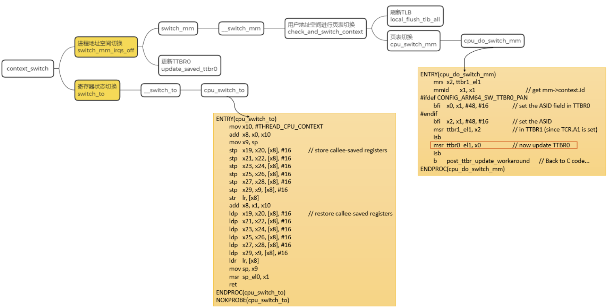


## 4.2 调度时刻

1. **scheduler_tick 时钟中断**

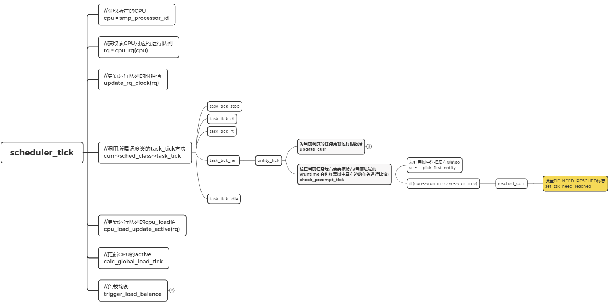

2. **wake_up_process 唤醒进程的时候**

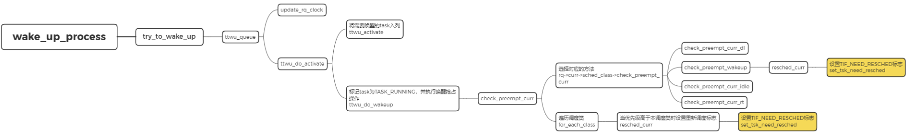

3. **do_fork 创建新进程的时候**

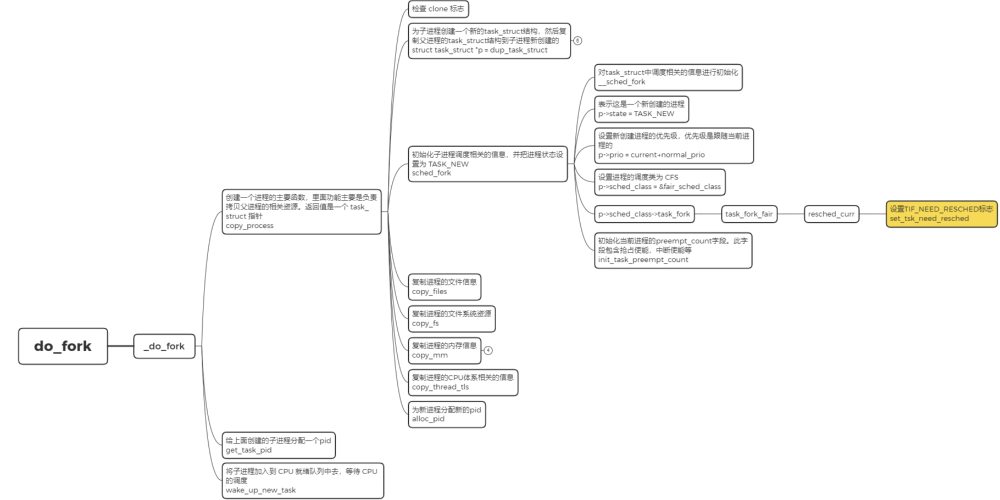

4. **set_user_nice 修改进程nice值的时候**

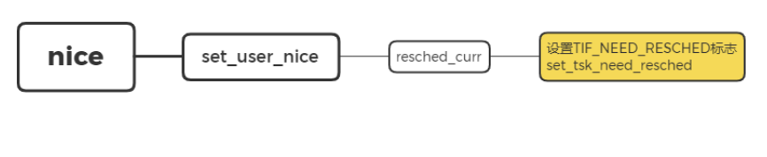

5. **smp_send_reschedule 负载均衡的时候**


## 4.3 执行调度

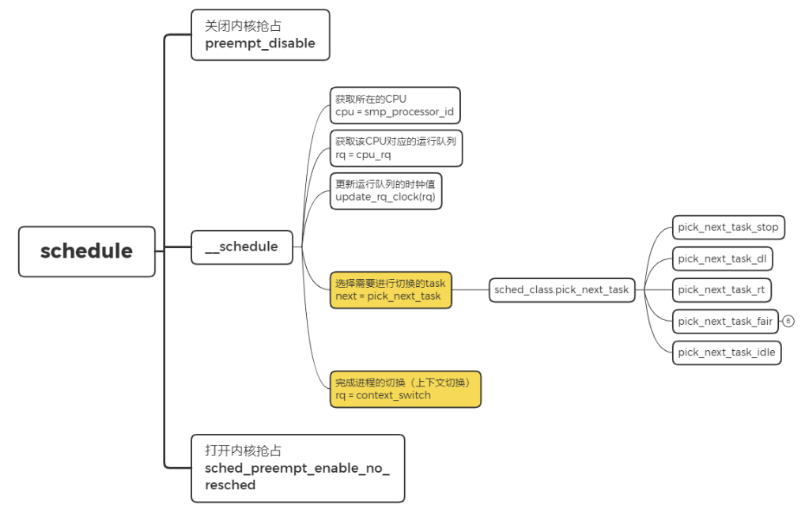


## 4.4 linux主调度器

| 调度器      | 内核版本         |
| ----------- | ---------------- |
| O(n) 调度器 | linux 0.11 - 2.4 |
| O(1) 调度器 | linux 2.6        |
| CFS 调度器  | linux 2.6 - 6.6  |
| EEVDF 度器  | linux 6.6 - 至今 |


## 4.5 EEVDF

`CFS调度器强度公平，只提供一个权重一个变量（nice值）`，用于控制任务之间运行时间分配的比例，不提供对特定任务时延层面的保障。这导致`服务质量保障（Qualitity of Service,Qos）`很难实现。传统手段是通过为不同任务设置标签，在调度关键逻辑（唤醒、抢占、负载均衡），对打了不同标签的任务进行特判处理，导致调度逻辑充满了特判和兜底。

为了将时延考虑在内，新的调度器`EEVDF在保证时间分配公平的同时`，引入代表任务`”应得时间“和”已得时间“的差异值 lag `作为关键指标，只有 `应得时间 > 已得时间 任务才有资格（称为eligible）`被挑选，进一步地，在有资格被挑选的任务中，选择`任务完成时限（deadline）`最近的任务运行，即`所谓的Earliest Eligible Vitual Deadline First 称为 EEVDF` 。


# 5. 通过trace查看TASK状态

**ADB工具下载：[Android 调试桥 (adb)  | Android Studio  | Android Developers](https://developer.android.google.cn/tools/adb?hl=zh-cn)**

**分析trace的网址：[Perfetto UI](https://ui.perfetto.dev/)**

```bat
@echo off

rem in /sys/kernel/debug/tracing/ or /sys/kernel/tracing/,please confirm by yourself

adb root

adb shell "echo 65536 > /sys/kernel/debug/tracing/buffer_size_kb"
echo "buffer_size_kb(per cpu): "
adb shell "cat /sys/kernel/debug/tracing/buffer_size_kb"

adb shell "echo nop > /sys/kernel/debug/tracing/current_tracer" >nul 2>&1
adb shell "echo 'noprint-tgid' > /sys/kernel/tracing/trace_options" >nul 2>&1

rem clear ftrace events
adb shell "echo > /sys/kernel/debug/tracing/set_event"

rem enable profiling events here,with loop
for %%x in (
    sched_switch
    sched_wakeup
    sched_migrate_task
    softirq_raise
    softirq_entry
    softirq_exit
    ipi
    irq
    irq_handler_entry
    irq_handler_exit
    cpu_frequency
    workqueue_execute_start
    workqueue_execute_end
    timer
    clk
    suspend_resume
    device_pm_callback_start
    device_pm_callback_end
    cpu_idle
    pm_qos_update_request
    i2c
    f2fs
) do (
    adb shell "echo %%x >> /sys/kernel/debug/tracing/set_event"
)

rem just in case tracing_enable is disabled by user or other debugging tool
adb shell "echo 1 > /sys/kernel/debug/tracing/tracing_enabled" >nul 2>&1
adb shell "echo 0 > /sys/kernel/debug/tracing/tracing_on"

rem erase previous recorded trace
adb shell "echo > /sys/kernel/debug/tracing/trace"
echo press any key to start capturing...
pause >nul

adb shell "echo 1 > /sys/kernel/debug/tracing/tracing_on"
echo "Start recording ftrace data"
echo "press any key to stop..."
pause >nul

adb wait-for-device
adb shell "echo 0 > /sys/kernel/debug/tracing/tracing_on"
echo "Recording stopped..."

adb shell "ps -AT" > ps_1.txt
adb shell cat /sys/kernel/debug/tracing/trace > SYS_FTRACE
adb shell "ps -AT" > ps_2.txt
adb shell "echo noprint-tgid > /sys/kernel/debug/tracing/trace_options" >nul 2>&1

rem default size
adb shell "echo 4096 > /sys/kernel/debug/tracing/buffer_size_kb"
echo "Done!"
pause
```


# 6. RT throttle（实时节流）

`RT调度器类有两个调度策略（FIFO和RR）`。他们的 `task` 可能会长期占用 `CPU` ，导致其他的 `CFS task` 无法执行。为了避免这种情况，`Linux是运用 RT throttle（实时节流） 机制解决的`，限制实时任务在给定周期内的最大运行时间，为非实时任务保留一定的CPU时间。。

```bash
# 查看当前RT节流设置
cat /proc/sys/kernel/sched_rt_period_us     # 周期长度（微秒）
cat /proc/sys/kernel/sched_rt_runtime_us    # 允许运行时间（微秒）

# 默认值：
# sched_rt_period_us = 1,000,000  (1秒)
# sched_rt_runtime_us = 950,000   (0.95秒)

# 允许运行时间比例 = sched_rt_runtime_us / sched_rt_period_us
# 默认：950,000 / 1,000,000 = 0.95 = 95%
# 所以默认配置下：
# 每秒内实时任务最多运行 0.95 秒（950毫秒）
# 必须保留至少 0.05 秒（50毫秒）给非实时任务
```

如果想知道是哪个 `RT task` 一直在运行，可以打开 `CONFIG_RT_GROUP_SCHED 和 CONFIG_XXX_RT_THROTTLE_MON` 宏定义，然后抓 `log` 和 `trace` 可以看到 `kernel log` 打印: `RT throrrling actived`，并打印出是哪个 `task` 在哪个 `CPU` 执行多少毫秒，然后找对应的 `owner` 确认。


# 7. CFS负载均衡

[CFS任务的负载均衡（概述）](http://www.wowotech.net/process_management/load_balance.html)

**CFS负载均衡主要有三种：**

1. 时钟中断（tick）中定期触发，在tick中触发load balance。我们称之tick load balance或者periodic load balance。具体的代码执行路径是：

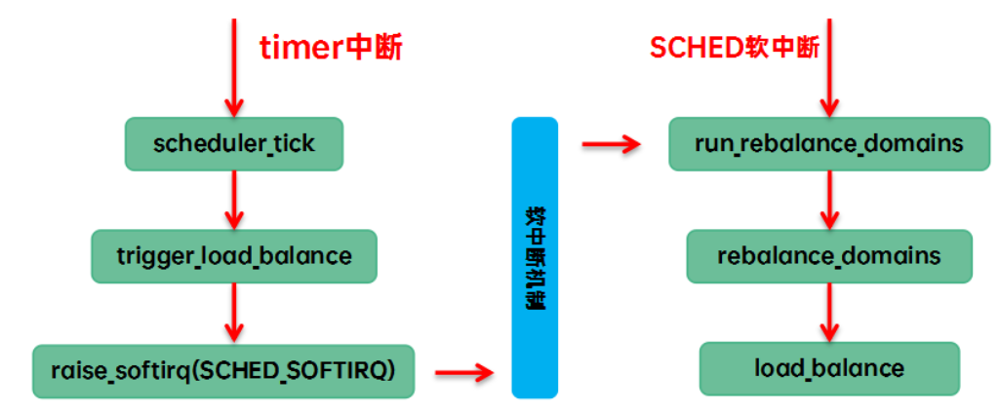

2. CPU即将进入空闲状态（执行idle线程）时触发，调度器在pick next的时候，当前cfs runque中没有runnable，只能执行idle线程，让CPU进入idle状态。我们称之new idle load balance。具体的代码执行路径是：

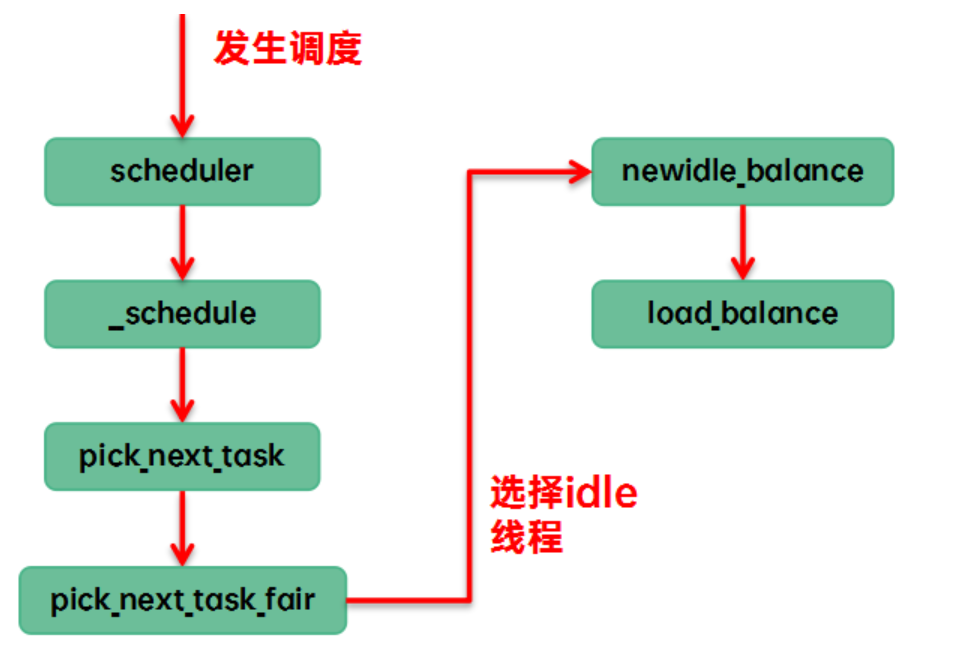

3. 某个CPU进入NO_HZ模式（停止tick）后，由繁忙CPU触发，其他的cpu已经进入idle，本CPU任务太重，需要通过ipi将其idle的cpu唤醒来进行负载均衡。我们称之nohz idle load banlance，具体的代码执行路径是：

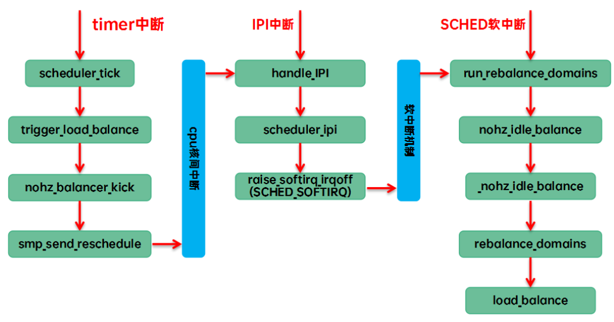

如果没有dynamic tick特性，那么其实不需要进行nohz idle load balance，因为tick会唤醒处于idle的cpu，从而周期性tick就可以覆盖这个场景。


# 8. 参考文献

[【原创】（一）Linux进程调度器-基础 - LoyenWang - 博客园](https://www.cnblogs.com/LoyenWang/p/12249106.html)

[【原创】（二）Linux进程调度器-CPU负载 - LoyenWang - 博客园](https://www.cnblogs.com/LoyenWang/p/12316660.html)

[【原创】（三）Linux进程调度器-进程切换 - LoyenWang - 博客园](https://www.cnblogs.com/LoyenWang/p/12386281.html)

[【原创】（四）Linux进程调度-组调度及带宽控制 - LoyenWang - 博客园](https://www.cnblogs.com/LoyenWang/p/12459000.html)

[【原创】（五）Linux进程调度-CFS调度器 - LoyenWang - 博客园](https://www.cnblogs.com/LoyenWang/p/12495319.html)

[【原创】（六）Linux进程调度-实时调度器 - LoyenWang - 博客园](https://www.cnblogs.com/LoyenWang/p/12584345.html)

[吐血整理 | 肝翻 Linux 进程调度所有知识点](https://mp.weixin.qq.com/s/-j7gPKUk1dkvzbP0ERdKVg)

[Linux调度器：进程优先级](http://www.wowotech.net/process_management/process-priority.html)

[一文搞懂linux进程调度框架 - 知乎](https://zhuanlan.zhihu.com/p/554149581)

[CFS调度时间片计算_cfs 调度周期-CSDN博客](https://blog.csdn.net/qq_23662505/article/details/127566718)

[CFS任务的负载均衡（概述）](http://www.wowotech.net/process_management/load_balance.html)

[进程管理 - 蜗窝科技](http://www.wowotech.net/sort/process_management)
