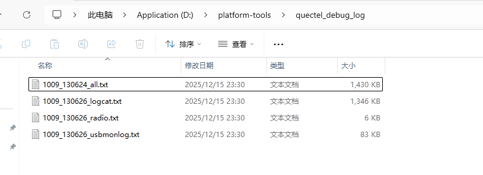

# 打印log&抓log方法

# 1. 抓log

1. 我们接上串口是可以抓到 U-Boot,kernel log 的（Android log是看不到的）
2. kernel log 可以在终端执行 dmesg 命令实时查看
3. Android log可以在终端执行 logcat，logcatd 命令实时查看（需要按下 Ctrl+C 终止打印）
4. 如果我们需要把 log 放到文件中使用搜索功能这个时候我们就要借助工具把它们抓出来
5. 使用ADB工具：

```bat
adb root
adb shell mkdir /data/quectel_debug_log
adb shell chmod 777 /data/quectel_debug_log
adb reboot
```

6. 执行上面命令机器重启后，在机器上执行想要复现的操作，停止操作后把 log pull 出来

```bat
adb root
adb pull /data/quectel_debug_log
```

7. 导出的log会在ADB工具目录下，logcat就是安卓的log




# 2. 增加打印

## 2.1 kernel

[2-Linux调试手段](./2-Linux调试手段)


## 2.2 Android

[使用 Logcat 查看日志  | Android Studio  | Android Developers](https://developer.android.google.cn/studio/debug/logcat?hl=zh-cn)

| 日志输出方法 | 日志级别    | 备注                         |
| ------------ | ----------- | ---------------------------- |
| `Log.v()`    | verbose     | 打印琐碎且意义较小的日志信息 |
| `Log.d()`    | debug       | 打印一些调试信息             |
| `Log.i()`    | information | 打印一些比较重要的数据       |
| `Log.w()`    | warn        | 打印一些警告信息             |
| `Log.e()`    | error       | 打印程序中的错误信息         |


## 2.3 U-Boot


