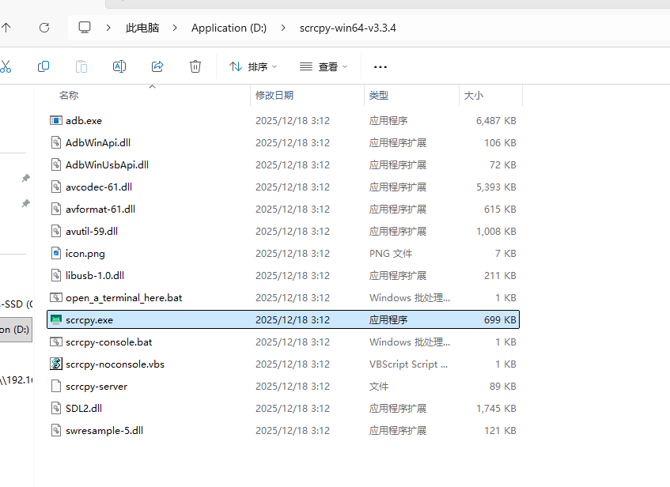
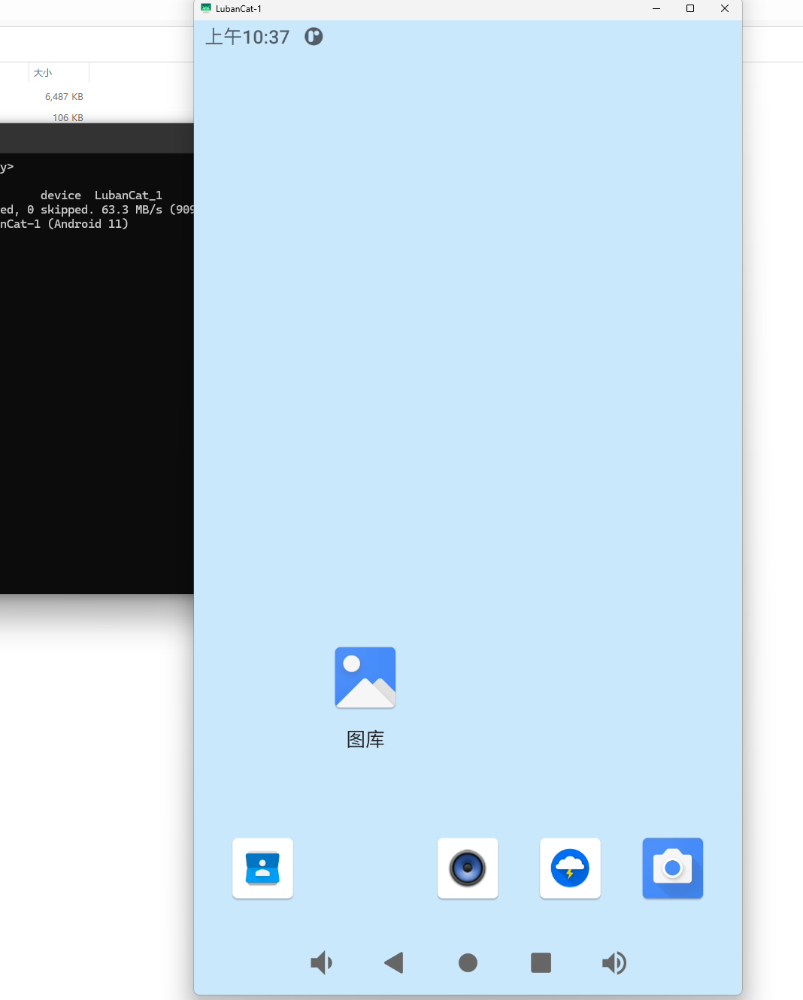
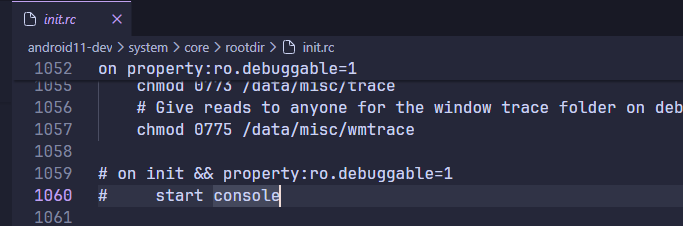

# Android开发环境搭建

# 1. 交叉编译工具链

1. 在 `Android` 源码目录下，找到存放交叉编译工具的文件夹，一般来说 `SDK` 里存放交叉编译工具的目录都是 `prebuilts` 文件夹：**`/home/wzt/rk3566/android11-dev/prebuilts/gcc/linux-x86/aarch64/gcc-linaro-6.3.1-2017.05-x86_64_aarch64-linux-gnu`**

2. 然后把交叉编译工具装到 Ubuntu 的启动脚本里：

```bash
sudo vim/etc/profile
```

3. 在最后一行追加交叉编译器的路径，这里用哪个就加哪个就行：

```bash
export PATH=/home/wzt/rk3566/android11-dev/prebuilts/gcc/linux-x86/aarch64/gcc-linaro-6.3.1-2017.05-x86_64_aarch64-linux-gnu/bin:$PATH
```

4. 应用环境变量，随后就可以使用交叉编译器了

```bash
source /etc/profile
```


# 2. 投屏

1. 使用 `scrcpy` 可以将 `Android` 的屏幕投屏到电脑上
2. `scrcpy` 需要使用 `ADB` 功能，所以在使用前需要确保 `Android` 设备插在电脑上是可以用 `ADB` 连接成功的
3. 下载：[Genymobile/scrcpy: Display and control your Android device](https://github.com/Genymobile/scrcpy)
4. 下载安装好后双击 `scrcpy.exe` 打开



5. 投屏成功




# 3. 打开debug串口控制台

1. 如果默认的串口只能显示，无法回车输入命令，说明没有打开串口控制台，请做如下修改后再次编译烧录：

2. 在 `init` 和 `property:ro.debuggable` 等于 `1` 的条件下，创建 `console子进程`，修改后重新编译，就可以在串口使用控制台了。

3. 把 `Android` 源码目录下的 `system/core/rootdir/init.rc` 文件里的 `# start console` 取消注释，然后重新编译烧录，串口控制台就可以用了




# 4. Android SDK 源码目录结构说明

| 目录名               | 说明                                                         |
| :------------------- | :----------------------------------------------------------- |
| **art**              | Android Runtime (Android 运行环境)，Android 5.0 之后 Java 虚拟机使用 ART；区别于传统的 Dalvik 虚拟机，旨在提高 Android 系统的流畅性 |
| **bionic**           | 基础 C 库源代码，Android 改造的 C/C++库，比传统的 glibc 更精简！不受 GPL 限制，支持 pthread_cancel()，不支持 C++ exception 和 C++ STL 模板编程 |
| **bootable**         | 包含一个 recovery 目录，该目录包含 recovery 程序（恢复出厂/升级）的源代码 |
| **build**            | Android 的编译系统，定义了各种编译规则，并包含通用产品配置   |
| **compatibility**    | 包含 Android CDD（Android 兼容性定义文档）                   |
| **cts**              | Compatibility Test Suite，即 Android 兼容性测试套件，CTS 是一个自动化测试套件，包含 PC 端和设备端（被测试设备），对手机的硬件、软件、接口、性能进行测试。只有通过 CTS 测试的 Android 手机系统，Google 才会颁发许可，以保证不同生厂商之间的 Android 系统的兼容 |
| **dalvik**           | Android Dalvik 虚拟机相关内容，Android 5.0 之后已经不再使用 Dalvik 虚拟机了，而改用 ART 作为 Android java 虚拟机。但是该目录在 Android 源码目录下依然存在，该目录下提供了一些工具 |
| **developers**       | 开发者目录，为 Android 开发者提供的一些参考文档、参考实例 demo 代码 |
| **development**      | 提供 Android 应用开发基础设施，包括开发工具、应用例子，提供 monkey 命令、shell 脚本和 python 脚本 |
| **device**           | Android 支持的各种设备及其配置，也就是设备产品定制目录       |
| **external**         | Android 引入的第三方开源库，Google 会把一些比较优秀的开源库纳入到 Android 源码里面，譬如 ppp、wpa_supplicant、libz、libcurl 等 |
| **frameworks**       | Android 应用框架核心层代码，由 java 和 C++编写，包括各种系统资源、System Service、SystemUI 等，是 framework 开发经常打交道的目录 |
| **hardware**         | 硬件抽象层代码，如 gps、WiFi 等                              |
| **kernel**           | Linux Kernel 源码目录，不过 Android 默认不提供，产商（譬如瑞芯微）可以将内核源码集成到该目录 |
| **libcore**          | Android 的 java 核心类库，譬如 java.lang 包、libart 库、JSON 库等 |
| **libnativehelper**  | JNI 编程时调用的各种接口的实现代码，如 findClass，最终会编译成 [libnativehelper.so](https://libnativehelper.so/) |
| **packages**         | Android 系统内置 App 的源码，譬如设置、输入法、墙纸、屏保等  |
| **pdk**              | Platform Development Kit（平台开发套件）相关测试代码和工具，pdk 的目标是帮助芯片供应商（也就是半导体产商，如瑞芯微）和原始设备制造商迁移到新的版本。从 Android 4.1 版本开始，Google 在发布新的 Android 版本之前会 Release 给部分签约的 OEM 产商和半导体产商 PDK，这样做的目的是让 OEM 产商和半导体产商可以提前开始适配新版本 Android，所以 PDK 本身的内容是不会公开的 |
| **platform_testing** | Android 平台测试程序                                         |
| **prebuilts**        | 预编译相关，包含 x86 和 arm 架构下预编译的一些资源，譬如 ndk 工具包、交叉编译器等 |
| **sdk**              | Android 的 java 层 SDK，包含为应用程序开发人员提供的开发工具，应用程序开发人员可以借助 sdk 中的 API 快速的进行应用开发 |
| **system**           | Android 底层文件系统库、应用和组件，譬如 busybox、init 进程等 |
| **test**             | Android vendor 测试框架，譬如 vts（vendor test suit）、mts（mainline test suit）、mlts。 CTS 确保 App 与 Android Framework 之间有一致的调用接口（API），这使得 App 开发者编写的同一个应用程序可以运行在不同系统版本（向前兼容）、不同硬件平台、不同产商制造的不同设备上；VTS 与 CTS 类似，通过对 vendor interface 进行测试，确保同一个版本的 Android framework 可以运行在不同 HAL 上，或不同 Android framework 可以运行在同一个 HAL 上。 Mainline Test Suit（MTS），MTS 由一组测试框架和测试用例组成，旨在帮助增强主线分支代码的健壮性、可靠性和合规性。 Mlts 是 Android 机器学习测试套件 |
| **toolchain**        | 没什么东西，都是一些 python 测试脚本                         |
| **tools**            | 一些特殊工具，譬如 acloud 命令用于连接谷歌云端工作站，apkzlib 用于 apk 打包 |
| **vendor**           | 厂商定制目录，存放了厂商相关的代码                           |

**瑞芯微 (Rockchip) 特有目录：**

| 目录名             | 说明                                                         |
| :----------------- | :----------------------------------------------------------- |
| **mkcombinedroot** | 瑞芯微提供                                                   |
| **rkbin**          | 瑞芯微提供，存放了 Rockchip 相关的 Binary 和工具             |
| **RKDocs**         | 瑞芯微提供，存放了芯片模块开发指导文档、平台支持列表、芯片平台相关文档、Android SDK 开发指南等，这些文档是 RK 提供给客户的参考文档 |
| **rkst**           | 瑞芯微提供                                                   |
| **RKTools**        | 瑞芯微提供，存放了 Linux 和 Windows 操作系统环境下的常用工具，譬如镜像烧录工具等 |
| **u-boot**         | 瑞芯微提供，存放了 RK 基于 v2017.09 版本进行开发的 U-Boot 源码 |

**注意**：以上目录结构基于 Android 源码标准布局，实际项目中可能因厂商定制而有所不同。瑞芯微特有的目录是针对 Rockchip 平台开发的额外内容。