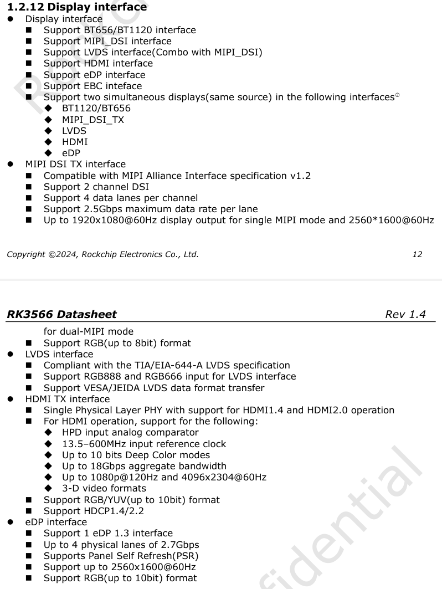
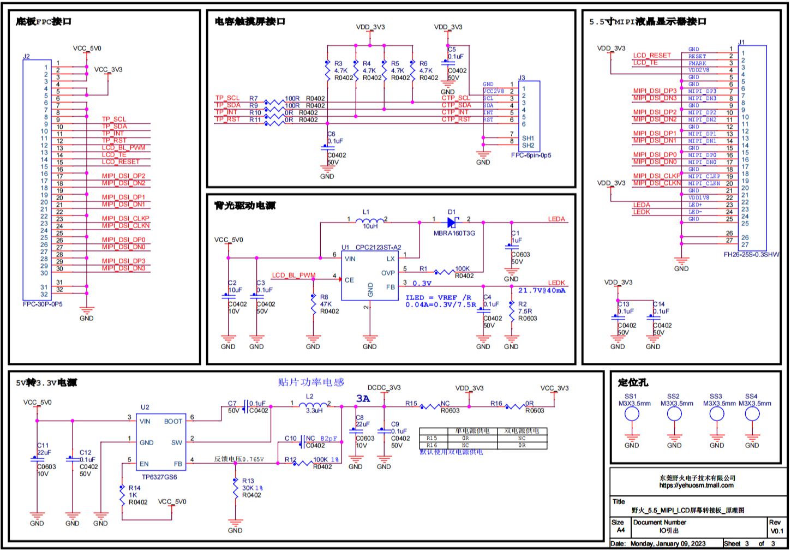
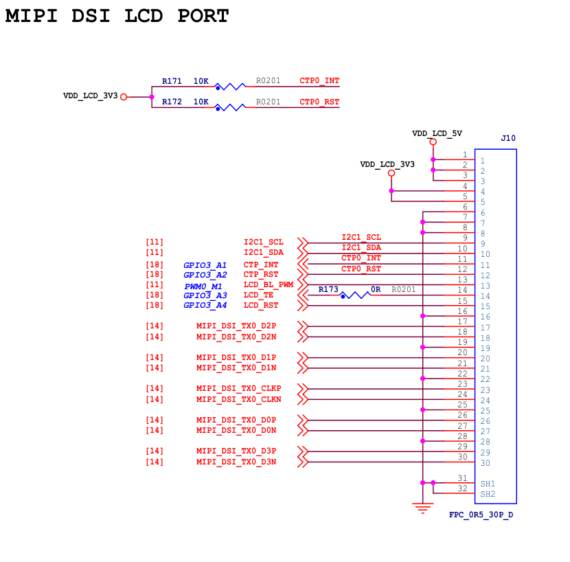

# 屏幕硬件电路分析

# 1. 最大分辨率支持

**屏幕最大分辨率的支持是由主控芯片的性能决定的**

**举例：**如果是用 RK3566 的 MIPI DSI 接口，就可以去查RK3566的数据手册的 Display interface（显示接口）章节，如果所选的屏幕最大分辨率小于这个芯片所支持的最大分辨率就是可行的

*如图可以看出 RK3566 如果使用 MIPI DSI 接口的话，只能支持色深为 RGB888 的 1920x1080@60Hz 分辨率显示*

# 2. MIPI屏硬件电路分析

**要驱动一块MIPI屏幕首先要分析他的原理图，下面以鲁班猫1开发板（RK3566）使用的5.5寸1080P触控屏举例：**

## 2.1 屏幕接口原理图

* 这块屏幕共有四对MIPI DSI的差分数据线，也就是4lanes的
* 有一组触控芯片的线路，是采用I2C通讯的触控芯片，还有一个中断引脚
* 还有一组背光控制线路

## 2.2 lanes

**`MIPI` 屏幕用几 `lanes` 和他的分辨率有直接关系，分辨率越高 `lanes` 越多，所以有一些分辨率低的小屏幕只有一条 `lanes` 差分对（`1 lanes` 就是对应的一对差分数据线），`lanes` 的差分对个数可以在设备树中配置**

*板端的接口原理图，可以看出来是与屏幕的接口对应的，其中的 LCD_TE 没有用到，因为设备树里配置的 video mode ，不需要 TE 线：*

## 2.3 背光电路

**根据上面的原理图，我们 `SOC` 实际上是通过控制 `LCD_BL_PWM` 引脚的 `PWM` 来间接控制 `LEDA` 和 `LEDK` 之间的电流值来控制背光的，这么设计是因为 `SOC` 的管脚的输出能力不够**

屏幕不同对于电流的要求也不同，选择屏幕以后要去确定屏幕的数据手册，他的背光典型电流是多少，我们的背光驱动电路不要超过他的限值，否则会有屏幕发烫、烧背光的情况发生

## 2.4 屏幕时钟

**首先是 `MIPI DSI` 的主时钟（`clock`），用于高速数据传输，只在 `HS Mode` 下有效，在设备树中配置，然后是 `LP Mode` 下的时钟（`clock`），用于 `MIPI` 屏幕初始化阶段发送初始化序列，一般不超过 `10M`，发送初始化序列的时候可以用逻辑分析仪抓到这个波形来分析 `DSI` 协议**

*屏幕自身内部的 PLL 时钟，是屏幕利用 MIPI DSI 的主时钟倍频或者分频出来的，如像素时钟、行时钟、帧时钟等等，只供屏幕 IC 内部使用。*

# 3. 显示框架与显示驱动框架

* RK平台的显示框架：RK Linux Graphics
* Android有自己的显示框架
* DRM显示驱动框架：[DRM（Direct Rendering Manager）学习简介-CSDN博客](https://blog.csdn.net/hexiaolong2009/article/details/83720940)

