# 调试MIPI屏幕

# 1. RK3566 MIPI DSI外设

**`SOC` 有一个 `MIPI DSI` 接口，相对应的就应该有一个 `MIPI DSI HOST` 控制器外设,该外设内核是符合标准 `MIPI` 协议的，此 `MIPI DSI HOST` 控制器用于连接内核和 `D-PHY` ， `DSI HOST` 控制器发出的所有并行数字信号（无论是时钟还是数据 `Lanes`）都必须经过同一个 `D-PHY` 模块转换为串行差分模拟信号后才能发送到 `PCB` 走线上。**

**RK3566 的 MIPI DSI HOST 控制器支持如下特性：**

* 兼容 MIPI 联盟标准
* 支持 DPI 接口颜色映射，支持 16/18/24 bit 色深
* 所有 DPI 接口极性可编程
* 最高支持 4 lanes 的 D-PHY 数据 lanes
* Data0 支持双线通信和 Escape模式
* 可以传输所有的 Generic 命令
* 支持 EOTP 包

**RK3566 的 D-PHY 支持如下特性：**

* V1.2 版本的 MIPI D-PHY
* 集成 PPI 接口，支持 DSI
* 最多支持 4 lanes，总共有 10Gbps 传输速率
* 支持 MIPI HS 和 LP 模式
* 支持 Skew 校准
* LP 模式下 10Mbps 传输速率

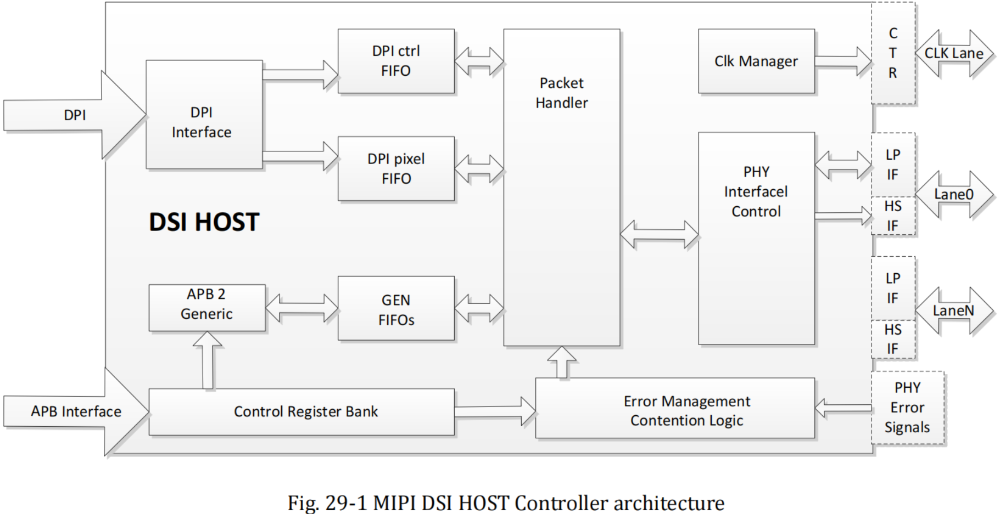


# 2. 原理图&设备树

## 2.1 原理图

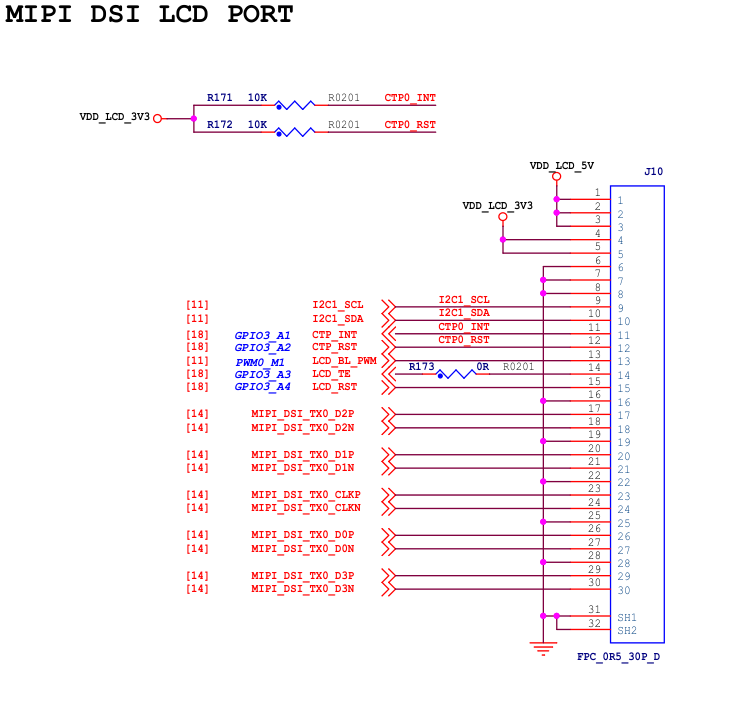

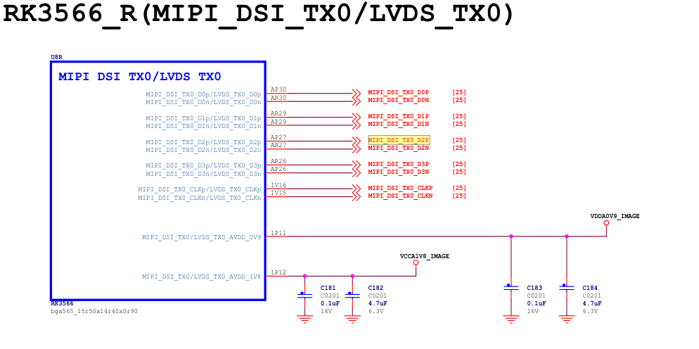

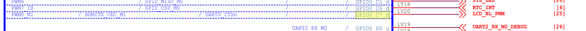


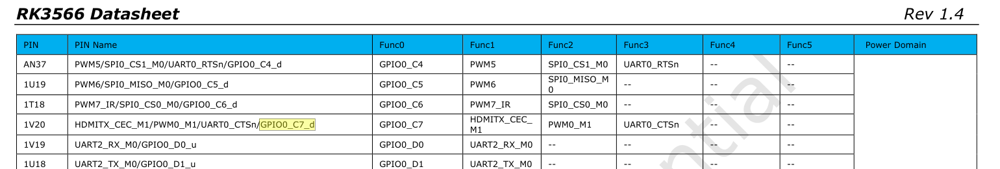

**可以看出：**

1. 我们的 `MIPI DSI` 接口实际上是接到了芯片内部的 `DSI_TX0` 上面 所以设备树里应该也是 `DSI0` 节点
2. 触控芯片是 `I2C` 接口的，设备树里也需要有一个对应的 `I2C` 节点
3. 背光控制 `PWM` 是接到了 `PWM0_M1` 上，所以设备树里需要把对应的引脚设置为 `PWM` 功能，但是数据手册里该引脚默认功能是 `GPIO` ,所以还得用 `pinctrl` 修改一下引脚复用功能
4. 其余就是一些 `GPIO` 正常配置成 `GPIO` 功能即可


## 2.2 设备树

### 2.2.1 RK平台显示子系统

多阅读厂商提供的参考手册，显示部分的在 `doc` 文件夹里的 `Common` 里的 `DISPLAY` 文件夹里

[Rockchip_Developer_Guide_DRM_Display_Driver_CN](../核心参考文献库/Rockchip_Developer_Guide_DRM_Display_Driver_CN.pdf)

[Rockchip_Developer_Guide_MIPI_DSI2_CN](../核心参考文献库/Rockchip_Developer_Guide_MIPI_DSI2_CN.pdf)

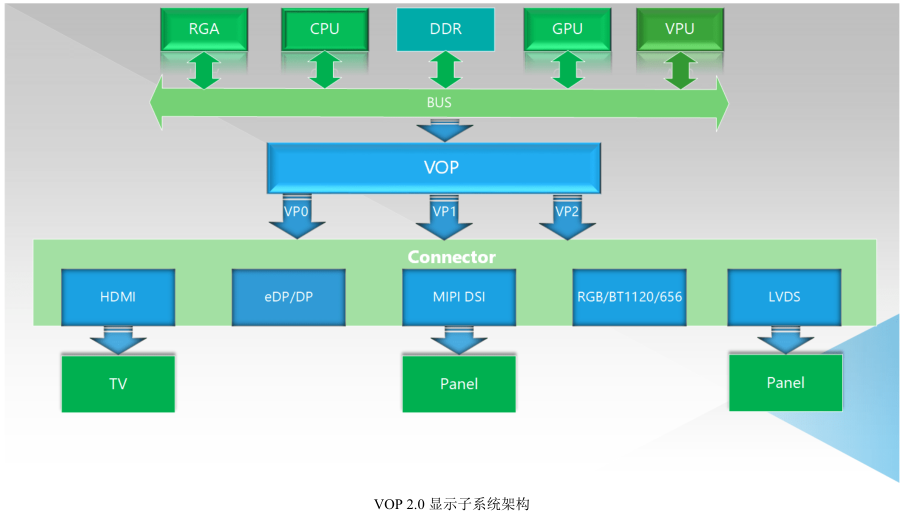

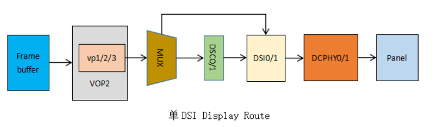

**可以看出：**

1. `MIPI DSI HOST` 控制器是接在 `VOP` 后面的，所以设备树里涉及到 `DSI` 的时候肯定是需要配置使用哪个 `VP` 通道来接收 `SOC` 发送到 `MIPI DSI HOST` 的显示数据的
2. 然后 `MIPI DSI HOST` 又接到了显示面板（`Panel`）上面，所以还会有一个 `dsi_panel` 的节点，这里面配置的是和显示屏幕面板相关的内容


### 2.2.2 设备树

**rk3568.dtsi**

```c
dsi0: dsi@fe060000 {
		compatible = "rockchip,rk3568-mipi-dsi";
		reg = <0x0 0xfe060000 0x0 0x10000>;
		interrupts = <GIC_SPI 68 IRQ_TYPE_LEVEL_HIGH>;
		clocks = <&cru PCLK_DSITX_0>, <&cru HCLK_VO>, <&video_phy0>;//时钟来源
		clock-names = "pclk", "hclk", "hs_clk";//时钟名字
		resets = <&cru SRST_P_DSITX_0>;//复位句柄
		reset-names = "apb";//复位名字，必须是apb
		phys = <&video_phy0>;//DSI所使用的PHY的设备节点
		phy-names = "mipi_dphy";//使用的PHY的名字
		power-domains = <&power RK3568_PD_VO>;//电源域句柄
		rockchip,grf = <&grf>;//SOC的grf寄存器
		#address-cells = <1>;
		#size-cells = <0>;
		status = "disabled";

		ports {
			#address-cells = <1>;
			#size-cells = <0>;

			dsi0_in: port@0 {
				reg = <0>;
				#address-cells = <1>;
				#size-cells = <0>;

				dsi0_in_vp0: endpoint@0 {
					reg = <0>;
					remote-endpoint = <&vp0_out_dsi0>;
					status = "disabled";
				};

				dsi0_in_vp1: endpoint@1 {
					reg = <1>;
					remote-endpoint = <&vp1_out_dsi0>;
					status = "disabled";
				};
			};
		};
	};

i2c1: i2c@fe5a0000 {
		compatible = "rockchip,rk3399-i2c";
		reg = <0x0 0xfe5a0000 0x0 0x1000>;
		clocks = <&cru CLK_I2C1>, <&cru PCLK_I2C1>;
		clock-names = "i2c", "pclk";
		interrupts = <GIC_SPI 47 IRQ_TYPE_LEVEL_HIGH>;
		pinctrl-names = "default";
		pinctrl-0 = <&i2c1_xfer>;
		#address-cells = <1>;
		#size-cells = <0>;
		status = "disabled";
	};
```

**rk3566-lubancat-dsi0-ebf410125_1080p.dtsi（dtsi之间会相互覆盖，以此为准）：**

```c
#include "rk3568-lubancat-dsi0-ebf410125_1080p.dtsi"

&route_dsi0 {
	status = "okay";
	connect = <&vp0_out_dsi0>;
};

&dsi0_in_vp0 {
	status = "okay";//启用VP0
};

&dsi0_in_vp1 {
	status = "disabled";
};

&dsi0_panel {
	reset-gpios = <&gpio3 RK_PA4 GPIO_ACTIVE_LOW>; //reset引脚一般是低电平有效，驱动最后会把reset引脚拉高，enable引脚一般是高电平有效，驱动最后会把enable引脚拉高
};

&gt911 {
	interrupt-parent = <&gpio3>;
	interrupts = <RK_PA1 IRQ_TYPE_LEVEL_LOW>;
	reset-gpios = <&gpio3 RK_PA2 GPIO_ACTIVE_LOW>;
	irq-gpios = <&gpio3 RK_PA1 GPIO_ACTIVE_HIGH>;
};

```

**rk3568-lubancat-dsi0-ebf410125_1080p.dtsi**

```c
&route_dsi0 {
	status = "okay";//路由DSI0状态
	connect = <&vp1_out_dsi0>;//连接到DSI0输入虚拟通道1
};

&video_phy0 {
	status = "okay";
};

&dsi0_in_vp0 {
	status = "disabled";
};
// RK3566有两个VOP，这里是用来链接VOP的，可以选择通道1或者通道0，我们选的是通道1
&dsi0_in_vp1 {
	status = "okay";//虚拟通道状态
};

&dsi0 {
	status = "okay";//DSI0控制器状态
	power-supply = <&mipi_dsi0_power>;//panel的电压要求，可选，regulator配置

	dsi0_panel: panel@0 {
		compatible = "simple-panel-dsi";
		reg = <0>;
		backlight = <&backlight>;//关联背光节点
		reset-gpios = <&gpio0 RK_PC5 GPIO_ACTIVE_LOW>;//复位引脚

		enable-delay-ms = <35>;// panel 开始接收视频数据到显示出第一帧画面所用的时间
		prepare-delay-ms = <6>;// panel 准备就绪并开始接受视频数据的时间
		reset-delay-ms = <0>;// panel 完全复位所花费的时间
		init-delay-ms = <20>;// panel 复位到发送初始化序列之间的时间
		unprepare-delay-ms = <0>;// panel 完全断电所花费的时间
		disable-delay-ms = <20>;// panel 关闭显示花费的时间

		size,width = <74>;// panel 宽度，也就是屏幕的物理宽度，单位mm
		size,height = <133>;// panel 高度，也就是屏幕的物理高度，单位mm

        // MIPI_DSI_MODE_VIDEO：主控采用 video 模式
        // MIPI_DSI_MODE_VIDEO_BURST：使用 video 模式的 Burst 模式
        // MIPI_DSI_MODE_LPM：支持 LP 模式，也就是在 LP 模式先传输初始化序列
        // MIPI_DSI_MODE_EOT_PACKET:HS 模式下的 EoT 包
		dsi,flags = <(MIPI_DSI_MODE_VIDEO | MIPI_DSI_MODE_VIDEO_BURST | MIPI_DSI_MODE_LPM | MIPI_DSI_MODE_EOT_PACKET)>;
		dsi,format = <MIPI_DSI_FMT_RGB888>;// video 模式下的像素格式
		dsi,lanes  = <4>;// DSI 通道 lanes 数量

		panel-init-sequence = [// 初始化序列
			39 00 04 B9 FF 83 99
			15 00 02 D2 77
			39 00 10 B1 02 04 74 94 01 32 33 11 11 AB 4D 56 73 02 02
			39 00 10 B2 00 80 80 AE 05 07 5A 11 00 00 10 1E 70 03 D4	
			15 00 02 36 02
			39 00 2D B4 00 FF 02 C0 02 C0 00 00 08 00 04 06 00 32 04 0A 08 21 03 01 00 0F B8 8B 02 C0 02 C0 00 00 08 00 04 06 00 32 04 0A 08 01 00 0F B8 01		
			39 05 22 D3 00 00 00 00 00 00 06 00 00 10 04 00 04 00 00 00 00 00 00 00 00 00 00 01 00 05 05 07 00 00 00 05 40						
			39 05 21 D5 18 18 19 19 18 18 21 20 01 00 07 06 05 04 03 02 18 18 18 18 18 18 2F 2F 30 30 31 31 18 18 18 18		
			39 05 21 D6 18 18 19 19 40 40 20 21 06 07 00 01 02 03 04 05 40 40 40 40 40 40 2F 2F 30 30 31 31 40 40 40 40			
			39 00 11 D8 A2 AA 02 A0 A2 A8 02 A0 B0 00 00 00 B0 00 00 00			
			15 00 02 BD 01			
			39 00 11 D8 B0 00 00 00 B0 00 00 00 E2 AA 03 F0 E2 AA 03 F0			
			15 00 02 BD 02			
			39 00 09 D8 E2 AA 03 F0 E2 AA 03 F0			
			15 00 02 BD 00			
			39 00 03 B6 8D 8D
			39 05 37 E0 00 0E 19 13 2E 39 48 44 4D 57 5F 66 6C 76 7F 85 8A 95 9A A4 9B AB B0 5C 58 64 77 00 0E 19 13 2E 39 48 44 4D 57 5F 66 6C 76 7F 85 8A 95 9A A4 9B AB B0 5C 58 64 77
			05 C8 01 11 
			05 C8 01 29 
		];

		panel-exit-sequence = [// 退出序列
			05 78 01 28
			05 00 01 10
		];

		disp_timings0: display-timings {
			native-mode = <&dsi0_timing0>;
			dsi0_timing0: timing0 {
				clock-frequency = <131376000>;
				hactive = <1080>;
				vactive = <1920>;
				hsync-len = <10>;
				hback-porch = <20>;
				hfront-porch = <10>;
				vsync-len = <5>;
				vback-porch = <20>;
				vfront-porch = <10>;
				hsync-active = <0>;
				vsync-active = <0>;
				de-active = <0>;
				pixelclk-active = <0>;
			};
		};

		ports {
			#address-cells = <1>;
			#size-cells = <0>;
			port@0 {
				reg = <0>;
				panel_in_dsi: endpoint {
					remote-endpoint = <&dsi_out_panel>;
				};
			};
		};
	};

	ports {
		#address-cells = <1>;
		#size-cells = <0>;

		port@1 {
			reg = <1>;
			dsi_out_panel: endpoint {
				remote-endpoint = <&panel_in_dsi>;
			};
		};
	};
};

&i2c1 {
	status = "okay";
	clock-frequency = <100000>;

	gt911: gt911@5d {
		status = "okay";
		compatible = "goodix,gt911";
		reg = <0x5d>;
		interrupt-parent = <&gpio0>;
		interrupts = <RK_PB5 IRQ_TYPE_LEVEL_LOW>;
		reset-gpios = <&gpio0 RK_PB6 GPIO_ACTIVE_LOW>;
		irq-gpios = <&gpio0 RK_PB5 GPIO_ACTIVE_HIGH>;
		touchscreen-inverted-x = <1>;
        touchscreen-inverted-y = <1>;
	};
};
```

鲁班猫默认配置的时钟是 (1080+10+20+10)\*(1920+5+20+10)\*60 = 131376000 ，但是这么配置是错误的，时钟配置错误会影响到显示帧率等问题，**实际的时钟配置需要考虑的因素：**

1. 色深是几位的，以及额外开销
2. MIPI DSI 是双边沿采集

**DSI 时钟计算公式：**

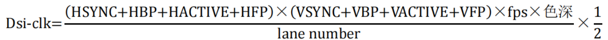

**所以实际上时钟配置应该是：**

(1080+10+20+10)\*(1920+5+20+10)\*60*24/4/2 = 394128000 也就是 394MHz

**再考虑双边沿采样+额外的开销，最大的时钟应该是：**

394\*2\*1.2=945.6MHz


# 3. 背光

屏幕背光 `backlight` 是通过一个 `PWM` 输出引脚来控制的，这个引脚需要具备 `PWM` 输出功能，结合上面的原理图可以看出，`LCD_BL_PWM` 是连接在了 `CPIO_C7_d` 上面，需要把设备树里这个引脚对应的功能复用成数据手册里描述的 `PWM_M0_M1` 功能，然后来控制屏幕的亮度：

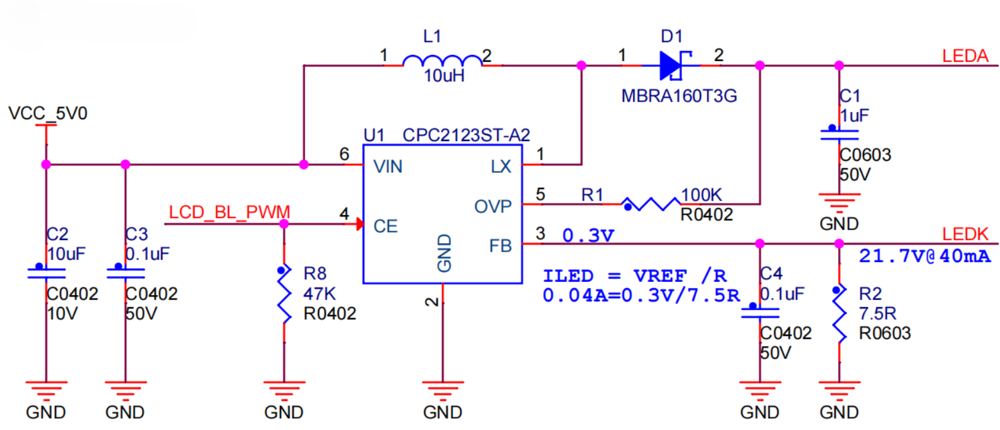

**rk3566-lubancat-1.dtsi（以此为准，覆盖掉引用的头节点）：**

```c
backlight: backlight {
		status = "okay";
		compatible = "pwm-backlight";
    	/*
    	 *	第一个 pwm0 表示使用的是指定使用哪个 pwm 当前使用的是 pwm0 设备
    	 *	第二个 表示的是pwm 的 id ，通常设置为 0
    	 *	第三个 50000 是PWM的周期，单位是 ns ，也就是 50000ns 一个周期，换算成频率就是 20KHz
    	 *	第四个 0 是极性设置，可以设置为 PWM_POLARITY_NORMAL（对应的值为0）或者 PWM_POLARITY_INVERTED（对应的值为1），第一个是正常极性，第二个极性翻转
    	 */
		pwms = <&pwm0 0 50000 0>;
		brightness-levels = <// 亮度级别，最高255
			 95  95  95  95  95  95  95  95
			 95  95  95  95  95  95  95  95
			 95  95  95  95  95  95  95  95
			 95  95  95  95  95  95  95  95
			 95  95  95  95  95  95  95  95
			 95  95  95  95  95  95  95  95
			 95  95  95  95  95  95  95  95
			 95  95  95  95  95  95  95  95
			 95  95  95  95  95  95  95  95
			 95  95  95  95  95  95  95  95
			 95  95  95  95  95  95  95  95
			 88  89  90  91  92  93  94  95
			 96  97  98  99 100 101 102 103
			104 105 106 107 108 109 110 111
			112 113 114 115 116 117 118 119
			120 121 122 123 124 125 126 127
			128 129 130 131 132 133 134 135
			136 137 138 139 140 141 142 143
			144 145 146 147 148 149 150 151
			152 153 154 155 156 157 158 159
			160 161 162 163 164 165 166 167
			168 169 170 171 172 173 174 175
			176 177 178 179 180 181 182 183
			184 185 186 187 188 189 190 191
			192 193 194 195 196 197 198 199
			200 201 202 203 204 205 206 207
			208 209 210 211 212 213 214 215
			216 217 218 219 220 221 222 223
			224 225 226 227 228 229 230 231
			232 233 234 235 236 237 238 239
			240 241 242 243 244 245 246 247
			248 249 250 251 252 253 254 255
		>;
		default-brightness-level = <200>;// 默认亮度级别，0表示占空比为0%，255表示100%占空比，也就是亮度最高
	};

&pwm0 {
	status = "okay";
	pinctrl-0 = <&pwm0m1_pins>;// 覆盖掉别的节点，以此为准
};
```

**rk3568.dtsi**

```c
pwm0: pwm@fdd70000 {
		compatible = "rockchip,rk3568-pwm", "rockchip,rk3328-pwm";
		reg = <0x0 0xfdd70000 0x0 0x10>;
		#pwm-cells = <3>;
		pinctrl-names = "active";
		pinctrl-0 = <&pwm0m0_pins>;//被覆盖
		clocks = <&pmucru CLK_PWM0>, <&pmucru PCLK_PWM0>;
		clock-names = "pwm", "pclk";
		status = "disabled";
	};
```

**rk3568-pinctrl.dtsi（pinctrl子系统）**

```c
pwm0 {
		pwm0m0_pins: pwm0m0-pins {
			rockchip,pins =
				/* pwm0_m0 */
				<0 RK_PB7 1 &pcfg_pull_none>;
		};

		pwm0m1_pins: pwm0m1-pins {
			rockchip,pins =
				/* pwm0_m1 */
				<0 RK_PC7 2 &pcfg_pull_none>;
		};
	};
```

1. `GPIO0_C7_d` 引脚具备复用成 `PWM0` 的功能，所以这里使用 `pinctrl` 把他设置成 `PWM` 的功能，引脚名后面的 `_u _d` 表示没有配置时候的默认 `IO` 状态 ，`\_u` 就是上拉， `\_d` 就是下拉，如果不希望屏幕在没有控制的时候被点亮，那这个默认状态最好和背光驱动芯片的 `EN` 引脚的关闭状态对应
2. `PWM` 背光驱动程序：`drivers/video/backlight/pwm_bl.c`
3. 如果配置好背光后屏幕没亮，但是测量 `PWM` 波形是正常的，那可能是 `MIPI` 屏幕 `IC` 还没有初始化成功导致背光电压不正常，可以测量一下背光电压


# 4. 复位引脚

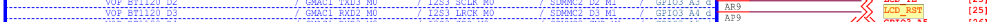

**rk3566-lubancat-dsi0-ebf410125_1080p.dtsi**

```c
&dsi0_panel {
	reset-gpios = <&gpio3 RK_PA4 GPIO_ACTIVE_LOW>;
};
```


# 5. 配置 DSI 速率

```c
// DSI速率一般不需要指定，驱动会自己计算
&dsi0{
    // rockchip,lane-rate = <480>;	// DSI0 通道速率
};
```


# 6. 配置 MIPI 屏幕的 lanes 数

```c
// DSI 通道 lanes 数量，根据屏幕使用的 lanes 来配，屏幕有几个就设置成几个，但是不能超过 SOC 允许的最大值
&dsi0 {
	dsi0_panel: panel@0 {
		dsi,lanes  = <4>;// 使用 4lanes
	];
};
```


# 7. MIPI 屏幕初始化序列

**`MIPI` 屏幕的初始化序列和屏幕主控芯片的寄存器有关，本质就是 `SOC` 通过 `DSI` 控制器在 `LP` 模式下向屏幕驱动主控芯片 `IC` 的寄存器里面写数据。**

* 向屏幕发送初始化序列时，初始化序列是有**字节流格式要求**的

* 一般情况下，初始序列都是要找屏幕厂商提供的，也有一些厂商会默认配好序列，不需要再去发送，开机即亮屏
* 一般参照厂家给的初始化序列发送就可以了，如果想`自定义一些内容`，可以阅读显示面板的驱动 `IC` 的【数据手册】，可以实现一些诸如`镜像显示，水平翻转、垂直翻转`之类的功能，在发送初始化序列的时候加上自己新增的功能就可以实现了

```c
&dsi0 {
	status = "okay";//DSI0控制器状态
	power-supply = <&mipi_dsi0_power>;//panel的电压要求，可选，regulator配置

	dsi0_panel: panel@0 {
		panel-init-sequence = [// 初始化序列
			39 00 04 B9 FF 83 99
			15 00 02 D2 77
			39 00 10 B1 02 04 74 94 01 32 33 11 11 AB 4D 56 73 02 02
			39 00 10 B2 00 80 80 AE 05 07 5A 11 00 00 10 1E 70 03 D4	
			15 00 02 36 02
			39 00 2D B4 00 FF 02 C0 02 C0 00 00 08 00 04 06 00 32 04 0A 08 21 03 01 00 0F B8 8B 02 C0 02 C0 00 00 08 00 04 06 00 32 04 0A 08 01 00 0F B8 01		
			39 05 22 D3 00 00 00 00 00 00 06 00 00 10 04 00 04 00 00 00 00 00 00 00 00 00 00 01 00 05 05 07 00 00 00 05 40						
			39 05 21 D5 18 18 19 19 18 18 21 20 01 00 07 06 05 04 03 02 18 18 18 18 18 18 2F 2F 30 30 31 31 18 18 18 18		
			39 05 21 D6 18 18 19 19 40 40 20 21 06 07 00 01 02 03 04 05 40 40 40 40 40 40 2F 2F 30 30 31 31 40 40 40 40			
			39 00 11 D8 A2 AA 02 A0 A2 A8 02 A0 B0 00 00 00 B0 00 00 00			
			15 00 02 BD 01			
			39 00 11 D8 B0 00 00 00 B0 00 00 00 E2 AA 03 F0 E2 AA 03 F0			
			15 00 02 BD 02			
			39 00 09 D8 E2 AA 03 F0 E2 AA 03 F0			
			15 00 02 BD 00			
			39 00 03 B6 8D 8D
			39 05 37 E0 00 0E 19 13 2E 39 48 44 4D 57 5F 66 6C 76 7F 85 8A 95 9A A4 9B AB B0 5C 58 64 77 00 0E 19 13 2E 39 48 44 4D 57 5F 66 6C 76 7F 85 8A 95 9A A4 9B AB B0 5C 58 64 77
			05 C8 01 11 
			05 C8 01 29 
		];

		panel-exit-sequence = [// 退出序列
			05 78 01 28
			05 00 01 10
		]; 
	};	
};
```


## 7.1 字节流格式

* **Byte 0** ：`DCS` 指令
* **Byte 1 **：等到多少 `ms` 发送 `DCS` 数据包
* **Byte 2** ：负载数据长度（受到 `DCS` 指令影响，不同的指令可以搭载的负载数据长度不一样）
* **Byte 3+** ：真正的负载数据

```latex
[DCS指令][发送延时][负载数据长度n][n个负载数据字节]
例如：
39 00 04 B9 FF 83 99	// 包类型：39	延时：0毫秒		数据长度：4字节	数据负载：B9 FF 83 99
15 00 02 D2 77			// 包类型：15	延时：0毫秒	 	数据长度：2字节	数据负载：D2 77
05 C8 01 29 			// 包类型：05	延时：200毫秒	数据长度：1字节	数据负载：29
```


## 7.2 包类型

想要了解 `MIPI` 协议具体的规范，可以阅读 `MIPI` 协议的官方文档，其中第60页就描述了具体的包类型：[mipi-DSI-specification-v1.3](../核心参考文献库/mipi-DSI-specification-v1.3.pdf)

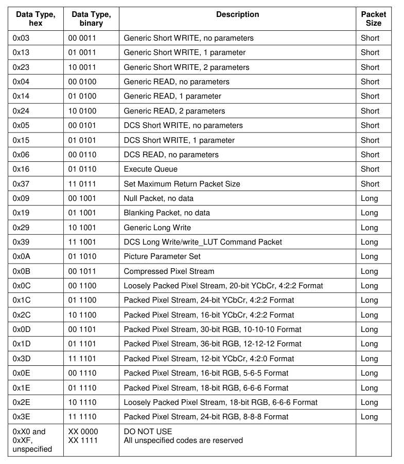

### 7.2.1 0x05

0x05 包不可以带参数，说明数据载荷部分第一个字节是要操作的寄存器，后面没有其他参数：

```latex
05 C8 01 29 			// 包类型：05	延时：200毫秒	数据长度：1字节	数据负载：29，其中01是要操作的寄存器
```


### 7.2.2 0x15

0x15 可以带一个参数，说明数据载荷部分第一个字节是要操作的寄存器，而后可以带一个参数：

```latex
15 00 02 D2 77			// 包类型：15	延时：0毫秒	 	数据长度：2字节	数据负载：D2 77，其中D2是要操作的寄存器，77是所带的一个参数
```


### 7.2.3 0x39

0x39 长写入，说明数据载荷部分除了操作的寄存器，还可以有很多数据位

```latex
39 00 04 B9 FF 83 99	// 包类型：39	延时：0毫秒		数据长度：4字节	数据负载：B9 FF 83 99，其中B9是要操作的寄存器，后面其余的字节数据是要写入的数据
```


# 8.屏幕参数调试步骤

## 8.1 配置 DSI 节点点亮背光

不点亮背光就算你参数配对了屏幕照样是黑的，所以第一步就是点亮背光，不用管别的参数先看屏幕亮不亮


## 8.2 屏幕参数 timings

**参考屏幕厂商提供的`【参考屏参】`或者`【屏幕数据手册】`，填写屏参**：


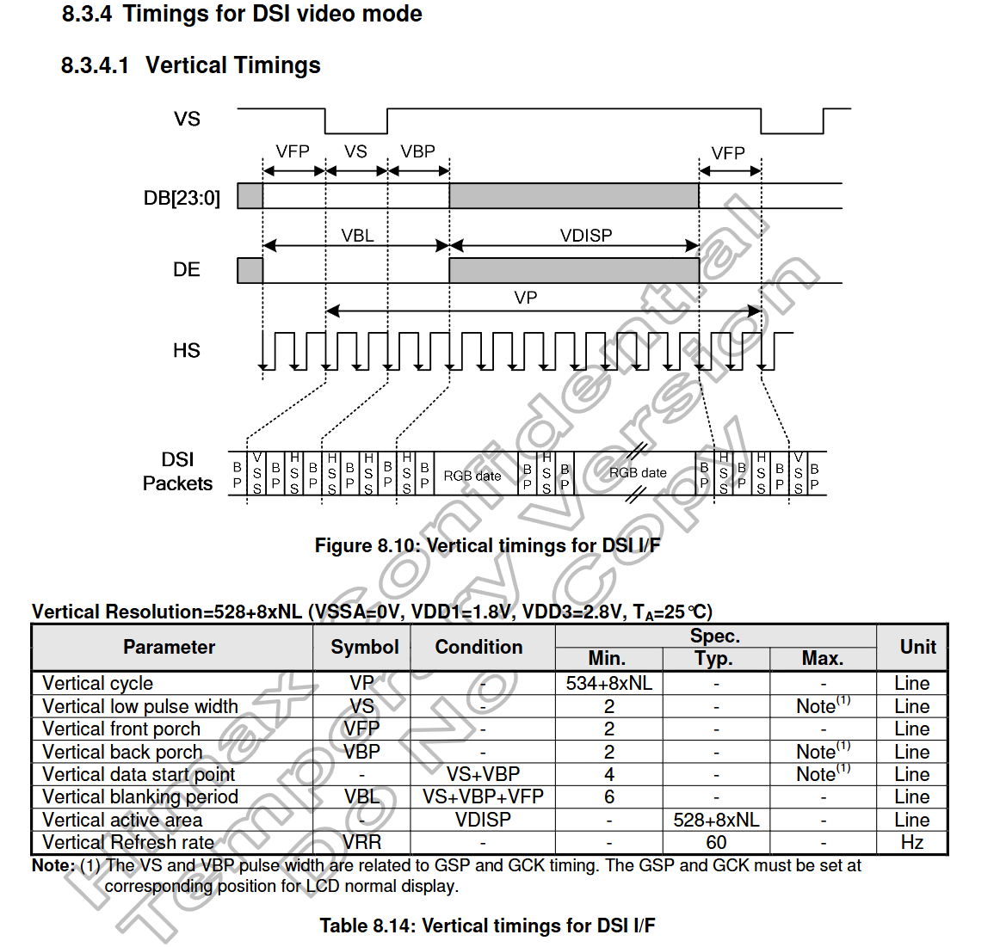

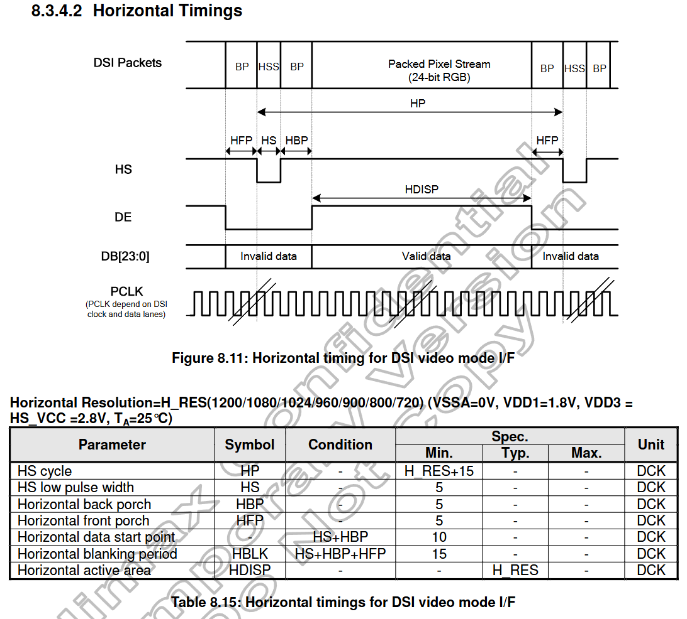


**根据阅读手册获得到的屏参，填写到设备树的 `timings` 里面，不要用最小值，为了保持稳定你自己至少得加一点吧**：

```c
disp_timings0: display-timings {
    native-mode = <&dsi0_timing0>; // 指定默认使用的时序模式为下方的dsi0_timing0
    dsi0_timing0: timing0 {
        // 基本时序参数（基于标准VESA时序模型）
        clock-frequency = <131376000>; // 像素时钟频率 (Pixel Clock Frequency)，单位Hz
        hactive = <1080>;  // 水平有效像素数 (Horizontal Active)，即一行中的可见像素
        vactive = <1920>;  // 垂直有效像素数 (Vertical Active)，即一帧中的可见行数
        
        // 水平时序参数 (Horizontal Timing)
        hsync-len = <10>;      // 水平同步脉冲宽度 (HSync Pulse Width)，单位像素时钟周期
        hback-porch = <20>;    // 水平后沿/后消隐 (Horizontal Back Porch)
        hfront-porch = <10>;   // 水平前沿/前消隐 (Horizontal Front Porch)
        
        // 垂直时序参数 (Vertical Timing)
        vsync-len = <5>;       // 垂直同步脉冲宽度 (VSync Pulse Width)，单位行数
        vback-porch = <20>;    // 垂直后沿/后消隐 (Vertical Back Porch)
        vfront-porch = <10>;   // 垂直前沿/前消隐 (Vertical Front Porch)
        
        // 信号极性控制 (Signal Polarity Control)
        // 0表示低电平有效/负极性，1表示高电平有效/正极性
        hsync-active = <0>;    // 水平同步信号极性 (HSync Polarity)
        vsync-active = <0>;    // 垂直同步信号极性 (VSync Polarity)
        de-active = <0>;       // 数据使能信号极性 (Data Enable Polarity)
        pixelclk-active = <0>; // 像素时钟边沿选择，0=在时钟下降沿采样数据，1=在上升沿采样
        
        // 可选参数（如果您的屏幕需要，可添加）：
        // hsync-skew = <0>;     // 水平同步偏移调整
        // vsync-skew = <0>;     // 垂直同步偏移调整
        // interlaced = <0>;     // 是否交错扫描，0=逐行，1=隔行
        // double-clk = <0>;     // 是否双像素时钟，0=单沿，1=双沿
    };
};
```


## 8.3 初始化序列

**厂家给的可能是这样：**

```latex
//Set_EXTC
SET_GENERIC(4);
W_D(0xB9);W_D(0xFF);W_D(0x83);W_D(0x99);

//Set_D2
SET_GENERIC(2);
W_D(0xD2);W_D(0x77);

//Set_GTP_Fmaping
SET_GENERIC(34);
W_D(0xD3);W_D(0x00);W_D(0x00);W_D(0x00);W_D(0x00);
W_D(0x00);W_D(0x00);W_D(0x06);W_D(0x00);W_D(0x00);
W_D(0x10);W_D(0x04);W_D(0x00);W_D(0x04);W_D(0x00);
W_D(0x00);W_D(0x00);W_D(0x00);W_D(0x00);W_D(0x00);
W_D(0x00);W_D(0x00);W_D(0x00);W_D(0x00);W_D(0x01);
W_D(0x00);W_D(0x05);W_D(0x05);W_D(0x07);W_D(0x00);
W_D(0x00);W_D(0x00);W_D(0x05);W_D(0x40);

delay_ms(5);
```

**转换之后就是**：

```latex
39 00 04 B9 FF 83 99
15 00 02 D2 77 
39 05 22 D3 00 00 00 00 00 00 06 00 00 10 04 00 04 00 00 00 00 00 00 00 00 00 00 01 00 05 05 07 00 00 00 05 40
```


## 8.4 闪烁亮屏

**一些驱动 `IC` 是支持屏幕闪烁测试的，阅读数据手册的 `BIST Mode Function` 章节，可以看到如何通过操作寄存器来实现闪烁亮屏，可以借助他来测试屏幕有没有初始化成功，`例如`这个 `HX8399-C` 芯片可以通过把 `0xB2` 寄存器的 `bank1 1st parameter` 寄存器的 `DISP_BIST_EN` 置位为 `1` 就会自动运行闪烁测试了**

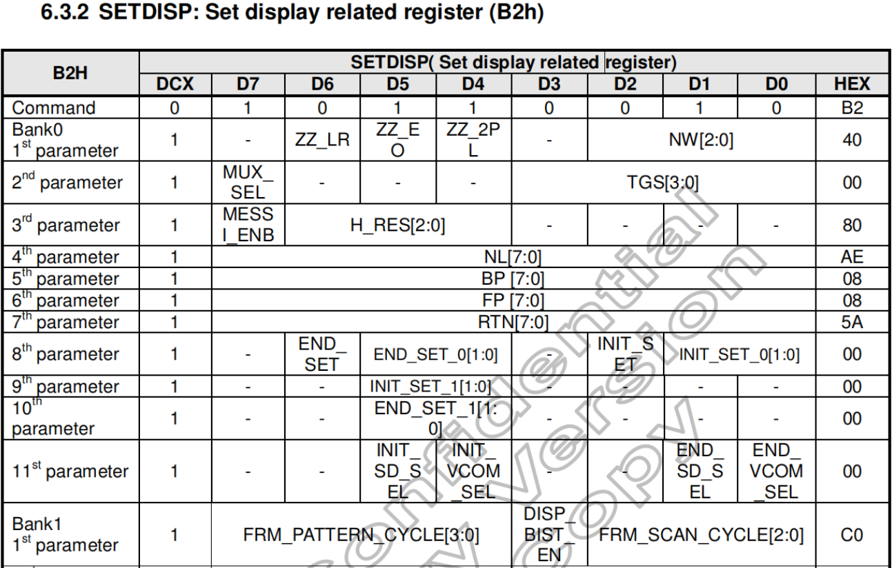

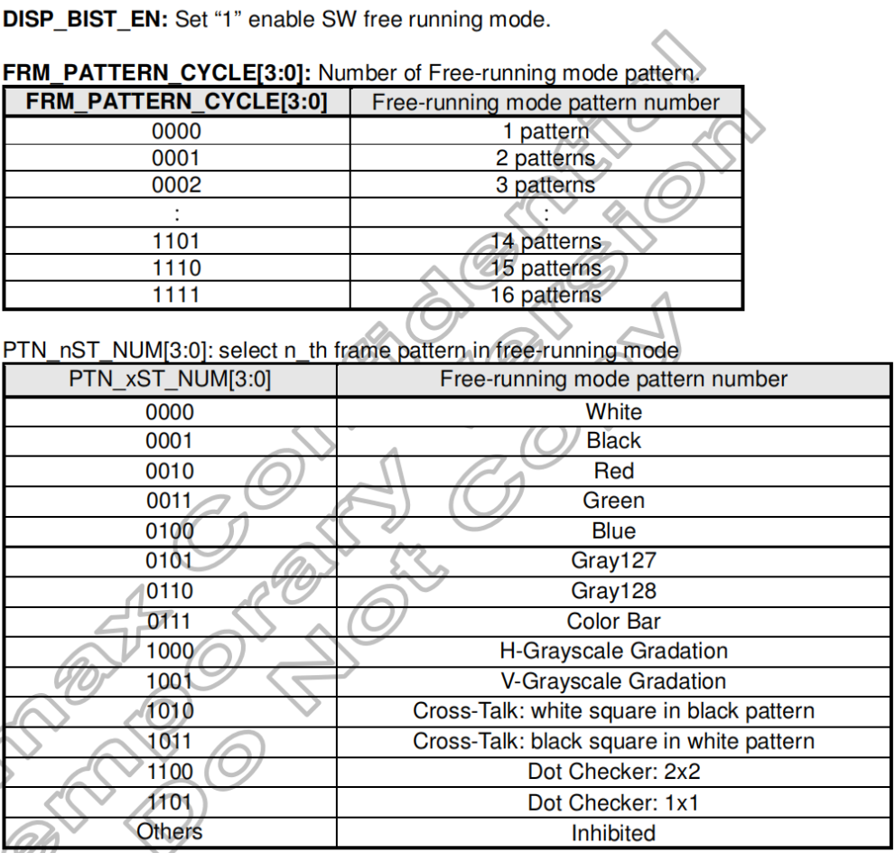


## 8.5 改变显示方向

**一些驱动 `IC` 是支持改变屏幕显示方向的，`例如`这个 `HX8399-C` 芯片可以通过修改 `0x36` 寄存器的值来改变显示方向，我们前面的初始化序列里向 `0x36` 写了 `0x02` 实际上就是操作了 `SS` 位,让他等于 `1` ，改变了显示方向：**

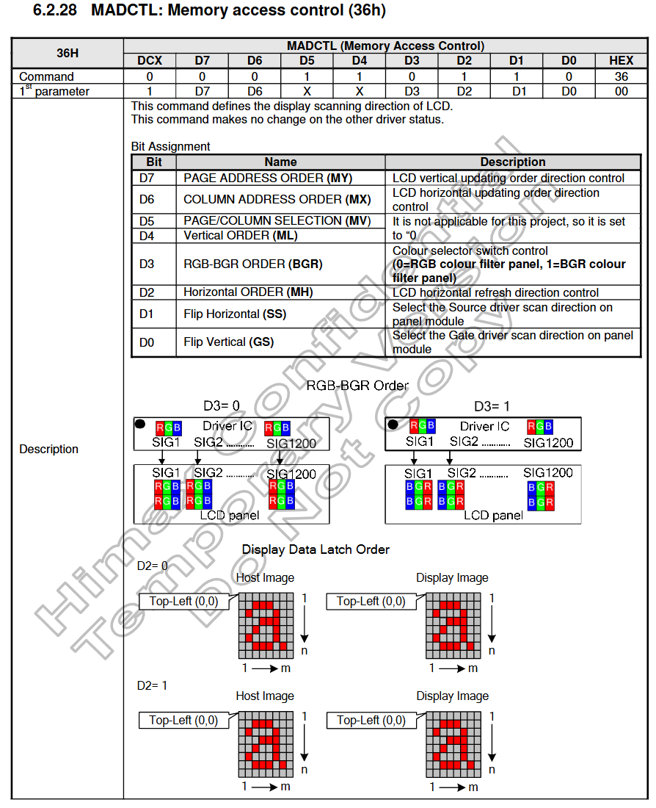

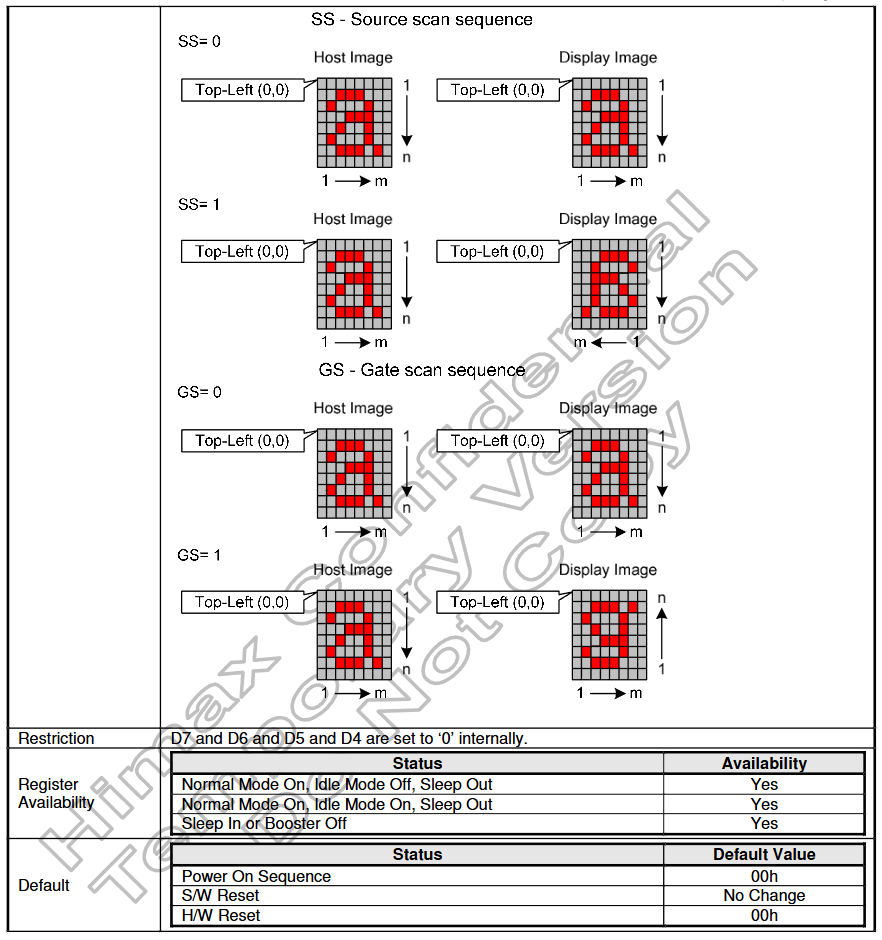


# 9. 调试 MIPI 屏幕步骤

## 9.1 和 SOC 以及屏幕原厂合作

* 不同的 `SOC` 的显示硬件设计也不一样，像 `RK` 就是有个 `VOP` ，别的 `SOC` 也会有不同的设计，需要根据芯片原厂的设计文档，才能知道设备树是怎么配的
* 不同的屏幕，他的屏幕参数，初始化序列等等也不一样，如果是大规模供货的屏幕，网上可能会有资料，没有资料的话就只能找屏幕原厂寻找帮助了


## 9.2 使用逻辑分析仪帮助

使用支持 `MIPI DSI LP` 的逻辑分析仪，`MIPI DSI` 协议会通过 `Data0` 这一对差分对来完成初始化序列的发送，而且是在 `LP` 模式下，速率并不高，初始化序列是 `MIPI` 屏幕驱动的重点，一般能正常发送初始化序列，大概率是可以正常显示的


## 9.3  MIPI 屏幕三大核心步骤

1. **屏幕背光： **一定最先搞定背光，背光不亮屏幕是不会显示任何东西的
2. **初始化序列：** 初始化序列正常，`MIPI` 屏幕才能正常显示
3. **屏幕的 `DPI` 参数：** 也就是 `HBP 、 HFP 、 VBP 、 VFP` 等这些参数

 

## 9.4 对 MIPI DSI  外设进行读写

```c
/*
 * kernel/drivers/gpu/drm/drm_mipi_dsi.h
 * kernel/drivers/gpu/drm/drm_mipi_dsi.c
 * 文件里提供了对于 MIPI DSI 外设进行通信的相关 API
 */

/**
 * 例如：
 * mipi_dsi_dcs_write_buffer() - transmit a DCS command with payload
 * @dsi: DSI peripheral device
 * @data: buffer containing data to be transmitted
 * @len: size of transmission buffer
 *
 * This function will automatically choose the right data type depending on
 * the command payload length.
 *
 * Return: The number of bytes successfully transmitted or a negative error
 * code on failure.
 */
ssize_t mipi_dsi_dcs_write_buffer(struct mipi_dsi_device *dsi,const void *data, size_t len)
```


## 9.5 判断 MIPI DSI 外设是否正常工作

**可以在 `DSI` 屏幕驱动（ `kernel/drivers/gpu/drm/panel/panel-simple.c` ）里添加一些打印**：

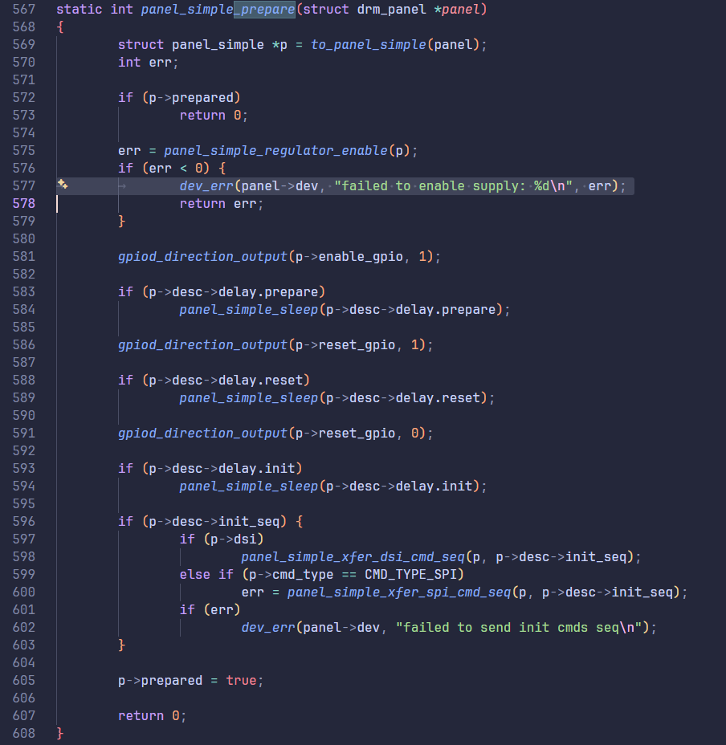


## 9.6 使能 EOTP（EoT packet） 特性

`EOTP` 是一个短包，用来指示数据链路上高速数据传输的结束，`EOTP` 主要作用是增强高速传输通信的稳定性，所以根本不需要在 `LP` 模式下发送 `EOTP` ，而 `DSI` 驱动根据 `MIPI_DSI_MODE_EOT_PACKET` 来判断是否使能 `EOTP` 。

```c
&dsi0 {
	status = "okay";//DSI0控制器状态
	power-supply = <&mipi_dsi0_power>;//panel的电压要求，可选，regulator配置

	dsi0_panel: panel@0 {
        // MIPI_DSI_MODE_VIDEO：主控采用 video 模式
        // MIPI_DSI_MODE_VIDEO_BURST：使用 video 模式的 Burst 模式
        // MIPI_DSI_MODE_LPM：支持 LP 模式，也就是在 LP 模式先传输初始化序列
        // MIPI_DSI_MODE_EOT_PACKET:HS 模式下的 EoT 包
		dsi,flags = <(MIPI_DSI_MODE_VIDEO | MIPI_DSI_MODE_VIDEO_BURST | MIPI_DSI_MODE_LPM | MIPI_DSI_MODE_EOT_PACKET)>;
		dsi,format = <MIPI_DSI_FMT_RGB888>;// video 模式下的像素格式
		dsi,lanes  = <4>;// DSI 通道 lanes 数量
	};
};
```


## 9.7 如何使能非连续时钟

`DSI` 驱动根据 `MIPI_DSI_CLOCK_NON_CONTINUOUS` 来判断是否使能非连续时钟，如果 `flags` 没有配置 `MIPI_DSI_CLOCK_NON_CONTINUOUS` ，表示使用的是连续时钟，如果配置了 `MIPI_DSI_CLOCK_NON_CONTINUOUS` 表示使用的是非连续时钟。

```c
&dsi0 {
	status = "okay";//DSI0控制器状态
	power-supply = <&mipi_dsi0_power>;//panel的电压要求，可选，regulator配置

	dsi0_panel: panel@0 {
        // MIPI_DSI_MODE_VIDEO：主控采用 video 模式
        // MIPI_DSI_MODE_VIDEO_BURST：使用 video 模式的 Burst 模式
        // MIPI_DSI_MODE_LPM：支持 LP 模式，也就是在 LP 模式先传输初始化序列
        // MIPI_DSI_MODE_EOT_PACKET:HS 模式下的 EoT 包
		dsi,flags = <(MIPI_DSI_MODE_VIDEO | MIPI_DSI_MODE_VIDEO_BURST | MIPI_DSI_MODE_LPM | MIPI_DSI_MODE_EOT_PACKET | MIPI_DSI_CLOCK_NON_CONTINUOUS )>;
		dsi,format = <MIPI_DSI_FMT_RGB888>;// video 模式下的像素格式
		dsi,lanes  = <4>;// DSI 通道 lanes 数量
	};
};
```