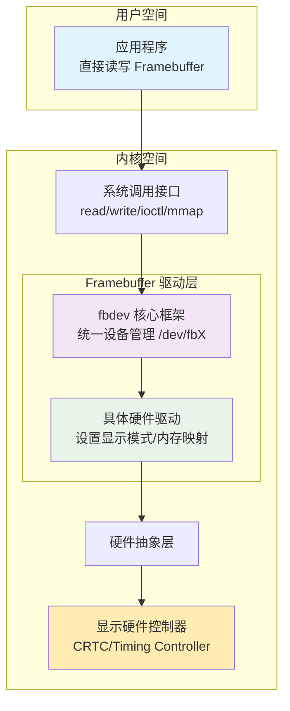
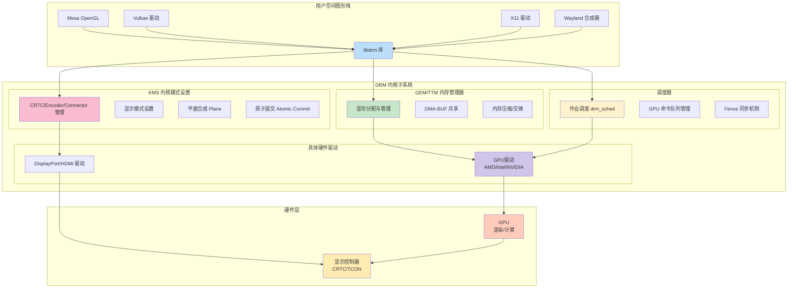

# Framebuffer 和 DRM 的区别

**在学习 `Framebuffer` 和 `DRM` 框架之前需要先学习 `Linux` 的 `Linux graphic subsystem`（图形子系统）**：

[Linux graphic subsytem(1)_概述](http://www.wowotech.net/graphic_subsystem/graphic_subsystem_overview.html)

[Linux graphic subsystem(2)_DRI介绍](http://www.wowotech.net/graphic_subsystem/dri_overview.html)

Framebuffer 和 DRM 都是 Linux Kernel 中的显示子系统，他们有不同的作用和定位。

Framebuffer是一种基础的图形子系统，他为用户空间提供了一种在显示器上面绘制像素的方式，通过一个简单的缓冲区来实现帧的绘制和显示

DRM是一个高级的图形子系统，它提供了许多高级功能，如硬件加速、3D图形渲染、视频解码等。支持多个用户空间客户端同时访问图形硬件。DRM还提供了复杂的内存管理和DMA机制，可以更好的管理系统中的显存。DRM能适应日益更新的显示硬件，DRM原生支持多层合成，支持VSYNC，支持DMA-BUF，支持一部更新，支持fence机制等

**`DRM` 原生支持多图层合成，而 `Framebuffer` 原生不支持，`DRM` 统一管理 `GPU` 和 `DISPLAY` 驱动，使得软件架构更为统一，方便管理和维护**：

| 特性         | DRM  | Framebuffer |
| ------------ | ---- | ----------- |
| 多图层合成   | 支持 | N/A         |
| VSYNC        | 支持 | N/A         |
| DMA-BUF      | 支持 | N/A         |
| 异步更新     | 支持 | N/A         |
| Fence机制    | 支持 | N/A         |
| 统一管理驱动 | 支持 | N/A         |

