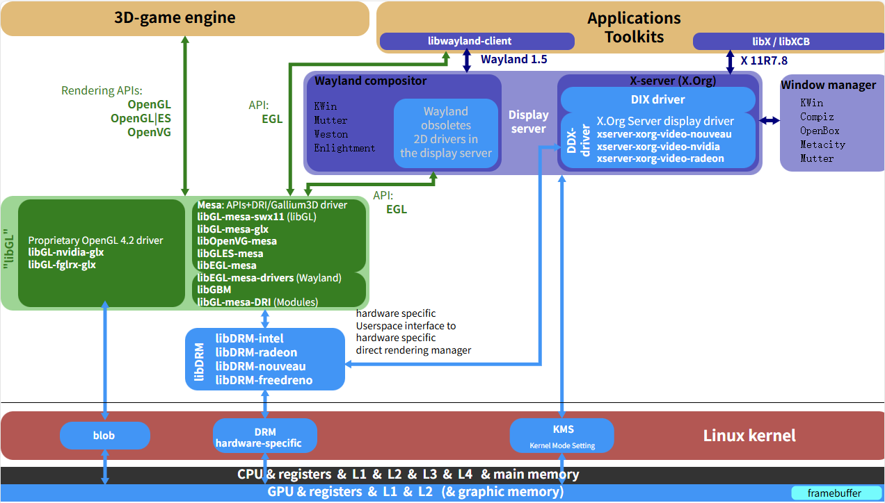

# Linux DRM框架

**在学习 `DRM` 框架之前需要先学习 `Linux` 的 `Linux graphic subsystem`（图形子系统）**：

[Linux graphic subsytem(1)_概述](http://www.wowotech.net/graphic_subsystem/graphic_subsystem_overview.html)

[Linux graphic subsystem(2)_DRI介绍](http://www.wowotech.net/graphic_subsystem/dri_overview.html)

# 1. DRM框架

Linux 图形子系统涉及到了 GUI 3D Application DRM/KMS hardware

