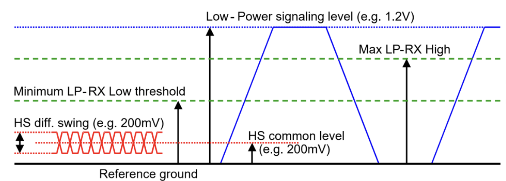

# MIPI DSI 波形详解

1. 分析 MIPI DSI 波形需要使用到逻辑分析仪
2. lane 分为 HS 和 LP 模式，HS 模式采用低压差分信号，传输速度快但是功耗大，信号电压幅度 100mV-300mV ，中心电平 200mV，LP 模式下采用单端驱动，功耗低，速度慢（<10Mbps），信号电压幅度 0-1.2V 。在 LP 模式下只需要使用 lane0 不需要使用时钟信号，通信过程的时钟信号通过 lane0 的两个差分线异或得到

