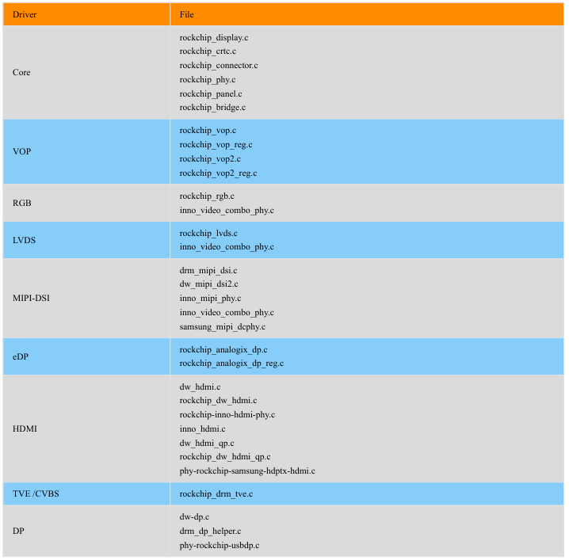

# U-Boot屏幕驱动

一般来说新项目调试屏幕的时候先调试 `kernel` 的屏幕让他可以点亮，再去调试 `U-Boot` 的屏幕驱动，因为 `kernel` 阶段的调试手段更多一些，而 `U-Boot` 阶段的屏幕驱动一般都是显示开机 `logo` 界面和 `充电界面`（如果产品有电池的话，关机充电的时候会显示充电界面）

# 1. Rockchip 平台

`RK` 在官方的 `U-Boot` 的基础上，新增屏幕相关的驱动，显示驱动在 `U-Boot` 中各主要提供的是 `开机logo` 和 `关机充电界面` 的显示，产品没有电池的话，`U-Boot` 阶段的屏幕驱动主要就是开机 `logo` 功能了

[Rockchip_Developer_Guide_DRM_Display_Driver_CN](../核心参考文献库/Rockchip_Developer_Guide_DRM_Display_Driver_CN.pdf)

[Rockchip_DRM_Panel_Porting_Guide_V1.6_20190228](../核心参考文献库/Rockchip_DRM_Panel_Porting_Guide_V1.6_20190228.pdf)

## 1.1 U-Boot 显示驱动目录

瑞芯微平台 `U-Boot` 显示驱动目录：`u-boot/drivers/video/drm`

我们使用的 `MIPI` 屏，那么就只用关心 `Core，VOP，MIPI-DSI` ，其他接口也是同理

## 1.2 U-Boot 设备树

`U-Boot` 有自己的设备树，但是显示节点的配置方法和`kernel` 是一样的，直接配置 `kernel` 的设备树就好了，是因为 `U-Boot` 的 设备树和 `kernel` 的设备树*功能不同*

原生的 `U-Boot` 只支持 `U-Boot` 使用自己的设备树，而 `RK` 平台修改后的 `U-Boot` 新增了对于 `kernel DTB` 的支持，即使用 `kernel DTB` 去初始化外设，主要目的是为了兼容外设板级差异，如 `power，clock，display` 等,二者区别：

* `U-Boot DTB`：负责初始化存储、打印串口等设备
* `kernel DTB`：负责初始化存储、打印串口以外的设备，如 `power，clock，display` 等

`U-Boot` 初始化时候先使用 `U-Boot` 完成存储、打印串口等的初始化,然后从存储上加载 `kernel DTB` 并转而使用这个 `DTB` 去初始化其他外设，`kernel DTB` 的代码实现在了函数 `init_kernel_dtb()` 中

开发者一般不用修改 `U-Boot DTS` （除非更换打印串口），各平台发布的 `SDK` 里使用的 `defconfig` 也都默认启用了 `kernel DTB` 机制，所以直接修改 `kernel DTB` 即可

