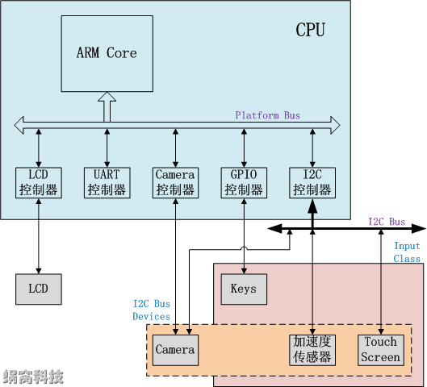
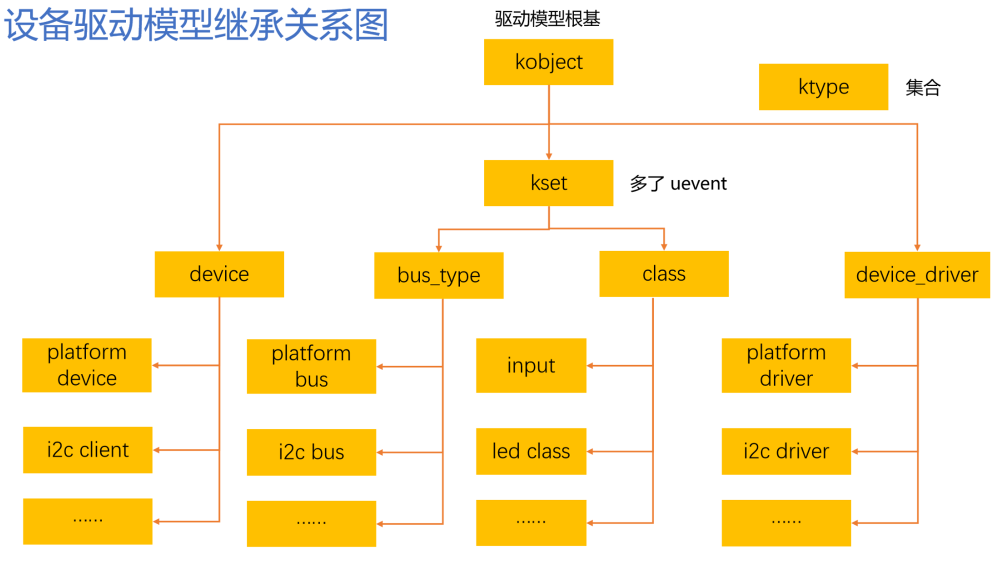
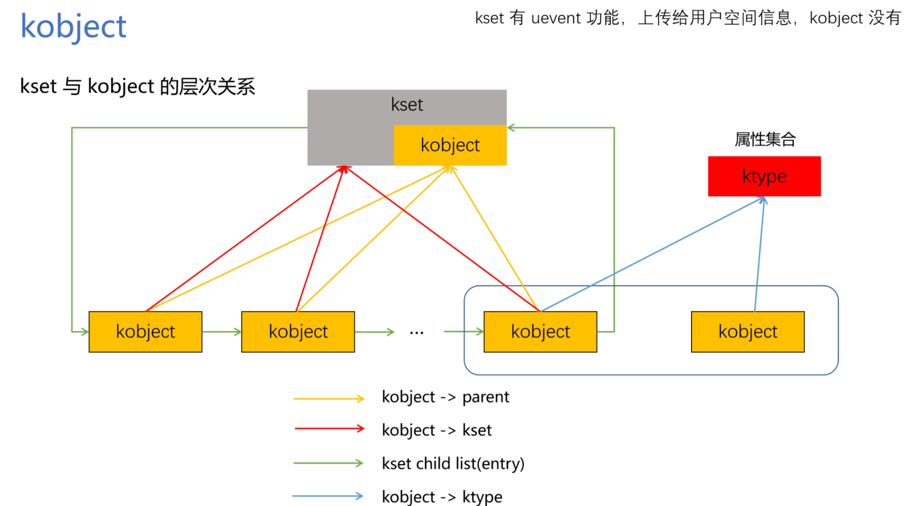
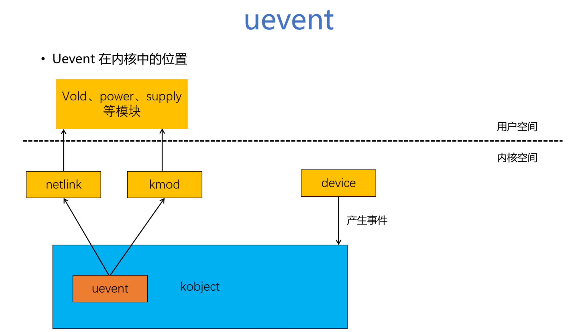
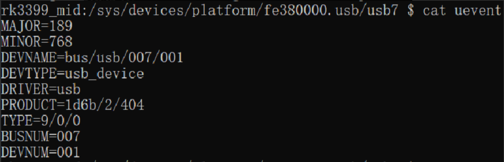
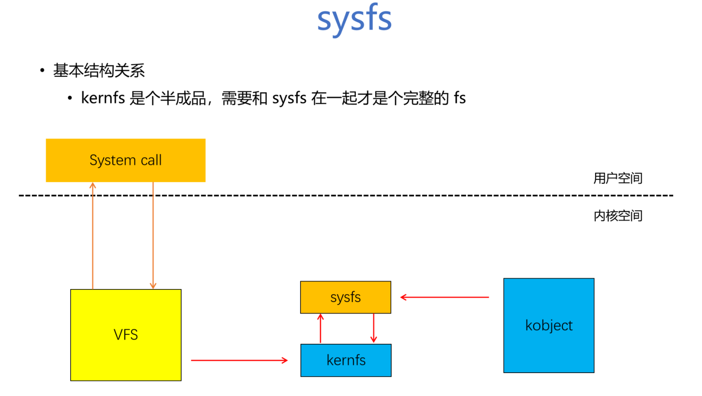

# Linux设备驱动模型

# 1. 概览

* Linux 2.6 引入了新的设备管理机制 - kobject
* Linux设备驱动模型分为了几个重要概念：bus_type、class、device、device_driver，所有的设备都要挂在Bus上面，没有单独存在的设备


## 1.1 bus_type、class、device、device_driver

[参考文献：蜗窝科技-Linux设备模型](http://www.wowotech.net/device_model/13.html/comment-page-2)



* **bus_type：**Linux认为总线是CPU和外部设备通信的通道，为了便于设备模型的抽象，所有的设备都应该链接到总线上面（无论是CPU内部总线、真实存在的总线、虚拟的总线、Platform Bus）
* **class：**类似于面向对象编程语言的`类`的概念，指的是具有相似属性或者功能的设备，这一类设备可以共用一些数据结构和接口函数
* **device：**抽象出来的硬件设备，描述他的名字、属性、从属的Bus、从属的Class等信息
* **device_driver：**抽象出来的设备的驱动程序，包含了设备初始化、电源管理等相关的接口实现，做内核驱动开发基本上都和他相关。


## 1.2 Platform Bus

在计算机中有的片上设备通过他自己的设备控制器直接和CPU相连接，CPU可以直接通过常规的寻址操作访问到这些设备。这些设备的连接方式不属于传统的物理总线相连接，但是为了设备驱动模型的标准化，就引入了这一条虚拟总线，通过标准化的方式描述和连接这些设备，供给这些设备挂靠


**总结：**

1. sysfs虚拟文件系统与设备驱动模型紧密相关，向外界暴露设备驱动模型的结构。向用户空间提供系统信息、改变参数的操作接口，一个kobject对象往往对应sysfs中的一个目录，kobject被用来与内核交互并创建它的sysfs可见表述
2. 使用class抽象设备的共性，减少了驱动开发过程中的重复劳动
3. 使用device和device_driver实现了设备的即插即用（热插拔），相同总线上的device和device_driver如果有相同的名字，内核就会执行device_driver中的初始化函数（probe），初始化设备。当系统中的硬件被热插拔时，在kobject子系统的控制下，将产生事件以通知用户空间。


# 2. kobject

**源码位置：**

* include/linux/kobject.h

* lib/kobject.c



## 2.1 什么是 kobject？为什么要引入它？

在早期，Linux 内核的各个子系统（如设备驱动、文件系统、模块等）各自管理自己的对象，没有统一的机制。这导致了很多重复代码和潜在的问题，例如：

- **引用计数混乱**：每个子系统都需要自己实现对象的引用计数，以防止对象在使用时被意外释放，导致内核崩溃。
- **sysfs 集成困难**：`sysfs`（一个展示内核对象层次结构的虚拟文件系统）需要一种统一的方式来暴露内核对象及其属性。
- **缺乏统一的父子关系**：对象之间的层次结构关系没有标准化的管理方式。
- **热插拔事件支持**：当设备插入或拔出时，需要一种标准机制来通知用户空间。

为了解决这些问题，内核开发者引入了 **kobject（内核对象）** 模型。它并不是一个独立的功能，而是一个**基础框架**，为内核中的其他数据结构提供通用的、可重用的功能。

**简单来说，kobject 是内核对象管理的“基础设施”或“基类”，是实现Bus、Class、Device、Driver的基础**


## 2.2 kobject 的核心功能

一个 kobject 本身几乎不做任何具体的事情，它的主要作用是为其“宿主”对象提供以下核心服务：

1. **引用计数**
	- kobject 内嵌了一个 `kref` 结构体，用于管理对象的生命周期。
	- 当有代码需要访问该对象时，会增加其引用计数；使用完毕后，则减少引用计数。
	- 当引用计数降为 0 时，系统会自动调用其释放函数来销毁该对象。这有效防止了“use-after-free”错误。
2. **sysfs 表示**
	- 每一个在 `sysfs` 中出现的目录，背后都有一个 kobject 在支撑。
	- kobject 的创建和销毁会自动在 `/sys` 目录下创建和删除对应的目录。
3. **数据结构组织**
	- kobject 通过 `parent` 指针可以形成清晰的**层次结构**（父子关系）。这在 `sysfs` 中表现为目录的嵌套。
	- 例如：一个 USB 鼠标的设备对象是其所在的 USB 控制器对象的子对象。
4. **热插拔事件通知**
	- 当 kobject 的状态发生变化（如被添加或移除）时，它会向用户空间发送一个 **uevent** 事件。
	- 用户空间的守护进程（如 `udev`）会监听这些事件，并据此在 `/dev` 目录下动态地创建设备节点、加载驱动模块等。


## 2.3 kobject 的常见“宿主”

如前所述，kobject 本身没有实际用途，它通常被**内嵌**到其他更有意义的内核数据结构中。这些数据结构被称为 kobject 的“宿主”。

最常见的例子有：

- `struct device`：代表一个设备（如鼠标、键盘、硬盘）。
- `struct device_driver`：代表一个驱动。
- `struct bus_type`：代表一种总线（如 PCI, USB）。
- `struct class`：代表一个设备类（如输入设备、网络设备、块设备）。

这种“内嵌”关系是面向对象思想中“继承”的体现。kobject 作为基类，为这些更具体的“子类”提供了通用的对象管理能力。


## 2.4 kobject、kset、ktype层次关系



**kset：**

- **是什么**：一个 kset 是**一组 kobject 的集合**。它本身也内嵌了一个 kobject，所以它也能在 `sysfs` 中表现为一个目录。
- **作用**：
	- **容器**：将相关的 kobject 聚集在一起。例如，所有 PCI 设备可以放在一个名为 `pci_devices` 的 kset 中。
	- **管理**：kset 是这些 kobject 的**共同管理者**。它可以为集合内的所有 kobject 提供统一的 `ktype`（见下文）。
	- **sysfs 层级**：kset 内嵌的 kobject 可以作为集合内所有 kobject 的默认父对象。

**ktype：**

- **是什么**：`ktype`（内核对象类型）描述了**特定类型的 kobject 的属性和行为**。它由 `struct kobj_type` 表示。
- **作用**：
	- **释放函数**：`ktype` 中最关键的成员是 `release` 函数指针。它定义了当 kobject 的引用计数为 0 时，如何正确地释放其宿主对象的内存。
	- **默认属性**：`ktype` 可以指定一组默认的 `sysfs` 属性文件（如 `name`, `uevent` 等）。
	- **sysfs 操作**：它包含了操作这些属性文件的方法。

**三者的关系：**

- **kobject** 是基本单元。
- **ktype** 定义了同一种类型的 kobject 的行为（也就是属性操作集合，其中最重要的是如何释放），多个kobject可能共用一个属性操作集。
- **kset** 将多个 kobject 组织在一起，并可以为它们提供共同的 ktype。

一个 kobject 可以同时属于一个 kset，并拥有一个 ktype。如果 kobject 被加入到 kset 中，但没有显式指定 ktype，那么它会使用 kset 的 ktype。

| 概念         | 角色                                                         | 比喻                                                         |
| :----------- | :----------------------------------------------------------- | :----------------------------------------------------------- |
| **kobject**  | **基础对象**，提供引用计数、sysfs接口、父子关系等基础设施。  | 就像“生物细胞”，是构成生命的基本单位，有通用的生命周期。     |
| **ktype**    | **对象类型**，定义同一种 kobject 的释放方式和默认属性行为。  | 就像“细胞类型说明书”，规定了一个肝细胞和一个皮肤细胞应该如何工作和死亡。 |
| **kset**     | **对象集合**，将相关的 kobject 分组管理。                    | 就像“器官”，将同类型的细胞（如肝细胞）组织在一起，形成一个功能单元（肝脏）。 |
| **宿主结构** | **具体对象**，如 `device`, `driver`，内嵌了 kobject 来获得其能力。 | 就像具体的“生物个体”（如一个人），由各种细胞和器官构成。     |

**kobject 模型的核心思想是：通过将通用功能（生命周期管理、层次结构、用户空间交互）下放到一个基础框架（kobject）中，让内核中更高级别的子系统可以专注于实现自己的特定逻辑，从而减少代码重复，提高稳定性和可维护性。** 它是理解现代 Linux 设备模型、`sysfs` 和 `udev` 等工作原理的基石。


## 2.5 kobject、kset、ktype相关结构体

### 2.5.1 kobject，kset，ktype

#### （1）kobject

```c
struct kobject {
	const char		*name;// 对象名称，在sysfs中显示为目录名，kobject添加到kernel时候要根据名字注册
	struct list_head	entry;// 用于将kobject链接到kset的链表中的list_head
	struct kobject		*parent;// 指向父kobject，用于构建sysfs层次结构
	struct kset		*kset;// 该kobject所属的kset（kobject集合）
	const struct kobj_type	*ktype;// kobject的类型，包含操作方法和属性行为，每一个kobject都必须有类型
	struct kernfs_node	*sd;// sysfs文件系统目录项，关联sysfs中的目录
	struct kref		kref;// 引用计数，管理kobject的生命周期

	unsigned int state_initialized:1;// 标记kobject是否已完成初始化
	unsigned int state_in_sysfs:1;// 标记kobject是否已添加到sysfs中，在sysfs中呈现
	unsigned int state_add_uevent_sent:1;// 标记是否已发送添加uevent事件
	unsigned int state_remove_uevent_sent:1;// 标记是否已发送移除uevent事件  
	unsigned int uevent_suppress:1;// 是否抑制uevent事件的发送

#ifdef CONFIG_DEBUG_KOBJECT_RELEASE
	struct delayed_work	release;// 用于调试kobject释放的延迟工作队列
#endif
};
```


#### （2）kset

比kobject多了Uevent

```c
struct kset {
	struct list_head list;// 用于链接该kset中所有kobject的链表头
	spinlock_t list_lock;// 保护list链表的自旋锁，防止并发访问
	struct kobject kobj;// 内嵌的kobject，代表kset本身在sysfs中的目录，也是kset能够出现在设备模型层次结构中的原因
	const struct kset_uevent_ops *uevent_ops;// uevent操作集，处理热插拔事件，包含过滤、命名等回调函数
} __randomize_layout;
```

```c
struct kset_uevent_ops {
	int (* const filter)(const struct kobject *kobj);// 过滤函数：决定是否对指定的kobject发送uevent事件，返回0表示发送uevent，非0值表示抑制uevent
	const char *(* const name)(const struct kobject *kobj);// 命名函数：为uevent事件提供子系统名称，返回的字符串将作为uevent的子系统名称
	int (* const uevent)(const struct kobject *kobj, struct kobj_uevent_env *env);// uevent处理函数：在发送uevent前添加自定义环境变量，可以用于向用户空间传递额外的设备信息
};
```


#### （3）kobj_type

```c
struct kobj_type {
	void (*release)(struct kobject *kobj);// 释放函数：当kobject引用计数为0时调用，负责清理kobject占用的资源
	const struct sysfs_ops *sysfs_ops;// sysfs操作集：定义在sysfs中文件的读写操作函数接口
	const struct attribute_group **default_groups;// 默认属性组：定义在sysfs中显示的默认文件和属性，也是sysfs中的一个或者多个文件，会在kobject添加到内核时候注册到sysfs中
	const struct kobj_ns_type_operations *(*child_ns_type)(const struct kobject *kobj);// 返回子目录的命名空间类型操作
	const void *(*namespace)(const struct kobject *kobj);// 获取kobject的命名空间，确定对象的归属
	void (*get_ownership)(const struct kobject *kobj, kuid_t *uid, kgid_t *gid);// 获取kobject在sysfs中的文件所有权（用户ID和组ID）
};
```

```c
struct sysfs_ops {
	ssize_t	(*show)(struct kobject *, struct attribute *, char *);// 显示函数：当读取sysfs属性文件时调用，将内核数据输出到用户空间的缓冲区
	ssize_t	(*store)(struct kobject *, struct attribute *, const char *, size_t);// 存储函数：当写入sysfs属性文件时调用，将用户空间的数据存储到内核中
};
```


### 2.5.2 uevent

#### （1）uevent的功能

* Uevent（User Space Event）是Linux内核向用户空间发送事件通知的机制，主要用于设备热插拔、设备状态变化等事件的通信。
* Uevent是kobject的一部分，用于在kobject状态发生改变的时候，例如增加、移除等通知用户空间程序。用户空间收到事件后，会做相应的处理



`kmod老版本kernel在用，现在已经停止使用了`


#### （2）uevent在sysfs中的展现




#### （3）uevent相关数据结构

1. kobj_uevent_env

```c
struct kobj_uevent_env {
    char *argv[3];                   // 执行用户空间程序的参数
    char *envp[UEVENT_NUM_ENVP];     // 环境变量数组
    int envp_idx;                    // 环境变量索引
    char buf[UEVENT_BUFFER_SIZE];    // 环境变量缓冲区
    int buflen;                      // 缓冲区使用长度
};
```

2. uevent事件类型：kobject_action

```c
// 常见事件类型
enum kobject_action {
    KOBJ_ADD,        // 设备添加
    KOBJ_REMOVE,     // 设备移除
    KOBJ_CHANGE,     // 设备状态改变
    KOBJ_MOVE,       // 设备移动
    KOBJ_ONLINE,     // 设备上线
    KOBJ_OFFLINE,    // 设备下线
    KOBJ_BIND,       // 设备绑定
    KOBJ_UNBIND,     // 设备解绑
};
```


#### （4）uevent的发送函数

```c
// 发送uevent到用户空间
int kobject_uevent(struct kobject *kobj, enum kobject_action action);
int kobject_uevent_env(struct kobject *kobj, enum kobject_action action, struct kobj_uevent_env *env);
```


### 2.5.3 sysfs



#### （1）sysfs 是什么？

1. **Sysfs** 是一个存在于内存中的**虚拟文件系统**。它最早在 Linux 2.6 内核中被引入，其核心目的是将内核中关于**设备、驱动和内核模块的拓扑结构**以一种清晰、统一的方式导出到用户空间。

2. 简单来说，Sysfs 在内核对象（设备、驱动等）和用户空间之间建立了一个桥梁，让用户和管理员可以通过简单的文件读写操作来查看和配置内核及硬件的参数。
3. 你通常可以在 `/sys` 目录下找到它。

```shell
ls /sys/
block  bus  class  dev  devices  firmware  fs  kernel  module  power
```


#### （2）sysfs 的设计目标与核心思想

Sysfs 的诞生与 Linux 设备模型的革新紧密相关。新的设备模型引入了 **kobject** 机制，而 Sysfs 本质上就是内核中 kobject 结构体的可视化视图。

它的核心思想是：**“一切皆文件”**。

- **目录** 代表内核对象（kobject），例如一个设备、一个驱动。

- **文件** 代表该对象的**属性**（attribute），例如设备地址、驱动版本、开关状态等。

- **符号链接** 代表对象之间的**关系**，例如设备与它所属的总线、设备与它对应的驱动之间的关系。

	

#### （3）sysfs 的主要目录结构

进入 `/sys` 目录，你会看到几个核心的顶层目录，它们从不同维度组织了内核信息：

1. **`/sys/devices/`** - **核心**
	- 这是整个系统设备拓扑结构的真实反映。它按实际硬件连接方式展示了所有被内核发现的设备，是其他目录信息的主要来源。
2. **`/sys/bus/`** - **按总线类型组织**
	- 包含了系统中所有类型的总线，如 `pci`, `usb`, `i2c`, `platform` 等。
	- 每个总线目录下通常有：
		- `devices`：链接到该总线下所有的设备（实际指向 `/sys/devices/` 中的对应设备）。
		- `drivers`：该总线下已注册的所有驱动。
3. **`/sys/class/`** - **按设备类别组织**
	- 这是对用户最友好的视图，它按设备的功能类别进行分类，如 `input`, `block`（块设备）, `net`（网络设备）, `tty`, `graphics` 等。
	- 例如，所有输入设备（鼠标、键盘）都可以在 `/sys/class/input/` 下找到。
4. **`/sys/block/`** - **块设备**
	- 包含所有的块设备（如硬盘、U盘），如 `sda`, `sdb` 等。在新版内核中，它通常是 `/sys/class/block/` 的一个符号链接。
5. **`/sys/dev/`** - **按设备号组织**
	- 包含两个子目录：
		- `char`：字符设备，按 `主设备号:次设备号` 组织。
		- `block`：块设备，同样按设备号组织。
6. **`/sys/kernel/`** - **内核参数**
	- 包含各种内核的可配置参数和状态信息，如 `security/`, `slab/`, `debug` 等。
7. **`/sys/module/`** - **内核模块**
	- 包含所有已加载的内核模块的信息，每个模块一个目录，里面有其参数、状态和代码段等。
8. **`/sys/power/`** - **电源管理**
	- 包含系统电源管理的相关接口，如 `state` 文件可以用来实现休眠或关机。


#### （4）Sysfs 的用途

1. **设备发现与管理**：系统和工具（如 udev）通过监视 Sysfs 的变化来动态地创建设备节点（在 `/dev` 目录下），并加载相应的驱动。
2. **查询硬件信息**：无需特权工具，即可通过 `cat` 命令查看设备厂商、型号、中断号、DMA通道等详细信息。
3. **动态配置内核参数**：通过 `echo` 命令向特定文件写入值，可以动态改变内核或设备的行为。例如：
	- 调节CPU频率：`/sys/devices/system/cpu/cpu0/cpufreq/`
	- 控制GPIO引脚：`/sys/class/gpio/`
	- 设置网卡参数：`/sys/class/net/eth0/`
4. **驱动开发与调试**：开发者可以通过 Sysfs 轻松地暴露驱动程序的调试接口或配置选项。


#### （5）举例：查看一个USB设备

假设你想了解你插入的USB鼠标。

1. **在 `/sys/class/input/` 下找到它**：

	```shell
	ls /sys/class/input/
	# 你可能会看到 input0, input1, mouse0 等目录
	ls /sys/class/input/mouse0/device/
	# 你会看到很多文件，如 name, id, capabilities
	cat /sys/class/input/mouse0/device/name
	# 可能会输出 "Logitech USB Receiver" 之类的设备名
	```

2. **通过符号链接找到它的真实位置**：

	```shell
	# 在 device 目录下，有一个到 /sys/devices/ 的符号链接
	ls -l /sys/class/input/mouse0/device
	# 你会看到类似 ‘device -> ../../../usb1/1-1/1-1.2/1-1.2:1.0/...’ 的链接
	# 跟随这个链接，你就能在 /sys/devices/ 下找到这个USB设备的完整信息，包括其所属的USB总线、电源、速度等。
	```


#### （6）sysfs 与 procfs 的区别

很多人会混淆 `/sys` 和 `/proc`，因为它们都是虚拟文件系统。

| 特性         | **Procfs (`/proc`)**                                       | **Sysfs (`/sys`)**                                           |
| :----------- | :--------------------------------------------------------- | :----------------------------------------------------------- |
| **主要目的** | 主要提供**进程信息**和**内核运行状态**。                   | 专门用于展示**设备、驱动和内核对象的统一模型**。             |
| **内容**     | 包含进程目录、系统统计信息、内核参数等，内容比较**混杂**。 | 内容高度**结构化**，严格遵循 kobject 模型。                  |
| **组织方式** | 组织相对松散。                                             | 组织非常严谨，通过目录、文件、链接清晰地表达了对象、属性和关系。 |

**简单总结：`/proc` 是关于“运行状态”的，而 `/sys` 是关于“设备结构”的。**


### 2.5.4 attribute

#### （1）attribute 是什么？

1. **attribute** “**属性**”。在 Linux 内核的设备模型中，它代表一个内核对象（`kobject`）的某个可被查看或修改的“属性”或“设置项”。它的核心思想是：**将一个内核对象的内部变量，通过 sysfs 虚拟文件系统，以一个普通的文件形式暴露给用户空间。**
- 用户可以通过 `cat` 命令**读取**该文件，来查看该属性的值。
	
- 用户可以通过 `echo` 命令**写入**该文件，来修改该属性的值（如果允许写入）。
2. **简单来说，一个 attribute 就对应了 sysfs 目录下的一个文件。**
3. 分为`普通的attribute`和`二进制attribute`
	* `struct attribute`为普通的，使用这种属性生成的`sysfs`文件，只能用字符串的形式读写
	* `struct bin_struct`为二进制的，在`struct attribute`的基础上，增加了`read`和`write`等函数，因此他生成的`sysfs`文件可以用任何方式读写，而且二进制文件是支持部分读写的


#### （2）举例：LED

假设我们有一个LED 设备，它在 Sysfs 中的路径是 `/sys/class/leds/myled/`。在这个目录下，你可能会看到：

```shell
ls /sys/class/leds/myled/
brightness  max_brightness  trigger
```

这里的每一个文件（`brightness`, `max_brightness`, `trigger`）都是一个 **Attribute**。

- `cat brightness`：读取的是 `brightness` 这个属性的值（当前亮度）。
- `echo 50 > brightness`：设置的是 `brightness` 这个属性的值（将亮度设置为 50）。
- `cat max_brightness`：读取的是 `max_brightness` 这个属性的值（最大亮度）。
- `echo "heartbeat" > trigger`：设置的是 `trigger` 这个属性的值（将触发模式设置为“心跳”）。


#### （3）数据结构

在内核代码中，一个 attribute 主要用 `struct attribute` 和更具体的 `struct device_attribute` 等结构体来表示。

1. **基础结构体：`struct attribute`**

  ```c
  struct attribute {
  	const char		*name;// 展示在sysfs中的属性文件名（如"brightness"）
  	umode_t			mode;// 文件权限（如0644表示所有者可读写，其他用户只读）定义该属性文件在 sysfs 中的访问权限
  #ifdef CONFIG_DEBUG_LOCK_ALLOC// 以下字段仅在开启锁依赖调试时编译进来
  	bool			ignore_lockdep:1;// 是否忽略锁依赖检查（只占用一个比特位）
  	struct lock_class_key	*key;// 动态分配的锁类（指向动态创建的锁类指针）
  	struct lock_class_key	skey;// 静态分配的锁类（编译时静态定义的或者内联的锁类键）
  #endif
  };
  ```

2. `attribute`结构体比较底层，一般会包含在其他结构体里面
	
	```c
	struct bin_attribute {
		struct attribute	attr;// 基础属性：文件名和权限
		size_t			size;// 文件大小（字节），0表示大小不固定
		void			*private;// 驱动私有数据，可在回调函数中使用
		struct address_space *(*f_mapping)(void);//返回与此文件关联的address_space映射，通常用于需要与页缓存交互的高级场景，大多数驱动不需要实现。
		ssize_t (*read)(struct file *, struct kobject *, const struct bin_attribute *,
				char *, loff_t, size_t);// 传统读操作 - 从二进制属性读取数据
		ssize_t (*read_new)(struct file *, struct kobject *, const struct bin_attribute *,
				    char *, loff_t, size_t);// 新的读操作 - 提供文件上下文信息
		ssize_t (*write)(struct file *, struct kobject *, const struct bin_attribute *,
				 char *, loff_t, size_t);// 传统写操作 - 向二进制属性写入数据
		ssize_t (*write_new)(struct file *, struct kobject *,
				     const struct bin_attribute *, char *, loff_t, size_t);// 新的写操作 - 提供文件上下文信息
		loff_t (*llseek)(struct file *, struct kobject *, const struct bin_attribute *,
				 loff_t, int);// 寻址操作 - 改变当前文件读写位置
		int (*mmap)(struct file *, struct kobject *, const struct bin_attribute *attr,
			    struct vm_area_struct *vma);// 内存映射操作 - 将文件映射到用户进程的地址空间
	};
	
	struct attribute_group {
		const char		*name;// 可选的组名，如果设置则创建子目录
		umode_t			(*is_visible)(struct kobject *,
						      struct attribute *, int);// 检查普通属性是否可见的回调函数
		umode_t			(*is_bin_visible)(struct kobject *,
							  const struct bin_attribute *, int);// 检查二进制属性是否可见的回调函数
		size_t			(*bin_size)(struct kobject *,
						    const struct bin_attribute *,// 动态计算二进制属性大小的回调函数
						    int);
		struct attribute	**attrs;// 普通属性指针数组，以NULL结束
		union {
			const struct bin_attribute	*const *bin_attrs;// 传统二进制属性数组
			const struct bin_attribute	*const *bin_attrs_new;// 新版二进制属性数组
		};
	};
	```
	


#### （4）工作原理：从用户空间到内核空间的调用链

当你在用户空间执行 `cat /sys/class/xxx/my_attr` 时，背后发生了一系列事情：

1. **VFS 拦截**：VFS 接收到读文件请求，发现这个文件属于 sysfs。
2. **路由到 Kernfs**：VFS 将操作路由到 Kernfs（Sysfs 的基础框架）。
3. **调用 Show 函数**：Kernfs 找到该文件对应的 `struct attribute`，进而找到其所属的 `struct device_attribute`，最后调用其 `show` 函数。
4. **执行内核代码**：`show` 函数（由驱动开发者编写）执行，它可能会：
	- 读取一个设备寄存器。
	- 访问一个内核变量的值。
	- 执行一些计算。
5. **返回数据**：`show` 函数将结果以字符串形式写入 `buf`。
6. **数据传递**：Kernfs 负责将 `buf` 中的数据从内核空间拷贝到用户空间。
7. **用户显示**：`cat` 命令接收到数据并将其打印在终端上。

**写入（`store`）的过程与此类似，方向相反。**


#### （5）attribute 的类型

根据所属的内核对象不同，有不同类型的 Attribute 结构体：

- `struct device_attribute`：用于设备。
- `struct driver_attribute`：用于驱动。
- `struct bus_attribute`：用于总线。
- `struct class_attribute`：用于设备类。

它们的基本思想都是一样的，只是第一个参数（回调函数中的 `dev`, `driver`, `bus`, `class`）不同，指向其所属的特定对象。


## 2.6 设备生命周期示例（集成 sysfs/attribute/uevent）

### 2.6.1 创建与初始化

```c
// 驱动探测函数中创建设备
static int my_driver_probe(struct platform_device *pdev)
{
    struct my_device *dev;
    
    // 1. 分配设备结构体（内含kobject）
    dev = kzalloc(sizeof(*dev), GFP_KERNEL);
    
    // 2. 初始化kobject并添加到sysfs
    device_initialize(&dev->dev);// 初始化内嵌的device结构体
    dev_set_name(&dev->dev, "my_device");// 设置设备名
    
    // 3. 创建sysfs属性组
    dev->dev.groups = my_dev_attr_groups;// 关联之前定义的属性组
    
    // 4. 注册设备到系统（触发uevent）
    device_add(&dev->dev);// 关键：注册设备，创建sysfs条目并发送uevent
    
    return 0;
}
```


### 2.6.2 sysfs 属性组定义

```c
// 定义设备属性
static ssize_t status_show(struct device *dev, char *buf) {
    return sprintf(buf, "active\n");
}
static DEVICE_ATTR_RO(status);// 创建只读属性"status"

static ssize_t value_store(struct device *dev, const char *buf, size_t count) {
    // 处理用户空间写入
    return count;
}
static DEVICE_ATTR_WO(value);// 创建只写属性"value"

// 属性组
static struct attribute *my_dev_attrs[] = {
    &dev_attr_status.attr,// 引用status属性的基础attr
    &dev_attr_value.attr,// 引用value属性的基础attr  
    NULL// 数组必须以NULL结束
};

static struct attribute_group my_dev_attr_group = {
    .attrs = my_dev_attrs,// 将属性数组关联到组
};

static const struct attribute_group *my_dev_attr_groups[] = {
    &my_dev_attr_group,// 可以包含多个属性组
    NULL,// 数组结束标记
};
```


### 2.6.3 用户空间交互效果

```shell
# 设备注册时自动触发uevent，被udev捕获
# udev根据规则创建设备节点

# 查看sysfs属性
ls /sys/devices/.../my_device/
# 显示: status  value  uevent  dev

# 读取属性
cat /sys/devices/.../my_device/status
# 输出: active

# 写入属性  
echo 100 > /sys/devices/.../my_device/value

# 手动触发uevent
echo add > /sys/devices/.../my_device/uevent
```


### 2.6.4 注销与清理

```c
static int my_driver_remove(struct platform_device *pdev)
{
    struct my_device *dev = platform_get_drvdata(pdev);
    
    // 1. 从系统注销设备（触发remove uevent）
    device_del(&dev->dev);
    
    // 2. 减少kobject引用计数，触发release回调
    put_device(&dev->dev);
    
    return 0;
}

// kobject release回调
static void my_dev_release(struct device *dev)
{
    struct my_device *my_dev = container_of(dev, struct my_device, dev);
    
    // 3. 释放设备内存
    kfree(my_dev);
    
    // 4. sysfs目录自动被内核清理
}
```


### 2.6.5 完整交互流程

**内核空间流程：**

device_initialize() → device_add() → 
├── kobject_add()：创建sysfs目录
├── sysfs_create_groups()：创建属性文件  
├── kobject_uevent()：发送"add" uevent
└── 设备就绪，等待用户空间交互


**用户空间效果：**

内核发送"add" uevent → udevd接收 →
├── 创建设备节点（如/dev/my_device）
├── 加载相应驱动模块
└── sysfs中可见属性文件(status, value, uevent)


**清理流程：**

device_del() → put_device() →
├── kobject_put()：引用计数减1
├── 计数为0时调用my_dev_release()
├── 释放设备内存
├── sysfs目录自动删除
└── 发送"remove" uevent通知用户空间


# 3. device、device_driver

Linux内核中有一半的代码是和设备驱动相关的！

* 设备和驱动分开设计增强了驱动的灵活性
* 设备和驱动通过bus这个纽带关联在了一起

```c
struct device {
	struct kobject kobj;			// 内嵌的kobject，用于sysfs表示和引用计数管理
	struct device		*parent;	// 父设备指针，用于构建设备层次结构

	struct device_private	*p;		// 设备驱动相关的私有数据，由设备核心内部使用

	const char		*init_name; 	// 设备的初始名称，在注册时可被覆盖
	const struct device_type *type;		// 设备类型描述符

	const struct bus_type	*bus;		// 设备所属的总线类型，该设备所在的总线对象指针
	struct device_driver *driver;		// 绑定到此设备的驱动程序指针

	void		*platform_data;	// 平台特定数据，用于保存具体的平台相关的数据，具体的驱动模块可以将一些私有的数据暂存在这里，需要使用的石时候再拿出来，因此设备模型并不关系该指针的实际含义
	void		*driver_data;	// 驱动程序数据，可通过dev_set_drvdata/dev_get_drvdata访问

	struct mutex		mutex;	// 互斥锁，用于同步对驱动程序的调用

	struct dev_links_info	links;		// 设备链接信息（电源管理相关）
	struct dev_pm_info	power;		// 电源管理信息
	struct dev_pm_domain	*pm_domain;	// 电源管理域

#ifdef CONFIG_ENERGY_MODEL
	struct em_perf_domain	*em_pd;		// 能量模型性能域
#endif

#ifdef CONFIG_PINCTRL
	struct dev_pin_info	*pins;		// 引脚控制信息
#endif
	struct dev_msi_info	msi;		// MSI中断信息

#ifdef CONFIG_ARCH_HAS_DMA_OPS
	const struct dma_map_ops *dma_ops;	// DMA映射操作函数指针
#endif
	u64		*dma_mask;		// DMA掩码（如果设备支持DMA）
	u64		coherent_dma_mask;	// 一致性DMA掩码，用于alloc_coherent映射
	u64		bus_dma_limit;		// 上游DMA约束限制
	const struct bus_dma_region *dma_range_map; // DMA区域映射表

	struct device_dma_parameters *dma_parms;	// DMA参数

	struct list_head	dma_pools;	// DMA内存池列表（如果设备支持DMA）

#ifdef CONFIG_DMA_DECLARE_COHERENT
	struct dma_coherent_mem	*dma_mem; 	// 一致性内存覆盖的内部结构
#endif
#ifdef CONFIG_DMA_CMA
	struct cma *cma_area;			// 用于DMA分配的连续内存区域
#endif
#ifdef CONFIG_SWIOTLB
	struct io_tlb_mem *dma_io_tlb_mem;	// SWIOTLB内存描述符
#endif
#ifdef CONFIG_SWIOTLB_DYNAMIC
	struct list_head dma_io_tlb_pools;	// 动态IO TLB池列表
	spinlock_t dma_io_tlb_lock;		// IO TLB自旋锁
	bool dma_uses_io_tlb;			// 标记设备是否使用IO TLB
#endif

	struct dev_archdata	archdata;	// 架构特定数据

	struct device_node	*of_node; 	// 关联的设备树节点
	struct fwnode_handle	*fwnode; 	// 固件设备节点

#ifdef CONFIG_NUMA
	int		numa_node;		// 设备所在的NUMA节点
#endif
	dev_t			devt;		// 设备号，分为主设备号和从设备号，在需要以设备节点的形式（字符设备和块设备）向用户空间提供接口的设备中，当作设备号使用。用于创建sysfs中的"/sys/dev/*"下的对应目录
	u32			id;		// 设备实例ID

	spinlock_t		devres_lock;	// 设备资源锁
	struct list_head	devres_head;	// 设备资源链表头

	const struct class	*class;		// 设备所属的类
	const struct attribute_group **groups;	// 可选的属性组数组

	void	(*release)(struct device *dev);	// 设备释放回调函数
	struct iommu_group	*iommu_group;	// IOMMU组
	struct dev_iommu	*iommu;		// IOMMU特定数据

	struct device_physical_location *physical_location; // 设备物理位置信息

	enum device_removable	removable;	// 设备可移动性标识

	// 各种状态标志位
	bool			offline_disabled:1;	// 是否禁止离线
	bool			offline:1;		// 是否处于离线状态
	bool			of_node_reused:1;	// 设备树节点是否被重用
	bool			state_synced:1;		// 状态是否已同步
	bool			can_match:1;		// 是否可以匹配驱动

#if defined(CONFIG_ARCH_HAS_SYNC_DMA_FOR_DEVICE) || \
    defined(CONFIG_ARCH_HAS_SYNC_DMA_FOR_CPU) || \
    defined(CONFIG_ARCH_HAS_SYNC_DMA_FOR_CPU_ALL)
	bool			dma_coherent:1;		// DMA是否一致性映射
#endif
#ifdef CONFIG_DMA_OPS_BYPASS
	bool			dma_ops_bypass : 1;	// 是否绕过DMA操作
#endif
#ifdef CONFIG_DMA_NEED_SYNC
	bool			dma_skip_sync:1;	// 是否跳过DMA同步
#endif
#ifdef CONFIG_IOMMU_DMA
	bool			dma_iommu:1;		// 是否使用IOMMU进行DMA
#endif
};
```


# 4. bus

* 总线是Linux设备驱动模型的核心
* 总线可以是物理的也可以是虚拟的


# 5. class


# 6. platform device


# 7. container_of

