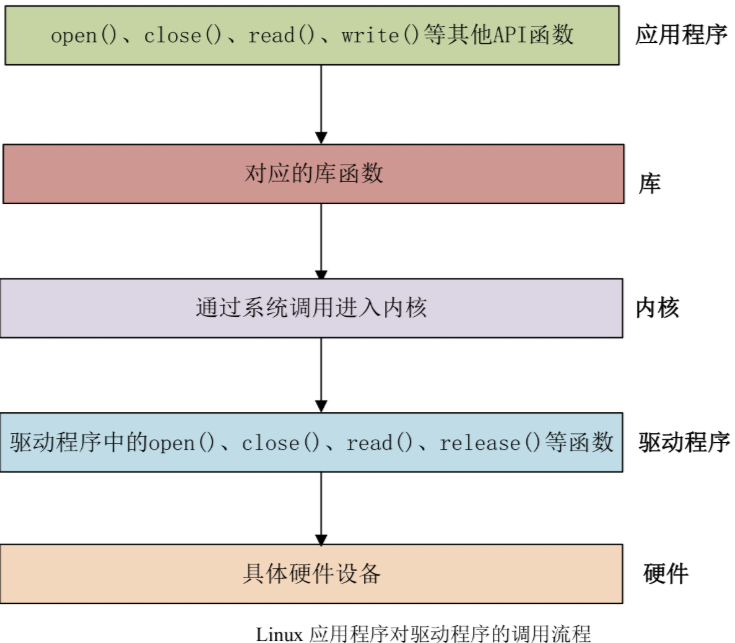
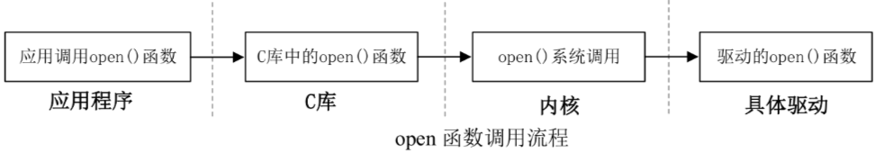
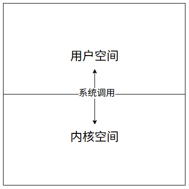

# 字符设备驱动

late_init是最后加载的

# 1. Linux应用程序如何调用驱动程序

* 字符设备是Linux驱动中最基本的一类设备驱动，字符设备就是一个一个字节按照字节流进行读写操作的设备，读写数据是分先后数据的，比如我们最常见的点灯、按键、I2C、SPI LCD等都是字符设备，这些设备的驱动就叫做字符设备驱动。

* 先来了解一下Linux下的应用程序是如何调用驱动程序的，调用流程如图所示：



* `在Linux中，一切皆文件`，驱动加载成功后，会在/dev目录下面生成一个相对应的文件。应用程序通过对这个名为/dev/xxx的文件进行相应的操作，即可实现对硬件的操作。比如我现在有一个叫做/dev/led的驱动文件，此文件是LED灯的驱动文件。应用程序通过`open`函数打开文件，使用完成后使用`close`函数关闭文件。 Open和close就是打开和关闭LED驱动的函数。如果要点亮或者关闭LED，那就使用write函数来操作，也就是向此函数写入数据。这个数据就是是要关闭还是打开LED的控制参数。如果要获取LED灯的状态。就用read函数从驱动中读取相应的状态。

* 应用程序运行在用户空间，而Linux驱动运行于内核空间。当我们在用户空间想要实现对内核的操作，比如使用open函数打开LED驱动，因为用户空间不能直接对内核进行操作，因此必须使用一个叫做`系统调用`的方法来实现从`用户空间陷入到内核空间`，这样才能实现对底层驱动的操作。open、close、write、read这些函数是由C库提供的。在Linux系统中，系统调用作为C库的一部分。当我们调用open函数的时候的流程如图所示：





* 在驱动程序中如何响应用户空间发起的系统调用，比如用户空间调用了 `open()` 函数，驱动中也要有个 `open()` 函数与之对应，。每一个系统调用，在驱动中都有与之对应的一个驱动函数，在Linux内核文件`include/linux/fs.h `中有一个叫做文件操作集的结构体 `file_operations` ，此结构体就是Linux内核驱动操作函数的集合。

```c
struct file_operations {
	struct module *owner;                    // 指向拥有此结构体的模块指针，用于模块引用计数
	fop_flags_t fop_flags;                   // 文件操作标志位，标识操作集的特性
	loff_t (*llseek) (struct file *, loff_t, int);                          // 调整文件读写位置
	ssize_t (*read) (struct file *, char __user *, size_t, loff_t *);       // 从文件读取数据到用户空间
	ssize_t (*write) (struct file *, const char __user *, size_t, loff_t *); // 从用户空间写数据到文件
	ssize_t (*read_iter) (struct kiocb *, struct iov_iter *);               // 异步读取操作
	ssize_t (*write_iter) (struct kiocb *, struct iov_iter *);              // 异步写入操作
	int (*iopoll)(struct kiocb *kiocb, struct io_comp_batch *, unsigned int flags); // IO轮询操作
	int (*iterate_shared) (struct file *, struct dir_context *);            // 共享目录遍历
	__poll_t (*poll) (struct file *, struct poll_table_struct *);           // 检查文件描述符是否可读写
	long (*unlocked_ioctl) (struct file *, unsigned int, unsigned long);    // 无锁设备控制命令
	long (*compat_ioctl) (struct file *, unsigned int, unsigned long);      // 兼容32位设备的控制命令
	int (*mmap) (struct file *, struct vm_area_struct *);                   // 将文件映射到内存
	int (*open) (struct inode *, struct file *);                            // 打开文件
	int (*flush) (struct file *, fl_owner_t id);                            // 刷新文件，关闭时调用
	int (*release) (struct inode *, struct file *);                         // 释放文件结构体
	int (*fsync) (struct file *, loff_t, loff_t, int datasync);             // 同步文件数据到存储设备
	int (*fasync) (int, struct file *, int);                                // 异步通知设置
	int (*lock) (struct file *, int, struct file_lock *);                   // 文件锁定操作
	unsigned long (*get_unmapped_area)(struct file *, unsigned long, unsigned long, unsigned long, unsigned long); // 获取未映射内存区域
	int (*check_flags)(int);                                                // 检查文件打开标志
	int (*flock) (struct file *, int, struct file_lock *);                  // 文件锁操作
	ssize_t (*splice_write)(struct pipe_inode_info *, struct file *, loff_t *, size_t, unsigned int); // 从管道写入文件
	ssize_t (*splice_read)(struct file *, loff_t *, struct pipe_inode_info *, size_t, unsigned int);  // 从文件读取到管道
	void (*splice_eof)(struct file *file);                                  // 管道读取结束通知
	int (*setlease)(struct file *, int, struct file_lease **, void **);     // 设置文件租约
	long (*fallocate)(struct file *file, int mode, loff_t offset, loff_t len); // 预分配文件空间
	void (*show_fdinfo)(struct seq_file *m, struct file *f);                // 显示文件描述符信息
#ifndef CONFIG_MMU
	unsigned (*mmap_capabilities)(struct file *);                           // 无MMU时的内存映射能力
#endif
	ssize_t (*copy_file_range)(struct file *, loff_t, struct file *, loff_t, size_t, unsigned int); // 文件间数据拷贝
	loff_t (*remap_file_range)(struct file *file_in, loff_t pos_in, struct file *file_out, loff_t pos_out, loff_t len, unsigned int remap_flags); // 文件范围重映射
	int (*fadvise)(struct file *, loff_t, loff_t, int);                     // 文件访问模式建议
	int (*uring_cmd)(struct io_uring_cmd *ioucmd, unsigned int issue_flags); // io_uring命令处理
	int (*uring_cmd_iopoll)(struct io_uring_cmd *, struct io_comp_batch *, unsigned int poll_flags); // io_uring轮询操作
	int (*mmap_prepare)(struct vm_area_desc *);                             // 内存映射准备操作
} __randomize_layout;  // 结构体布局随机化，增强安全性
```


# 2. Linux设备号

# 3. 驱动模块的加载和卸载

# 4. 文件私有数据

# 5. 字符设备注册

# 6. 代码示例


