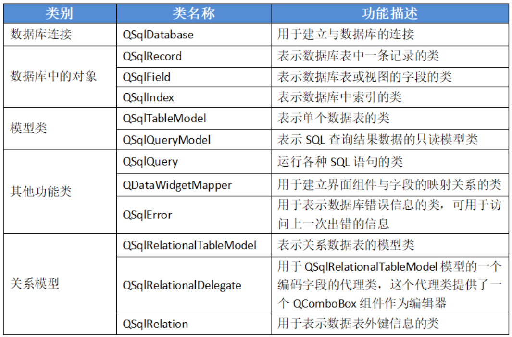
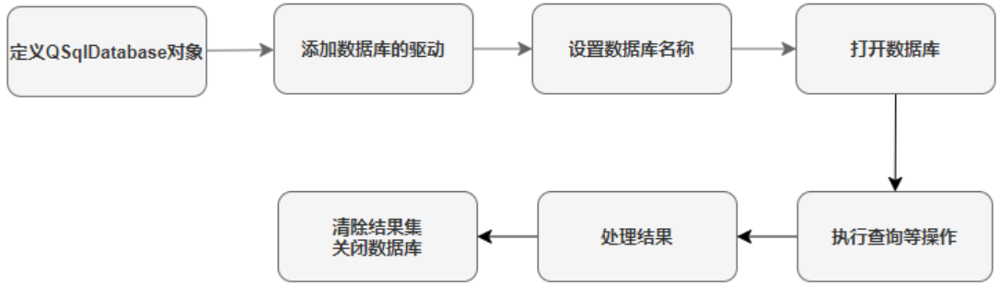

# 一、SQLite数据库

## （1）下载并安装数据库

***
**[https://www.sqlite.org/download.html](https://www.sqlite.org/download.html)**
***

**根据你的操作系统（这里是Windows）和架构（32位或64位），找到合适的下载文件：**

1. 比如我使用64位Windows就选： `sqlite-dll-win64-x64-xxxxxx.zip` （动态链接库文件，用于在应用程序中链接SQLite）

2. 还有工具包：`sqlite-tools-win64-x64-xxxxxx.zip` （包含命令行工具如`sqlite3.exe`，用于直接操作数据库）

3. 下载并解压以上文件到同一个目录下

4. 在此目录>>打开命令窗口CMD，输入`sqlite3`，返回版本信息等内容，说明安装成功

## （2）测试数据库是否安装成功

**1、使用SQLite3命令行工具创建数据库**

在命令行中输入 `sqlite3` 后跟数据库文件名：

```sqlite
sqlite3 mydatabase.db
```

一旦数据库被创建，可以使用 **.databases** 命令来检查它是否在数据库列表中，如下所示：

```sqlite
.databases
```

使用 **.quit** 命令退出 sqlite 提示符，如下所示：

```sqlite
.quit
```

**2、执行SQL命令**

输入`sqlite3`后会进入进入SQLite提示符，就可以执行SQL命令来创建表和执行其他数据库操作：

```sqlite
//创建一个表users，包含两个元素
CREATE TABLE users(id INTEGER PRIMARY KEY,name TEXT); 

//在users表中插入一个元素名叫张三
INSERT INTO users(name) VALUES('张三'); 

//查询users表的所有元素
SELECT *FROM users; 
```

**3、可视化工具**

安装 Navicat Premium 软件，可以便捷的图形化管理各种数据库，一个数据库就是一个`.db3`的文件。

# 二、Qt SQL模块

**如果要使用QtSQL模块中的类，就必须在项目文件（.pro文件）中添加`QT += sql`代码配置！**

QtSQL模块提供了一个与平台及数据库无关的访问数据库的接口，下面这是相关的类：



# 三、访问数据库

Qt中访问数据库的步骤如下：



#### 1、创建QSqlDatabase对象

通过添加数据库驱动，并指定使用的驱动类型（如MySQL、PostgreSQL、SQLite等数据库的驱动），建立应用程序与特定数据库之间的连接，从而能够使用Qt的SQL模块API与数据库进行交互。

1. `QSqlDatabase::addDatabase("驱动名称");`

添加驱动并创建QSqlDatabase对象：

1. `QSqlDatabase database = QSqlDatabase::addDatabase("QSQLITE");`

#### 2、设置数据库名称

指定要访问的数据库的名称。如果本目录下没有该文件，则会创建，否则连接该文件。

1. `database::setDatabaseName("数据库文件名");`

#### 3、打开数据库

如果成功返回true，失败返回false。

1. `database.open();`

可以用QSqlError::driverText()得到错误信息。database.lastError()会返回QSqlError对象。

1. `bool result = datebase.open();`
2. `if (result)`
3. `{`        
4.     `qDebug() << "数据库连接成功";`
5. `}`
6. `else`
7. `{`
8.     `QSqlError lastError = database.lastError();`
9.     `qDebug << lastError.driverText();`
10. `}`

#### 4、执行查询等操作

通过QSqlQuery对象执行sql语句。

1. `QSqlQuery query;`
2. `query.exec("select * from student");`

#### 5、处理结果

1. `query.next();//定位到第一行记录`
2. `QString col1 = query.value(0).toString();//得到本行记录的第一列值`
3. `QString col2 = query.value(1).toString();//得到本行记录的第二列值`
4. `....`

#### 6、清除结果集、关闭数据库

清理 `QSqlQuery` 对象。每次执行完SQL查询操作后，`QSqlQuery` 对象都会持有查询结果集。调用 `clear()` 方法可以清空查询结果集，并释放与此查询相关的内存资源。

关闭 器的连接。当应用程序完成数据库操作后，及时关闭数据库连接可以释放系统资源。

1. `query.clear();`
2. `database.close();`

#### 7、示例代码

（1）查询示例

1. `QSqlDatabase database = QSqlDatabase::addDatabase("QSQLITE");`
2. `database.setDatabaseName("d:/sqllitedb/test.db3");`
3. `bool result = database.open();`
4. `if (!result)`
5. `{`
6.     `QSqlError error = database.lastError();`
7.     `qDebug() << error.driverText();`
8.     `return;`
9. `}`
10. `QSqlQuery query;`
11. `query.exec("select * from employee");`
12. `while (query.next())`
13. `{`
14.     `QString empno = query.value(0).toString();`
15.     `QString ename = query.value(1).toString();`
16.     `QString salary = query.value(6).toString();`
17.     `qDebug() << empno << ename << salary;`
18. `}`
19. `database.close();`

（2）添加、删除、修改数据

1. `QSqlDatabase open()`
2. `{`
3.     `QSqlDatabase database = QSqlDatabase::addDatabase("QSQLITE");`
4.     `database.setDatabaseName("d:/sqllitedb/test.db3");`
5.     `database.open();`
6.     `return database;`
7. `}`

9. `void insert()`
10. `{`
11.     `QSqlDatabase database = open();`
12.     `QSqlQuery query;`
13.     `bool result = query.exec("insert into employee(empno, ename, salary) values(3,'hello', 10000)");`

15.     `if (!result)`
16.     `{`
17.         `QSqlError lastError = database.lastError();`
18.         `qDebug() << lastError.driverText();`
19.     `}`
20.     `database.close();`
21. `}`

23. `void update()`
24. `{`
25.     `QSqlDatabase database = open();`
26.     `QSqlQuery query;`
27.     `bool result = query.exec("update employee set salary = 30000 where empno = 1");`
28.     `if (!result)`
29.     `{`
30.         `QSqlError lastError = database.lastError();`
31.         `qDebug() << lastError.driverText();`
32.     `}`
33.     `database.close();`
34. `}`

36. `void del()`
37. `{`
38.     `QSqlDatabase database = open();`
39.     `QSqlQuery query;`
40.     `query.exec("delete from  employee  where empno = 3");`
41.     `database.close();`
42. `}`

### 三、QSqlTableModel

在 Qt 中进行数据库编程时，通常会使用模型/视图（Model/View）架构来处理数据和用户界面之间的交互。模型负责管理数据以及数据相关的操作。

对于数据库应用来说，最常用的模型包括：

- **`QSqlTableModel`**：适用于表格式的数据，它直接从数据库表读取数据并提供给视图。
- **`QSqlQueryModel`**：适用于执行 SQL 查询返回的结果集，它可以灵活地展示任意查询结果。

QSqlTableModel模型类通常和QTableView组件构成模型/视图结构，实现数据表的数据显示和编辑。

完成如下功能开发：


#### 1、打开数据库

1. `#ifndef MAINWINDOW_H`
2. `#define MAINWINDOW_H`

4. `#include <QMainWindow>`
5. `#include <QSqlDatabase>`
6. `#include <QSqlTableModel>`

8. `QT_BEGIN_NAMESPACE`
9. `namespace Ui {`
10. `class MainWindow;`
11. `}`
12. `QT_END_NAMESPACE`

14. `class MainWindow : public QMainWindow`
15. `{`
16.     `Q_OBJECT`

18. `public:`
19.     `MainWindow(QWidget *parent = nullptr);`
20.     `~MainWindow();`

22. `private slots:`
23.     `void on_actionOpenDB_triggered();`

25. `private:`
26.     `Ui::MainWindow *ui;`
27.     `QSqlDatabase database; //数据库连接`
28.     `QSqlTableModel *model; //数据模型`
29.     `void openTable(); //打开表`
30. `};`
31. `#endif // MAINWINDOW_H`

1. `#include "mainwindow.h"`
2. `#include "ui_mainwindow.h"`
3. `#include <QFileDialog>`
4. `#include <QMessageBox>`
5. `#include <QSqlError>`

7. `MainWindow::MainWindow(QWidget *parent)`
8.     `: QMainWindow(parent)`
9.     `, ui(new Ui::MainWindow)`
10. `{`
11.     `ui->setupUi(this);`
12. `}`

14. `MainWindow::~MainWindow()`
15. `{`
16.     `delete ui;`
17. `}`

19. `void MainWindow::on_actionOpenDB_triggered()`
20. `{`
21.     `QString filename = QFileDialog::getOpenFileName(this, "选择文件","","数据库(*.db)");`
22.     `if (filename.isEmpty())`
23.     `{`
24.         `return;`
25.     `}`
26.     `database = database.addDatabase("QSQLITE");`
27.     `database.setDatabaseName(filename);`
28.     `if (!database.open())`
29.     `{`
30.         `QSqlError error = model->lastError();`
31.         `qDebug() << error.text();`
32.         `QMessageBox::warning(this, "错误", "打开数据库失败");`
33.     `}`
34.     `else{`
35.         `openTable();`
36.     `}`
37. `}`

39. `void MainWindow::openTable()`
40. `{`
41.     `//创建模型，database是目标数据库`
42.     `model = new QSqlTableModel(this, database);`
43.     `//设置模型所对应的数据库表名为 "employee"`
44.     `//模型将与 "employee" 的数据库表进行数据交互，如查询、插入、更新和删除记录等操作。`
45.     `model->setTable("employee");`
46.     `//设置模型的编辑策略为 OnManualSubmit`
47.     `//表示模型不会自动将对数据的更改提交到数据库，而是需要程序员显式调用 submitAll() 方法来提交更改。`
48.     `//这种策略适用于希望在多个更改后一次性提交的情况`
49.     `model->setEditStrategy(QSqlTableModel::OnManualSubmit);`
50.     `model->setSort(model->fieldIndex("empno"), Qt::AscendingOrder);`
51.     `if (!model->select())//查询数据失败`
52.     `{`
53.         `QMessageBox::critical(this, "打开数据表失败", "错误信息：\n" + model->lastError().text());`
54.         `return;`
55.     `}`
56. `}`

#### 2、关联模型/视图

1. `//初始化视图数据`
2. `void MainWindow::initData()`
3. `{`
4.     `//设置表头数据`
5.     `//orientation：表示要设置的是水平（Qt::Horizontal，即列头）还是垂直（Qt::Vertical，即行头）的表头数据。`
6.     `model->setHeaderData(model->fieldIndex("empno"), Qt::Horizontal, "工号");`
7.     `model->setHeaderData(model->fieldIndex("ename"), Qt::Horizontal, "姓名");`
8.     `model->setHeaderData(model->fieldIndex("gender"), Qt::Horizontal, "性别");`
9.     `model->setHeaderData(model->fieldIndex("birthday"), Qt::Horizontal, "出生日期");`
10.     `model->setHeaderData(model->fieldIndex("province"), Qt::Horizontal, "省份");`
11.     `model->setHeaderData(model->fieldIndex("department"), Qt::Horizontal, "部门");`
12.     `model->setHeaderData(model->fieldIndex("salary"), Qt::Horizontal, "薪水");`
13.     `model->setHeaderData(model->fieldIndex("memo"), Qt::Horizontal, "备注");`
14.     `//设置模型`
15.     `ui->tableView->setModel(model);`
16.     `selection = new QItemSelectionModel(model, this);`
17.     `//设置选择模型`
18.     `ui->tableView->setSelectionModel(selection);`
19. `}`

#### 3、添加记录

1. `void MainWindow::on_actionAdd_triggered()`
2. `{`
3.     `QSqlRecord record = model->record();//获取一条空记录，只有字段定义`
4.     `model->insertRecord(model->rowCount(), record);`
5.     `selection->clearSelection();`
6.     `QModelIndex index = model->index(model->rowCount()-1, 0);`
7.     `selection->setCurrentIndex(index, QItemSelectionModel::Select);//设置选择行`
8. `}`

#### 4、删除记录

1. `void MainWindow::on_actionDelete_triggered()`
2. `{`
3.     `int ok = QMessageBox::warning(this, "删除记录", "确定删除？", QMessageBox::Ok | QMessageBox::Cancel);`
4.     `if (ok == QMessageBox::Ok)`
5.     `{`
6.         `QModelIndex index = selection->currentIndex();`
7.         `model->removeRow(index.row());`
8.         `bool result = model->submitAll();`
9.         `if (result)`
10.         `{`
11.             `QMessageBox::information(this, "", "删除成功");`
12.         `}`
13.         `else`
14.         `{`
15.             `QMessageBox::information(this, "", "删除失败");`
16.         `}`
17.     `}`
18. `}`

设置选择模式：

1. `MainWindow::MainWindow(QWidget *parent)`
2.     `: QMainWindow(parent)`
3.     `, ui(new Ui::MainWindow)`
4. `{`
5.     `ui->setupUi(this);`
6.     `//设置选择模式。表格视图这里采用单选模式，在同一时间只能有一个单元格或一行被选中。`
7.     `ui->tableView->setSelectionMode(QAbstractItemView::SingleSelection);`
8.     `ui->tableView->setAlternatingRowColors(true); //交错行变色`
9. `}`

#### 5、保存/取消

1. `void MainWindow::on_actionSave_triggered()`
2. `{`
3.     `bool result = model->submitAll();`
4.     `if (result)`
5.     `{`
6.         `QMessageBox::information(this, "保存数据", "保存成功");`
7.     `}`
8.     `else`
9.     `{`
10.         `QMessageBox::information(this, "保存数据", "保存失败");`
11.     `}`
12. `}`

15. `void MainWindow::on_actionReverse_triggered()`
16. `{`
17.     `model->revertAll();`
18. `}`