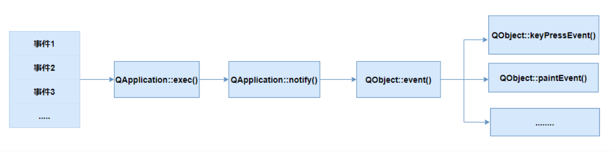

除了信号和槽通信机制外，Qt中还提供了事件处理机制实现与用户的交互和对象间的通信。Qt捕获底层操作系统消息，进行封装之后转换为Qt事件，事件处理后才发出信号。

# 一、事件概述

> Qt中事件是程序内部或外部发生的动作。比如用户移动鼠标、单击鼠标、鼠标拖拽、按下按键等操作都会产生对应的事件。

## 1. 事件来源

- **程序外部：** 在与用户交互时产生，比如用户点击鼠标、按下按键等，此时操作系统会感知到用户的行为，并产生消息，然后将消息投递到应用程序的消息队列当中；应用程序从消息队列中提取消息，并将其转化为Qt事件，生产事件对象。
- **程序内部：** 由Qt应用程序自身产生。例如当窗口第一次显示时，会产生一个绘制事件，以通知窗口需要重新绘制自身，从而使窗口可见。这是由程序内部产生的事件。

## 2. Qt事件处理机制

1. 当操作系统发生一个事件时，事件首先会被操作系统内核中的设备驱动程序所感知，然后发送给操作系统的事件管理系统，事件管理系统将其放入到事件队列中。
2. Qt应用程序作为一个客户端，通过调用 QApplication 的 `exec()` 函数启动事件监听循环，这个循环会不断地从事件队列取出事件，Qt捕获之后，会将该事件转换为相应的Qt事件对象。
3. 事件自己不能处理自己，循环中依次取出事件首先交给 `notify()` 函数，通过 notify() 函数派发给处理事件的对象。
4. **由 QObject 类以及其派生类对象进行事件的处理，通过重写 `event()` 函数，或重写对应的事件处理函数完成事件的处理。**

## 3. 事件与信号

**事件**是底层操作系统所产生的消息，由Qt捕获之后，封装为对应的事件对象，比如鼠标单击对应的事件类型是QEvent::MouseButtonPress，我们在程序中可以通过重写对应的事件处理函数或event()函数进行事件的处理。

Qt为了方便事件的处理，引入了**信号（Signal）**的概念，封装了一些事件操作的标准预处理**，比如对QPushButton预定义了`clicked()`信号。使用户不必去处理底层事件，只需要处理信号即可。当一个事件触发后，对象通过发射一个信号（Signal）进行通知，而其他对象的槽函数（Slot）可以连接到这个信号，从而实现对事件的处理。

# 二、事件类型

- **键盘事件（如 QKeyEvent ，当用户按下或释放键盘按键时产生）**
- **鼠标事件（如 QMouseEvent ，包含鼠标点击、移动、滚轮滚动等操作）**
- **窗口事件（如 resize 、paint 、 move 等，与窗口大小、位置、重绘相关的事件）**

**Qt捕获之后，会将该事件转换为相应的Qt事件对象，所有事件都是QEvent类或其派生类的实例，常见的事件类如下：**

| 类名          | 作用   | 类名           | 作用       | 类名          | 作用   |
| ----------- | ---- | ------------ | -------- | ----------- | ---- |
| QMouseEvent | 鼠标事件 | QPaintEvent  | 绘画事件     | QCloseEvent | 关闭事件 |
| QWheelEvent | 滚轮事件 | QTimerEvent  | 定时器事件    | QShowEvent  | 显示事件 |
| QKeyEvent   | 键盘事件 | QResizeEvent | 窗口大小改变事件 | QHideEvent  | 隐藏事件 |

**事件处理函数都是虚函数，全部声明在QWidget类中，如果要在子类中处理事件，需要重写对应的事件处理函数。**

# 三、鼠标事件

> 鼠标事件涉及鼠标左键或右键按下，释放、双击、移动等操作。 QMouseEvent 类用于处理鼠标事件。

|事件处理函数|对应事件类型|参数类型|描述|
|---|---|---|---|
|mousePressEvent()|QEvent::MouseButtonPress|QMouseEvent|鼠标按键按下|
|mouseDoubleClickEvent()|QEvent::MouseButtonDblClick|QMouseEvent|鼠标双击|
|mouseReleaseEvent()|QEvent::MouseButtonRelease|QMouseEvent|鼠标释放|
|mouseMoveEvent()|QEvent::MouseMove|QMouseEvent|鼠标移动|
|wheelEvent()|QEvent::QWheelEvent|QWheelEvent|鼠标滚轮滚动|

## 1. QMouseEvent对象

QMouseEvent 封装鼠标事件的类，常用的成员函数：

| 成员函数                            | 描述                |
| ------------------------------- | ----------------- |
| Qt::MouseButton button() const; | 返回产生事件的按钮         |
| QPoint globalPos() const;       | 返回鼠标的位置，使用屏幕坐标    |
| QPoint pos() const;             | 返回鼠标的位置，使用用户区坐标   |
| QEvent::Type type() const       | 返回事件类别，如按下、释放或双击等 |

## 2. QWheelEvent对象

QWheelEvent 类封装了鼠标滚轮事件，如滚轮滚动的方向、幅度、位置等。

常用的成员函数：

|成员函数|描述|
|---|---|
|QPoint pos() const;|返回事件发生时鼠标的位置（用户区坐标）|
|QPoint globalPos() const;|返回事件发生时鼠标的位置（屏幕坐标）|
|QPoint angleDelta() const;|返回滚轮的滚动量|

## 3. 重写鼠标事件函数

创建QWidget类的子类，重写事件处理函数

# 四、重写event()事件函数

`event()`函数是QObject类所提供的，特定事件处理函数仅能处理预定义的事件类型，而`event()`函数可以处理所有类型的事件。

- 对于只需要处理某种特定类型事件的情况，重写对应的特定事件处理函数会更加直接。
- 如果需要对多种不同类型的事件进行处理，那么就重写`event()`函数。

下面是重写event()实现事件处理示例：

1. 新建MyWidget类
2. mywidget.h文件如下：

1. `#ifndef MYWIDGET_H`
2. `#define MYWIDGET_H`

4. `#include <QWidget>`

6. `namespace Ui {`
7. `class MyWidget;`
8. `}`

10. `class MyWidget : public QWidget`
11. `{`
12.     `Q_OBJECT`

14. `public:`
15.     `explicit MyWidget(QWidget *parent = nullptr);`
16.     `~MyWidget();`
17.     `//重写事件处理函数event()，使得MyWidget能够处理并响应各类事件。`
18.     `// 返回值true表示事件已被处理，false表示事件未被处理。`
19.     `bool event(QEvent *event);`
20. `protected:`
21.     `//自定义的鼠标事件处理函数`
22.     `void doPressEvent(QMouseEvent *event);`

24. `private:`
25.     `Ui::MyWidget *ui;`
26. `};`

28. `#endif // MYWIDGET_H`

1. mywidget.cpp文件如下：

1. `#include "mywidget.h"`
2. `#include "ui_mywidget.h"`
3. `#include <QEvent>`
4. `#include <QMouseEvent>`
5. `#include <QDebug>`

7. `MyWidget::MyWidget(QWidget *parent)`
8.     `: QWidget(parent)`
9.     `, ui(new Ui::MyWidget)`
10. `{`
11.     `ui->setupUi(this);`
12. `}`

14. `MyWidget::~MyWidget()`
15. `{`
16.     `delete ui;`
17. `}`

19. `bool MyWidget::event(QEvent *event)`
20. `{`
21.     `if (event->type() == QEvent::MouseButtonPress)`
22.     `{`
23.         `//将接收到的QEvent对象强转为QMouseEvent子类对象`
24.         `QMouseEvent *mEvent = dynamic_cast <QMouseEvent*>(event);`
25.         `//调用自定义成员函数`
26.         `doPressEvent(mEvent);`
27.         `//返回true表示事件已被正确消费，不再需要进一步处理。`
28.         `return true;`
29.     `}`
30.     `// 对于非鼠标按钮释放事件，调用基类QWidget的event()函数以进行默认的事件处理。`
31.     `// 这样可以确保所有未在本函数中处理的其他事件也能得到正常的处理。`
32.     `return QWidget::event(event);`
33. `}`

35. `void MyWidget::doPressEvent(QMouseEvent *event)`
36. `{`
37.     `if (event->button() == Qt::LeftButton)`
38.     `{`
39.         `qDebug() << "左键点击" ;`
40.     `}`
41.     `else`
42.     `{`
43.         `qDebug() << "右键点击";`
44.     `}`
45. `}`

# 五、键盘事件

## 1. 键盘事件处理函数

|事件处理函数|对应事件类型|参数类型|描述|
|---|---|---|---|
|void keyPressEvent(QKeyEvent *event);|QEvent::KeyPress|QKeyEvent|按键按下|
|void keyReleaseEvent(QKeyEvent *event);|QEvent::KeyRelease|QKeyEvent|按键释放|

下面是处理键盘事件的示例：

通过按键移动图片，重写键盘按下事件的处理函数。

1. `#ifndef KEYEVENTWIDGET_H`
2. `#define KEYEVENTWIDGET_H`

4. `#include <QWidget>`

6. `namespace Ui {`
7. `class KeyEventWidget;`
8. `}`

10. `class KeyEventWidget : public QWidget`
11. `{`
12.     `Q_OBJECT`

14. `public:`
15.     `explicit KeyEventWidget(QWidget *parent = nullptr);`
16.     `~KeyEvevtWidget();`
17. `protected:`
18.     `//处理按键事件`
19.     `void keyPressEvent(QKeyEvent *e);`

21. `private:`
22.     `Ui::KeyEventWidget *ui;`
23. `};`

25. `#endif // KEYEVENTWIDGET_H`

1. KeyEvevtWidget.cpp文件如下

1. `#include "KeyEventWidget.h"`
2. `#include "ui_keyeventwidget.h"`
3. `#include <QWheelEvent>`
4. `#include <QKeyEvent>`

6. `KeyEventWidget::KeyEventWidget(QWidget *parent)`
7.     `: QWidget(parent)`
8.     `, ui(new Ui::WheelWidget)`
9. `{`
10.     `ui->setupUi(this);`
11.     `ui->label->setStyleSheet("background-color: #ccc; height: 200px; width:100px");`
12. `}`

14. `KeyEventWidget::~KeyEventWidget()`
15. `{`
16.     `delete ui;`
17. `}`

20. `void KeyEventWidget::keyPressEvent(QKeyEvent *e)`
21. `{`
22.     `//按上方向键，标签（图片）向上移动`
23.     `if (e->key() == Qt::Key_Up)`
24.     `{`
25.         `ui->label->move(ui->label->x(), ui->label->y()-5);`
26.     `}`
27.     `else if (e->key() == Qt::Key_Down)`
28.     `{`
29.         `ui->label->move(ui->label->x(), ui->label->y()+5);`
30.     `}`
31.     `else if (e->key() == Qt::Key_Left)`
32.     `{`
33.         `ui->label->move(ui->label->x()-5, ui->label->y());`
34.     `}`
35.     `else if (e->key() == Qt::Key_Right)`
36.     `{`
37.         `ui->label->move(ui->label->x()+5, ui->label->y());`
38.     `}`
39.     `//按下ctrl+m组合键`
40.     `else if (e->key() == Qt::Key_M && e->modifiers() == Qt::ControlModifier)`
41.     `{`
42.         `// 检查当前窗口状态，如果窗口是最大化的，则还原窗口`
43.         `if (windowState() & Qt::WindowMaximized) {`
44.             `setWindowState(windowState() & ~Qt::WindowMaximized);`
45.         `} else {`
46.             `// 如果窗口不是最大化的，则最大化窗口`
47.             `setWindowState(Qt::WindowMaximized);`
48.         `}`
49.     `}`
50.     `else`
51.     `{`
52.         `//使用父类的默认函数处理其他按键事件`
53.         `QWidget::keyPressEvent(e);`
54.     `}`
55. `}`

## 2. QKeyEvent对象

用于描述键盘事件，常用成员函数：

|成员函数|描述|
|---|---|
|int key() const;|获取按下的键|
|int modifiers() const;|判断修饰键（Ctrl、Shift、Alt）是否在按下状态|

# 六、定时器事件

Qt的定时器事件主要用于实现周期性或延迟执行任务的功能。对于实时监控、动画效果、定期检查状态变化以及其他需要按时间顺序控制的行为非常有用。

在Qt中，有两种主要的方式来使用定时器：

## 1. QTimer类

- `QTimer`是基于事件循环的定时器，通过创建一个QTimer对象并调用其`start()`方法来启动定时器。当设定的时间间隔到期时，会自动触发关联的槽函数（slot）或者发送一个`timeout()`信号。
- 使用QTimer可以轻松实现在特定时间间隔后执行重复的任务，例如更新用户界面、轮询硬件状态、刷新数据等。

## 2. 定时器事件

（1）对于任意QObject子类，可以调用以下成员函数开启定时器：

1. `int startTimer(int interval, Qt::TimerType timerType = Qt::CoarseTimer);`

该函数会以interval毫秒为周期开启一个定时器，产生一个QTimerEvent定时器事件，并返回定时器标识。

`Qt::TimerType timerType`用于指定计时器的类型：

- `Qt::VeryCoarseTimer`：这是最不精确的计时器类型，可能有几秒钟的误差。这种类型的计时器会消耗最少的系统资源。
- `Qt::CoarseTimer`：这是一种相对不精确的计时器类型，可能有几百毫秒的误差。这种类型的计时器比`VeryCoarseTimer`更精确，但仍然消耗较少的系统资源。
- `Qt::PreciseTimer`：这是最精确的计时器类型，误差通常小于1毫秒。这种类型的计时器提供最高的精度，但可能会消耗更多的系统资源。

（2）QObject子类，可以通过重写`timerEvent()`成员函数处理定时器事件

1. `void timerEvent(QTimerEvent *event);`

（3）清除定时器，直到调用QObject类里的成员函数

1. `void killTimer(int id);`

下面是一个定时器事件的示例：

timerwidget.h文件如下

1. `#ifndef TIMERWIDGET_H`
2. `#define TIMERWIDGET_H`

4. `#include <QWidget>`

6. `namespace Ui {`
7. `class TimerWidget;`
8. `}`

10. `class TimerWidget : public QWidget`
11. `{`
12.     `Q_OBJECT`

14. `public:`
15.     `explicit TimerWidget(QWidget *parent = nullptr);`
16.     `~TimerWidget();`
17. `protected:`
18.     `//重写定时器事件处理函数`
19.     `void timerEvent(QTimerEvent *e);`
20. `private slots:`
21.     `//开始按钮槽函数`
22.     `void on_start_clicked();`
23.     `//结束按钮槽函数`
24.     `void on_stop_clicked();`

26. `private:`
27.     `Ui::TimerWidget *ui;`
28.     `int timerId;`
29. `};`

31. `#endif // TIMERWIDGET_H`

重写定时器事件函数，timerwidget.cpp代码如下：

1. `#include "timerwidget.h"`
2. `#include "ui_timerwidget.h"`

4. `TimerWidget::TimerWidget(QWidget *parent)`
5.     `: QWidget(parent)`
6.     `, ui(new Ui::TimerWidget),timerId(-1)`
7. `{`
8.     `ui->setupUi(this);`
9.     `if (timerId == -1)`
10.     `timerId = startTimer(1000);`
11.     `ui->label->setStyleSheet("font-size:20px;background-color:#fff;border:1px solid black;border-radius:5px;");`
12.     `ui->label->resize(200, 30);`
13. `}`

15. `TimerWidget::~TimerWidget()`
16. `{`
17.     `delete ui;`
18. `}`

20. `void TimerWidget::timerEvent(QTimerEvent *e)`
21. `{`
22.     `ui->label->setText(QTime::currentTime().toString());`
23. `}`
24. `//开始按钮`
25. `void TimerWidget::on_start_clicked()`
26. `{`
27.     `if (timerId == -1)`
28.     `timerId = startTimer(1000);`
29. `}`

31. `//结束按钮`
32. `void TimerWidget::on_stop_clicked()`
33. `{`
34.     `if (timerId != -1)`
35.     `{`
36.         `killTimer(timerId);`
37.         `timerId = -1;`
38.     `}`
39. `}`

# 七、事件过滤器

> Qt中的事件过滤器机制，允许在对象接收到事件之前拦截和处理这些事件。使用事件过滤器可以在不直接修改对象代码的情况下增加额外的事件处理逻辑。

事件过滤器的用途：

- 监视和响应特定对象的事件，而无需直接修改对象的代码
- 拦截事件，在事件达到目标对象之前进行预处理或完全阻止事件
- 实现跨多个对象的通用事件处理逻辑，而不需要在每个对象所属的类中定义重复相同的代码

事件过滤器的使用步骤：

1. 安装事件过滤器，给要进行事件过滤的对象（组件）安装事件过滤器
2. 开发事件过滤器，对事件进行拦截处理。进行事件拦截处理的对象需要重写`QObject::eventFilter()`函数进行事件的处理
3. 事件处理，如果`eventFilter()`返回`true`表示事件处理完毕，如果返回`false`，事件将继续传递，最终到达目标对象。

## 1. 安装事件过滤器

使用`QObject::installEventFilter()`函数将一个事件过滤器对象安装到需要进行事件过滤的对象上。

1. `obj->installEventFilter(this);`

在UI可视化界面拖放一个QLabel组件，为该组件安装事件过滤器：

1. `// 为标签（label）控件安装事件过滤器，事件过滤器会监视所有传递给该 label 的事件。`
2. `//这里this是指向实现了事件过滤逻辑的对象。将事件的处理交给该对象。`
3. `ui->label->installEventFilter(this);`

## 2. 重写eventFilter()函数

对事件进行过滤器处理的对象必须重写`QObject::eventFilter()`虚函数。

它的主要作用是在事件传递给目标对象之前提供一个拦截点。在事件到达目标对象之前对其进行处理、修改甚至阻止。

- **`watched`**: 参数是一个指向被监视对象的指针。这个对象就是调用`installEventFilter`函数安装过滤器的那个对象。
- **`event`**: 参数是一个指向事件的指针，表示正在传递给`watched`对象的事件

1.  `virtual bool eventFilter(QObject *watched, QEvent *event);`

对QLabel组件进行事件拦截处理：

1. `//拦截并处理对象接收到的事件`
2. `bool Widget::eventFilter(QObject *watched, QEvent *event)`
3. `{`
4.     `// 检查当前被监视的对象是否是 label 控件`
5.     `if (watched == ui->label)`
6.     `{`
7.         `if (event->type() == QEvent::MouseButtonPress)`
8.         `{`
9.             `this->close();`
10.             `//阻止鼠标点击事件,表示事件已经被当前的事件过滤器处理了`
11.             `//事件不会被任何后续的事件过滤器处理`
12.             `return true;`
13.         `}`
14.     `}`
15.     `//如果事件没有被上面的代码处理，调用基类的eventFilter方法继续事件处理过程`
16.     `//保证其他事件能够继续按默认的方式进行处理`
17.     `return QWidget::eventFilter(watched, event);`
18. `}`
