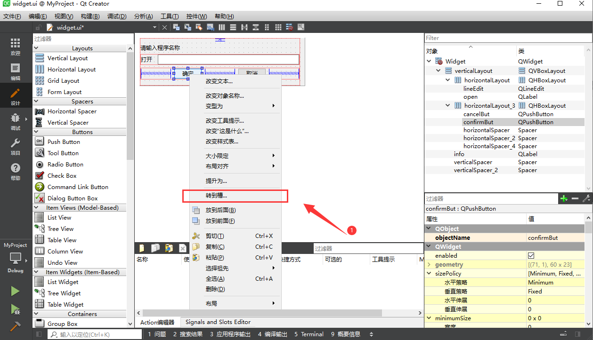
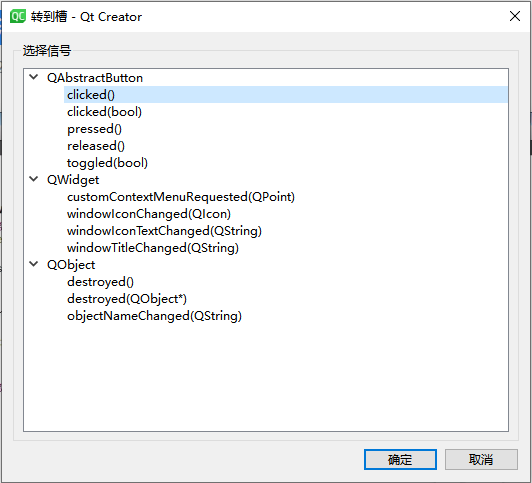
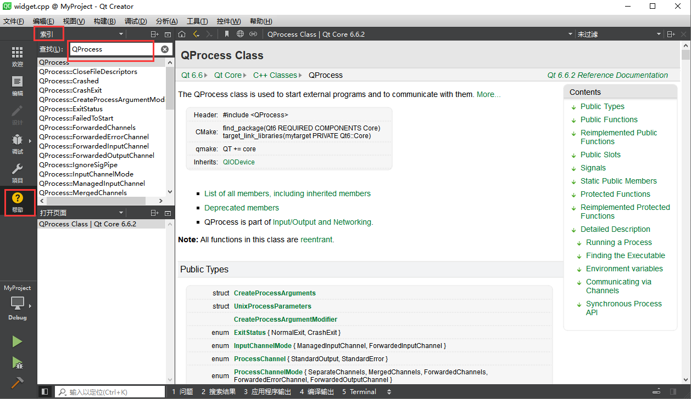
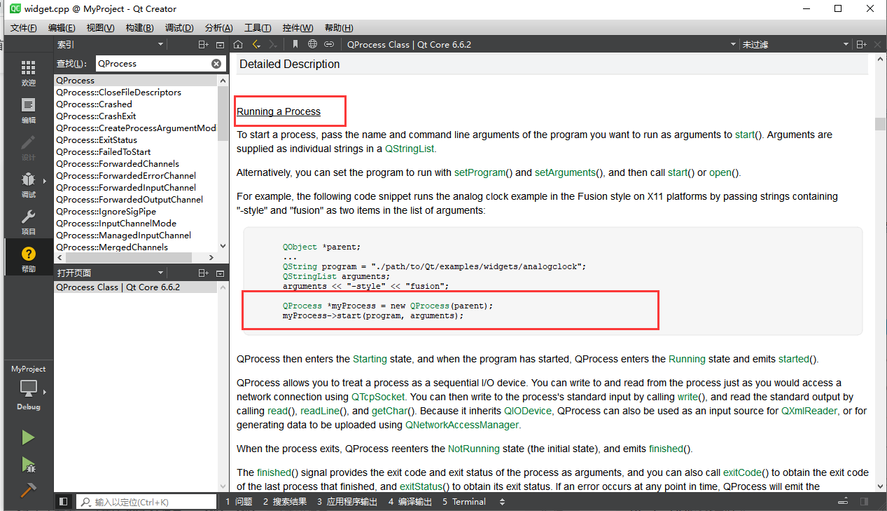
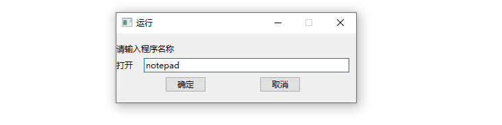
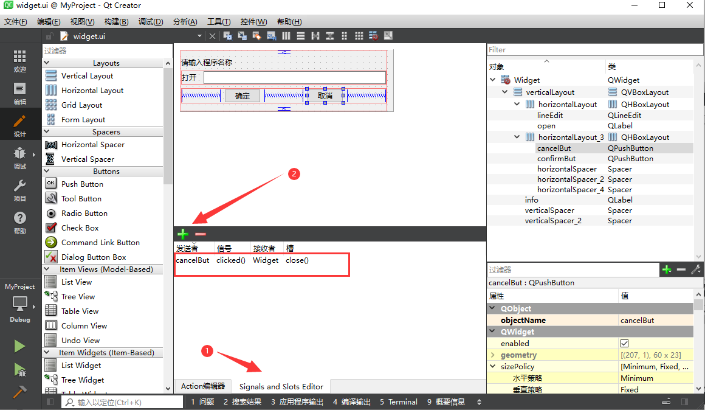
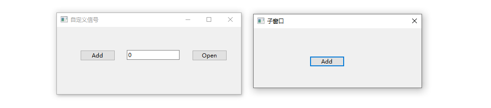

# 一、信号和槽

**信号（Signals）**：

- 信号是由Qt对象在特定情况或事件发生时自动发出的通知。例如，当用户点击一个按钮时，按钮对象会发出一个`clicked()`信号。
- 信号本身并不执行任何操作，它是事件的宣告

**槽（Slots）**：

- 槽是普通的C++成员函数，可以与信号关联；当信号被发射时，与之绑定关联的槽函数会被自动调用执行。

- 要想在信号发出时执行槽函数，则需要关联信号与槽函数。

**连接（Connect）**:

- 通过`QObject::connect()`函数，可以将一个信号与一个或多个槽关联起来。当信号被触发时，与之关联的所有槽函数将会被顺序或并发地执行（取决于连接类型）

编写槽函数以及与信号进行关联，可以通过代码的方式开发，也可以通过图形设计界面进行设计关联。

> 接下来我们先演示在UI界面上进行自动关联的方式：

→ 首先在控件上点击右键，转到槽。



→ 选择信号，这里我们选择`clicked()`单击信号。



→ 添加完成后会自动生成如下代码：

→ 所有的槽函数必须要加`slots`关键字

```cpp
// widget.h
private slots:
void on_confirmBut_clicked()
{
    
}
```

→ 接下来我们在槽函数中实现代码，完成开启一个新的进程。在帮助手册中搜索 `QProcess` 。



→ 如下代码示例，用来启动一个进程。



→ 代码实现如下：

```cpp
#include "widget.h"
#include "ui_widget.h"
#include <QProcess>

Widget::Widget(QWidget *parent)
    : QWidget(parent), ui(new Ui::Widget)
{
    // 初始化窗口
    ui->setupUi(this);
}

Widget::~Widget()
{
    delete ui;
}

void Widget::on_confirmBut_clicked()
{
    // 获取界面中LineEdit单行文件框控件中输入的文本
    QString program = ui->lineEdit->text();
    // 创建一个进程对象
    QProcess *myProcess = new QProcess(this);
    // 启动进程
    myProcess->start(program);
}
```

→ 运行项目，在文本框中输入如下内容，点击确定按钮，打开一个记事本程序。



→ 给取消按钮添加信号与槽：



# 二、信号与槽的绑定方式

## 1. 基于字符串的连接

这种方式在早期的Qt版本中使用较多，它不支持编译时检查

```cpp
QObject::connect(sender, SIGNAL(signal()), receiver, SLOT(slot()));

connect(cancelBut, SIGNAL(clicked()), this, SLOT(on_cancelBut_clicked()))
```

## 2. 使用函数的方法

>**Connect 函数：**
>**`sender`**：这是一个指向信号发送者对象的指针，它属于 `QObject` 类型。当这个对象发射特定信号时，就会触发相应的槽函数。例如，若 `sender` 是一	个 `QPushButton` 对象，当按钮被点击时，就会发射 `clicked` 信号。
>
>**`signal`**：这是一个指向信号的指针，信号本质上是特殊的成员函数。在 C++ 里，使用 `&` 来获取成员函数的地址。比如 `&QPushButton::clicked` 就	代表 `QPushButton` 类的 `clicked` 信号。
>
>**`receiver`**：这是一个指向信号接收者对象的指针，同样属于 `QObject` 类型。接收者对象包含要被调用的槽函数。
>
>**`method`**：这是一个指向槽函数的指针，槽函数也是成员函数。例如 `&Widget::on_button_clicked` 就代表 `Widget` 类中的 `on_button_clicked` 	槽函数。
>
>**`type`**：这是一个可选参数，用于指定连接类型，默认值为 `Qt::AutoConnection` 。连接类型决定了信号发射时槽函数的调用方式。常见的连接类型如   	下： `Qt::AutoConnection` ：这是默认的连接类型。如果信号发送者和接收者处于同一线程，那么使用 `Qt::DirectConnection` ；如	果处于不同线程，则使用 `Qt::QueuedConnection` 。
>	`Qt::DirectConnection` ：当信号发射时，槽函数会立即被调用，就像普通的函数调用一样。
>	`Qt::QueuedConnection` ：信号发射后，槽函数会被放入接收者所在线程的事件队列中，等接收者所在线程处理事件时再调用槽函数。
>	`Qt::BlockingQueuedConnection` ：和 `Qt::QueuedConnection` 类似，不过信号发射线程会被阻塞，直到槽函数执行完毕。这种连接类	型要求信号发送者和接收者不能处于同一线程，否则会导致死锁。

```cpp
// connect 函数原型：
QMetaObject::Connection QObject::connect
    (
    const QObject *sender, 
    PointerToMemberFunction signal, 
    const QObject *receiver, 
    PointerToMemberFunction method, 
    Qt::ConnectionType type = Qt::AutoConnection
    );
```

**这是最直观的绑定方式，直接在代码中使用函数：**

```cpp
QObject::connect(sender, &SenderClass::signal, receiver, &ReceiverClass::slot);

connect(commitBut,&QPushButton::clicked, this, &Widget::on_commitBut_clicked);
```

## 3. `Lambda` 表达式

（C++11）Qt5 引入了对 lambda 表达式的支持，可以用来定义槽函数的行为，这为处理简单逻辑提供了一种简洁的方式。

```cpp
QObject::connect(sender, &SenderClass::signal, [=]() {
// 处理逻辑
});

connect(cancelBut, &QPushButton::clicked, this, [=](){
this->close();
});
```

## 4. 使用Qt Creator的 Go To Slot 功能

虽然这不是一种编程上的绑定方式，但在Qt Creator IDE中，你可以通过右击信号并选择 “转到槽” (Go To Slot)，IDE会自动生成相应的槽函数框架代码并自动完成连接，简化了开发过程。

# 三、自定义信号

> 1. 自定义信号，可以实现在自定义的类中，根据需要定义新的信号类型，以便当特定事件发生时，能够通知并调用其他对象的槽函数。
> 2. 自定义信号的步骤包括：声明信号和发射信号。
> 3. Qt中信号与槽机制的实现需要元系统的支持，发送者和接受者需要直接或间接继承 `QObject` 类，在类定义的私有访问权限处要加上 `Q_OBJECT` 宏。

我们通过自定义信号实现数字自增功能：


## 1. 自定义信号

### 1.1 声明信号

使用`signals:`声明信号，信号可以有参数

```cpp
signals:
void change(int value);
```

### 1.2 发射信号

发射信号使用`emit`关键字。

```cpp
// 这里我们通过点击一个按钮，发射自定义的信号。
connect(ui->pushButton,&QPushButton::clicked, this, [&](){
static int num = 0;
emit change(num++);
});
```

### 1.3 连接信号和槽

```cpp
// 声明槽函数
private slots:
void on_change(int val);
// 定义槽函数
void Widget::on_change(int val)
{
ui->lineEdit->setText(QString::number(val));
}
// 连接槽函数
connect(this, &Widget::change, this,&Widget::on_change);
```

## 2. 跨窗口发射信号

> 在多窗口应用程序中，通常涉及一个窗口或对象中的信号需要被另一个窗口或对象的槽函数接收处理，从而实现跨窗口数据处理。

例如要实现如下功能，在父窗口中点击`open`按钮会打开一个子窗口，在子窗口中点击 `Add` 按钮主窗口中的计数自增。需要进行跨窗口的信号处理。



### 2.1 开发子窗口

```cpp
// 子窗口中自定义信号
signals:
void sig_send(int val);
// 发射信号
connect(ui->addBut,&QPushButton::clicked,[&](){
    static int val =0;
    emit sig_send(val++);
})
```

### 2.2 父窗口打开子窗口

```cpp
// 打开子窗口，并绑定信号和槽函数
connect(ui->openBut, &QPushButton::clicked, this, [&]()
{
Dialog dialog;
connect(&dialog, &Dialog::sig_send, [&](int val){
ui->lineEdit->setText(QString::number(val));
});
dialog.setWindowTitle("子窗口");
dialog.exec();
});
```