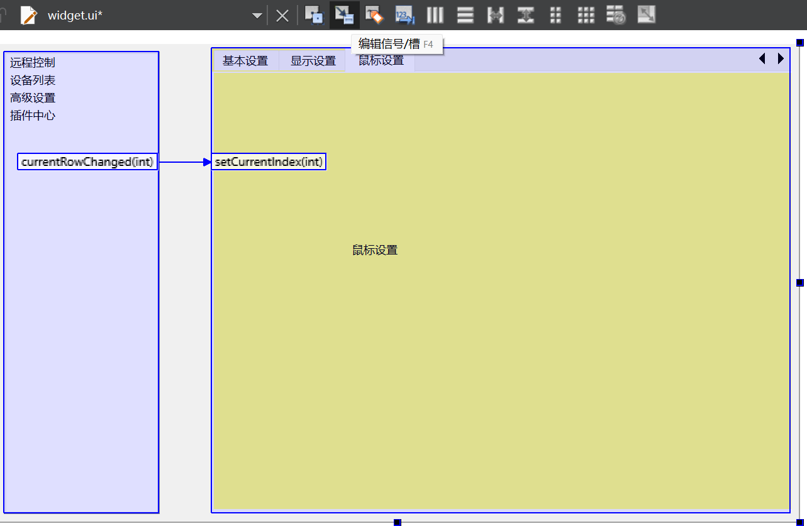
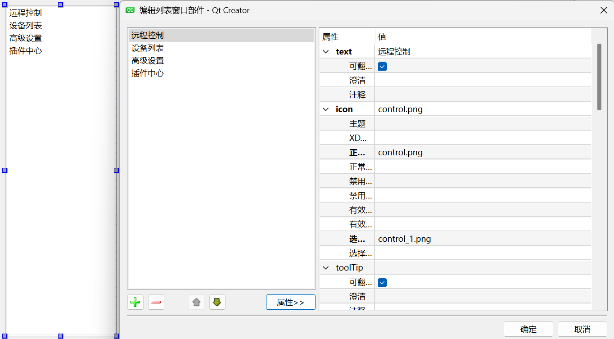
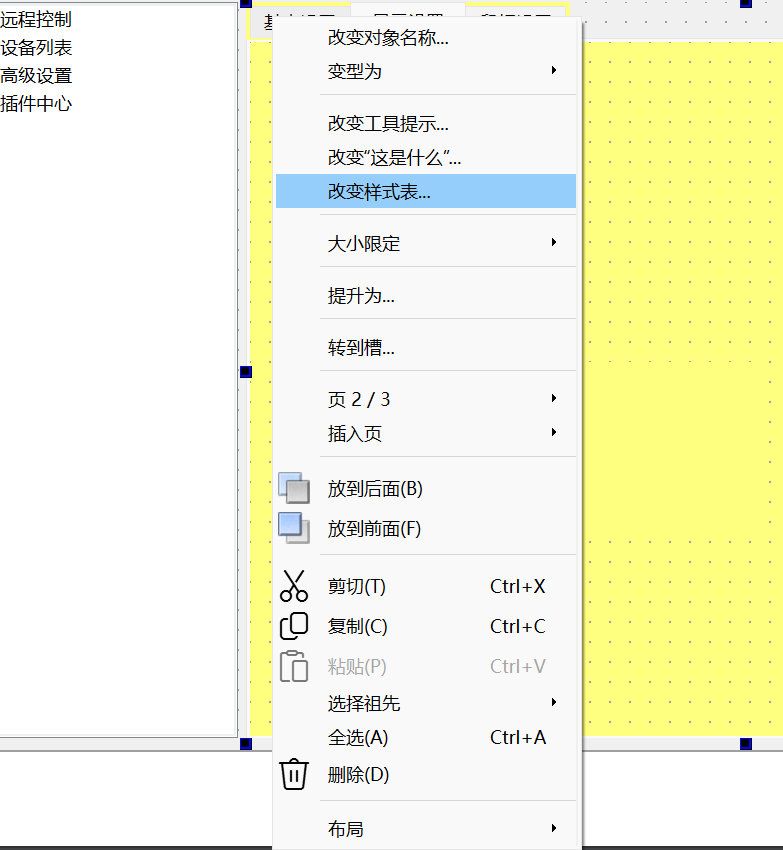
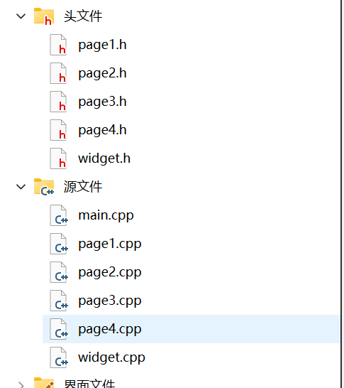
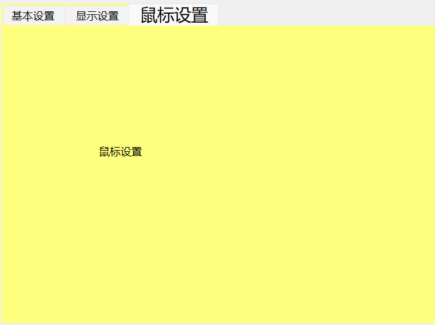
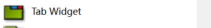
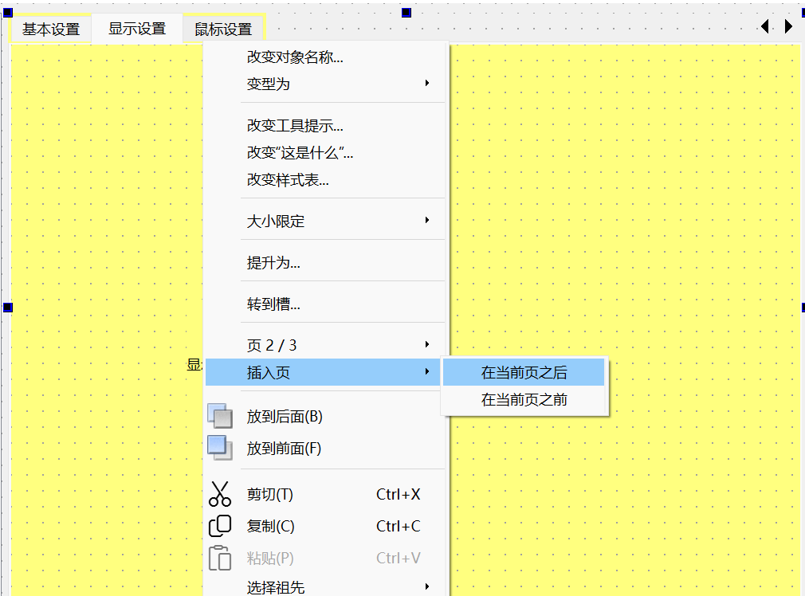

# 一、QListWidget

> `QListWidget` 列表框，主要用于展示一系列项目的列表，每个项目是一个`QListWidgetItem` 列表项对象。

`QListWidget` 通过 `addItem`, `insertItem`, `removeItem` 等方法来操作列表项。每个列表项(`QListWidgetItem`)可以设置文本及图标。

## 1、基本使用步骤

### （1）**包含头文件**

包含 `QListWidget` 的头文件。

```cpp
#include <QListWidget>
```

### （2）**创建实例**

创建一个 `QListWidget` 对象。

```cpp
// 创建一个QListWidget对象，通过传递this指针设置他所从属的父部件，
// 这样该QListWidget会受this类的管理，例如内存管理等，
// 并且可以在当前类的界面等相关场景中使用它来展示列表内容等。
QListWidget *listWidget = new QListWidget(this);
```

### （3）**添加项**

通过 `addItem` 方法添加文本项或使用 `new QListWidgetItem` 创建带有自定义数据的项。

```cpp
// 使用addItem方法添加一个QListWidgetItem类型的列表项，这里创建一个新的QListWidgetItem对象并传入文字"列表项1"作为该项内容
listWidget->addItem(new QListWidgetItem("列表项1"));

// 直接通过addItem方法传入一个字符串来创建并添加一个简单的列表项，文本内容为"列表项2"
listWidget->addItem("列表项2");
```

### （4）**自定义项**

可以为项设置图标、背景色、字体等。

```cpp
// 创建一个新的QListWidgetItem对象，后续将对其进行更多属性设置后再添加到列表中
QListWidgetItem *item3 = new QListWidgetItem;
QIcon icon;
icon.addFile(":/images/mirror_1.png");
item3->setIcon(icon);
item3->setText("列表项3");
item3->setBackground(Qt::yellow);
item3->setFont(QFont("宋体", 14, QFont::Bold));
listWidget->addItem(item3);// 将设置好各种属性的item3添加到列表部件中
```

### （5）**响应点击事件**

连接 `itemClicked` 信号到槽函数，用户单击列表项时执行操作。

```cpp

connect(listWidget,&QListWidget::itemClicked,this,&Widget::on_item_clicked);

void Widget::on_item_clicked(QListWidgetItem *item)
{
    qDebug() << item->text();
}
```

```cpp
// 使用Qt的信号与槽机制建立连接。
// 将listWidget（QListWidget类型对象）的currentRowChanged信号与statckWidget（QStackedWidget类型对象）的setCurrentIndex槽函数连接起来。
// 意味着当listWidget中当前选中行发生改变（即currentRowChanged信号被发射）时，
// 会自动触发statckWidget的setCurrentIndex槽函数，
// 通常用于实现类似列表选择与对应页面切换之类的功能，
// 比如列表中选择不同项，对应的堆叠窗口中的不同页面进行切换显示。
connect(listWidget,&QListWidget::currentRowChanged,statckWidget,&QStackedWidget::setCurrentIndex);
```

## 2、可视化设计

用 `编辑信号/槽按钮` 可以快速的将元件之间的槽函数建立起关系



`双击列表窗口控件的Item` 可以快速设置列表选项的图标文字等等



`右键对象->改变样式表` 可以快速设置QSS样式



# 二、QStackedWidget

>`QStackedWidget` 堆叠窗口主要用于多个窗口在同一位置的显示，通过函数切换当前显示的窗口控件来切换当前显示窗口控件，只有当前选中的会显示，其余的相当于被遮罩了起来

## 1、头文件

```cpp
#include <QStackedWidget>
```

## 2、创建堆叠窗口容器

```cpp
//创建堆叠容器
QStackedWidget *statckWidget = new QStackedWidget;
```

## 3、为堆叠窗口容器添加控件

可以为每一页都新建一个文件，这样添加的时候只需要添加一个对象就好了



```cpp
//把对应的Widget对象添加到堆叠窗口容器控件中
Page1 *p1  = new Page1;
Page2 *p2  = new Page2;
Page3 *p3  = new Page3;
Page4 *p4  = new Page4;
statckWidget->addWidget(p1);
statckWidget->addWidget(p2);
statckWidget->addWidget(p3);
statckWidget->addWidget(p4);

//将堆叠窗口容器控件添加到布局中
layout->addWidget(statckWidget, 4);
```

## 4、绑定槽函数

```cpp
//通过上面创建的listwidget切换选项卡时候发射的行索引信号，绑定到堆叠控件的通过索引设置当前显示页面函数上面，就可以实现点击选项卡后堆叠窗口根据选项来切换显示的页面
connect(listWidget, &QListWidget::currentRowChanged,statckWidget,&QStackedWidget::setCurrentIndex);
```

# 三、QTabWidget

> QTabWidget 选项卡组件，通过标签页的形式来组织和切换不同的界面内容，包含一个选项卡栏（QTabBar）和一个页面区域，通过点击不同的选项卡来查看不同的内容页面。其中只有一个当前选中的页面（即可见页面）是可见的，而其他页面则不可见，可以通过点击顶部的标签来切换显示不同的页面。



## 1、基本使用步骤

### （1）首先需要包含 `QTabWidget` 的头文件。

```cpp
#include <QTabWidget>
```

### （2）创建一个 `QTabWidget` 对象，并绑定到布局中

```cpp
QTabWidget *tabWidget = new QTabWidget;
indexlayout->addWidget(tabWidget);
```

### （3）通过 `addTab()` 方法添加新的标签页，传入一个 QWidget 对象作为页面内容，以及一个字符串作为标签的标题。

```cpp
// 创建一个新的QWidget对象，它将作为QTabWidget中第一个选项卡对应的页面容器，
QWidget *page1 = new QWidget;
QLabel *label1 = new QLabel("页面1", page1);
//将page1这个页面添加到tabWidget中，设置显示的标题为"选项卡1"
tabWidget->addTab(page1,"选项卡1");

//也可以直接用字符串的方法添加标签页
tabWidget->addTab(new QLabel("基本设置"), "选项卡2");
```

## 2、可视化设计



