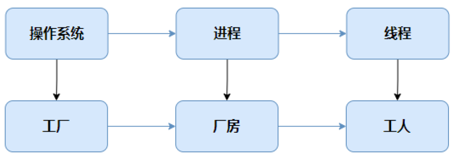
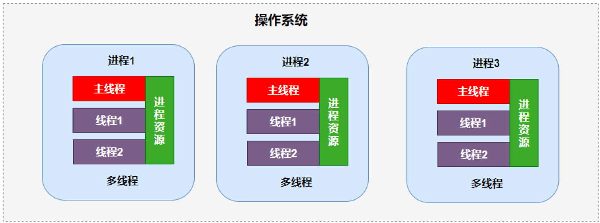
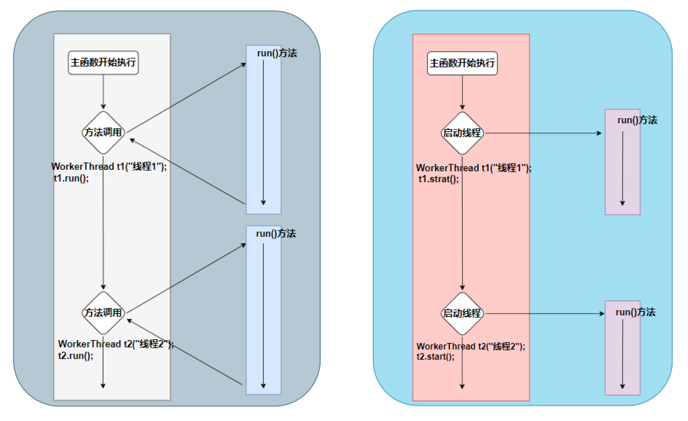

# 一、线程基础概念

线程是一种用于实现并发执行的机制。它允许程序同时执行多个任务，从而提高程序的性能和响应性。

例如：在一个图形用户界面（GUI）应用程序中，主线程通常用于处理用户界面的事件（如鼠标点击、键盘输入等），而一些执行比较耗时的操作（如文件下载、数据处理等）我们可以开启新的线程来执行这些操作，这样可以避免因为耗时操作导致界面阻塞。

## 1. 线程与进程的区别

* 进程是操作系统资源分配的基本单位，拥有独立的内存空间和系统资源。 
* 线程是CPU调度的基本单位，共享进程内存和资源。 
* 线程与进程的关系，一个进程中可以包含多个线程。

进程是操作系统中进行资源分配的基本单位；线程是CPU调度和分派任务的基本单位，用于执行进程的指令。

进程好比厂房，线程就是厂房里的工人，每个工人（线程）负责不同的任务，但都在同一个厂房（进程）的环境下工作。



## 2. 线程的概念

> 线程是进程内部的执行单元，一个进程中可以包含一个或多个线程，这些线程共享同一进程的地址空间（包括全局变量、堆等）。一个线程只能属于一个进程，一个进程中可以包含多个线程，多个线程可以共享同一进程的资源。线程的引入使得同一进程内的多个任务可以并行（或并发）执行，提高系统资源的利用率。



# 二、线程的创建

> Qt中线程的创建方式有以下几种方式：
>
> * 继承 `QThread` 类 
> * 使用 `moveToThread()` 方法 
> * 使用 `QtConcurrent::run()` 方法 
> * 使用 `QThreadPool` 线程池

## 1. 继承 `QThread` 类

> 这是最直接的方式，通过创建一个继承自 `QThread` 的类，并重写其 `run()` 方法来实现多线程。 

**实现步骤：**

1. 继承 `QThread` 类 
2. 重写父类的 `run()` 方法，在函数内部编写子线程要处理的具体业务流程 
3. 在主线程中创建子线程对象
4. 启动子线程，调用 `strart()` 方法

```cpp
// workerthread.h文件
#include <QThread>

class WorkerThread : public QThread
{
public:
    WorkerThread(QString threadName = QString());
    void run() override; 
private:
    QString threadName;
};
```

```cpp
// workerthread.cpp文件
#include "workerthread.h"
#include <QDebug>

WorkerThread::WorkerThread(QString threadName):threadName(threadName)
{}

void WorkerThread::run()
{
    for (int i = 0; i < 100; ++i) {
        qDebug() << threadName << ":" << i; 
    }
}
```

当一个线程被创建并启动后，它会被加入到操作系统的调度队列中，等待调度器分配CPU时间。操作系统的调度器（Scheduler）根据一定的策略来决定哪个线程应该获得CPU的时间片。

```cpp
// main.cpp文件
#include <QCoreApplication> 
#include "workerthread.h"

int main(int argc, char *argv[])
{
    QCoreApplication a(argc, argv);
    //启动子线程，调用strart()方法 
    WorkerThread t1("线程1"); 
    t1.start();
    WorkerThread t2("线程2"); 
    t2.start();
    for (int i = 0; i < 100; ++i) { 
        qDebug() << "主线程：" << i; 
    }
    return a.exec();
}
```

不能直接调用线程对象的run()方法，这属于方法调用。启动线程要调用start()方法。



## 2. 使用 `moveToThread()` 方法

> 这种方式更灵活，适用于需要在线程间通信的场景。通过将一个 QObject 的子类对象移动到新线程中，实现多线程。

```cpp
// work.h文件
#include <QObject>

class Work: public QObject
{
    Q_OBJECT 
public:
    Work(); 
public slots:
    void doWork();
};
```

```cpp
// work.cpp文件
#include "work.h" 
#include <QDebug> 
#include <QThread>

Work::Work() {}

void Work::doWork()
{
    qDebug() << "子线程开始执行，当前任务所在线程的Id：" << QThread::currentThreadId();
}
```

```cpp
// main.cpp文件
#include "work.h"

int main(int argc, char *argv[])
{
    Work *work = new Work;  //创建QObject的子类对象
    QThread *thread = new QThread; //创建线程对象
    work->moveToThread(thread); // 将 work对象移动到thread线程中
    QObject::connect(thread, &QThread::started, work, &Work::doWork); 
    thread->start();
    
    //work->doWork();
    qDebug() << "主线程，线程Id：" << QThread::currentThreadId();
}
```

## 3. 使用 `QtConcurrent::run()` 方法

> `QtConcurrent` 提供了高层次的并行计算接口，简化了多线程编程的复杂度。使用 `QtConcurrent::run()` 可以在单独的线程中运行函数。

```cpp
// 在单独的线程中运行函数
#include <QtConcurrent/QtConcurrent>

void doWork()
{
    for (int i = 0; i < 10; ++i) {
        qDebug() << QThread::currentThreadId() << "：" << i; 
        QThread::msleep(100);
    }
}

int main()
{
    // 在单独的线程中运行 doWork() 函数
    QFuture<void> future = QtConcurrent::run(doWork); 
    future.waitForFinished(); // 等待线程完成
    for (int i = 0; i < 10; ++i) 
    { 
        qDebug() << "主线程：" << i; 
    }
    return 0;
}
```

```cpp
// 调用类的成员函数的方法
#include <QtConcurrent/QtConcurrent> 
#include <QDebug>

class Worker 
{ 
public:
    void doWork() 
    {
        qDebug() << "子线程:" << QThread::currentThreadId(); 
    }
};

int main(int argc, char *argv[]) {
    QCoreApplication a(argc, argv);

    // 在单独的线程中运行 Worker 的 doWork 成员函数
    Worker *w = new Worker;
    auto lambda = [w]() {
        w->doWork();
    };
    QtConcurrent::run(lambda);
    future.waitForFinished();
    qDebug() << "主线程：" << QThread::currentThreadId(); 
    delete w;

    return a.exec();
}
```

## 4. 使用 `QThreadPool` 线程池

> 在高并发场景中，频繁创建和销毁线程会带来较大的性能开销。使用线程池可以预先创建一定数量的线程，并将任务分配给这些线程执行，从而提高效率。
>
> 线程池使得线程可以复用，执行完一个任务，并不被销毁，而是可以继续执行其他的任务。
>
> `QThreadPool` 有一个任务队列。当线程池中的活动线程数量达到最大线程数时，新提交的任务不会立即执行，而是会被添加到这个任务队列中。一旦线程池中有线程完成了当前任务并变为空闲状态，它就会从任务队列中取出下一个任务来执行。

**实现步骤：** 

1. 创建一个 `QRunnable` 对象，实现run()函数
2. 使用 `QThreadPool::globalInstance()->start()` 将其提交到线程池
3. 将实现 `QRunnable` 接口的任务提交到线程池执行

```cpp
// Task.h
#include <QRunnable>

class Task : public QRunnable
{
public:
    Task();
    void run() override;
};
```

```cpp
// Task.cpp
#include "task.h" 
#include <QDebug> 
#include <QThread>

Task::Task() {}

void Task::run()
{
    qDebug() << "执行任务：" << QThread::currentThreadId(); 
    QThread::sleep(1);
}
```

```cpp
// main.cpp
#include "task.h"

int main(int argc, char *argv[])
{
    QCoreApplication a(argc, argv);

    Task *t1 = new Task; 
    Task *t2 = new Task; 
    Task *t3 = new Task; 
    Task *t4 = new Task; 
    Task *t5 = new Task;

    QThreadPool pool = QThreadPool::globalInstance();
    qDebug() << "最大线程数：" << pool.maxThreadCount();
    int coreCount = QThread::idealThreadCount(); // 获取系统的核心数 
    qDebug() << "系统核心数：" << coreCount;
    pool.setMaxThreadCount(2);

    pool.start(t1); 
    pool.start(t2); 
    pool.start(t3); 
    pool.start(t4); 
    pool.start(t5);

    return a.exec();
}
```

# 三、线程安全

> 线程安全是指在多线程环境下访问和操作共享数据时，能够保证数据的一致性和完整性。如下代码中，当多线程对共享资源进行操作时，就会产生线程安全的问题。

```cpp
// Ticket.h
#include <QObject> 
#include <QThread> 
#include <QString> 

class Ticket : public QThread
{
    Q_OBJECT 
public:
    explicit Ticket(QString threadName, int &count, QObject *parent = nullptr); 
    void run() override;
private:
    QString threadName;
    int& count;
};
```

```cpp
// Ticket.cpp
#include "ticket.h" 
#include <QDebug>

Ticket::Ticket(QString threadName, int& count, QObject *parent)
    : QThread{parent}, threadName(threadName), count(count)
{
}

void Ticket::run()
{
    while (count > 0)
    {
        qDebug() << threadName << "正在买票：" << count; 
        count --;
        msleep(100);// 模拟购票间隔
    }
}
```

```cpp
// main.cpp
#include "Ticket.h"

int main(int argc, char *argv[])
{
    QCoreApplication a(argc, argv); 
    int count = 10;
    Ticket t1("窗口1", count);
    Ticket t2("窗口2", count);
    Ticket t3("窗口3", count);

    t1.start(); 
    t2.start(); 
    t3.start();

    // 等待所有线程完成 
    t1.wait();
    t2.wait();
    t3.wait();
    qDebug() << "结束";

    return app.exec();
}
```

## 1. 互斥锁（`QMutex`）

> 互斥锁（`QMutex`），用于保护共享资源，当多个线程需要访问同一共享资源时，使用 `QMutex` 确保同一时间只有一个线程能够访问资源。互斥锁如同厕所的门锁，一次只能有一个人进入使用厕所（访问共享资源）。

**互斥锁通过锁定和解锁来保护共享数据：**

* **锁定：**当一个线程调用 `mutex.lock()` 或者 `mutex.tryLock()` 成功时，该线程就获得了互斥锁的所有权，并且可以安全地访问共享资源。
* **解锁：**当线程完成对共享资源的操作后，应该调用 `mutex.unlock()` 来释放锁，允许其他等待的线程获取锁并访问共享资源。

```cpp
// Ticket.h
#include <QObject> 
#include <QThread> 
#include <QString> 
#include <QMutex>

class Ticket : public QThread
{
    Q_OBJECT 
public:
    explicit Ticket(QString threadName, int &count, QMutex& lock, QObject *parent = 
nullptr);
    void run() override; 
private:
    QString threadName; 
    int& count;
    QMutex& lock;
};
```

```cpp
// Ticket.cpp
#include "ticket.h" 
#include <QDebug>

Ticket::Ticket(QString threadName, int& count, QObject *parent)
    : QThread{parent}, threadName(threadName), count(count), lock(lock)
{
}

void Ticket::run()
{
    while (count > 0)
    {
        lock.lock();
        qDebug() << threadName << "正在买票：" << count; 
        count --;
        msleep(100);// 模拟购票间隔
        lock.unlock();
    }
}
```

```cpp
// main.cpp
#include "ticket.h"

int main(int argc, char *argv[])
{
    QCoreApplication a(argc, argv); 
    int count = 10;
    QMutex lock;
    Ticket t1("窗口1", count, lock); 
    Ticket t2("窗口2", count, lock); 
    Ticket t3("窗口3", count, lock);

    t1.start(); 
    t2.start(); 
    t3.start();

    // 等待所有线程完成 
    t1.wait();
    t2.wait();
    t3.wait();

    qDebug() << "结束";

    return app.exec();
}
```

## 2. 读写锁（`QReadWriteLock`）

* **`QReadWriteLock`类**

`QReadWriteLock` 提供了比互斥锁更灵活的控制方式，允许多个线程同时读取数据，但在写入时只允许一个线程进行操作。这对于读多写少的场景非常有用。

* **读锁：**读线程调用 `lockForRead()` 函数获取读锁，允许多个读线程同时访问共享数据。 

* **写锁：**可以通过 `lockForWrite()` 获取写锁，此时没有其他线程可以读取或写入数据。 

* 同样地，使用完毕后需要调用相应的 unlock() 方法来释放锁。

```cpp
// main.cpp
#include <QReadWriteLock>

QReadWriteLock lock;
int shareData = 10;
void read(QString threadName)
{
    for (int i = 0; i < 5; ++i) {
        lock.lockForRead(); // 获取读锁
        qDebug() << threadName << "正在读共享数据：" << shareData; 
        lock.unlock(); // 释放读锁
    }
}

void write(QString threadName)
{
    for (int i = 0; i < 5; ++i) 
    {
        lock.lockForWrite(); // 获取写锁
        shareData++;
        qDebug() << threadName << "正在写共享数据：" << shareData; 
        QThread::msleep(2000); // 模拟耗时操作
        lock.unlock(); // 释放写锁
    }
}

int main(int argc, char *argv[])
{
    QCoreApplication a(argc, argv);

    // 两个读线程并发读取数据，模拟了读操作的高并发场景 
    QtConcurrent::run(read, "Reader1");
    QtConcurrent::run(read, "Reader2");

    // 启动一个写线,一个写线程负责修改数据，展示了写操作的独占性 
    QtConcurrent::run(write, "Writer");

    return a.exec();
}
```

* **`QReadLocker`类**

`QReadLocker` 类用于在其作用域内自动获取和释放 `QReadWriteLock` 的读锁。当 `QReadLocker` 对象被创建时，它会自动调用 `QReadWriteLock` 的 `lockForRead()` 方法来获取读锁；当 `QReadLocker` 对象超出其作用域（例如，函数结束当前代码块）时，它会自动调用 `QReadWriteLock` 的 `unlock()` 方法来释放读锁。

```cpp
// main.cpp
#include <QCoreApplication> 
#include <QReadWriteLock> 
#include <QReadLocker> 
#include <QDebug>

int sharedData = 0; 
QReadWriteLock rwLock;

void readData() {
    QReadLocker locker(&rwLock);  // 自动获取读锁
    qDebug() << "Read data: " << sharedData; 
    // 当 locker 超出作用域时，自动释放读锁
}

int main(int argc, char *argv[]) {
    QCoreApplication a(argc, argv);

    QtConcurrent::run(readData); 
    
    return a.exec();
}
```

* **`QWriteLocker` 类**

`QWriteLocker` 类的工作方式与 `QReadLocker` 类似，只不过它用于在其作用域内自动获取和释放`QReadWriteLock` 的写锁。当 `WriteLocker` 对象被创建时，它会自动调用 `QReadWriteLock` 的`lockForWrite()` 方法来获取写锁；当 `QWriteLocker` 对象超出其作用域时，它会自动调用`QReadWriteLock` 的 `unlock()` 方法来释放写锁。

```cpp
// main.cpp
#include <QCoreApplication> 
#include <QReadWriteLock> 
#include <QWriteLocker> 
#include <QDebug>

int sharedData = 0; 
QReadWriteLock rwLock;

void writeData() {
    QWriteLocker locker(&rwLock);  // 自动获取写锁
    sharedData = 10;
    qDebug() << "Write data: " << sharedData; 
    // 当 locker 超出作用域时，自动释放写锁
}

int main(int argc, char *argv[]) {
    QCoreApplication a(argc, argv);

    QtConcurrent::run(writeData);

    return a.exec();
}
```

## 3. 信号量（`QSemaphore`）

`QSemaphore` 是 Qt 框架中提供的一个用于线程同步的类，它是基于信号量机制实现的。互斥锁在同一时间只允许一个线程访问共享资源，而信号量可以允许指定数量的线程同时访问共享资源。

信号量的实现原理是其内部维护了一个整数计数器，线程在访问共享资源之前，需要先获取信号量（调用 `acquire()` 方法，这会使计数器的值减 1）；使用完资源后，需要释放信号量（调用 `release()` 方法，这会使计数器的值加 1）。当计数器的值为 0 时，后续尝试获取信号量的线程就会被阻塞，直到有其他线程释放信号量。

| 函数                      | 说明                                                         |
| ------------------------- | ------------------------------------------------------------ |
| `QSemaphore(int n = 0)`   | 构造函数，用于初始化信号量的初始可用资源数量。 n ：表示信号量的初始可用资源数量，默认值为 0。 |
| `void acquire(int n = 1)` | 获取n 个信号量，信号量计数器减n 。如果当前信号量的值小于 n ，线程会阻塞，直到有足够的资源可用 |
| `void release(int n =1)`  | 释放 n 个资源，信号量的值会增加 n 。                         |

```cpp
// main.cpp
#include <QThread>

//定义信号量，初始资源数量为 2 
QSemaphore semaphore(2);

// 工作线程类
class WorkerThread : public QThread
{
public:
    void run() override {
        // 获取信号量
        semaphore.acquire();
        qDebug() << QThread::currentThreadId() << "：获取信号量";

        // 模拟工作
        QThread::sleep(5);
        // 释放信号量
        semaphore.release();
        qDebug() << QThread::currentThreadId() << "：释放信号量"; 
    }
};

int main(int argc, char *argv[])
{
    QCoreApplication a(argc, argv);

    // 同时开启多个工作线程， 只有获取到信号量的线程才能执行工作。 
    WorkerThread threads[5];
    for (auto& thread : threads) {
        thread.start();
    }

    // 等待所有线程完成
    for (auto& thread : threads) { 
        thread.wait();
    }

    return a.exec();
}
```

## 4. 条件变量(`QWaitCondition`)

`QWaitCondition` 是 Qt 提供的一个线程同步工具，用于在线程之间进行协作。它允许一个或多个线程等待某个特定条件的发生，直到其他线程显式地通知它们继续执行。`QWaitCondition` 通常与 `QMutex` 或 `QReadWriteLock` 配合使用，以确保线程安全。

```cpp
// main.cpp
#include <QCoreApplication> 
#include <QThread>
#include <QMutex>
#include <QDebug>
#include <QList>
#include <QWaitCondition>

QMutex lock;
QList<int> dataList; // 共享数据队列
QWaitCondition condition; // 条件变量
bool isProducerFinished = false; // 标志位，用于通知消费者生产是否完成

class Producer: public QThread
{
public:
    void run() override 
    {
        qDebug() << "生产者线程开始运行";
        for (int i = 0; i < 5; ++i) 
        {
            QThread::sleep(3); // 模拟生产耗时
            lock.lock();
            qDebug() << "生产者线程获取到了锁";
            dataList.append(i);
            qDebug() << "生产者生产数据：" << i;
            condition.wakeOne(); // 唤醒一个等待的消费者线程 
            lock.unlock();
        }
        lock.lock();
        isProducerFinished = true; // 标记生产完成
        condition.wakeAll(); // 唤醒所有消费者线程，通知它们可以退出 
        lock.unlock();
    }
};

class Consumer: public QThread
{
public:
    void run() override
    {
        qDebug() << "消费者线程开始运行";
        while (true) {
            lock.lock();
            qDebug() << "消费者线程获取到了锁";
            while (dataList.isEmpty()) {
                condition.wait(&lock); // 等待条件满足，释放锁并阻塞 
            }

            if (isProducerFinished) {
                lock.unlock();
                qDebug() << "消费者线程退出";
                break; // 如果生产完成且没有数据了，退出循环 
            }

            int value = dataList.takeFirst(); // 消费数据 
            qDebug() << "消费者消费数据：" << value;
            lock.unlock();
        }

    }
};

int main(int argc, char* argv[])
{
    QCoreApplication app(argc, argv);

    Producer producer; 
    Consumer consumer;

    consumer.start(); 
    producer.start();

    producer.wait(); 
    consumer.wait(); 
    return app.exec();
}
```

# 四、多线程注意事项

## 1. 子线程中不能操作UI控件

Qt创建的子线程中是不能对UI对象进行任何操作的，即 `QWidget` 及其派生类对象。每个程序在启动的时候都有一个线程，这个线程被称为“主线程”（在Qt应用里就是GUI线程）。Qt的GUI必须运行在这个线程上。

例如 `QPixmap` ，不可以在另一个线程上运行（主要是事件循环在主线程里，窗口的绘制事件，用户的输入事件等等只会在事件循环中处理）。

其他线程一般当作工作线程来使用，可以用来减少主线程的负担，处理一些其他的工作。

## 2. 选择合适的线程创建方式

通常建议使用自定义类并使用 `moveToThread` 方法的方式，而不是继承 `QThread` 的方式。这样可以更好地管理线程的生命周期和对象树，同时也更易于实现线程安全和单元测试。

## 3. 控制线程数量

在使用多线程时需要控制线程数目，避免过多的线程导致资源浪费和性能下降。可以通过Qt提供的 `QThreadPool` 类来管理线程池，从而更好地控制线程数目。

# 五、跨线程调用槽函数

> 在Qt中，跨线程调用槽函数是一种常见的线程间通信方式。由于Qt的信号和槽机制是线程安全的，因此可以通过信号和槽来实现跨线程的调用。以下是详细说明跨线程调用槽函数的方法：
>
> 1. **`QMetaObject::invokeMethod`**：直接调用槽函数，适合动态调用。
> 2. **信号和槽**：最常用的跨线程通信方式，简单且线程安全。
> 3. **`QTimer` 或事件循环**：间接调用槽函数，适合简单场景。
> 4. **`QApplication::postEvent`**：适合需要自定义事件的场景。
> 5. **`QFuture` 和 `QtConcurrent`**：适合异步任务。

## 1. 使用 `QMetaObject::invokeMethod`

`QMetaObject::invokeMethod` 是Qt提供的一个静态方法，用于在运行时调用对象的槽函数或方法。它可以确保跨线程调用的安全性。

```cpp
bool QMetaObject::invokeMethod(
    QObject* object,          // 目标对象（槽函数所属的对象）
    const char* method,       // 方法名（槽函数名）
    Qt::ConnectionType type,  // 连接类型（通常用 Qt::QueuedConnection）
    QGenericReturnArgument ret, // 返回值（可选）
    QGenericArgument val0 = QGenericArgument(nullptr), // 参数1
    QGenericArgument val1 = QGenericArgument(),        // 参数2
    ...
);
```

**示例：**假设有一个槽函数 `updateUI(const QImage& image)`，需要在子线程中调用它来更新主线程的UI：

```cpp
#include <QApplication>
#include <QThreadPool>
#include <QWidget>
#include <QLabel>
#include <QPixmap>
#include <QImage>
#include <QTimer>
#include <QMutex>
#include <QWaitCondition>
#include <QRunnable>
#include <QDebug>

class InferenceTask : public QRunnable
{
public:
    InferenceTask(QObject* receiver) : m_receiver(receiver) {}
    void run() override {
        // 模拟推理过程
        QThread::msleep(1000); // 假设推理需要1秒
        QImage image(100, 100, QImage::Format_RGB32);
        image.fill(Qt::green); // 生成一个绿色的图片
        // 将结果发送给主线程
        QMetaObject::invokeMethod(m_receiver, "updateUI", Qt::QueuedConnection, Q_ARG(QImage, image));
    }
private:
    QObject* m_receiver;
};

class MainWindow : public QWidget
{
    Q_OBJECT
public:
    MainWindow(QWidget* parent = nullptr) : QWidget(parent) {
        label = new QLabel(this);
        label->setFixedSize(100, 100);
        setFixedSize(100, 100);
        // 启动推理任务
        QThreadPool::globalInstance()->start(new InferenceTask(this));
    }
public slots:
    void updateUI(const QImage& image) {
        QPixmap pixmap = QPixmap::fromImage(image);
        label->setPixmap(pixmap);
    }
private:
    QLabel* label;
};

int main(int argc, char* argv[]) {
    QApplication app(argc, argv);

    MainWindow window;
    window.show();

    return app.exec();
}

#include "main.moc"
```

**参数说明：**

- **`Qt::QueuedConnection`**：确保槽函数在目标线程的事件循环中执行，适合跨线程调用。
- **`Q_ARG`**：用于传递参数，`Q_ARG(Type, value)`。

## 2. 使用信号和槽

Qt的信号和槽机制天然支持跨线程通信。当信号和槽连接时，如果发送信号的对象和接收槽函数的对象位于不同的线程，Qt会自动使用`Qt::QueuedConnection`，确保槽函数在接收对象的线程中执行。

**示例：**假设子线程完成推理后，需要将结果发送给主线程更新UI：

```cpp
// 主线程中
class MainWindow : public QWidget {
    Q_OBJECT
public:
    MainWindow(QWidget* parent = nullptr) : QWidget(parent) {
        // 连接信号和槽
        connect(&worker, &Worker::resultReady, this, &MainWindow::updateUI);
    }

public slots:
    void updateUI(const QImage& image) {
        QPixmap pixmap = QPixmap::fromImage(image);
        label->setPixmap(pixmap);
    }

private:
    QLabel* label;
    Worker worker; // Worker 是一个在子线程中运行的对象
};

// 子线程中
class Worker : public QObject {
    Q_OBJECT
public:
    void doWork() {
        // 模拟推理过程
        QImage image(100, 100, QImage::Format_RGB32);
        image.fill(Qt::green);

        // 发送信号
        emit resultReady(image);
    }

signals:
    void resultReady(const QImage& image);
};
```

**说明：**

- **`Qt::QueuedConnection`**：当信号和槽位于不同线程时，Qt会自动使用队列连接。
- **线程安全**：信号和槽机制是线程安全的，无需手动加锁。

## 3. 使用 `QTimer` 或事件循环

如果子线程没有直接访问主线程的对象，可以通过`QTimer`或事件循环来间接调用槽函数。

```cpp
// 子线程中
QTimer::singleShot(0, mainWindow, [mainWindow, image]() {
    mainWindow->updateUI(image);
});
```

**说明：**

- **`QTimer::singleShot`**：将调用延迟到主线程的事件循环中执行。
- 这种方式适合简单的跨线程调用。

## 4. 使 `QApplication::postEvent`

`QApplication::postEvent` 可以将事件发送到目标对象的事件队列中，适合跨线程通信。

```cpp
// 自定义事件
class ImageEvent : public QEvent {
public:
    static const QEvent::Type EventType = static_cast<QEvent::Type>(QEvent::User + 1);

    ImageEvent(const QImage& image) : QEvent(EventType), image(image) {}

    QImage image;
};

// 子线程中
QImage image(100, 100, QImage::Format_RGB32);
image.fill(Qt::green);
QApplication::postEvent(mainWindow, new ImageEvent(image));

// 主线程中
bool MainWindow::event(QEvent* event) {
    if (event->type() == ImageEvent::EventType) {
        ImageEvent* imageEvent = static_cast<ImageEvent*>(event);
        updateUI(imageEvent->image);
        return true;
    }
    return QWidget::event(event);
}
```

**说明：**

- **`QApplication::postEvent`**：将事件发送到目标对象的事件队列中。
- 适合需要自定义事件的场景。

## 5. **使用 `QFuture` 和 `QtConcurrent`**

如果使用`QtConcurrent`运行异步任务，可以通过`QFutureWatcher`来监控任务完成，并在主线程中调用槽函数。

**示例：**

```cpp
// 主线程中
QFutureWatcher<QImage>* watcher = new QFutureWatcher<QImage>(this);
connect(watcher, &QFutureWatcher<QImage>::finished, this, [this, watcher]() {
    QImage image = watcher->result();
    updateUI(image);
});

// 启动异步任务
QFuture<QImage> future = QtConcurrent::run([]() {
    QImage image(100, 100, QImage::Format_RGB32);
    image.fill(Qt::green);
    return image;
});
watcher->setFuture(future);
```

**说明：**

- **`QtConcurrent`**：用于运行异步任务。
- **`QFutureWatcher`**：用于监控任务完成并触发槽函数。

