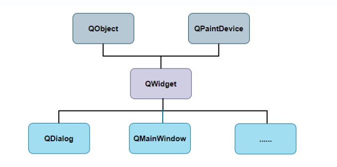

# 一、窗口类部件

窗口就是没有父部件的部件，所以又称顶级部件。窗口类主要包括基本窗口类QWidget、对话框类QDialog和主窗口类QMainWindow三种。



QObject是Qt框架中的一个核心基类，它提供了对象模型和信号槽机制。而QPaintDevice及其子类则提供了绘制和显示内容的功能。`要使用他的功能必须在自定义类声明时候加上该关键字`！

## 1、QObject类

**QObject类是所有Qt类的基类**，它提供了对象模型和信号槽机制。任何对象要实现信号与槽机制，都必须使用Q_OBJECT宏。因此不管是否真正用到信号与槽机制，最好在所有QObject子类中都使用Q_OBJECT宏，避免出现不必要的错误。

```cpp
class MainWindow : public QMainWindow
{
    Q_OBJECT//要使用他的功能必须在窗口类的声明时候加上该关键字
public:
    MainWindow(QWidget *parent = nullptr);
    ~MainWindow();
private slots:
private:
    Ui::MainWindow *ui;
};
```

## 2、QWidget

**基本窗口类**是Qt 中所有用户界面对象的基类，是最基本的可视元素。可以作为一个独立的窗口（顶级窗口部件）存在，或者作为另一个 QWidget 的子部件（嵌入式窗口部件）。

没有划分菜单、工具栏、状态栏、主窗口 等区域。

## 3、QMainWindow

是 QWidget的子类（QWidget 是 QtWidgets 的子类），包含菜单栏，工具栏，状态栏，标题栏等，中间部分则为主窗口区域。

## 4、QDialog

是 QWidget 的子类，用于与用户进行简短交互，如确认操作。**对话框**在外观上和基本窗口相似。通常由标题栏、客户区、边框组成，标题栏上有关闭按钮。

# 二、基本窗口类QWidget

QWidget类是所有用户界面类的基类，也是所有可视组件（窗口部件）的基类，所有的窗口、按钮、标签、文本框等控件都是直接或间接从`QWidget`派生而来。

* 既可以作为独立窗口存在，也可以作为另一个窗口部件的子部件嵌入其中。
* 通常用于创建不带特定框架结构（如菜单栏、工具栏）的窗口或自定义界面组件。

创建QWidget窗口的代码示例：

```cpp
#include "widget.h"

#include <QApplication>
#include <QWidget>
#include <Qdebug>

int main(int argc, char *argv[])
{
	QApplication a(argc, argv); //GUI程序对象
	QWidget w;//窗口实例对象
	w.setWindowTitle("这里是标题");//设置标题
	w.resize(300,200);//设置用户区的大小
	w.move(500,500);//移动窗口的位置
	w.setCursor(Qt::UpArrowCursor);//设置光标为向上箭头（光标枚举常量）
	w.show();//绘制窗口
	return a.exec();//启动程序事件监听
}
```

# 三、主窗口类QMainWindow

QMainWindow类的实例是一个可以设置菜单栏、工具栏、状态栏的主应用程序窗口。主要组成部分：

1. **菜单栏 (Menu Bar)**: 位于窗口顶部，通常包含多个菜单。
2. **工具栏 (Toolbars)**: 可以放置在窗口的顶部、底部或两侧，包含常用的按钮和控件。
3. **状态栏 (Status Bar)**: 位于窗口底部，显示一些临时信息或状态。
4. **中心窗口部件 (Central Widget)**: 位于主窗口的中央区域，可以放置任何 QWidget 子类的实例。这个中心窗口部件可以有自己的布局。

```cpp
int main(int argc, char *argv[])
{
    QApplication a(argc, argv);
    QMainWindow w;
    w.setWindowTitle("主窗口");
    QMenuBar *bar = w.menuBar();
    bar->addMenu("文件");
    bar->addMenu("编辑");
    bar->addMenu("视图");
    bar->addMenu("构建");
    bar->addMenu("调试");
    w.statusBar()->showMessage("状态栏信息");
    w.show();
    return a.exec();
}
```

# 四、对话框类QDialog

对话框窗口的基类，用于创建**模态或非模态的对话框窗口**。对话框是与用户进行简短交互的顶层窗口，通常用于显示消息或执行一些临时性的任务。

- **模态对话框**：在模态对话框打开时，它会阻塞其父窗口或整个应用程序，直到用户关闭对话框。这意味着用户必须先处理对话框中的任务，才能继续与应用程序的其他部分交互。
- **非模态对话框**：非模态对话框则不会阻止用户与其父窗口或其他窗口的交互，它独立于主窗口运行，允许用户同时操作多个窗口。

```cpp
int main(int argc, char* argv[])
{
    QApplication a(argc, argv);

    QDialog d;
    d.setWindowTitle("对话框");
    d.setModal(true); // 以模态形式显示，对话框关闭前无法切换到基本窗口
    d.resize(200, 100);
    d.show();

    QWidget w;
    w.setWindowTitle("基本窗口");
    w.show();

    return a.exec();
}
```