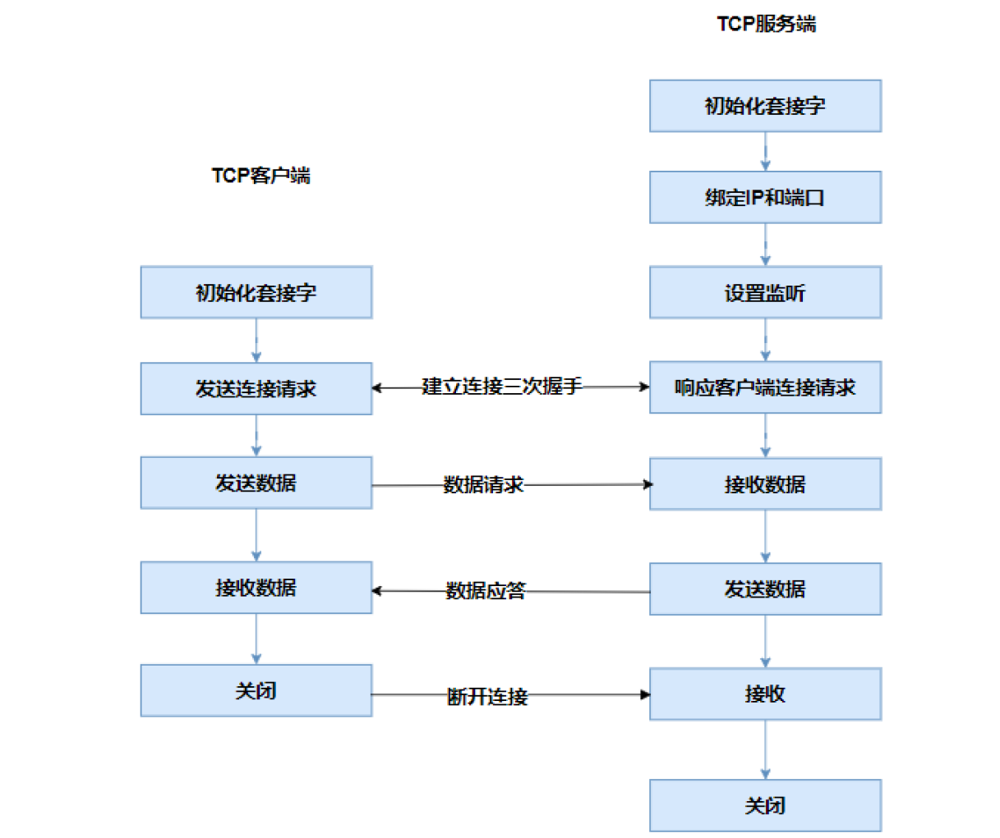

# 一、QT网络编程

Qt 提供了强大的网络编程支持，主要通过 `QtNetwork` 模块实现，支持 TCP、UDP、HTTP 等协议，并且 可以跨平台使用。涉及的核心类包括 

* `QTcpSocket` 和 `QTcpServer`

  * `QTcpSocket` 类用于实现 TCP网络通信的功能，允许应用程序通过 TCP 协议发送和接收数据。

  * `QTcpServer` 类用于实现 TCP 服务器的功能，监听特定的端口并接受客户端的连接请求。

* `QUdpSocket`
  * `QUdpSocket` 类用于实现 UDP 协议的通信，支持广播和多播功能。相比 TCP，UDP 更加简单，但不保证数据包的顺序或可靠性。 

* `QHostAddress`
  * `QHostAddress` 类表示一个 IP 地址（IPv4 或 IPv6），可用于指定服务器地址或绑定本地地址。

# 二、TCP与UDP的区别

`TCP`（传输控制协议）和 `UDP`（用户数据报协议）是两种最常用的网络通信协议，主要区别如下：

* TCP 是一种面向连接的协议，数据传输之前，必须先建立一个连接（通过三次握手），并在传输完成后断开连接。
* TCP 提供了确认机制、重传机制以及序列号来确保数据包能够按顺序无误地到达接收端。如果某个数据包丢失或损坏，它会被重新发送。
* UDP 是一种无连接的协议，因此不需要事先建立连接就可以发送数据， 更加轻量级和快速。
* UDP 不提供任何确认机制或重传机制，这意味着数据包可能会丢失、重复或者失序。然而，对于某些实时性要求较高的应用来说，这种“不可靠”可能是可以接受的。


TCP 适用于需要保证数据完整性的应用，如文件传输、电子邮件、Web 浏览等。UDP 通常用于对速度要求高于准确性的情况，比如视频会议、在线游戏、VoIP（语音通过互联网协议）等。

# 三、QT的TCP通信

## 1. TCP编程模型

**TCP编程模型主要分为以下几个阶段：**

* **TCP客户端：**加载套接字库，创建套接字，设置套接字选项。 

* **TCP服务端：**同样需要加载套接字库，创建套接字，设置套接字选项。

2. **绑定阶段**

* **TCP服务端：**将套接字绑定到特定的IP地址和端口号上，使其能够监听该地址和端口的连接请求。

3. **监听阶段**

* **TCP服务端：**设置套接字进入监听状态，等待客户端的连接请求。 

4. **连接建立阶段**

* **TCP客户端：**向服务端发送连接请求。 

* **TCP服务端：**响应客户端的连接请求，完成三次握手过程，建立可靠的TCP连接。

5. **数据传输阶段**

* **TCP客户端：**发送数据请求给服务端。

* **TCP服务端：**接收客户端发送的数据请求。 

* **TCP服务端：**根据客户端的请求进行处理，发送数据响应给客户端。 

* **TCP客户端：**接收服务端发送的数据响应。

6. **连接关闭阶段**

* **TCP客户端：**发送断开连接的请求。

* **TCP服务端：**接收客户端的断开连接请求，完成四次挥手过程，关闭连接。 

* **TCP服务端：**在完成数据传输和连接关闭后，关闭套接字，释放相关资源。 

* **TCP客户端：**同样在完成数据传输和连接关闭后，关闭套接字，释放相关资源。



## 2. 使用 `QTcpServer` 实现 TCP 服务器

涉及的核心类有两个: `QTcpServer` 和 `QTcpSocket`：

### 2.1 `QTcpServer`

`QTcpServer` 类用于监听来自客户端的连接请求，并管理多个客户端连接。每个新的客户端连接都会创建一个新的 `QTcpSocket` 对象。

| 函数及信号                                  | 说明                                                         |
| ------------------------------------------- | ------------------------------------------------------------ |
| `listen(const QHostAddress&, quint16 port)` | 绑定指定的IP端口，并开始监听。                               |
| `nextPendingConnection()`                   | 从系统中获取一个已经建立好的`tcp`连接。返回一个`QTcpSocket`对象，通过这个`socket`对象完成和客户端之间的通信。 |
| `newConnection`                             | 信号，当有新的客户端建立连接成功后触发。                     |

### 2.2 `QTcpSocket`

`QTcpSocket` 是实现TCP客户端的核心类，允许应用程序连接到远程主机并发送或接收数据。它支持异步事件处理，通过信号与槽机制( 如 `readyRead()` 和 `connected()` )进行通信。

| 函数及信号                 | 说明                                                         |
| -------------------------- | ------------------------------------------------------------ |
| `readAll()`                | 读取当前接收缓冲区的数据，返回 `QByteArray` 对象。           |
| `write(const QByteArray&)` | 把数据写入 `socket` 中。                                     |
| `deleteLater()`            | 暂时把 `socket` 对象标记为无效，Qt会在下一个事件循环中析构释放该对象。 |
| `readyRead`                | 信号，有数据到达并准备就绪时触发。                           |
| `disconnected`             | 信号，连接断开时触发。                                       |

### 2.3 TCP服务器实验

```cpp
// MainWindow.h
#ifndef MAINWINDOW_H 
#define MAINWINDOW_H

#include <QMainWindow> 
#include <QTcpServer> 
#include <QTcpSocket>

QT_BEGIN_NAMESPACE 
namespace Ui { 
class MainWindow;
}
QT_END_NAMESPACE

class MainWindow : public QMainWindow
{
    Q_OBJECT

public:
    MainWindow(QWidget *parent = nullptr);
    ~MainWindow();

private slots:
    void on_pushButton_start_clicked();
    void on_pushButton_send_clicked();

private:
    Ui::MainWindow *ui; 
    QTcpServer *server; 
    QTcpSocket *socket;
};
#endif // MAINWINDOW_H
```

```cpp
// MainWindow.cpp
#include "mainwindow.h" 
#include "ui_mainwindow.h" 

#include <QHostAddress> 
#include <QTcpSocket>

MainWindow::MainWindow(QWidget *parent)
    : QMainWindow(parent)
    , ui(new Ui::MainWindow)
{
    ui->setupUi(this);
    this->setWindowTitle("服务端");
    ui->pushButton_send->setEnabled(false); 
    //创建QTcpServer对象用于监听客户端的连接
    server = new QTcpServer(this);

    // 当有新的客户端连接时触发的槽函数
    connect(server, &QTcpServer::newConnection, this, [=](){
        // 获取与客户端通信的套接字
        socket = server->nextPendingConnection();

        // 当收到客户端发送的数据时触发的槽函数
        connect(socket, &QTcpSocket::readyRead, this, [=](){ 
            QByteArray data = socket->readAll();
            ui->textEdit_record->append("客户端：" +data);
        });

        // 当客户端断开连接时触发的槽函数
        connect(socket, &QTcpSocket::disconnected, this, [=]() 
                {
            socket->close(); // 关闭套接字
            socket->deleteLater();// 删除套接字对象以释放资源
            ui->statusbar->showMessage("连接断开");
            ui->pushButton_send->setEnabled(false);
        });
        ui->statusbar->showMessage("连接成功");
        ui->pushButton_send->setEnabled(true);
    });
}

MainWindow::~MainWindow()
{
    delete ui;
}

void MainWindow::on_pushButton_start_clicked()
{
    // 获取用户在输入框中输入的端口号，并转换为整数
    int port = ui->lineEdit_port->text().toInt(); 
    // 开始监听指定端口的所有IP地址的连接请求
    server->listen(QHostAddress::Any, port);
    // 禁用开始按钮，避免重复启动监听
    ui->pushButton_start->setEnabled(false);
}

void MainWindow::on_pushButton_send_clicked()
{
    QString msg = ui->plainTextEdit_data->toPlainText(); 
    // 将消息转换为UTF-8编码并发送给客户端
    socket->write(msg.toUtf8());
    ui->textEdit_record->append("服务端：" + msg);
}
```

## 3. 使用 `QTcpSocket` 实现 TCP 客户端

```cpp
// MainWindow.h
#ifndef MAINWINDOW_H 
#define MAINWINDOW_H

#include <QMainWindow> 
#include <QTcpSocket>

QT_BEGIN_NAMESPACE 
namespace Ui { 
class MainWindow;
}
QT_END_NAMESPACE

class MainWindow : public QMainWindow
{
    Q_OBJECT

public:
    MainWindow(QWidget *parent = nullptr);
    ~MainWindow();

private slots:
    void on_pushButton_clicked();

    void on_pushButton_send_clicked();

    void on_pushButton_close_clicked();

private:
    Ui::MainWindow *ui;
    QTcpSocket *socket;
};
#endif // MAINWINDOW_H
```

```cpp
// MainWindow.cpp
#include "mainwindow.h" 
#include "ui_mainwindow.h"

MainWindow::MainWindow(QWidget *parent)
    : QMainWindow(parent)
    , ui(new Ui::MainWindow)
{
    ui->setupUi(this);
    this->setWindowTitle("客户端");
    ui->pushButton_close->setEnabled(false); 
    ui->pushButton_send->setEnabled(false);

    //创建网络通信的套接字对象
    socket = new QTcpSocket(this);
    //当套接字对象有数据可以读取时触发readyRead信号
    connect(socket, &QTcpSocket::readyRead, this, [=](){
        // 读取所有数据
        QByteArray data = socket->readAll();
        ui->textEdit_record->append("服务器：" + data);
    });
    // 当套接字与服务器断开连接时触发disconnected信号
    connect(socket, &QTcpSocket::disconnected, this, [=](){ 
        socket->close();
        ui->statusbar->showMessage("连接断开");
        ui->pushButton_close->setEnabled(false);
        ui->pushButton->setEnabled(true);
        ui->pushButton_send->setEnabled(false);
    });
    //当套接字与服务器连接成功时触发connected信号
    connect(socket, &QTcpSocket::connected, this, [=](){
        ui->statusbar->showMessage("连接成功");
        ui->pushButton_close->setEnabled(true);
        ui->pushButton->setEnabled(false);
    });
}

MainWindow::~MainWindow()
{
    delete ui;
}
//打开连接
void MainWindow::on_pushButton_clicked()
{
    QString ip = ui->lineEdit_ip->text();
    int port = ui->lineEdit_port->text().toInt();
    socket->connectToHost(QHostAddress(ip), port);
}

//发送数据
void MainWindow::on_pushButton_send_clicked()
{
    QString msg = ui->plainTextEdit_data->toPlainText(); 
    socket->write(msg.toUtf8());
    ui->textEdit_record->append("客户端：" + msg);
}
//断开连接
void MainWindow::on_pushButton_close_clicked()
{
    ui->pushButton_close->setEnabled(false); 
    ui->pushButton->setEnabled(true);
    socket->close();
}
```

# 四、基于多线程实现TCP通信

## 1. 客户端开发

### 1.1 工作类用于实现耗时任务

```cpp
// work.h
#ifndef WORKER_H 
#define WORKER_H

#include <QObject> 
#include <QTcpSocket>

class Worker : public QObject
{
    Q_OBJECT 
public:
    explicit Worker(QObject *parent = nullptr); 
    //连接服务器
    void connectServer(QString ip, int port);
    //发送文件
    void sendFile(QString filePath);
signals:
    void connectSuccess();
    void connectClose();
    void currentPercent(int percent);
private:
    QTcpSocket *socket;
};

#endif // WORKER_H
```

```cpp
// work.cpp
#include "worker.h" 
#include <QFile> 
#include <QFileInfo>

// Worker 的构造函数 
Worker::Worker(QObject *parent)
    : QObject{parent}  
{
}

// 连接服务器的方法
void Worker::connectServer(QString ip, int port)
{
    socket = new QTcpSocket(this);  // 创建一个 QTcpSocket 对象用于网络通信

    // 尝试连接到指定的 IP 地址和端口号
    socket->connectToHost(QHostAddress(ip), port);

    // 当连接成功时触发的槽函数
    connect(socket, &QTcpSocket::connected, this, &Worker::connectSuccess);

    // 当连接断开时触发的槽函数
    connect(socket, &QTcpSocket::disconnected, this, [=]() { 
        socket->close();  // 关闭套接字
        socket->deleteLater();  // 删除套接字对象以释放资源

        emit connectClose();  // 发射信号，通知主线程连接已关闭 
    });
}

// 发送文件的方法
void Worker::sendFile(QString filePath)
{
    QFile file(filePath);  // 创建一个 QFile 对象表示要发送的文件 
    QFileInfo info(filePath);  // 获取文件信息（如大小）
    int fileSize = info.size();  // 获取文件大小

    file.open(QFile::ReadOnly);  // 以只读模式打开文件

    // 循环读取文件内容并发送
    while (!file.atEnd())  // 判断文件是否已经读取完毕
    {
        static int num = 0;  // 静态变量，记录已发送的字节数

        if (num == 0)  // 如果是第一次发送数据
        {
            // 先发送文件大小（4 字节整数），发给服务器端用来确定文件传输什么时候完成（文件大小）。 
            //第一个参数是一个指向数据缓冲区的指针（类型为 const char*），表示要发送的数据
            //第二个参数是要发送的字节数。
            socket->write((char*)&fileSize, 4);
        }

        QByteArray line = file.readLine();  // 每次读取一行数据 
        num += line.size();  // 累加已发送的字节数

        // 计算当前传输进度百分比
        int percent = (num * 100 / fileSize);

        // 发射信号，通知主线程更新进度条 
        emit currentPercent(percent);

        // 发送当前读取的数据行 
        socket->write(line); 
    }
}
```

### 1.2 窗口类开发

```cpp
// MainWindow.h
#ifndef MAINWINDOW_H
#define MAINWINDOW_H

#include <QMainWindow>

QT_BEGIN_NAMESPACE 
namespace Ui { 
class MainWindow;
}
QT_END_NAMESPACE

class MainWindow : public QMainWindow
{
    Q_OBJECT

public:
    MainWindow(QWidget *parent = nullptr);
    ~MainWindow();

private slots:
    void on_pushButton_connect_clicked();
    void on_pushButton_file_clicked(); 
    void on_pushButton_send_clicked();

signals:
    void startConnect(QString ip, int port);
    void sendFile(QString filePath); 
private:
    Ui::MainWindow *ui;
};
#endif // MAINWINDOW_H
```

```cpp
// MainWindow.cpp
#include "mainwindow.h" 
#include "ui_mainwindow.h" 
#include <QThread> 
#include "worker.h" 
#include <QFileDialog>

MainWindow::MainWindow(QWidget *parent)
    : QMainWindow(parent)
    , ui(new Ui::MainWindow)
{
    ui->setupUi(this);
    ui->progressBar->setRange(0, 100); 
    ui->progressBar->setValue(0);

    QThread *thread = new QThread; 
    Worker *worker = new Worker;
    worker->moveToThread(thread);

    // 连接信号和槽：当主窗口发出 startConnect 信号时，调用 Worker 的 connectServer 方法 
    connect(this, &MainWindow::startConnect, worker, &Worker::connectServer);

    //处理子线程中发射的信号
    connect(worker, &Worker::connectSuccess, this, [=](){ 
        ui->statusbar->showMessage("连接成功");
        });

    // 当子线程中的连接关闭时触发
    connect(worker, &Worker::connectClose, this, [=](){ 
        ui->statusbar->showMessage("连接关闭");
        // 停止线程并释放资源
        thread->quit();// 请求线程退出
        thread->wait();// 等待线程完全退出
        worker->deleteLater(); // 删除工作对象
        thread->deleteLater();// 删除线程对象
    });

    // 连接信号和槽：当主窗口发出 sendFile 信号时，调用 Worker 的 sendFile 方法 
    connect(this, &MainWindow::sendFile, worker, &Worker::sendFile);

     // 连接信号和槽：当子线程更新传输进度时，更新进度条的值
    connect(worker, &Worker::currentPercent, ui->progressBar, &QProgressBar::setValue);
    thread->start();
}

MainWindow::~MainWindow()
{
    delete ui;
}
//连接服务器
void MainWindow::on_pushButton_connect_clicked()
{
    QString ip = ui->lineEdit_ip->text();
    int port = ui->lineEdit_port->text().toInt(); 
    // 发射信号，通知子线程开始连接服务器
    emit startConnect(ip, port);
}

//选择文件
void MainWindow::on_pushButton_file_clicked()
{
    QString filePath = QFileDialog::getOpenFileName(this, "选择文件"); 
    if (filePath.isEmpty())
    {
        return;
    }
    ui->lineEdit_file->setText(filePath);
}

//发送文件
void MainWindow::on_pushButton_send_clicked()
{
    // 发射信号，通知子线程发送文件
    emit sendFile(ui->lineEdit_file->text());
}
```

## 2. 服务端开发

### 2.1 创建接收文件的线程类

```cpp
// recvfile.h
#ifndef RECVFILE_H 
#define RECVFILE_H

#include <QObject> 
#include <QThread> 
#include <QTcpSocket>

class RecvFile : public QThread
{
    Q_OBJECT 
public:
    explicit RecvFile(QTcpSocket *socket, QObject *parent = nullptr); 
    void run() override;
signals:
    void over();
private:
    QTcpSocket *socket;
};

#endif // RECVFILE_H
```

```cpp
// recvfile.cpp
#include "recvfile.h" 
#include <QFile>

RecvFile::RecvFile(QTcpSocket *socket, QObject *parent)
    : QThread{parent}, socket(socket)  
{
   
}

// 线程运行时执行的任务 
void RecvFile::run()
{
    // 创建一个 QFile 对象用于保存接收到的文件 
    QFile *file = new QFile("recv.txt");

    // 以只写模式打开文件
    file->open(QFile::WriteOnly);

    // 当套接字有数据可读时触发的槽函数
    connect(socket, &QTcpSocket::readyRead, this, [=]() { 
        static int count = 0;  // 静态变量，记录已接收的字节数 
        static int total = 0;  // 静态变量，记录文件总大小

        if (count == 0)  // 如果是第一次接收数据
        {
            // 先读取文件大小（4 字节整数）
            //第一个参数是一个指向缓冲区的指针（类型为 char*），用于存储从套接字中读取的数据。
            //第二个参数是需要读取的最大字节数。
            socket->read((char*)&total, 4); 
        }

        // 读取当前所有可用数据
        QByteArray data = socket->readAll();

        // 累加已接收的字节数
        count += data.size();

        // 将接收到的数据写入文件 
        file->write(data);

        // 判断是否已接收完所有数据
        if (count == total)
        {
            socket->close();  // 关闭套接字
            socket->deleteLater();  // 删除套接字对象以释放资源 
            file->close();  // 关闭文件
            file->deleteLater();  // 删除文件对象以释放资源
            emit over();  // 发射信号，通知主线程文件接收完成 
        }
    });
    exec();  // 启动事件循环，使线程能够持续监听信号
}
```

### 2.2 窗口类开发

```cpp
// MainWindow.h
#ifndef MAINWINDOW_H 
#define MAINWINDOW_H

#include <QMainWindow> 
#include <QTcpServer> 
#include <QTcpSocket>

QT_BEGIN_NAMESPACE 
namespace Ui { 
class MainWindow;
}
QT_END_NAMESPACE

class MainWindow : public QMainWindow
{
    Q_OBJECT

public:
    MainWindow(QWidget *parent = nullptr);
    ~MainWindow();

private slots:
    void on_pushButton_clicked();

private:
    Ui::MainWindow *ui;
    QTcpServer *server; 
    QTcpSocket *socket;
};
#endif // MAINWINDOW_H
```

```cpp
// MainWindow.cpp
#include "mainwindow.h" 
#include "ui_mainwindow.h" 
#include "recvfile.h"

// MainWindow 的构造函数 
MainWindow::MainWindow(QWidget *parent)
    : QMainWindow(parent) 
    , ui(new Ui::MainWindow) 
{
    ui->setupUi(this); 

    server = new QTcpServer(this);  // 创建一个 QTcpServer 对象用于监听客户端连接

    // 当有新的客户端连接时触发的槽函数
    connect(server, &QTcpServer::newConnection, this, [=]() {
        socket = server->nextPendingConnection();  // 获取与客户端通信的套接字

        // 创建一个新的 RecvFile 线程对象，用于接收文件 
        RecvFile *thread = new RecvFile(socket);

        thread->start();  // 启动线程以开始接收文件

        // 当文件接收完成时触发的槽函数
        connect(thread, &RecvFile::over, this, [=]() {
            thread->exit();  // 请求线程退出
            thread->wait();  // 等待线程完全退出
            thread->deleteLater();  // 删除线程对象以释放资源
            ui->statusbar->showMessage("文件接收完成");  // 在状态栏显示文件接收完成信息 
        });
    });
}

MainWindow::~MainWindow()
{
    delete ui;  
}

// 开始监听按钮的槽函数
void MainWindow::on_pushButton_clicked()
{
    int port = ui->lineEdit->text().toInt();  // 获取用户输入的端口号并转换为整数 
    server->listen(QHostAddress::Any, port);  // 监听指定端口
}
```

