# 一、STM32+VSCode+CMake 开发环境简介

> **本开发环境的优势：**
>
> 1. 使用全开源工具链，没有版权纠纷
> 1. 使用VSCode编辑代码，编辑体验良好
> 1. Ninja构建工程，构建速度飞快
> 1. CMake组织工程，自由度很高
> 1. GCC编译器开源且免费，网上资料很多
> 1. OpenOCD + Cortex-Debug 烧录调试一次性解决，支持实时查看变量，查看寄存器，调试RTOS，显示 J-Link-RTT 调试信息、运行时修改变量
> 1. 初始化配置代码可使用CubeMX一键生成 ，省去手动搭建模版工程的繁琐


# 二、工具链安装

## 2.1 CMake

> [Download CMake](https://cmake.org/download/)
>
> 1. 打开官网下载最新版本的二进制文件，选择 windows-x86_64 版本的.zip文件
> 2. 解压到自己想要的路径

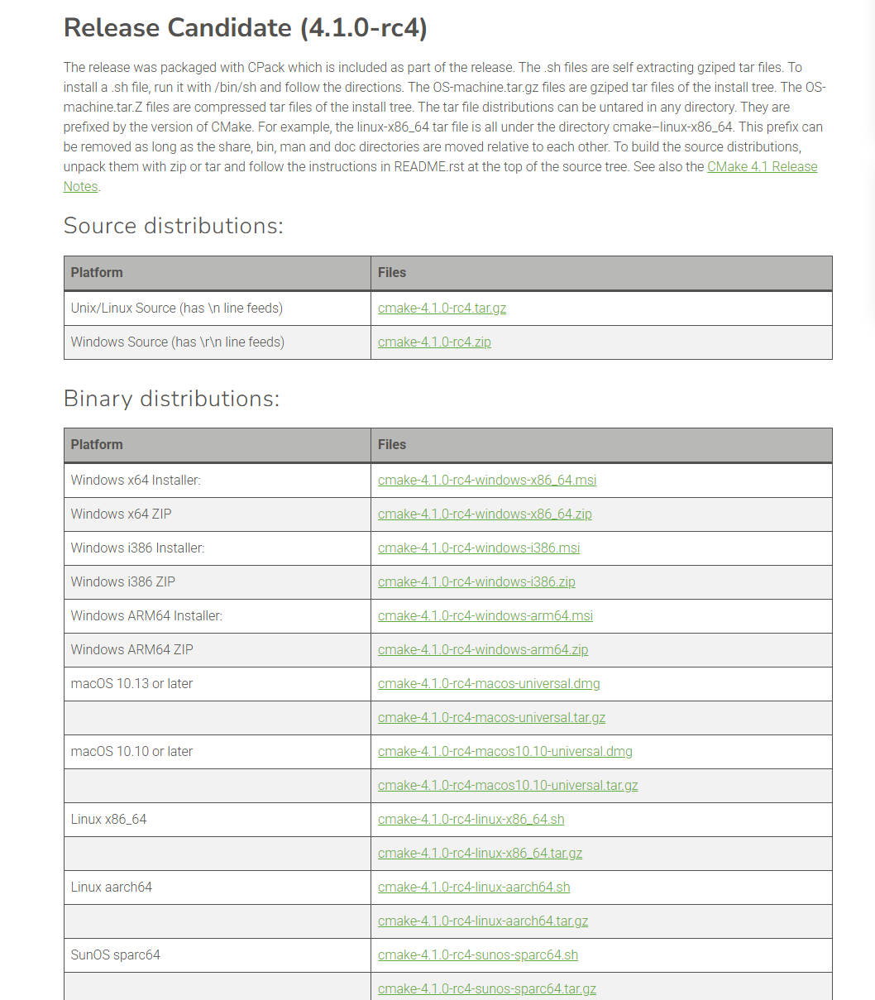

## 2.2 Ninja

> [Releases · ninja-build/ninja](https://github.com/ninja-build/ninja/releases)
>
> 1. 打开Ninja的官方github仓库下载最新版本的文件，选择 win 版本的.zip文件
> 2. 解压到自己想要的路径

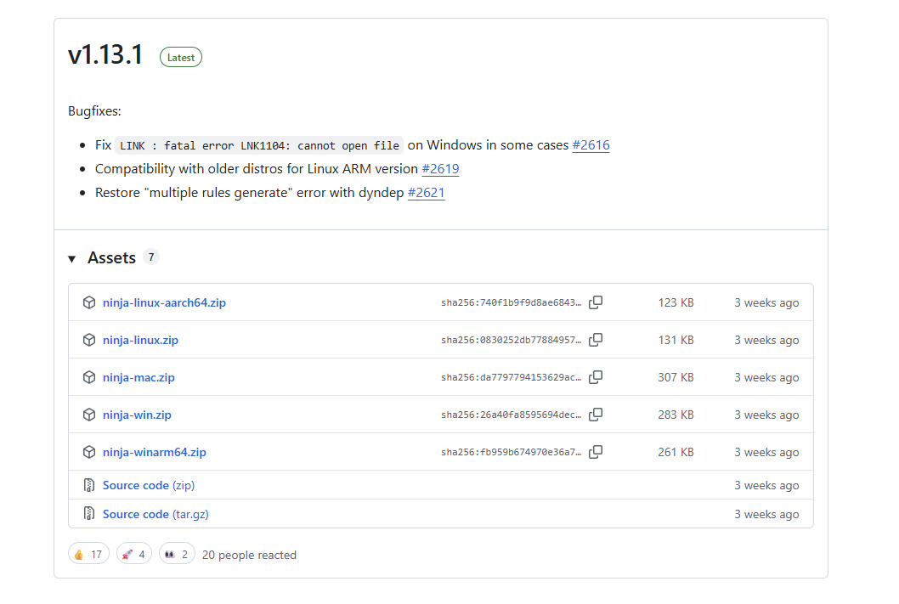

## 2.3 Arm-eabi-none-gcc

> [Arm GNU Toolchain Downloads – Arm Developer](https://developer.arm.com/downloads/-/arm-gnu-toolchain-downloads)
>
> 1. 打开官方网站下载最新版本的arm-eabi-none-gcc文件,选择 mingw-w64-x86_64 版本的.zip文件
> 2. 解压到自己想要的路径

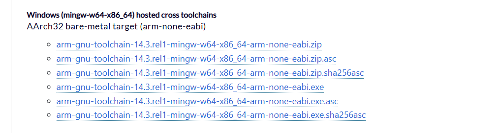

## 2.4 OpenOCD

> [Download OpenOCD for Windows](https://gnutoolchains.com/arm-eabi/openocd/)
>
> 1. 打开官方网站下载最新版本的OpenOCD文件,选择最新版本的.7z文件
> 2. 解压到自己想要的路径

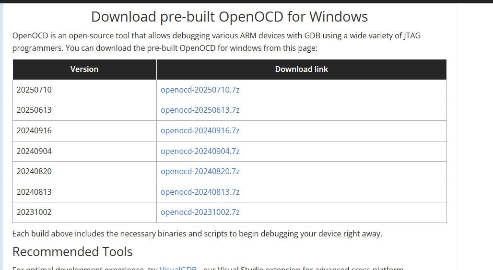

## 2.5 SVD寄存器描述文件

> 1. 在ST官网下载安装STM32CubeCLT后会有个文件夹STMicroelectronics_CMSIS_SVD，里面就是SVD文件
> 2. 也可以去第三方网站或者github仓库下载SVD文件

## 2.6 VSCode + Cortex-Debug

>1. 在VSCode官网下载并安装 VSCode
>2. 安装完成后安装插件 `Crotex-Debug` 、`CMakeTools`、 `C++`、 `Chinese(Simplified)`

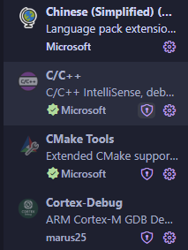

# 三、配置工具链环境变量

> 为了让操作系统能识别安装的工具链，需要把解压后文件夹的bin路径添加到系统环境变量PATH里面

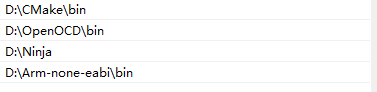

# 四、CubeMX新建CMake工程

> 生成代码的页面有个选项选择 ToolChain/IDE 找到CMake并选择，然后点击生成代码

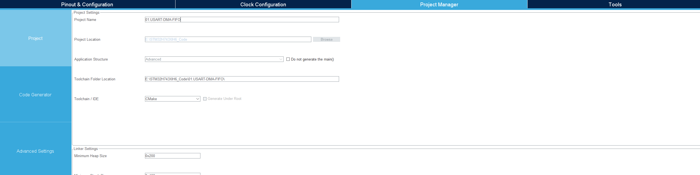

# 五、VSCode编译烧录调试

## 5.1 VSCode打开项目文件夹

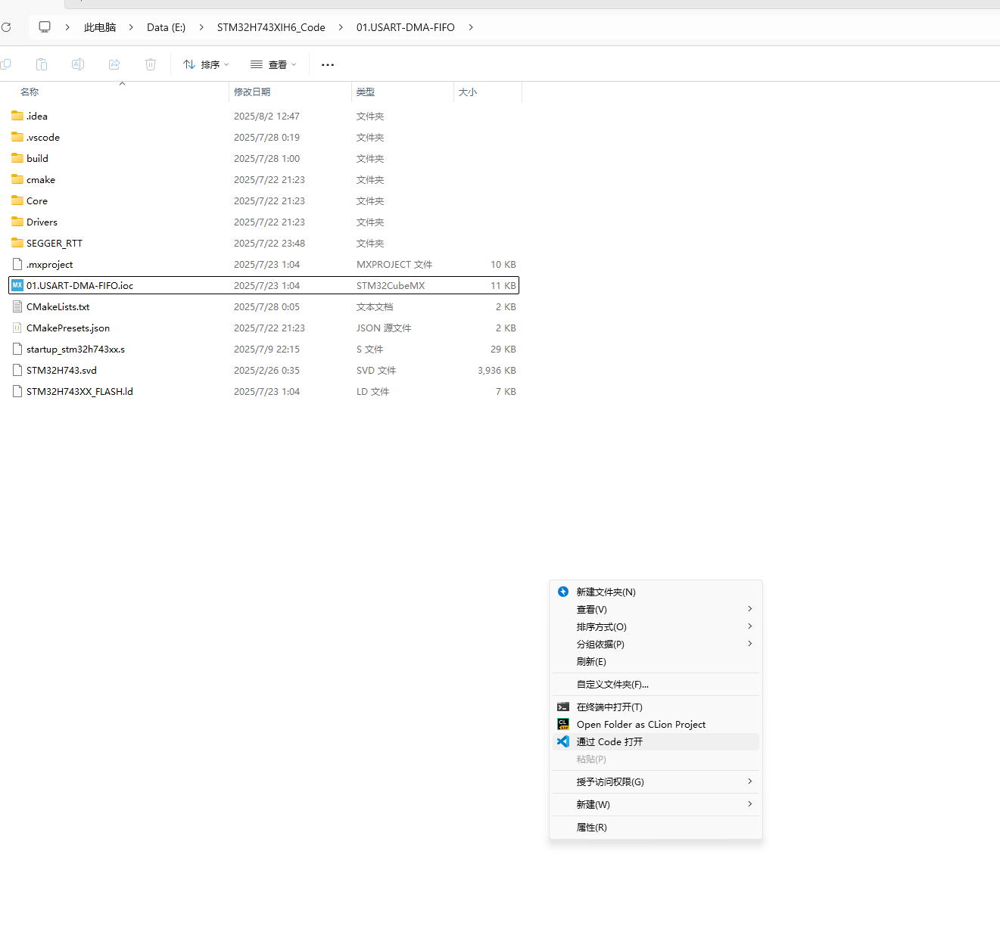

## 5.2 CMkae + Ninja 构建

1. 打开新的工程会让选择CMake目标，调试阶段就选择 DeBug 发布阶段就选择 Release
2. 点击左下角的**生成**，执行CMake项目构建

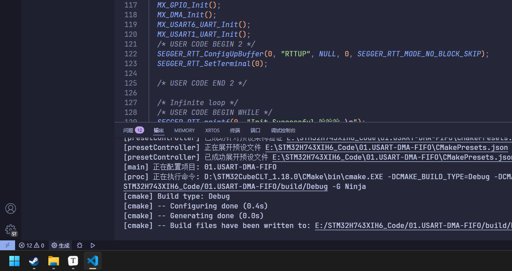

3. 生成成功

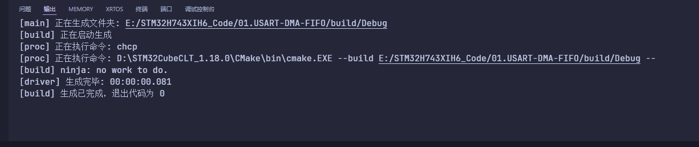

## 5.3 Cortex-Debug 烧录调试

1. 点击左侧的工具栏下载调试

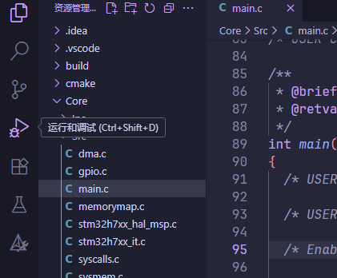

或者直接在上一步构建完成工程后在左下角点击选择并启动调试配置，然后就会弹出来添加配置，选择Cortex-debug然后进行下一步


2. 点击调试添加配置,在配置文件的右下角点击添加配置

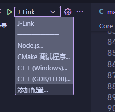

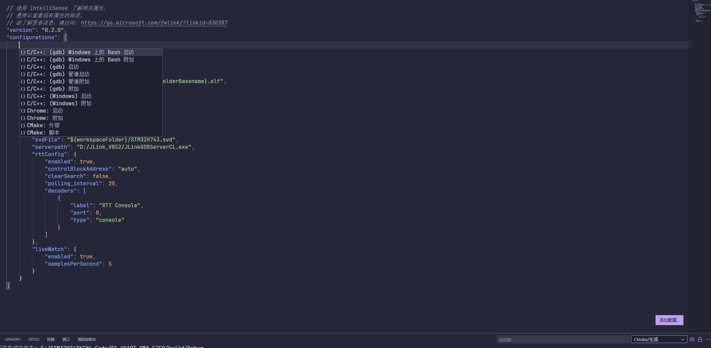

3. 唤起下拉菜单后根据自己的调试器选择调试配置，我这里是JLink就选择JLink，一般来说OpenOCD是比较通用的配置，基本上所有的调试器都可以用

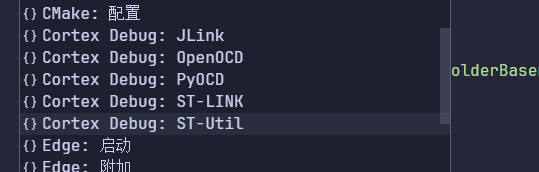

4. 参考我的配置项目，编辑配置项

```json
{
    // 使用 IntelliSense 了解相关属性。 
    // 悬停以查看现有属性的描述。
    // 欲了解更多信息，请访问: https://go.microsoft.com/fwlink/?linkid=830387
    "version": "0.2.0",
    "configurations": [
        {
            "name": "J-Link",
            "cwd": "${workspaceFolder}",
            /*生成的烧录文件路径*/
            "executable": "./build/Debug/${workspaceFolderBasename}.elf",
            "request": "launch",
            "type": "cortex-debug",
            /*调试服务器；类型*/
            "servertype": "jlink",
            /*使用的芯片*/
            "device": "STM32H743XI",
            /*调试开始运行到main函数*/
            "runToEntryPoint": "main",
            "showDevDebugOutput": "none",
            "interface": "swd",
            /*寄存器配置文件*/
            "svdFile": "${workspaceFolder}/STM32H743.svd",
            /*JLINK-GDB服务器*/
            "serverpath": "D:/JLink_V852/JLinkGDBServerCL.exe",
            /*此项目是用来JLINK-RTT打印调试log用的*/
            "rttConfig": {
                "enabled": true,
                "controlBlockAddress": "auto",
                "clearSearch": false,
                "polling_interval": 20,
                "decoders": [
                    {
                        "label": "RTT Console",
                        "port": 0,
                        "type": "console"
                    }
                ]
            },
            /*此项目是用来打开实时监控变量的*/
            "liveWatch": {
                "enabled": true,
                "samplesPerSecond": 5
            }
        }
    ]
}
```

5. 配置好后点击开始调试，就会自动开始烧录+调试，点击运行，程序就会从头开始全速运行，直到遇到断点或者调试
5. 在启用了实时监视变量后在Live Watch窗口输入指定的全局变量名字，就能监视变量了

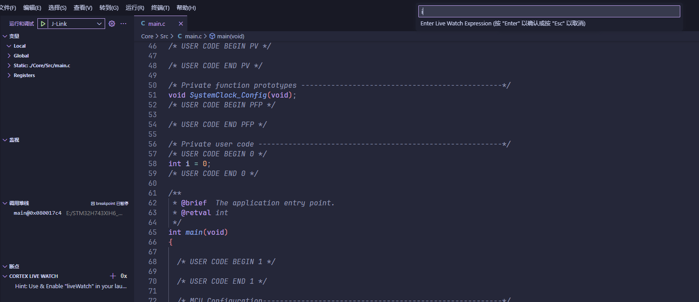

7. 可以看到变量确实在实时刷新

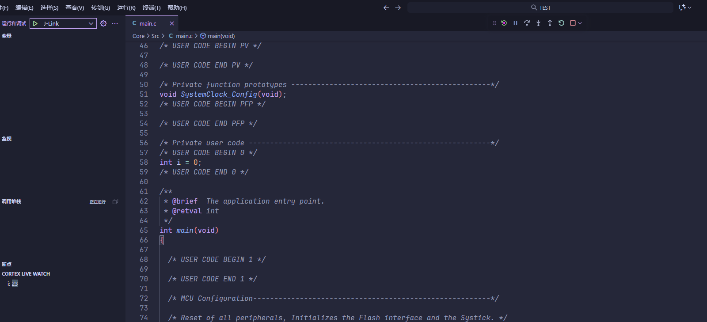

8. 实时刷新变量修改值需要把调试停下来，点一下调试的暂停键，然后在调试窗口找到变量下面的Global选项，会找到我们的全局变量的

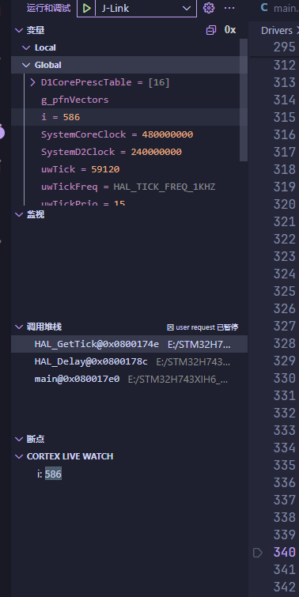

9. 上一步我调试的i，我直接修改它

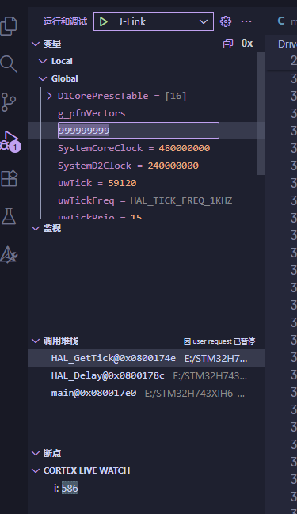

10. 修改完成后让调试继续运行，发现确实修改成功了！


# 六、J-Link RTT 调试

## 6.1 J-Link RTT 简介

> **RTT**(Real Time Transfer)是一种用于嵌入式中与用户进行交互的技术，它结合了SWO和半主机的优点，具有极高的性能。
>
> 使用RTT可以从 MCU 非常快速输出调试信息和数据，且不影响MCU实时性。这个功能可以用于很多支持J-Link的设备和MCU，兼容性强。RTT支持两个方向的多个通道，上到主机，下到目标，它可以用于不同的目的，为用户提供尽可能多的自由。
>
> 默认实现每个方向使用一个通道，用于可打印终端输入和输出。使用J-Link RTT Viewer，可用于“虚拟”终端，允许打印到多个窗口（例如，一个用于标准输出，一个对于错误输出，一个用于调试输出）。

## 6.2 RTT 环境搭建

1. J-Link 驱动下载

> [SEGGER - The Embedded Experts - Downloads - J-Link / J-Trace](https://www.segger.com/downloads/jlink/)
>
> 下载并安装到自己想要安装的磁盘位置即可

2. 安装完成后，打开J-Link的安装目录（开始->SEGGR->J-Link RTT Viewer->右键打开文件所在位置->然后继续右键打开文件所在位置->此时就是安装目录了），找到如下路径`JLink_V852\Samples\RTT`,解压路径里面的压缩包`SEGGER_RTT_V852.zip`(不同的版本，V后面的数字可能不一样)

3. 在项目工程中加入`SEGGER_RTT_V852\RTT`目录下的全部四个文件。CMake工程添加文件方法请自行百度。

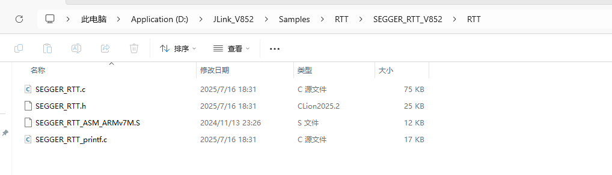

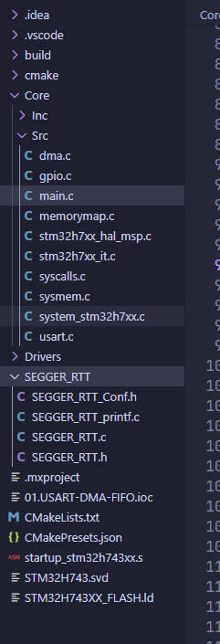

4. 工程加入文件后，在想要用到RTT的文件中包含`#include "SEGGER_RTT.h"`,然后直接调用`SEGGER_RTT_printf()`就好了，例如`SEGGER_RTT_printf(0,"hello world!")`这个和C语言的printf的格式差不多，就是前面加了一个通道`0`的参数。

5. 参考代码如下：

```c
/*包含对应的头文件*/
#include "SEGGER_RTT.h"

int main(void)
{
  /*初始化RTT输出终端为通道0*/
  SEGGER_RTT_ConfigUpBuffer(0, "RTTUP", NULL, 0, SEGGER_RTT_MODE_NO_BLOCK_SKIP);
  SEGGER_RTT_SetTerminal(0);
  /*打印RTT调试信息，使用方法和printf完全一样*/
  SEGGER_RTT_printf(0, "Init Successful 哈哈哈 \n");
}
```

6. 此时再次打开调试就会发现终端里多出了一个RTT的调试窗口，可以正常打印信息

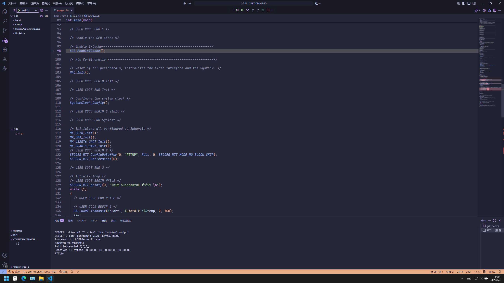

7. RTT 不止可以输出，也可以输入，方法类似
