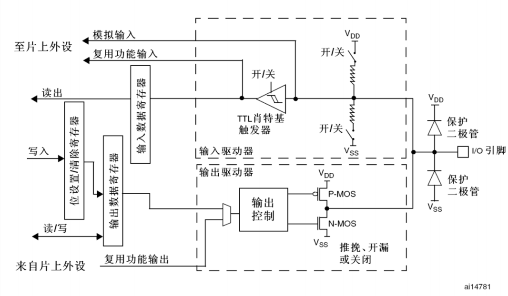

# GPIO的硬件结构

# GPIO的八种工作模式

* **特别说明：**
	1. 在**输出的时候是可以有输入（浮空）的：** 当 GPIO 被配置为输出模式时，其内部的输入缓冲器仍然默认是活动的，不需要专门配置
	2. 在**输入模式下，没有输出**。
	3. **GPIO能够承载的电流是由上限的**：很多单片机或芯片都使用了**高电平弱驱动，低电平强驱动**的规则,所以驱动元件的时候最好让单片机输出0，元件的正极由外部电源供电，即使这样，**单片机的电流承载也是有上限**的，**驱动大功率器件的时候最好用MOS或者三极管**来驱动！！！
	4. 驱动高压元件的时候要加上**高压隔离**（一般来说光耦隔离比较好，也支持较高的PWM频率），防止损坏MCU或者PC，具体使用MOS还是隔离方案根据实际需求选择

| 模式名称   | 性质   | 模式选择                          | 特征                                                |
| :----- | :--- | :---------------------------- | :------------------------------------------------ |
| 浮空输入   | 数字输入 | GPIO_Mode_IN_FLOATING         | 可读取引脚电平，若引脚悬空，则电平不确定                              |
| 上拉输入   | 数字输入 | GPIO_Mode_IPU                 | 可读取引脚电平，内部连接上拉电阻，悬空时默认高电平                         |
| 下拉输入   | 数字输入 | GPIO_Mode_IPD                 | 可读取引脚电平，内部连接下拉电阻，悬空时默认低电平                         |
| 模拟输入   | 模拟输入 | GPIO_Mode_AIN                 | GPIO无效，引脚直接接入内部ADC                                |
| 开漏输出   | 数字输出 | GPIO_Mode_Out_OD （Open-Drain） | 可输出引脚电平，输出1为高阻态，两个MOS管都不工作，输出0的时候NMOS工作接GND（也就是0） |
| 推挽输出   | 数字输出 | GPIO_Mode_Out_PP （Push-Pull）  | 可输出引脚电平，高电平接VDD，低电平接VSS                           |
| 复用开漏输出 | 数字输出 | GPIO_Mode_AF_OD               | 由片上外设控制，输出1为高阻态，输出0接GND                           |
| 复用推挽输出 | 数字输出 | GPIO_Mode_AF_PP               | 由片上外设控制，高电平接VDD，低电平接VSS                           |
# 配置GPIO流程
```c
//1.首先必须包含头文件
#include "stm32f10x.h"

//2.给对应的时钟使能（具体哪个引脚对应哪个时钟，查看参考手册的时钟树）
RCC_APB2PeriphClockCmd(RCC_APB2Periph_GPIOA,ENABLE);

//3.创建用于初始化GPIO的结构体
GPIO_InitTypeDef GPIO_InitTypeStructure;

//4.给GPIO结构体选择引脚、频率、输入输出模式
GPIO_InitTypeStructure.GPIO_Mode=GPIO_Mode_Out_PP;//推挽输出
GPIO_InitTypeStructure.GPIO_Speed=GPIO_Speed_50MHz;//50MHz频率（切换电平的速度）
GPIO_InitTypeStructure.GPIO_Pin=GPIO_Pin_1;//选择使用的引脚，可以用 |（或）多选

//5.调用初始化函数，选择GPIOx（A、B、C......）和初始化结构体指针
GPIO_Init(GPIOA,&GPIO_InitTypeStructure);

//6.对应端口读写函数
GPIO_WriteBit(GPIOA,GPIO_Pin_1,Bit_RESET);//输出0
GPIO_WriteBit(GPIOA,GPIO_Pin_1,Bit_SET);//输出1
GPIO_ReadInputDataBit(GPIOA,GPIO_Pin_1);//读取输入电平,返回1或0
```