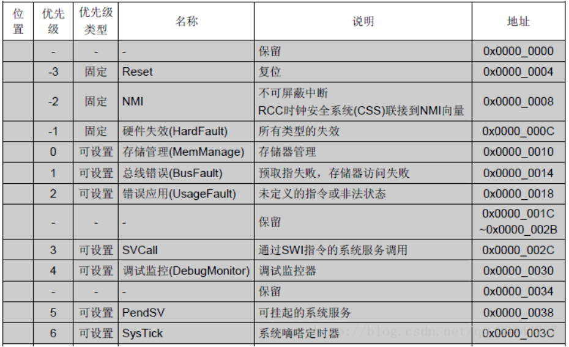
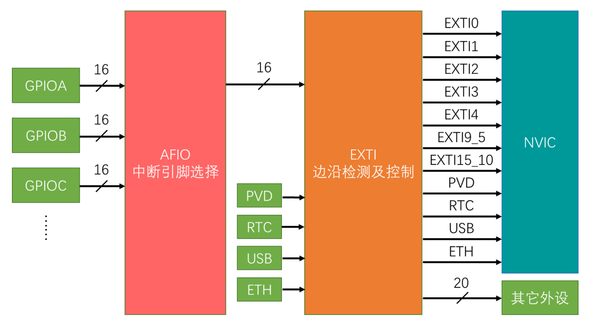
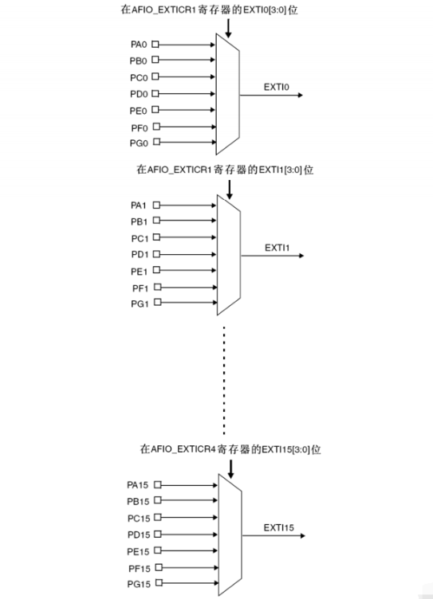
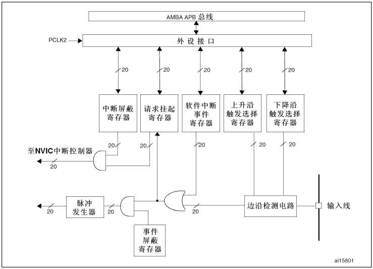

# 一、中断系统

## （1）什么是中断
* 中断的定义就是在主程序运行过程中，出现了特定的中断触发条件（中断源），使得**CPU暂停当前正在运行的程序，转而去处理中断服务程序**，处理完成后又返回原来被暂停的位置继续运行。
## （2）中断优先级
* 中断优先级就是当有多个中断源同时申请中断时，CPU会根据中断源的轻重缓急进行裁决，**优先响应优先级更高的中断源**。
## （3）中断嵌套
* 当一个中断程序正在运行时，又有新的更高抢占优先级的中断源申请中断，CPU再次暂停当前中断程序，转而去处理新的中断程序，处理完成后依次进行返回。这种**把中断程序再次中断**的现象，就叫做中断嵌套。
## （4）STM32的中断
* STM32有很多个可屏蔽中断通道（对于具体型号还是以对应手册说明为准）， 包含EXTI、TIM、ADC、USART、SPI、I2C、RTC等多个外设。
* 使用**NVIC**统一管理中断，每个中断通道都拥有16个可编程的优先等级，可对优先级进行分组，进一步设置抢占优先级和响应优先级。
* 可以通过查看手册看到**中断向量表**，其中阴影部分的是内核中断，**数字越小优先级越高**,白色的是外设中断，通常用的就是外设中断。



## （5）NVIC基本结构
* **NVIC（Nest Vector Interrupt Controller）称为嵌套中断向量控制器**。在STM32中它是用来统一分配中断优先级和管理中断的。NVIC是一个内核外设，NVIC就是设计来负责帮助CPU管理中断的，它有很多输入口。所有的中断线路都可以接进来。

## （6）NVIC中断优先级分组

* NVIC的中断优先级由优先级寄存器的4位（0~15）决定，这4位可以进行切分，分为高n位的**抢占优先级** 和低4-n位的**响应优先级**。这个优先级的数是**值越小，优先级越高**。抢占优先级高的可以**中断嵌套**，响应优先级高的可以**优先排队**，抢占优先级和响应优先级均相同的按中断向量表中的**中断号**排队。
* 一般来说，建议全部采用抢占优先级（也就是使用分组4），这样的话优先级高的可以打断优先级低的，程序的实时性更好，而且便于管理，而且如果使用FreeRTOS就必须全部使用抢占优先级，便于移植RTOS

| 分组方式 |  抢占优先级  |   响应优先级    |
| :--: | :-----: | :--------: |
| 分组0  |  取值为0   | 4位，取值为0~15 |
| 分组1  | 取值为0~1  | 3位，取值为0~7  |
| 分组2  | 取值为0~3  | 2位，取值为0~3  |
| 分组3  | 取值为0~7  | 1位，取值为0~1  |
| 分组4  | 取值为0~15 |  0位，取值为0   |

# 二、EXTI外部中断
## （1）EXTI是什么
* **EXTI（Extern Interrupt）外部中断**，EXTI可以监测指定GPIO口的电平信号，当其指定的GPIO口产生电平变化时，EXTI将立即向NVIC发出中断申请，经过NVIC处理后即可中断CPU主程序，使CPU执行EXTI对应的中断服务程序。
* **触发方式：**
	* 上升沿
	* 下降沿
	* 双边沿
	* 软件触发
* **GPIO口：** 包含所有GPIO口，但相同的Pin不能同时触发中断。意思就是比如PA0和PB0不能同时用，只要GPIO_Pin是一样的，就只能选一个作为中断引脚
* **EXTI通道数：**
	* GPIO_Pin
	* PVD输出
	* RTC闹钟
	* USB唤醒
	* 以太网唤醒
* **外部中断的触发响应方式：** 
	* 中断响应是正常的流程，引脚电平触发中断（通过NVIC）
	* 事件响应不会触发中断，而是触发其他外设操作（不通过NVIC），属于外设之间的联合工作
## （2）基本结构



## （3）AFIO复用IO口
* **功能：**
	* **复用功能引脚重映射**（只有当某功能需要被复用至其本来对应的IO口之外的其他IO口时，才需要打开AFIO）:
	* **中断引脚选择**


## （4）EXTI框图



# 三、外部中断示例代码
* 使用 IO 口外部中断的步骤：
	1. 开启GPIO的时钟，并初始化GPIO口为输入。  
	2. 开启 AFIO 时钟 。 
	3. 设置 IO 口与中断线的映射关系。  
	4. 初始化线上中断，设置触发条件等，并使能中断。  
	5. 设置中断分组策略（NVIC）。
	6. 初始化NVIC的相关配置，并使能中断。
	7. 编写中断服务函数（先检查标志位，确认是哪个中断再进入处理，结束后要清除挂起位）。

* 以旋转编码器触发为例（使用PA8、PA9两个IO口）
```c
void Encoder_Init(void){

	//开启GPIO和AFIO的时钟
	RCC_APB2PeriphClockCmd(RCC_APB2Periph_GPIOA,ENABLE);
	RCC_APB2PeriphClockCmd(RCC_APB2Periph_AFIO,ENABLE);
	
	//初始化GPIO
	GPIO_InitTypeDef GPIO_InitTypeStructure;
	GPIO_InitTypeStructure.GPIO_Mode = GPIO_Mode_IPU;
	GPIO_InitTypeStructure.GPIO_Pin = GPIO_Pin_8 |GPIO_Pin_9;
	GPIO_InitTypeStructure.GPIO_Speed = GPIO_Speed_50MHz;
	GPIO_Init(GPIOA,&GPIO_InitTypeStructure);
	
	//初始化外部中断 / 事件控制器（EXTI）
	GPIO_EXTILineConfig(GPIO_PortSourceGPIOA,GPIO_PinSource8);//选择中断线
	EXTI_InitTypeDef EXTI_InitTypeStructure;
	EXTI_InitTypeStructure.EXTI_Line = EXTI_Line8;
	EXTI_InitTypeStructure.EXTI_LineCmd = ENABLE;//使能中断线
	EXTI_InitTypeStructure.EXTI_Mode = EXTI_Mode_Interrupt;//中断模式和事件模式
	EXTI_InitTypeStructure.EXTI_Trigger = EXTI_Trigger_Rising; //上升沿触发
	EXTI_Init(&EXTI_InitTypeStructure);
	
	//NVIC分组4
	NVIC_PriorityGroupConfig(NVIC_PriorityGroup_4);
	
	//初始化嵌套中断向量控制器（NVIC），以配置中断的优先级和使能相关中断通道
	NVIC_InitTypeDef NVIC_InitTypeStructure;
	NVIC_InitTypeStructure.NVIC_IRQChannel = EXTI9_5_IRQn;
	NVIC_InitTypeStructure.NVIC_IRQChannelCmd = ENABLE;//使能中断
	NVIC_InitTypeStructure.NVIC_IRQChannelPreemptionPriority = 0; //抢占优先级
	NVIC_InitTypeStructure.NVIC_IRQChannelSubPriority = 0;//响应优先级
	NVIC_Init(&NVIC_InitTypeStructure);
}

//中断服务函数，在startup_stm32fxxx.s这样的文件中可以找到对应的中断服务函数
void EXTI9_5_IRQHandler(void)
{
	//检查指定外部中断线的中断标志位是否被置位，确认是想要的中断才进入函数处理
	if(EXTI_GetITStatus(EXTI_Line8)==SET)
	{	
		if(GPIO_ReadInputDataBit(GPIOA,GPIO_Pin_9)==1)
		{
			EncoderCount++;
		}else{
			EncoderCount--;
		}	
/*
EXTI_ClearITPendingBit(EXTI_Line8)用于清除外部中断线（EXTI）的挂起位。在STM32中，当外部中断事件发生时，相应的挂起位会被置位，用于表示该中断请求正在等待处理。这个函数就是用来清除这个挂起位，以确保中断系统能够正确地响应下一次中断事件。	
*/
		EXTI_ClearITPendingBit(EXTI_Line8);
	}
}
```
* 主函数
```c
int16_t EncoderCount=0;

int main(void){
	OLED_Init();
	OLED_Clear();
	Encoder_Init();
	while(1){
		OLED_ShowSignedNum(1,1,EncoderCount,5);
	}
}
```
