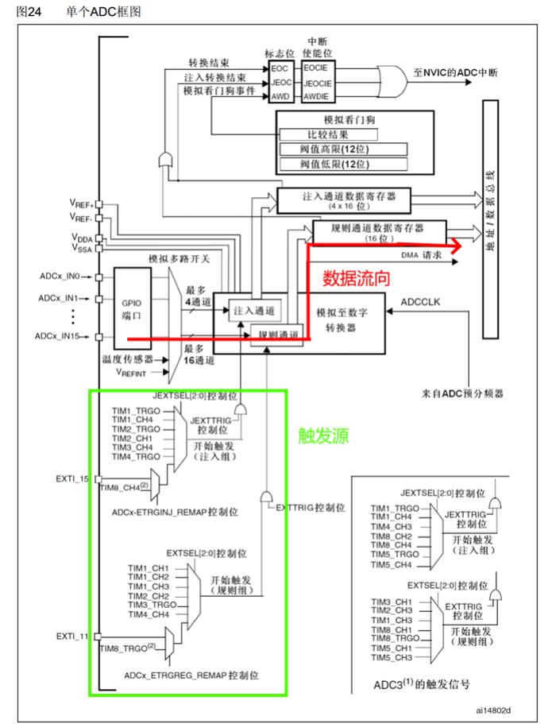
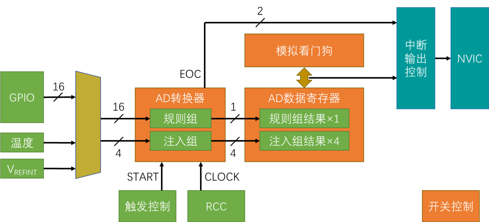
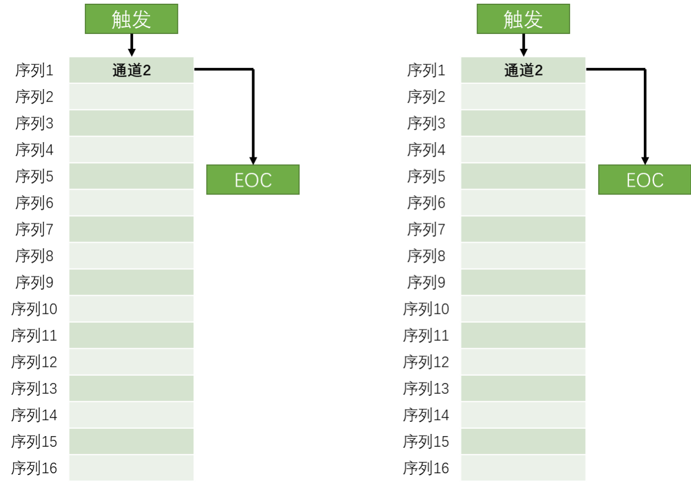
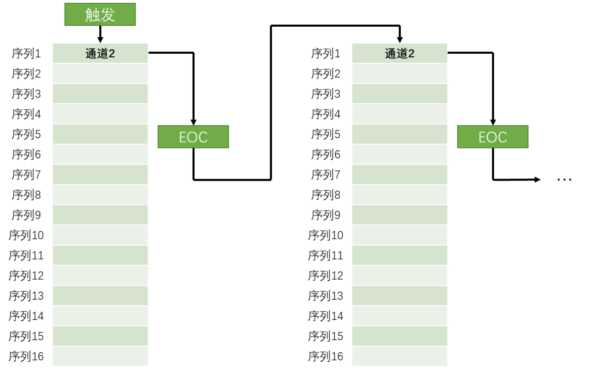
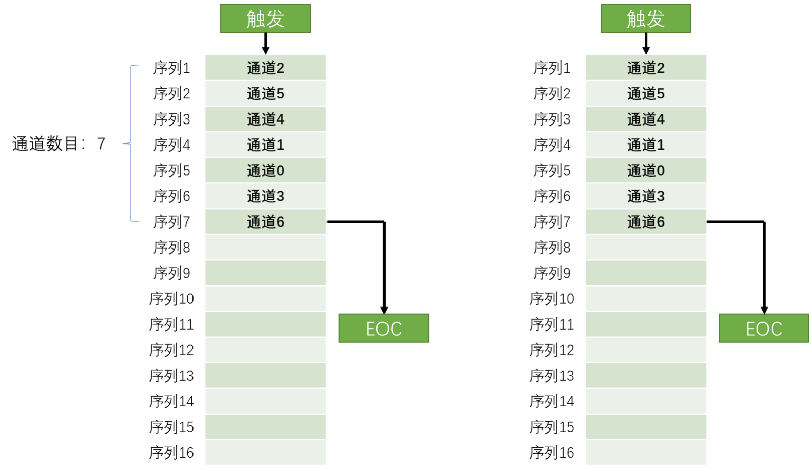
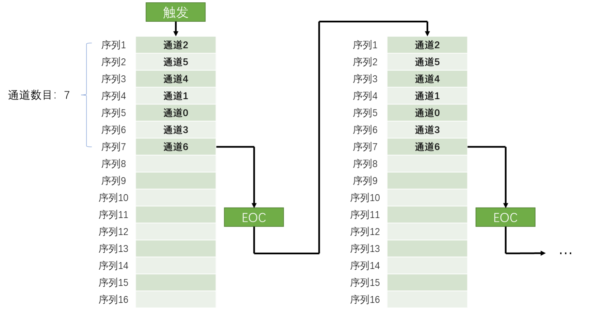
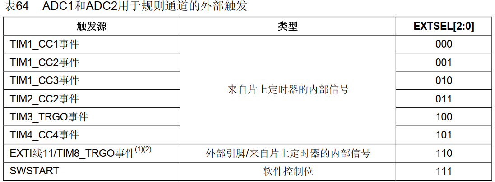
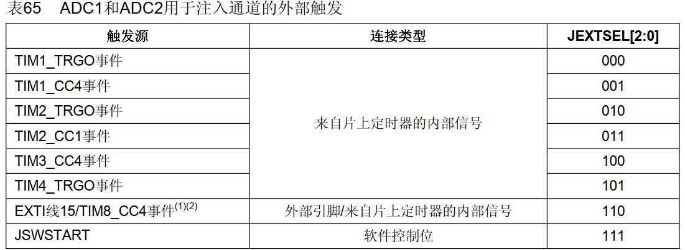
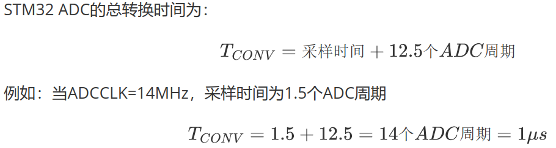

# 一、ADC简介

* **模数转换器**，有时也叫AD转换器。ADC可以将引脚上连续变化的模拟电压转换为内存中存储的数字变量，建立模拟电路到数字电路的桥梁。
* **STM32的ADC是12位逐次逼近型ADC**，输入电压范围是0~3.3V，转换结果范围是0~4095，将转换**结果存在16位数据寄存器**中，可以选择**左对齐**或者**右对齐**。
* STM32的ADC具有**两个转换单元：** 
	* 用于常规使用的**规则组**
	* 用于突发事件的**注入组**
* 配备了**模拟看门狗**可以自动监测输入电压范围。

# 二、ADC框图



* VREF+ 输入，模拟参考正极，ADC使用的高端/正极参考电压，2.4V ≤ VREF+ ≤ VDDA 
* VREF- 输入，模拟参考负极，ADC使用的低端/负极参考电压，VREF- = VSSA
* VDDA输入，模拟电源，等效于VDD的模拟电源且：2.4V ≤ VDDA ≤ VDD(3.6V) 
* VSSA输入，模拟电源地，等效于VSS的模拟电源地 
* ADCx_IN，模拟输入信号16个模拟输入通道 
# 三、ADC基本结构



1. 输入通道，`GPIO口`，外加`两个内部通道（一般在转换通道的后面：是温度和参考电压通道）`。

2. 然后进入AD转换器，AD转换器 里有两个组，一个是`规则组`，一个是`注入组`。
	* 规则组最多可以选中16个通道
	* 注入组最多可以选择4个通道
	* 转换的结果可以存放在AD数据寄存器里，其中规则组只有一个数据寄存器，而注入组有4个

3. 在AD转换器下方里有`触发控制`，提供了开始转换这个START信号。
	* 触发控制可以选择软件触发和硬件触发。
	* 硬件触发主要是来自于定时器，也可以选择外部中断的引脚。

4. `来自于RCC的ADC时钟CLOCK`，ADC逐次比较的过程就是由这个时钟推动的。

5. 在ADC数据寄存器上面可以布置一个`模拟看门狗`，用于监测转换结果的范围。如果超出设定的阈值，就通过中断输出控制向NVIC申请中断。

6. 另外`规则组和注入组转换完成后，会有一个EOC信号`，它会置一个标志位通向NVIC。

7. 在右下角有一个`开关控制`，这个开关控制在库函数中就是ADC_CMD函数，用于给ADC上电的。

# 四、转换模式

## ADC单通道转换：

`单次转换`：配置为单次模式使能，扫描模式失能。这样ADC的这个通道，转换一次后，转换结果放在数据寄存器里，同时给EOC标志位置 1，整个转换过程就结束了，就停止转换。等待下一次触发。

这个表就是规则组里的菜单，有16个空位，分别是序列1到序列16。可以在这里写入要转换的通道。在非扫描的模式下，只有第一个序列1的位置有效，这时同时选中一组的方式就简化为选中一个的方式了。 我们可以在序列1的位置指定想转换的通道，比如在这个位置写入通道2，就可以触发转换，ADC就会对 这个通道2进行模数转换，过一小段时间后转换完成，转换结果放在数据寄存器里，同时给EOC标志位置 1，整个转换过程就结束了。判断这个EOC标志位，如果转换完了，就可以在数据寄存器里读取结果了。 如果想再启动一次转换，那就需要再触发一次转换，结束置EOC标志位读结果。如果想换一个通道转 换，那在转换之前，把第一个位置的通道2改成其他通道，然后再启动转换就行了。



`连续转换`：配置为连续模式使能，扫描模式失能。这样ADC的这个通道，转换一次后，接着进行下一次转换，不断连续。

首先它还是非扫描模式，所以菜单列表就只用第一个。然后它与上一种单次转换不同的是，它在一次转换结束后不会停止，而是立刻开始下一轮的转换，然后一直持续下去。这样就只需要最开始触发一次，之后就可以一直转换了。这个模式的好处就是开始转换之后，不需要等待一段时间的，因为它一直都在转换，所以就不需要手动开始转换了，也不用判断是否结束。想要读AD值的时候，直接从数据寄存器取就是了。



## ADC多通道转换：

`单次转换`：配置为单次模式使能，**扫描模式**使能。这样ADC的多个通道，按照配置的顺序依次转换一次后，转换完成之后，产生EOC信号转换结束，就停止转换。等待下一次触发。

这个模式也是单次转换，所以每触发一次转换结束后，就会停下来，下次转换就得再触发才能开始。由于它是扫描模式，这就会用到这个列表了，可以在这个列表中添加通道。比如第一个是通道2，第二个是通道5，第三个是通道4……等等。这里每个位置是通道几，可以任意指定，并且也是可以重复的。可以指定通道使用个数，比如这里指定通道数目为7，那就只会看前7个位置，在每次触发之后，ADC就依次对这前7个位置进行AD转换，转换结果都放在数据寄存器里，这里为了防止数据被覆盖（因为转换结果数据寄存器只有一个，扫描到下一个序列转换完后上一个转换的结果就被覆盖了），就需要用DMA及时将数据挪走，当7个通道转换完成之后，产生EOC信号转换结束，然后再触发，下一次就又开始新一轮的转换。



`连续转换`： 配置为连续模式使能，**扫描模式**使能。这样ADC的多个通道，按照配置的顺序依次转换一次后，接着进行下一次转换，不断连续。

这个模式就是在前一个模式基础上变了一点，就是一次转换完成后，立刻开始下一次的转换，其他都和上一个模式是一样的。



**结论：** 扫描模式只在多通道的条件下有效，来使得各个通道按照配置循序依次转换。而单次模式无论在单通道还是多通道下只对这些或者这个通道进行一次转换，连续模式无论是在单通道还是多通道下都对这些或者这个通道不断进行连续的转换。

# 五、触发控制
* 通过查看STM32F1XX的参考手册可以找到ADC的外部触发：
## 规则通道



## 注入通道



# 六、转换时间与自动校准
## 转换时间



## 自动校准

ADC有一个内置自校准模式。校准可大幅减小因内部电容器组的变化而造成的准精度误差。校准期间，在每个电容器上都会计算出一个误差修正码(数字值)，这个码用于消除在随后的转换中每个电容器上产生的误差。建议在每次上电后执行一次校准。注意启动校准前， ADC必须处于关电状态超过至少两个ADC时钟周期。

# 七、模拟看门狗

模拟看门狗功能，允许检测输入电压是否超出事先定义的**高低阈值（HTR与LTR）**。一旦采集到的电压超出该上下限，将会触发模拟看门狗中断。

```c
//设置模拟看门狗的高低阈值（12位ADC是0~4095，自己换算所需值即可）
#define MyADCDog_HTR 2000
#define MyADCDog_LTR 1200

void MyADC_Init(void) {
    // 使能GPIOA外设时钟
    RCC_APB2PeriphClockCmd(RCC_APB2Periph_GPIOA, ENABLE);
    
    // 使能ADC1外设时钟
    RCC_APB2PeriphClockCmd(RCC_APB2Periph_ADC1, ENABLE);
    
    // 配置ADC的时钟，将其设置为PCLK2（APB2总线时钟）的6分频
    RCC_ADCCLKConfig(RCC_PCLK2_Div6);
	
    // 初始化GPIO配置
    GPIO_InitTypeDef GPIO_InitStructrue;
    GPIO_InitStructrue.GPIO_Mode = GPIO_Mode_AIN;
    GPIO_InitStructrue.GPIO_Pin = GPIO_Pin_7;
    GPIO_InitStructrue.GPIO_Speed = GPIO_Speed_50MHz;
    GPIO_Init(GPIOA, &GPIO_InitStructrue);
	
    // 初始化ADC配置
    ADC_InitTypeDef ADC_InitTypeDefStructure;
    ADC_InitTypeDefStructure.ADC_ContinuousConvMode = ENABLE;//连续转换
    ADC_InitTypeDefStructure.ADC_DataAlign = ADC_DataAlign_Right;//数据右对齐
    ADC_InitTypeDefStructure.ADC_ExternalTrigConv = ADC_ExternalTrigConv_None;//无外部触发
    ADC_InitTypeDefStructure.ADC_Mode = ADC_Mode_Independent;//独立模式
    ADC_InitTypeDefStructure.ADC_NbrOfChannel = 1;//使用一个通道
    ADC_InitTypeDefStructure.ADC_ScanConvMode = DISABLE;//不扫描
    ADC_Init(ADC1, &ADC_InitTypeDefStructure);
	
    // 配置规则组转换通道，指定使用ADC1的ADC_Channel_7通道（对应GPIOA引脚7），使用ADC1，把通道7放入序列1，采样时间55.5个时钟周期
    ADC_RegularChannelConfig(ADC1, ADC_Channel_7, 1, ADC_SampleTime_55Cycles5);
    
    // 使能ADC1，让其进入可工作状态，准备进行模数转换操作
    ADC_Cmd(ADC1, ENABLE);
	
    // 重置ADC1的校准，这是进行校准的第一步操作，用于清除之前可能存在的校准状态信息
    ADC_ResetCalibration(ADC1);
    
    // 通过循环检查ADC1校准重置状态，直到校准重置操作完成，确保校准能正常进行后续步骤
    while (ADC_GetResetCalibrationStatus(ADC1));
    
    // 启动ADC1的校准过程，校准可提高ADC转换的精度和准确性，使转换结果更可靠
    ADC_StartCalibration(ADC1);
    
    // 通过循环检查ADC1校准状态，直到校准过程结束，保证校准顺利完成
    while (ADC_GetCalibrationStatus(ADC1));
	
    // 软件触发，结合前面的连续转换模式，触发后将持续进行模数转换
    ADC_SoftwareStartConvCmd(ADC1, ENABLE);
	
    // 使能ADC1的模拟看门狗功能，并且设置为单寄存器监控模式
    ADC_AnalogWatchdogCmd(ADC1, ADC_AnalogWatchdog_SingleRegEnable);
    
    // 配置模拟看门狗的高阈值（MyADCDog_HTR）和低阈值（MyADCDog_LTR）
    ADC_AnalogWatchdogThresholdsConfig(ADC1, MyADCDog_HTR, MyADCDog_LTR);
    
    // 指定模拟看门狗监控的通道ADC_Channel_7，和前面模数转换的通道一致，确保有效监控
    ADC_AnalogWatchdogSingleChannelConfig(ADC1, ADC_Channel_7);
	
    // 使能ADC的模拟看门狗中断，当模拟看门狗检测到转换值超出阈值时，将触发相应中断
    ADC_ITConfig(ADC1, ADC_IT_AWD, ENABLE);
	
    // 设置NVIC（嵌套中断向量控制器）的优先级分组为第4组，决定了中断优先级的分组方式
    NVIC_PriorityGroupConfig(NVIC_PriorityGroup_4);
	
    // 初始化NVIC相关配置的结构体变量
    NVIC_InitTypeDef NVIC_InitTypeStructure;
    NVIC_InitTypeStructure.NVIC_IRQChannel = ADC1_2_IRQn;//指定ADC1或2的中断通道
    NVIC_InitTypeStructure.NVIC_IRQChannelCmd = ENABLE;//使能中断通道
    NVIC_InitTypeStructure.NVIC_IRQChannelPreemptionPriority = 1;//抢占优先级1级
    NVIC_InitTypeStructure.NVIC_IRQChannelSubPriority = 0;//响应优先级0
    NVIC_Init(&NVIC_InitTypeStructure);
}

// GetMyADCreturn函数用于获取ADC1转换后的值
uint16_t GetMyADCreturn(void) {
    return ADC_GetConversionValue(ADC1);// 返回ADC1当前的转换值
}

uint16_t value;

int main(void){
	OLED_Init();
	OLED_Clear();
	Led_Init();
	MyADC_Init();
	while(1){
		value =  GetMyADCreturn();
		OLED_ShowNum(1,3,value,5);//显示数字电压
		OLED_ShowNum(2,3,value*3.3*1000/4095.0,5);//显示模拟电压,单位是mv
		Delay_ms(500);
	}
}

//ADC中断处理函数
void ADC1_2_IRQHandler(void)
{
	if(ADC_GetITStatus(ADC1,ADC_IT_AWD)==SET)//判断模拟看门狗中断状态位是否触发
	{
		if(value>MyADCDog_HTR)
		{
			GPIO_SetBits(GPIOA,GPIO_Pin_0);//高于阈值就开灯
		} 
		if(value<MyADCDog_LTR)
		{
			GPIO_ResetBits(GPIOA,GPIO_Pin_0);//低于阈值就关灯
		}		
		ADC_ClearITPendingBit(ADC1,ADC_IT_AWD);//清除中断挂起标志位，便于下次中断
	}
}
```

# 七、示例代码

## 单通道连续转换

```c
void MyADC_Init(void)
{
    // 开启ADC时钟和对应的GPIO时钟
    RCC_APB2PeriphClockCmd(RCC_APB2Periph_GPIOA, ENABLE);
    RCC_APB2PeriphClockCmd(RCC_APB2Periph_ADC1, ENABLE);
    
    // 设置ADCCLK，设置为PCLK2（APB2总线时钟）的6分频
    RCC_ADCCLKConfig(RCC_PCLK2_Div6);
    
    // 配置GPIO，要设置成模拟输入
    GPIO_InitTypeDef GPIO_InitStructrue;
    GPIO_InitStructrue.GPIO_Mode = GPIO_Mode_AIN;
    GPIO_InitStructrue.GPIO_Pin = GPIO_Pin_0; // PA0是ADC的通道0
    GPIO_InitStructrue.GPIO_Speed = GPIO_Speed_50MHz;
    GPIO_Init(GPIOA, &GPIO_InitStructrue);
    
    // 初始化ADC
    ADC_InitTypeDef ADC_InitTypeDefStructure;
    ADC_InitTypeDefStructure.ADC_ContinuousConvMode = ENABLE;//连续转换
    ADC_InitTypeDefStructure.ADC_DataAlign = ADC_DataAlign_Right;// 数据右对齐
    ADC_InitTypeDefStructure.ADC_ExternalTrigConv = ADC_ExternalTrigConv_None;//无外部触发（需要用软件触发）
    ADC_InitTypeDefStructure.ADC_Mode = ADC_Mode_Independent;//ADC1 独立工作，不与其他 ADC 协同工作
    ADC_InitTypeDefStructure.ADC_NbrOfChannel = 1;//只使用一个通道
    ADC_InitTypeDefStructure.ADC_ScanConvMode = DISABLE;//不扫描
    ADC_Init(ADC1, &ADC_InitTypeDefStructure);
    
    // 规则组配置，使用ADC1，通道0，将其放在序列1，采样周期是55.5个时钟周期
    ADC_RegularChannelConfig(ADC1, ADC_Channel_0, 1, ADC_SampleTime_55Cycles5);
    
    // 使能ADC
    ADC_Cmd(ADC1, ENABLE);
    
    // 调用重置校准函数
    ADC_ResetCalibration(ADC1);
    
    // 等待重置校准返回标志位
    while (ADC_GetResetCalibrationStatus(ADC1));
    
    // 启动校准
    ADC_StartCalibration(ADC1);
    
    // 等待校准结束的标志位
    while (ADC_GetCalibrationStatus(ADC1));
    
    // 软件触发
    ADC_SoftwareStartConvCmd(ADC1, ENABLE);
}

uint16_t GetMyADCreturn(void)
{
    // 等待ADC的转换结束标志位
    while (ADC_GetFlagStatus(ADC1, ADC_FLAG_EOC) == 0);

    // 获取ADC的转换结果，并返回（是16位的数据）
    return ADC_GetConversionValue(ADC1);
}

int main(void)
{
    OLED_Init();
    OLED_Clear();
    MyADC_Init();
    uint16_t value; 
    while (1)
    {
        value = GetMyADCreturn();
        OLED_ShowNum(1, 3, value, 5);                       //显示数字电压
        OLED_ShowNum(2, 3, value * 3.3 * 1000 / 4095.0, 5); //显示模拟电压,单位是mv
        Delay_s(1);
    }
}
```

## 多通道连续转换

### 1、软件方法（不使用DMA）

* **方法：** 使用软件方法把多个通道依次放入序列1

* **本质：** 是**单通道单次转换**，只是用软件**把不同的通道依次放入序列1再触发转换**，等转换结束了再进行下一个通道。

```c
void MyADC_Init(void){
    // 使能GPIOA外设时钟
    RCC_APB2PeriphClockCmd(RCC_APB2Periph_GPIOA, ENABLE);
    
    // 使能ADC1外设时钟，ADC1要正常工作，必须先开启对应的时钟
    RCC_APB2PeriphClockCmd(RCC_APB2Periph_ADC1, ENABLE);
    
    // 配置ADC的时钟，将其设置为PCLK2（APB2总线时钟）的6分频
    RCC_ADCCLKConfig(RCC_PCLK2_Div6);
    
    //初始化GPIO
    GPIO_InitTypeDef GPIO_InitStructrue;
    GPIO_InitStructrue.GPIO_Mode = GPIO_Mode_AIN;
    //选择GPIOA的第0、1、2、3引脚作为模拟输入引脚
    GPIO_InitStructrue.GPIO_Pin = GPIO_Pin_0|GPIO_Pin_1|GPIO_Pin_2|GPIO_Pin_3;
    GPIO_InitStructrue.GPIO_Speed = GPIO_Speed_50MHz;
    GPIO_Init(GPIOA, &GPIO_InitStructrue);
    
    //配置ADC工作模式
    ADC_InitTypeDef ADC_InitTypeDefStructure;
    ADC_InitTypeDefStructure.ADC_ContinuousConvMode = DISABLE;//禁用连续转换模式
    ADC_InitTypeDefStructure.ADC_DataAlign = ADC_DataAlign_Right;//右对齐
    //无外部触发
    ADC_InitTypeDefStructure.ADC_ExternalTrigConv = ADC_ExternalTrigConv_None;
    ADC_InitTypeDefStructure.ADC_Mode = ADC_Mode_Independent;//独立模式
    ADC_InitTypeDefStructure.ADC_NbrOfChannel = 1;//只用一个通道
    ADC_InitTypeDefStructure.ADC_ScanConvMode = DISABLE;//每次只用一个通道，当然不扫描
    ADC_Init(ADC1, &ADC_InitTypeDefStructure);
    
    // 使能ADC1，让其进入可工作状态，准备进行模数转换操作
    ADC_Cmd(ADC1, ENABLE);
    
    // 重置ADC1的校准，这是进行校准的第一步操作
    ADC_ResetCalibration(ADC1);
    
    // 检查ADC1校准重置状态，直到校准重置操作完成，确保校准能正常进行后续步骤
    while(ADC_GetResetCalibrationStatus(ADC1));
    
    // 启动ADC1的校准过程，校准能提高ADC转换的精度和准确性
    ADC_StartCalibration(ADC1);
    
    // 检查ADC1校准状态，直到校准过程结束，保证校准顺利完成
    while(ADC_GetCalibrationStatus(ADC1));
}

uint16_t GetMyADCreturn(uint8_t ADC_Channel){
    //把传入的通道放入序列1，巧妙实现多通道采集
    ADC_RegularChannelConfig(ADC1, ADC_Channel, 1, ADC_SampleTime_55Cycles5);
    
    // 以软件触发的方式启动ADC的转换过程
    ADC_SoftwareStartConvCmd(ADC1, ENABLE);
    
    //检查ADC的转换结束标志，若未结束则持续等待
    while(ADC_GetFlagStatus(ADC1, ADC_FLAG_EOC) == 0);
    
    //当转换结束后，获取ADC1的转换结果（是一个16位的数据，代表模拟信号对应的数字量）
    return ADC_GetConversionValue(ADC1);
}

int main(void){
	OLED_Init();
	OLED_Clear();
	MyADC_Init();
	while(1){
		OLED_ShowNum(1,11,GetMyADCreturn(ADC_Channel_0),5);
		OLED_ShowNum(2,11,GetMyADCreturn(ADC_Channel_1),5);
		OLED_ShowNum(3,11,GetMyADCreturn(ADC_Channel_2),5);
		OLED_ShowNum(4,11,GetMyADCreturn(ADC_Channel_3),5);
		Delay_s(1);
	}
}
```

### 2、硬件方法（使用DMA搬运数据）

* **方法：** 多通道连续扫描模式

```c
void MyADC_Init(void){
    // 使能GPIOA外设时钟
    RCC_APB2PeriphClockCmd(RCC_APB2Periph_GPIOA, ENABLE);
    
    // 使能ADC1外设时钟，ADC1要正常工作，必须先开启对应的时钟
    RCC_APB2PeriphClockCmd(RCC_APB2Periph_ADC1, ENABLE);
    
    // 配置ADC的时钟，将其设置为PCLK2（APB2总线时钟）的6分频
    RCC_ADCCLKConfig(RCC_PCLK2_Div6);
    
    // 初始化GPIO
    GPIO_InitTypeDef GPIO_InitStructrue;
    GPIO_InitStructrue.GPIO_Mode = GPIO_Mode_AIN;//模拟输入
    // 选择GPIOA的第0、1、2、3引脚
    GPIO_InitStructrue.GPIO_Pin = GPIO_Pin_0|GPIO_Pin_1|GPIO_Pin_2|GPIO_Pin_3;
    GPIO_InitStructrue.GPIO_Speed = GPIO_Speed_50MHz;
    GPIO_Init(GPIOA, &GPIO_InitStructrue);
    
    // 配置ADC1的工作模式相关参数
    ADC_InitTypeDef ADC_InitTypeDefStructure;
    ADC_InitTypeDefStructure.ADC_ContinuousConvMode = ENABLE;//开启连续转换，触发后就一直不停
    ADC_InitTypeDefStructure.ADC_DataAlign = ADC_DataAlign_Right;//右对齐
    // 设置转换触发方式为无外部触发
    ADC_InitTypeDefStructure.ADC_ExternalTrigConv = ADC_ExternalTrigConv_None;
    ADC_InitTypeDefStructure.ADC_Mode = ADC_Mode_Independent;//独立模式
    ADC_InitTypeDefStructure.ADC_NbrOfChannel = 4;//使用四个通道
    ADC_InitTypeDefStructure.ADC_ScanConvMode = ENABLE;//使用四个通道，要开启扫描，按照序列依次转换
    ADC_Init(ADC1, &ADC_InitTypeDefStructure);
    
    // 配置规则组转换通道，这里配置通道0，采样序列为1，采样时间为55.5个时钟周期
    ADC_RegularChannelConfig(ADC1, ADC_Channel_0, 1, ADC_SampleTime_55Cycles5);
    
    // 配置规则组转换通道，这里配置通道1，采样序列为2，采样时间为55.5个时钟周期
    ADC_RegularChannelConfig(ADC1, ADC_Channel_1, 2, ADC_SampleTime_55Cycles5);
    
    // 配置规则组转换通道，这里配置通道2，采样序列为3，采样时间为55.5个时钟周期
    ADC_RegularChannelConfig(ADC1, ADC_Channel_2, 3, ADC_SampleTime_55Cycles5);
    
    // 配置规则组转换通道，这里配置通道3，采样序列为4，采样时间为55.5个时钟周期
    ADC_RegularChannelConfig(ADC1, ADC_Channel_3, 4, ADC_SampleTime_55Cycles5);
    
    // 使能ADC1，让其进入可工作状态，准备进行模数转换操作
    ADC_Cmd(ADC1, ENABLE);
    
    // 重置ADC1的校准，这是进行校准的第一步操作
    ADC_ResetCalibration(ADC1);
    
    // 检查ADC1校准重置状态，直到校准重置操作完成，确保校准能正常进行后续步骤
    while(ADC_GetResetCalibrationStatus(ADC1));
    
    // 启动ADC1的校准过程，校准能提高ADC转换的精度和准确性
    ADC_StartCalibration(ADC1);
    
    // 检查ADC1校准状态，直到校准过程结束，保证校准顺利完成
    while(ADC_GetCalibrationStatus(ADC1));
    
    // 开启ADC1的DMA功能，通过DMA方式传输ADC转换的数据，减轻CPU负担，提高数据传输效率
    ADC_DMACmd(ADC1, ENABLE);
    
    // 以软件触发的方式启动ADC1的转换过程
    ADC_SoftwareStartConvCmd(ADC1, ENABLE); //软件触发
}

//定义一个全局变量数组，用来存放DMA从寄存器搬出来的数据
uint16_t DataA[4]={0};

/*
用于初始化DMA（直接存储器访问）相关配置，设置其传输的源地址、目的地址、传输模式等参数
-参数：
DISAddr：表示目的地址，即数据要传输到的内存地址
num：表示要传输的数据单元的个数
*/
void MyDMA_Init(uint32_t DISAddr, uint8_t num){
    // 使能DMA1的外设时钟，因为后续要使用DMA1进行数据传输操作，所以先开启其时钟
    RCC_AHBPeriphClockCmd(RCC_AHBPeriph_DMA1, ENABLE);
    
    // 初始化DMA参数
    DMA_InitTypeDef DMA_InitTypeDefStructure;
    DMA_InitTypeDefStructure.DMA_BufferSize = num;//传输单元个数 
    DMA_InitTypeDefStructure.DMA_DIR = DMA_DIR_PeripheralSRC;//传输方向：外设作为源地址 
    DMA_InitTypeDefStructure.DMA_M2M = DMA_M2M_Disable;//禁止内存到内存传输 
    DMA_InitTypeDefStructure.DMA_MemoryBaseAddr = DISAddr;//目的内存基地址 
    //设置每次传输数据宽度为半字是16位 
    DMA_InitTypeDefStructure.DMA_MemoryDataSize = DMA_MemoryDataSize_HalfWord;
    DMA_InitTypeDefStructure.DMA_MemoryInc = DMA_MemoryInc_Enable;// 内存地址自增功能，在每次传输完一个单元，内存地址自动增加相应的偏移量，以便存储下一个数据单元 
    DMA_InitTypeDefStructure.DMA_Mode = DMA_Mode_Circular;//循环模式，传输完一轮自动重复 
    DMA_InitTypeDefStructure.DMA_PeripheralBaseAddr = (uint32_t)&(ADC1->DR);//设置外设基地址，表示数据从ADC1->DR寄存器读取数据 
    DMA_InitTypeDefStructure.DMA_PeripheralDataSize = DMA_PeripheralDataSize_HalfWord;// 设置外设数据宽度为半字（16位），与前面内存数据宽度设置相对应，确保传输过程中外设和内存的数据宽度一致 
    // 禁用外设地址自增功能，因为ADC1的数据寄存器地址是固定的，不需要在传输过程中改变
    DMA_InitTypeDefStructure.DMA_PeripheralInc = DMA_PeripheralInc_Disable; 
    // 设置DMA传输的优先级为高优先级，在多个DMA通道同时竞争使用DMA总线资源时，高优先级通道会优先获得使用权
    DMA_InitTypeDefStructure.DMA_Priority = DMA_Priority_High; 
    // 按照上述配置初始化DMA1的通道1
    DMA_Init(DMA1_Channel1, &DMA_InitTypeDefStructure); 
    
    // 使能DMA1的通道1，开启DMA传输功能，使其可以按照配置好的参数进行数据传输操作
    DMA_Cmd(DMA1_Channel1, ENABLE); 
}

int main(void)
{
	OLED_Init();
	OLED_Clear();
	//一定要先开DMA，ADC一开始转换后就搬运到DataA[0]，然后依次往后，如果先开ADC的话，DMA就不知道哪个数据应该搬到哪个位置
	MyDMA_Init((uint32_t)DataA,4);
	MyADC_Init();
	while (1)
	{
		OLED_ShowNum(1,1,DataA[0],5);
		OLED_ShowNum(2,1,DataA[1],5);
		OLED_ShowNum(3,1,DataA[2],5);
		OLED_ShowNum(4,1,DataA[3],5);
		Delay_s(1);
	}
}
```