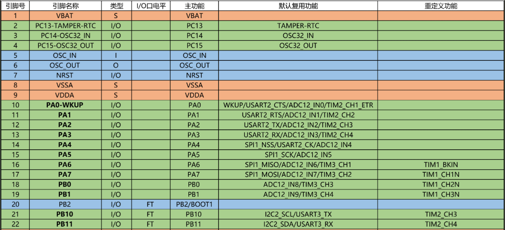

# 引脚复用（外部中断引脚选择）

* 使用片上外设控制GPIO的时候需要使用AFIO引脚复用功能，也就是让外设来控制GPIO

```c
//使用方法：在开启时钟的时候把对应的AFIO时钟也开了就行，然后如果需要复用推挽、开漏的话，在GPIO初始化的时候选上即可
RCC_APB2PeriphClockCmd(RCC_APB2Periph_AFIO, ENABLE);
```

# 复用功能引脚重映射

* 需要把某个外设的功能搬到另一个引脚上的时候需要使用**复用功能引脚重映射**



* 比如把上面TIM2_CH3，原本默认复用在PA2，要搬到PB10，就需要复用功能引脚重映射

```c
//1.第一步：开AFIO时钟
RCC_APB2PeriphClockCmd(RCC_APB2Periph_AFIO, ENABLE);

//2.第二步：在引脚重映射函数参数中选择对应的功能搬过来即可
GPIO_PinRemapConfig(GPIO_PartialRemap2_TIM2, ENABLE);//这样就把TIM2的功能重映射了
```
