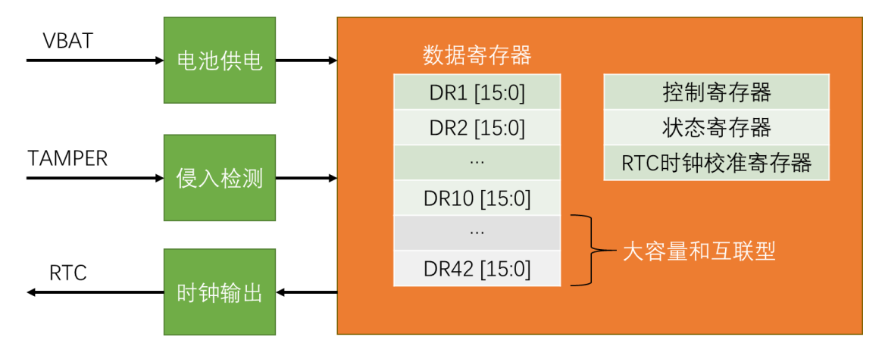

# BKP介绍
* **BKP（Backup Registers）备份寄存器或者叫后备寄存器**。可用于存储用户应用程序数据。BKP的特性是当VDD电源被切断，它们仍然由**VBAT维持供电**。当系统在待机模式下被唤醒，或系统复位或电源复位时，它们也不会被复位。这里VDD就是系统的主电源，供电电压是2.0-3.6V，VBAT就是备用电池电源，供电电压是1.8-3.6V。**TAMPER引脚**产生的侵入事件也可以将所有备份寄存器内容清除，可以用于设备防拆检测。**RTC引脚输出RTC校准时钟**、**RTC闹钟脉冲或者秒脉冲**，可以用于为其它设备提供时钟。存储RTC时钟校准寄存器用于校准时钟。可以看出BKP和RTC的关联程度很高，设计者就是把RTC的这两个功能放到BKP中了。BKP的用户数据存储容量是 20字节（中容量和小容量）/ 84字节（大容量和互联型），对于STM32F103C8T6芯片来说，其BKP容量是20字节。
# BKP结构



* BKP基本结构图。图中橙色部分可以称为后备区域，BKP处于后备区域，但**后备区域不只有BKP，还有RTC的相关电路**也位于后备区域。STM32后备区域的特性就是当VDD主电源掉电时，后备区域仍然可以由VBAT的备用电池供电。当VDD主电源上电时，后备区域供电会由VBAT切换到VDD，也就是主电源有电时，VBAT是不会用的，这样可以节省电池电量。然后BKP是位于后备区域的，BKP里主要有数据寄存器、控制寄存器、状态寄存器和RTC时钟校准寄存器等。其中数据寄存器是主要部分，它用来存储数据的。每个数据寄存器都是16位的，也就是一个数据寄存器可以存2个字节。对于中容量和小容量的设备，里面有DR1、DR2一直到DR10，总共10个数据寄存器。一个进入寄存器存2个字节，所以总容量是20个字节。对于大容量和互联型设备，里面除了DR1到DR10，还有DR11、DR12一直到DR42，总共42个数据寄存器，因此其总容量是84个字节。BKB还有另外几个功能。侵入检测，可以从PC13位置的TEMPER引脚，引入一个检测信号，当TEMPER产生上升沿或者下降沿时，清除BKP所有的内容，以保证安全。时钟输出，可以把RTC的相关时钟，从对应的RTC引脚输出数据，供外部使用。其中输出校准时钟时再配合BKP中的时钟校准寄存器，可以对RTC的误差进校准。

# 读写BKP示例代码
* **对应的头文件**
```c
#include "stm32f10x.h"                  // Device header
#include "MYBKP.h"

//BKP的数据断电会丢失，所以不能把电池拔了，拔了就丢失了！！！

void MYBKP_Init(void)
{
    /*
	执行以下操作可以使能对备份寄存器和RTC的访问。
	● 通过设置寄存器RCC_APB1ENR的PWREN和BKPEN位来打开电源和后备接口的时钟
	● 电源控制寄存器(PWR_CR)的DBP位来使能对后备寄存器和RTC的访问。	
	*/
    RCC_APB1PeriphClockCmd(RCC_APB1ENR_BKPEN,ENABLE);
    RCC_APB1PeriphClockCmd(RCC_APB1ENR_PWREN,ENABLE);
    PWR_BackupAccessCmd(ENABLE);
}

//写
void MyBKP_WriteBackupRegister(uint16_t BKP_DR, uint16_t Data)
{
	BKP_WriteBackupRegister( BKP_DR,  Data);
}

//读
uint16_t MyBKP_ReadBackupRegister(uint16_t BKP_DR)
{
	return BKP_ReadBackupRegister(BKP_DR);
}
```
* **对应的main函数**
```c
#include "stm32f10x.h"  
#include "Delay.h"
#include "OLED.h"
#include "MYBKP.h"

int main(void)
{
	//上电后等待设备准备好
	Delay_ms(100);
	//中断优先级组策略，一个工程中定义一次就好
	NVIC_PriorityGroupConfig(NVIC_PriorityGroup_2);
	//初始化硬件
	OLED_Init();
	OLED_Clear();
	MYBKP_Init();
	
	//可以通过注释这一行并拔掉电池来测试这一功能
	MyBKP_WriteBackupRegister(BKP_DR1,0xA1B1); //BKP_DR1 .... BKP_DR10
	
	OLED_ShowHexNum(1,1,MyBKP_ReadBackupRegister(BKP_DR1),4);		
	while(1){	
	}
}
```