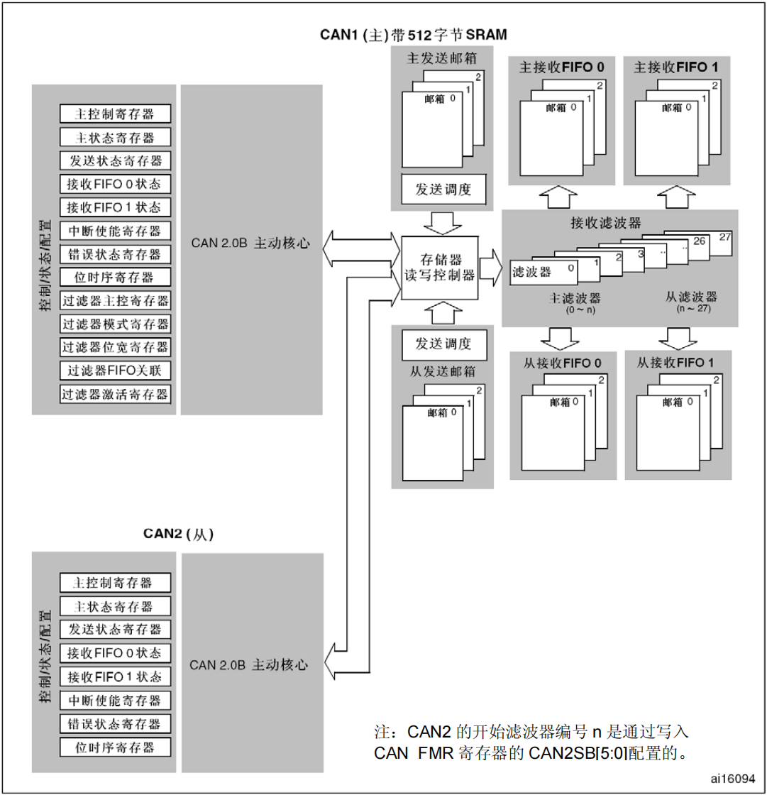
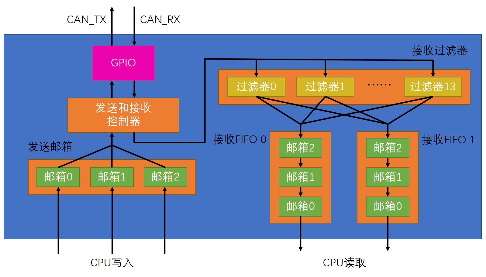
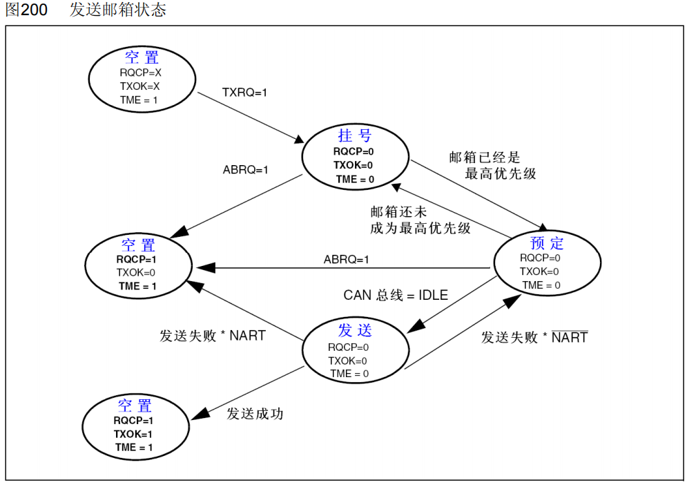
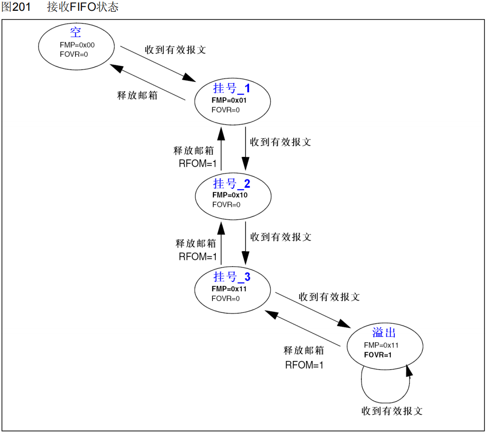
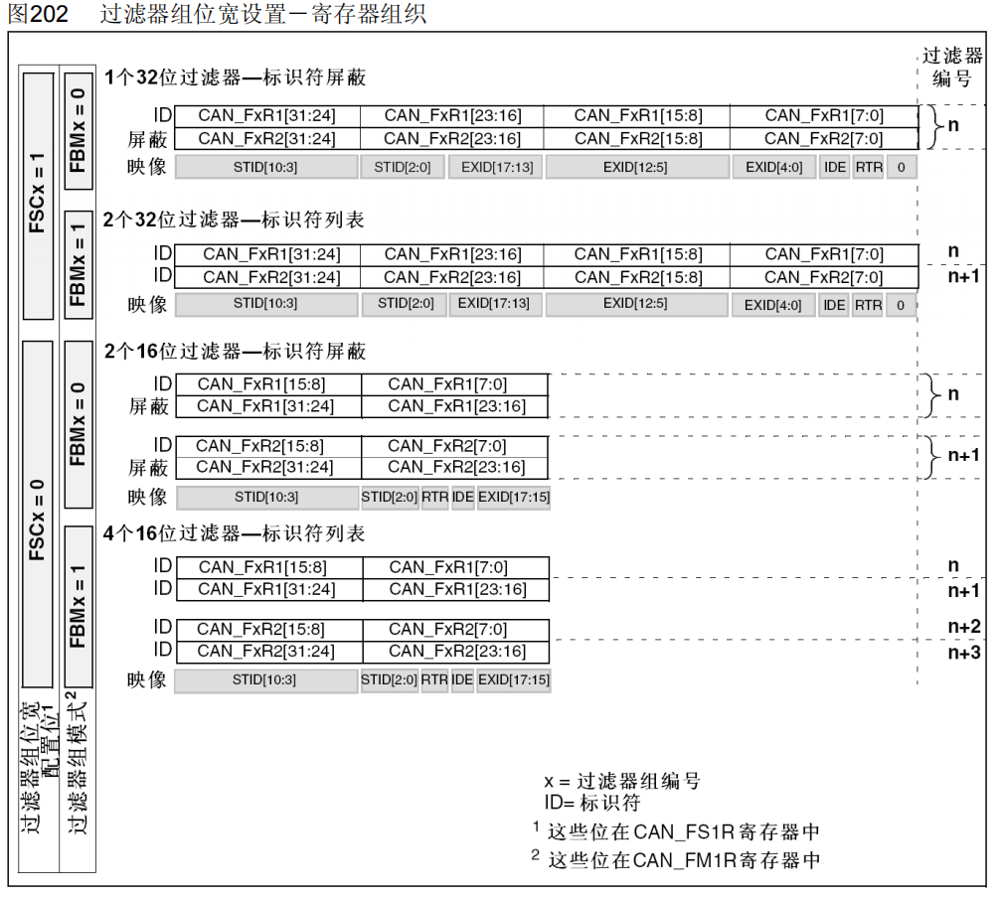
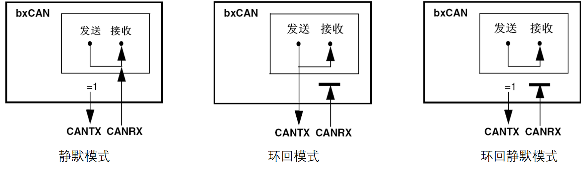
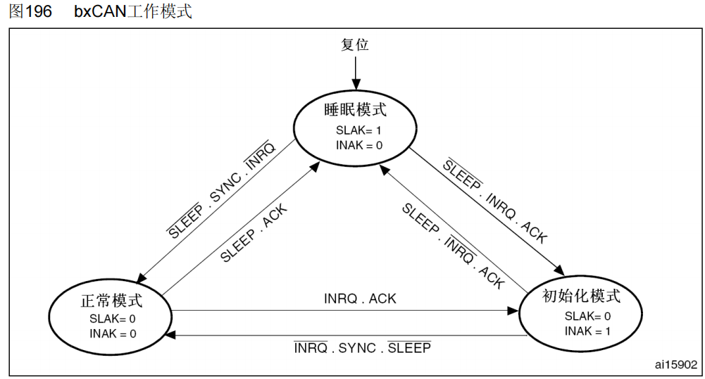
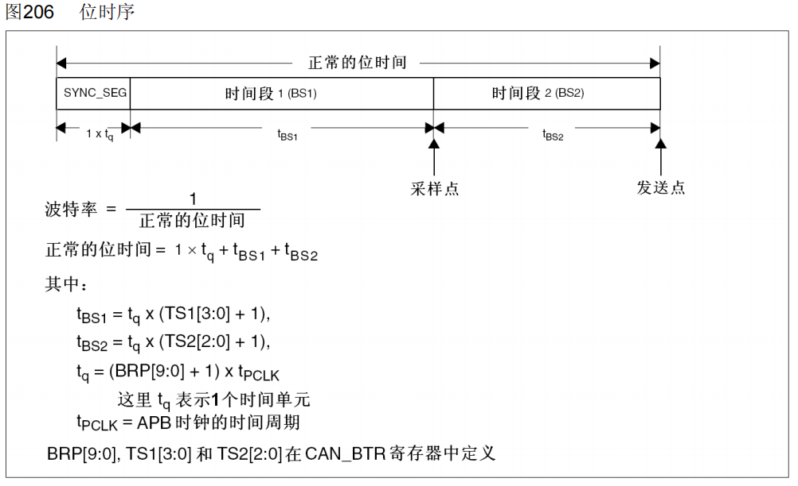

# 一、bxCAN 控制器

## 1. bxCAN控制器简介

* STM32低端型号（STM32F103C8T6）内置bxCAN外设（CAN控制器），支持CAN2.0A和2.0B，可以自动发送CAN报文和按照过滤器自动接收指定CAN报文，程序只需处理报文数据而无需关注总线的电平细节，CAN控制器需要外接CAN收发器才能实现CAN通信
* 波特率最高可达1兆位/秒
* 3个可配置优先级的发送邮箱
* 2个3级深度的接收FIFO
* 14个过滤器组（互联型28个）
* 时间触发通信、自动离线恢复、自动唤醒、禁止自动重传、 接收FIFO溢出处理方式可配置、发送优先级可配置、双CAN模式
* bxCAN外设是不支持CANFD的，只有高端型号的FDCAN控制器才支持

## 2. bxCAN框图

## 3. CAN基本结构

* CPU只需要将数据放入发送邮箱然后请求发送，或者从接收FIFO邮箱中读取数据，具体的时序生成，发送接收，由bxCAN控制器管理员自动实现

* 发送邮箱有三个是防止CPU放入帧到邮箱，但是由于总线忙碌，bxCAN控制器管理员没来得及发送出去，因此需要一些缓冲区
* 可以通过过滤器来配置不接收或者只接收什么类型的数据，并且可以将不同过滤器接收到的数据放入不同的FIFO
* 每个接受FIFO队列都有3个邮箱，这样的话可以将通过过滤器的帧放到邮箱中等待CPU读取（可以通过配置来控制邮箱满后的逻辑，比如新来的顶掉最后一个或者如果队列满员新来的帧直接丢失）

## 4. 发送接收

### 4.1 配置寄存器

* **NART 禁止报文自动重传 (No automatic retransmission)：**
  * 置1，关闭自动重传，CAN报文只被发送1次，不管发送的结果如何（成功、出错或仲裁丢失）；
  * 置0，自动重传，CAN硬件在发送报文失败时会一直自动重传直到发送成功
* **TXFP 发送FIFO优先级 (Transmit FIFO priority)：**
  * 置1，优先级由发送请求的顺序来决定，先请求的先发送；
  * 置0，优先级由报文标识符来决定，标识符值小的先发送（标识符值相等时，邮箱号小的报文先发送）
* **RFLM 接收FIFO锁定模式 (Receive FIFO locked mode)：**
  * 置1，接收FIFO锁定，FIFO溢出时，新收到的报文会被丢弃；
  * 置0，禁用FIFO锁定，FIFO溢出时，FIFO中最后收到的报文被新报文覆盖

### 4.2 发送过程

> **选择一个空置邮箱 → 写入报文 → 请求发送**

**寄存器描述：**

1. **RQCP: 邮箱请求完成 (Request completed mailbox) **

   当上次对邮箱的请求(发送或中止)完成后，硬件对该位置’1’。

   软件对该位写’1’可以对其清’0’；当硬件接收到新的发送请求时也对该位清’0’(CAN_TIR 寄存器的TXRQ位被置’1’)。

   该位被清’0’时，邮箱的其它发送状态位(TXOK, ALST和TERR)也被清’0’。

2. **TXOK: 邮箱发送成功 (Transmission OK of mailbox)** 

   每次在邮箱1进行发送尝试后，硬件对该位进行更新：

   0：上次发送尝试失败；

   1：上次发送尝试成功。

   当邮箱的发送请求被成功完成后，硬件对该位置’1’。

3. **TXRQ: 发送数据请求 (Transmit mailbox request) **

   由软件对其置’1’，来请求发送邮箱的数据。

   当数据发送完成，邮箱为空时，硬件对其清’0’。

4. **TME2: 发送邮箱空 (Transmit mailbox empty) **

   当邮箱中没有等待发送的报文时，硬件对该位置’1’。

5. **ABRQ: 邮箱中止发送 (Abort request for mailbox 1) **

   软件对该位置’1’，可以中止邮箱的发送请求，当邮箱的发送报文被清除时硬件对该位清’0’。

   如果邮箱中没有等待发送的报文，则对该位置’1’没有任何效果。

### 4.3 接收过程

**寄存器描述：**

1. **FMP[1:0]: FIFO 报文数目 (FIFO message pending) **

   反映了当前接收FIFO中存放的报文数目。每当1个新的报文被存入接收FIFO，硬件就对FMP加'1'。每当软件对'RFOM'位写'1'来释放输出邮箱，FMP1就被减'1'，直到其为'0'。

2. **FOVR: FIFO 溢出 (FIFO overrun) **

   当FIFO已满，又收到新的报文且报文符合过滤条件，硬件对该位置’1’。该位由软件清’0’。

3. **RFOM: 释放接收FIFO输出邮箱 (Release FIFO output mailbox) **

   软件通过对该位置’1’来释放接收FIFO的输出邮箱。如果接收FIFO为空，那么对该位置’1’没有任何效果，即只有当FIFO中有报文时对该位置’1’才有意义。如果FIFO中有2个以上的报文，由于FIFO的特点，软件需要释放输出邮箱才能访问第2个报文。当输出邮箱被释放时，硬件对该位清’0’。

## 5. 标识符过滤器

### 5.1 标识符过滤器简介

> 总线上的报文很多，每个设备可以通过设置过滤器来选择自己只接收什么类型的报文，这样的话就减少了软件编写时的额外过滤操作

### 5.2 过滤器寄存器

> **注：该寄存器是左对齐的，写入的时候记得左移**
>
> 1. 每个过滤器的核心由两个32位寄存器组成：R1[31:0] 和 R2[31:0]
>
> 2. **FSCx：位宽设置 **
>
>    置0，16位；置1，32位
>
> 3. **FBMx：模式设置  **  
>
>    置0，屏蔽模式；置1，列表模式
>
> 4. **FFAx：关联设置 **
>
>    置0，FIFO 0；置1，FIFO 1
>
> 5. **FACTx：激活设置 **   
>
>    置0，禁用；置1，启用

### 5.3 列表模式/屏蔽模式

> **屏蔽模式: ** ID决定了我需要的ID，屏蔽位控制着ID对应的位是否必须匹配成功才允许通过，1表示必须匹配，0不做限制
>
> **列表模式: ** 只有在列表里的ID才可以通过

## 6. 测试模式

* **静默模式：**用于分析CAN总线的活动，不会对总线造成影响
* **环回模式：**用于自测试，同时发送的报文可以在CAN_TX引脚上检测到
* **环回静默模式：**用于热自测试，自测的同时不会影响CAN总线

## 7. 工作模式

* **初始化模式：**用于配置CAN外设，禁止报文的接收和发送
* **正常模式：**配置CAN外设后进入正常模式，以便正常接收和发送报文
* **睡眠模式：**低功耗，CAN外设时钟停止，可使用软件唤醒或者硬件自动唤醒
  * **AWUM：**`置1，自动唤醒`，一旦检测到CAN总线活动，硬件就自动清零SLEEP，唤醒CAN外设；`置0，手动唤醒`，软件清零SLEEP，唤醒CAN外设

## 8. 位时序

CAN外设的位时序配置和CAN协议稍有不同，但是总体是一样的:

* SS = 1Tq
* BS1 = 1~16Tq
* BS2 = 1~8Tq
* SJW = 1~4Tq

> **波特率：**
>
> = CAN控制器总线频率 / 分频系数 / 一位的Tq数量 
>
> = 36MHz / (BRP[9:0] +1) / (1+(TS1[3:0] +1 ) + (TS2[2:0] +1))

## 9. 中断

# 二、FDCAN 控制器
