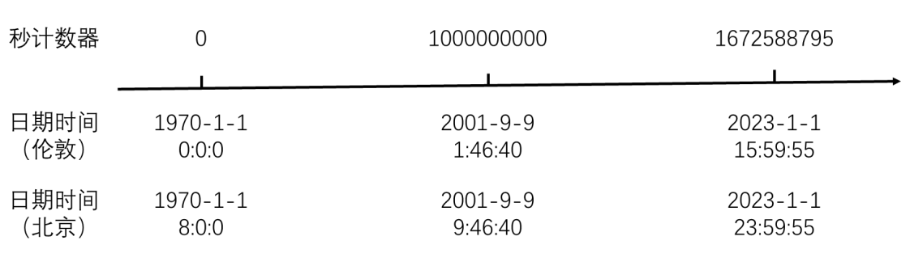
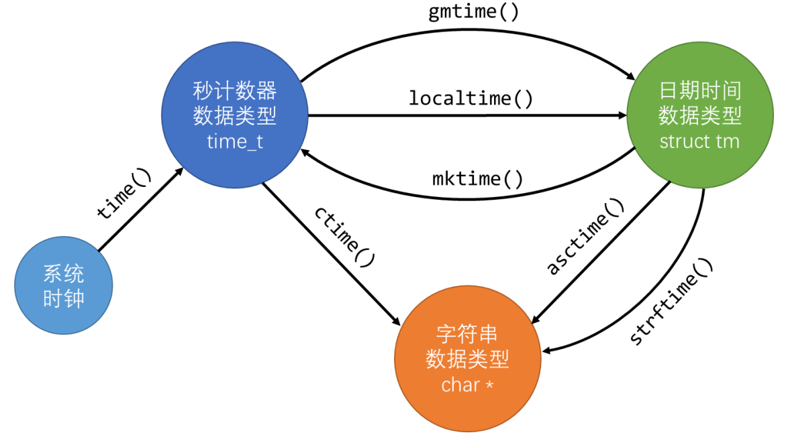
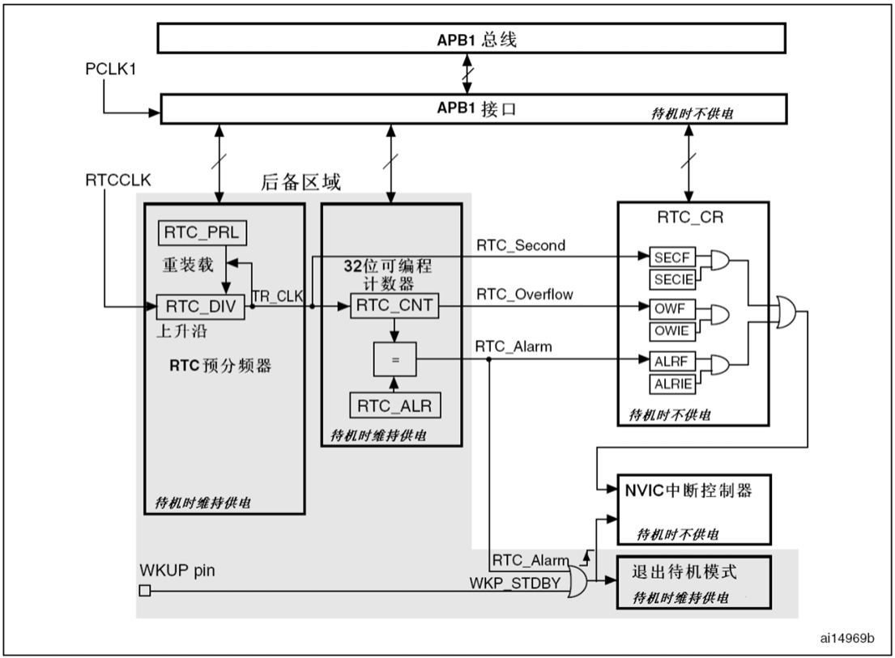
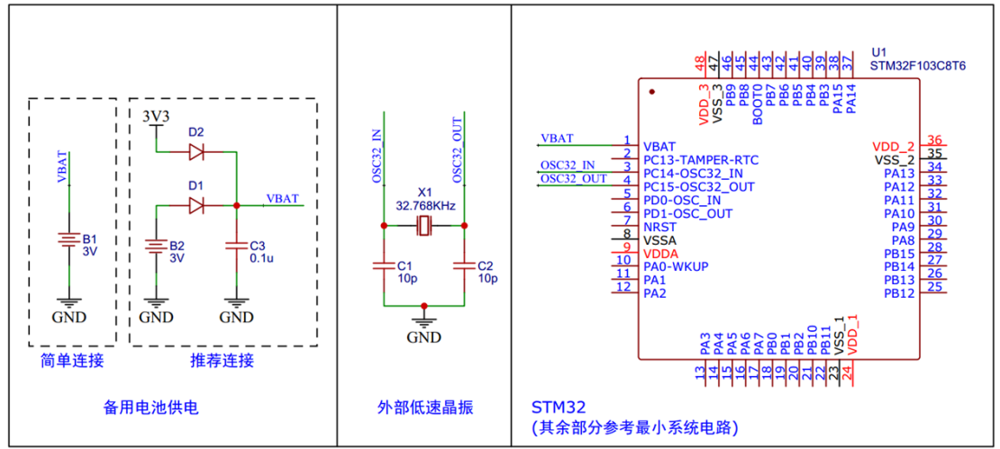

# 一、时间处理

## （1）Unix时间戳
* Unix时间戳（Unix Timestamp）最早是在Unix系统使用的，所以叫Unix时间戳。目前Linux、Windows、MacOS、Android这些系统，它们底层的计时系统都是使用的Unix时间戳，所以在现代计算机世界的底层，Unix时间戳还是在扮演着重要的角色的。**Unix 时间戳定义为从UTC/GMT的1970年1月1日0时0分0秒开始所经过的秒数**，不考虑闰秒。时间戳存储在一个秒计数器中，秒计数器为32位/64位的整型变量。世界上**所有时区的秒计数器相同**，但是世界上不同地区有不同的时区，全球目前被划分为24个不同的时区，其中穿过英国伦敦的经线被称作本初子午线，前面所说的**1970年1月1日0时0分0秒指的就是伦敦时间**。对于世界上其他不同时区的地方通过**添加偏移来得到当地时间**。比如下图就是伦敦时间和北京时间的换算关系。



## （2）时间处理



| 函数                                                           | 作用                   |
| :----------------------------------------------------------- | :------------------- |
| time_t time(time_t*);                                        | 获取系统时钟秒计数器           |
| struct tm\* localtime(const time_t*);                        | 秒计数器转换为日期时间结构体（当地时间） |
| time_t mktime(struct tm*);                                   | 日期时间结构体转换为秒计数器（当地时间） |
| char\* ctime(const time_t*);                                 | 秒计数器转换为字符串（默认格式）     |
| char\* asctime(const struct tm*);                            | 日期时间转换为字符串（默认格式）     |
| size_t strftime(char, size_t, const char, const struct tm*); | 日期时间结构体转换为字符串（自定义格式） |
## （3）GMT/UTC时间
* **GMT（Greenwich Mean Time）格林尼治标准时间标准时间**，就是传统的计时方法
* **UTC（Universal Time Coordinated）协调世界时**。它是一种以原子钟为基础的时间计量系统。它规定铯133原子基态的两个超精细能级间在零磁场下跃迁辐射9,192,631,770周所持续的时间为1秒。**由于地球自转变慢，UTC引入了闰秒机制，程序员需软件修正，否则与收拾中心的时间会产生偏差**
# 二、RTC实时时钟
## （1）RTC是什么？
* RTC（Real Time Clock）实时时钟。RTC是一个独立的定时器，可为系统提供时钟和日历的功能。RTC和时钟配置系统处于**后备区域**，**系统复位时数据不清零**，VDD（2.0-3.6V）断电后可**借助VBAT（1.8- 3.6V）供电**继续走时。和BKP的是一样的，主电源断电，复位，时间都应该继续，因此就需要备用电池来维持电路的继续运行了。包含一个32位的可编程计数器，可对应Unix时间戳的秒计数器，一个20位的可编程预分频器，可适配不同频率的输入时钟。这里由于一秒计数一次需要一个1Hz的信号驱动计数器，但是实际提供给RTC模块的时钟频率通常都比较高，所以需要分频器来处理转换一下。
* 可选择**三种RTC时钟源**，分别是**HSE时钟除以128（通常为8MHz/128）、LSE振荡器时钟（通常为32.768KHz）、LSI振荡器时钟（40KHz）**。之前讲过的RCC时钟树中提到过整个芯片可以有4个时钟源，分别是HSE高速外部时钟信号、HSI高速内部时钟信号、LSI低速内部时钟信号、LSE低速外部时钟信号。其中H表示高速，L表示低速，E表示外部，I表示内部。高速时钟一般供内部程序运行和主要外设使用，低速时钟一般供RTC，看门狗这些东西使用。所以HSE通常是外部主晶振信号，LSE那一路是最为常用的32.768kHz的外部RTC晶振信号，LSI这一路是芯片内部的振荡电路，它的精度不高，只是做备用而已。通常最常用的都是LSE这一路时钟信号。而且，**HSE和LSI两路时钟在主电源断电时，都会断电**，只有**LSE这一路在主电源断电后，备用电池还会给它供电**，所以如果要实现关机状态继续走时的功能就必须选用LSE这一路时钟信号。
## （2）RTC基本结构
* **阴影部分是可以由电池供电的后备区域，断电不丢失**
* **DIV**是一个自减计数器，来一个时钟减一下，**重装计数器**存储的是计数目标值
* 在计数器右边有**3个信号可以触发中断**，分别是**秒信号**、**计数器溢出信号**和**闹钟信号**。三个信号先通过中断输入控制进中断使能，使能的中断才能通向NVIC，然后向CPU申请中端。
* 需要**闹钟**的话，配置30位闹钟值即可。需要中断的话，先允许中断，再配置NVIC，最后写对应的中断函数即可。



## （3）推荐电路



## （4）使用步骤
1. 对于BKP和RTC的开启比较复杂，需要先开启后备区和电源控制时钟并且设置后备区电源使能才可以开启并允许访问，具体步骤如下：
	* 开启时钟RCC_APB1ENR的PWREN和BKPEN，使能PWR和BKP时钟
	* 开启后备区的电源：PWR_BackupAccessCmd(ENABLE);
2. 设置外部时钟源，并启动RTC时钟
3. 如果需要读写RTC寄存器，需要等待系统时钟同步，不然没法读写
4. 配置RTC分频器里寄存器的值
5. 任何操作RTC寄存器都需要等待上次操作完成：void RTC_WaitForLastTask(void)；操作完最好也等待一下
6. 如果需要使用中断，就要给对应的中断使能然后设置NVIC结构体的值并初始化
# 三、代码示例（通过串口设置闹钟中断点灯）
* **RTC配置函数**
```c
#include "stm32f10x.h"                  // Device header
#include "MYRTC.h"
#include "time.h"

void MyRTC_Init(void)
{
    /*1.开时钟
	行以下操作将使能对后备寄存器和RTC的访问：
	设置寄存器RCC_APB1ENR的PWREN和BKPEN位，使能电源和后备接口时钟
	设置寄存器PWR_CR的DBP位，使能对后备寄存器和RTC的访问。
	*/
    RCC_APB1PeriphClockCmd(RCC_APB1Periph_PWR,ENABLE);
	RCC_APB1PeriphClockCmd(RCC_APB1Periph_BKP,ENABLE);
	PWR_BackupAccessCmd(ENABLE);
	
    /*2.开启外部LSE 32.768KHz 晶振
	LSE晶体是一个32.768kHz的低速外部晶体或陶瓷谐振器。它为实时时钟或者其他定时功能提供
	一个低功耗且精确的时钟源。
	LSE晶体通过在备份域控制寄存器(RCC_BDCR)里的LSEON位启动和关闭。
	在备份域控制寄存器(RCC_BDCR)里的LSERDY指示LSE晶体振荡是否稳定。在启动阶段，直
	到这个位被硬件置’1’后，LSE时钟信号才被释放出来。如果在时钟中断寄存器里被允许，可产
	生中断申请。
	*/
    RCC_LSEConfig(RCC_LSE_ON); //开启LSE
	while(RCC_GetFlagStatus(RCC_FLAG_LSERDY)!=SET);//等待 LSE晶体振荡稳定
	
	//3.配置RTC的时钟来源，必须是LSE，因为只有他是掉电后仍然能由电池供电的
	RCC_RTCCLKConfig(RCC_RTCCLKSource_HSE_Div128);
	
	//4.启动RTC时钟
	RCC_RTCCLKCmd(ENABLE);

    //5.等待帧同步
	/*	
	RTC核完全独立于RTC的APB1接口。
	软件可以通过APB1接口配置RTC的预分频值 、 计数器值和闹钟值。但是，相关的可读寄存器只在与
	RTC APB1时钟进行重新同步的RTC时钟的上升沿被更新。RTC标志也是如此的。
	这意味着，如果APB1接口曾经被关闭，而读操作又是在刚刚重新开启APB1之后，则在第一次
	的内部寄存器更新之前，从APB1上读出的RTC寄存器数值可能被破坏了(通常读到0)。
	*/
	RTC_WaitForSynchro();
	
	/*6.配置RTC的分频器
	配置过程：
	1. 查询RTOFF位，直到RTOFF的值变为’1’
	2. 置CNF值为1，进入配置模式
	3. 对一个或多个RTC寄存器进行写操作
	4. 清除CNF标志位，退出配置模式
	5. 查询RTOFF，直至RTOFF位变为’1’以确认写操作已经完成。
	仅当CNF标志位被清除时，写操作才能进行，这个过程至少需要3个RTCCLK周期。
	*/
	RTC_WaitForLastTask();	
	RTC_SetPrescaler(32768-1);
	RTC_WaitForLastTask();	
	
	//打开闹钟中断
	//中断使能
	RTC_ITConfig(RTC_IT_ALR,ENABLE);
	
	NVIC_InitTypeDef NVIC_InitTypeStructure;
	NVIC_InitTypeStructure.NVIC_IRQChannel = RTC_IRQn;
	NVIC_InitTypeStructure.NVIC_IRQChannelCmd = ENABLE;
	NVIC_InitTypeStructure.NVIC_IRQChannelPreemptionPriority = 1;
	NVIC_InitTypeStructure.NVIC_IRQChannelSubPriority = 1;
	NVIC_Init(&NVIC_InitTypeStructure);
}

//设置一个指定的时间  uint16_t CurrentDate[]={2024,12,4,14,27,30}
void MyRTC_SetTime(uint16_t *CurrentDateSet)
{
	//1.把日期格式转为时间戳	
	
	//int tm_sec;   /* seconds after the minute, 0 to 60
	//             (0 - 60 allows for the occasional leap second) */
	//int tm_min;   /* minutes after the hour, 0 to 59 */
	//int tm_hour;  /* hours since midnight, 0 to 23 */
	//int tm_mday;  /* day of the month, 1 to 31 */
	//int tm_mon;   /* months since January, 0 to 11 */
	//int tm_year;  /* years since 1900 */	
	
	struct tm date;
	date.tm_year=CurrentDateSet[0]-1900;	
	date.tm_mon = CurrentDateSet[1]-1;
	date.tm_mday = CurrentDateSet[2];
	date.tm_hour =CurrentDateSet[3];
	date.tm_min = CurrentDateSet[4];
	date.tm_sec = CurrentDateSet[5];
	
	time_t timestamp= mktime(&date) - 8*60*60; //设置的是伦敦时间，要减掉8小时
	
	
	RTC_WaitForLastTask();
	RTC_SetCounter(timestamp);//设置时间戳
	RTC_WaitForLastTask();
	
}


//获取时间 uint16_t CurrentReadDate[6];
void MyRTC_GetTime(uint16_t *CurrentReadDate)
{
	//获取时间戳
	time_t timestamp = RTC_GetCounter() + 8*60*60; //换算成北京时间
	//转为日期格式
	struct tm date;
	date = *localtime(&timestamp);
	//int tm_sec;   /* seconds after the minute, 0 to 60
	//             (0 - 60 allows for the occasional leap second) */
	//int tm_min;   /* minutes after the hour, 0 to 59 */
	//int tm_hour;  /* hours since midnight, 0 to 23 */
	//int tm_mday;  /* day of the month, 1 to 31 */
	//int tm_mon;   /* months since January, 0 to 11 */
	//int tm_year;  /* years since 1900 */	
	CurrentReadDate[0]=date.tm_year + 1900;
	CurrentReadDate[1]=date.tm_mon + 1;
	CurrentReadDate[2]=date.tm_mday;
	CurrentReadDate[3]=date.tm_hour;
	CurrentReadDate[4]=date.tm_min;
	CurrentReadDate[5]=date.tm_sec;	
}

//设置闹钟时间
void MyRTC_SetAlarm(uint16_t *AlarmWriteDate)
{
	struct tm date;
	date.tm_year=AlarmWriteDate[0]-1900;	
	date.tm_mon = AlarmWriteDate[1]-1;
	date.tm_mday = AlarmWriteDate[2];
	date.tm_hour =AlarmWriteDate[3];
	date.tm_min = AlarmWriteDate[4];
	date.tm_sec = AlarmWriteDate[5];
	
	time_t timestamp= mktime(&date) - 8*60*60 -1; //设置的是伦敦时间，要减掉8小时 , 减1秒是因为多数了1秒
	
	
	RTC_WaitForLastTask();
	RTC_SetAlarm(timestamp);//设置闹钟时间
	RTC_WaitForLastTask();
	
}

void LED_Init(void)
{
	RCC_APB2PeriphClockCmd(RCC_APB2Periph_GPIOA,ENABLE);
	GPIO_InitTypeDef GPIO_InitTypeDefstructure;
	GPIO_InitTypeDefstructure.GPIO_Mode = GPIO_Mode_Out_PP;
	GPIO_InitTypeDefstructure.GPIO_Pin = GPIO_Pin_1;
	GPIO_InitTypeDefstructure.GPIO_Speed = GPIO_Speed_50MHz;
	
	GPIO_Init(GPIOA,&GPIO_InitTypeDefstructure);
}
```
* **对应的主函数（串口部分在串口笔记里找）**
```c
#include "stm32f10x.h"  
#include "Delay.h"
#include "OLED.h"
#include "MyRTC.h"
#include "Serial2.h"
#include "string.h"
#include "stdio.h"
#include "time.h"
#include "stdlib.h"

uint16_t CurrentWriteDate[]={2024,12,4,14,27,30};
uint16_t CurrentReadDate[6];

int main(void)
{
	Delay_s(1); //上电后等设备准备好
	NVIC_PriorityGroupConfig(NVIC_PriorityGroup_2); //一个project中定义一次即可
	//初始化硬件
	OLED_Init();
	OLED_Clear();	
	MyRTC_Init();
	LED_Init();
	Serial2_Init();
	//设置时间
	MyRTC_SetTime(CurrentWriteDate);
	while (1)
	{
		if(USART2_RxStringGetComplateFlagStatus()==1)
		{
			char str[20]="";
			strcpy(str,USART2_RxStringGetData());
			OLED_ShowString(4,1,str);
			uint16_t alarm[6]={0};
			sscanf(str,"%hu %hu %hu %hu %hu %hu",&alarm[0],&alarm[1],&alarm[2],&alarm[3],&alarm[4],&alarm[5]);
			MyRTC_SetAlarm(alarm);
		}
		OLED_ShowNum(1,1,RTC_GetCounter(),10);
		//获取当前时间
		MyRTC_GetTime(CurrentReadDate);
		OLED_ShowNum(2,1,CurrentReadDate[0],4);
		OLED_ShowNum(2,6,CurrentReadDate[1],2);
		OLED_ShowNum(2,9,CurrentReadDate[2],2);
		OLED_ShowNum(3,1,CurrentReadDate[3],2);
		OLED_ShowNum(3,4,CurrentReadDate[4],2);
		OLED_ShowNum(3,7,CurrentReadDate[5],2);
	}
}

//闹钟中断服务函数
void RTC_IRQHandler(void)
{
	if(RTC_GetITStatus(RTC_IT_ALR)==SET)
	{
		GPIO_WriteBit(GPIOA,GPIO_Pin_1,Bit_SET);
		RTC_ClearITPendingBit(RTC_IT_ALR);
	}
}
```