# 一、定时器

## （1）定时器介绍

TIM（Timer）定时器，可以对输入的时钟进行计数，并在计数值达到设定值时触发中断
* **时基单元：**
	* 16 位计数器（数多少，可以是 向上数，向下数，中间对齐数）计数器寄存器(TIMx_CNT) 
	* 16 位预分频器（分频多少）预分频器寄存器 (TIMx_PSC) 
	* 自动重装寄存器（数到多少就停） 自动装载寄存器 (TIMx_ARR)
* **作用：**
	* 定时中断功能 
	* 内外时钟源选择、输入捕获、输出比较、编码器接口、主从触发模式等多种功能
## （2）定时器类型

|  类型   |                         功能                         |
| :---: | :------------------------------------------------: |
| 高级定时器 |      拥有通用定时器全部功能，并额外具有重复计数器、死区生成、互补输出、刹车输入等功能      |
| 通用定时器 | 拥有基本定时器全部功能，并额外具有内外时钟源选择、输入捕获、输出比较、编码器接口、主从触发模式等功能 |
| 基本定时器 |                 拥有定时中断、主模式触发DAC的功能                 |

## （3）定时器框图
* **注意：**
	* 箭头向下是事件
	* 箭头向上是中断和DMA输出
	* 带阴影的寄存器是根据控制位的设定，在更新事件时传送预加载寄存器的内容至工作寄存器

1. **高级定时器框图**

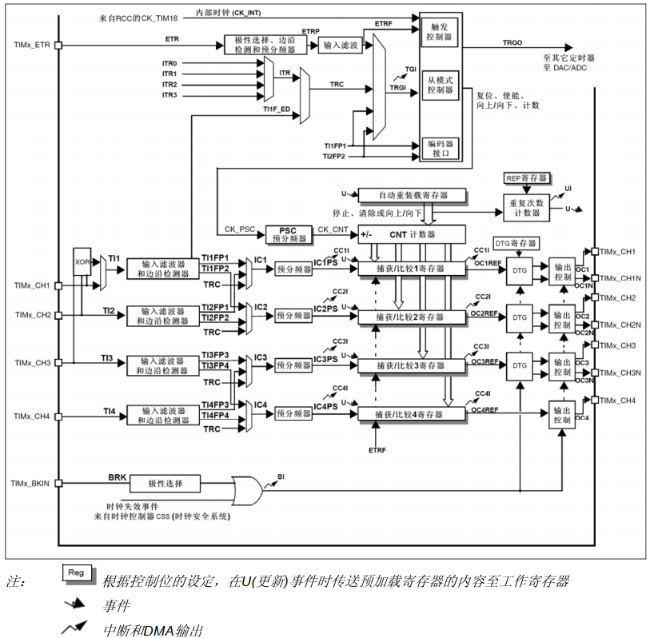

2. **通用定时器框图**

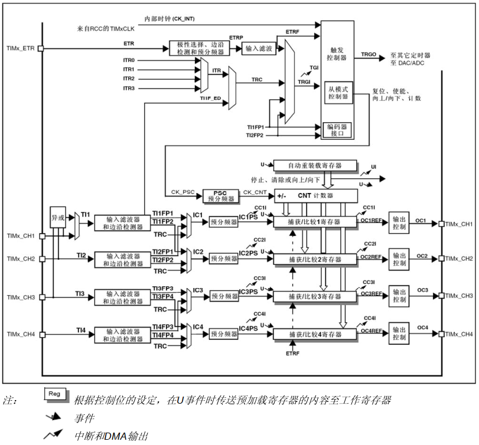

3. **基本定时器框图**

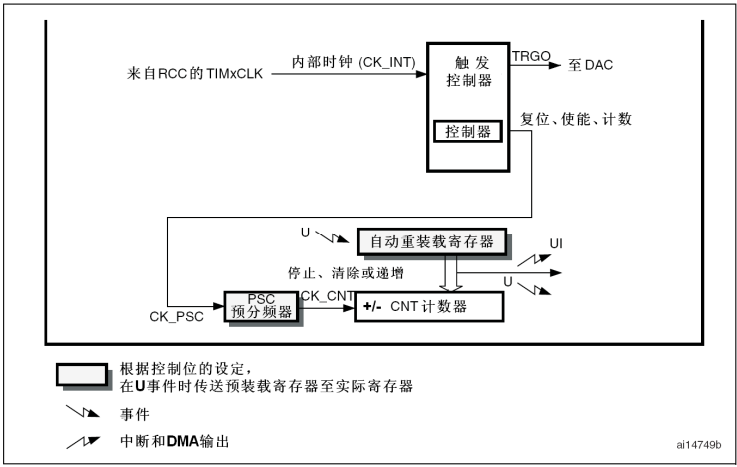

## （4）时钟树
* 具体每个芯片的定时器挂载在哪个时钟上，查看参考手册的时钟树（RCC）部分即可
# 二、定时器中断
## （1）基本结构

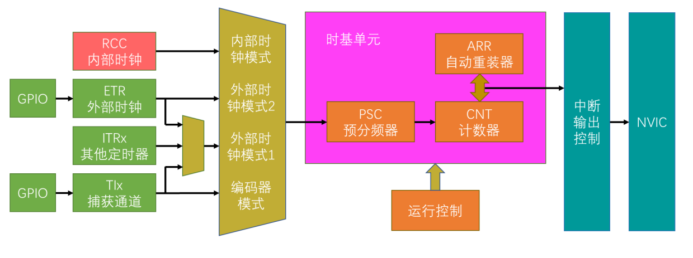

### 1. **定时器的时钟来源：**
* **内部时钟（CK_INT）**
	- **来源描述**：这是定时器最常用的时钟来源之一，来自于系统总线的时钟。
	- **应用场景**：在一般的定时任务中，如定时中断产生一定频率的脉冲信号或者进行简单的定时采样等操作，内部时钟作为稳定的时钟源是很好的选择。例如，在一个数据采集系统中，需要每隔一定时间（如 1ms）对传感器的数据进行采集，就可以使用内部时钟来驱动定时器产生 1ms 的定时中断。  
* **外部时钟模式 1（TIMx_ETR）**
	- **来源描述**：外部时钟信号可以通过定时器的外部触发输入引脚（TIMx_ETR）输入。这个外部时钟信号可以是由外部芯片（如外部晶振电路或者其他微控制器产生的时钟信号）提供的稳定时钟脉冲。外部时钟信号进入定时器后，经过滤波和极性选择等处理后，作为定时器的计数时钟。
	- **应用场景**：在与外部设备进行时钟同步的场合很有用。例如，在 SPI 通信中，当 SPI 主设备的时钟由外部的一个高精度时钟源提供时，从设备的 STM32 定时器可以将这个外部时钟作为输入，从而实现与主设备时钟的精确同步，确保数据传输的准确性。
* **外部时钟模式 2（TIx）**
	- **来源描述**：外部时钟信号通过定时器的通道引脚（如 TI1、TI2 等）输入。在这种模式下，定时器能够捕获外部输入信号的边沿（上升沿或者下降沿），并且每捕获一个边沿，定时器的计数器就会加 1。这使得定时器可以根据外部事件的发生频率来进行计数，外部事件的频率就相当于定时器的时钟频率。例如，当连接一个旋转编码器到定时器通道引脚时，编码器输出的脉冲信号可以作为外部时钟模式 2 的输入，定时器根据编码器脉冲来计数，进而可以测量电机等设备的转速。
	- **应用场景**：主要用于对外部事件进行计数和测量外部信号的频率、周期等参数。例如在电机控制中，用于测量电机的转速，通过将电机上的霍尔传感器信号连接到定时器通道引脚，定时器就能根据霍尔传感器输出的脉冲来计算电机的转速。
* **内部触发输入（ITRx）**
	- **来源描述**：这是一种利用内部信号触发定时器的方式。它通过内部的互连机制，将一个定时器的输出信号作为另一个定时器的触发信号，从而实现定时器之间的协同工作。例如，在复杂的多定时器应用场景下，定时器 1 的输出可以作为定时器 2 的内部触发输入，当定时器 1 满足一定条件产生输出信号时，定时器 2 开始计数或者执行其他操作。
	- **应用场景**：在需要多个定时器协同工作的复杂定时系统中应用广泛。比如在一个工业自动化控制系统中，需要按照一定的顺序和时间间隔控制多个执行机构，通过内部触发输入可以方便地实现定时器之间的联动，使得各个执行机构按照精确的时间顺序进行动作。
### 2. **时基单元的配置：**
* **PSC预分频器（16位）：**
	* **预分频系数：** 预分频器的值决定了输入时钟被分频的比例，预分频器的分频系数是由预分频器寄存器（PSC）的值加 1来决定的。例如：如果内部时钟频率为8MHz ，预分频器PSC值设置为 7，那么进入计数器的时钟频率为8MHz/（7+1）=1MHz 
* **CNT计数器的计数模式：**
	* **向上计数模式：** 计数器从 0 开始，按照经过预分频后的时钟脉冲逐次增加计数，当计数达到自动重装载寄存器（ARR）的值时，产生溢出事件。
	* **向下计数模式：** 计数器从自动重装载寄存器（ARR）的值开始，按照时钟脉冲逐次减少计数，当计数到 0 时，产生相应的事件，如中断。
	- **中央对齐计数模式**：计数器先向上计数，当计数达到 ARR 值的一半时，开始向下计数，直到计数到 0。
* **ARR自动重装载寄存器（16位）：**
	* 自动重装载寄存器用于设定计数器的计数上限。通过设置ARR寄存器来指定这个值。
	* 例如：当需要一个定时器每隔 1 秒产生一个溢出事件，且经过预分频后进入计数器的时钟频率为1MHz （周期为1us），那么自动重装载寄存器的值应该设置为1000000-1 （因为计数器是从0开始计数到上限的，而且1s=1000000us需要计数1000000次 ）。这样，计数器从 0 开始计数，当从0计数到 999999时就会产生溢出。
## （2）定时器中断示例代码
* 定时器中断函数
```c
void MyTime_Init(void){
	//1.初始化定时器时钟
	RCC_APB1PeriphClockCmd(RCC_APB1Periph_TIM2,ENABLE);
	
	//2.将指定的定时器（这里是 TIM2）配置为使用内部时钟作为其时钟源。
	TIM_InternalClockConfig(TIM2);
	
	//3.初始化时基单元
	TIM_TimeBaseInitTypeDef TIM_TimeBaseInitTypeDefStructure;
	TIM_TimeBaseInitTypeDefStructure.TIM_ClockDivision = TIM_CKD_DIV1;//不分频
	TIM_TimeBaseInitTypeDefStructure.TIM_CounterMode = TIM_CounterMode_Up;//向上
	TIM_TimeBaseInitTypeDefStructure.TIM_Period = 10000-1;//0-9999最大计数值
	TIM_TimeBaseInitTypeDefStructure.TIM_Prescaler = 7200-1;//7200分频
	TIM_TimeBaseInitTypeDefStructure.TIM_RepetitionCounter = 0;//重复计数0次
	//初始化时基单元，会生成一个更新事件，立即重新加载预分频器和重复计数器的值。
	TIM_TimeBaseInit(TIM2,&TIM_TimeBaseInitTypeDefStructure);
	
	//4.清除初始化产生的事件标志位，以便能正常启动
	TIM_ClearFlag(TIM2,TIM_FLAG_Update);
	
	//5.使能指定的定时器
	TIM_Cmd(TIM2,ENABLE);
	
	//6.启用或禁用指定的定时器（TIM）中断，可以选择中断外设和使用的中断源
	TIM_ITConfig(TIM2,TIM_IT_Update,ENABLE);
	
	//7.选择NVIC分组策略4（只有抢占优先级）
	NVIC_PriorityGroupConfig(NVIC_PriorityGroup_4);
	
	//8.初始化嵌套中断向量控制器（NVIC），以配置中断的优先级和使能相关中断通道
	NVIC_InitTypeDef NVIC_InitTypeDefStructure;
	NVIC_InitTypeDefStructure.NVIC_IRQChannel = TIM2_IRQn;//TIM2中断
	NVIC_InitTypeDefStructure.NVIC_IRQChannelCmd = ENABLE;//使能
	NVIC_InitTypeDefStructure.NVIC_IRQChannelPreemptionPriority = 0;//抢占0
	NVIC_InitTypeDefStructure.NVIC_IRQChannelSubPriority = 0;//响应0
	NVIC_Init(&NVIC_InitTypeDefStructure);
}

//中断服务函数，在startup_stm32fxxx.s这样的文件中可以找到对应的中断服务函数
void TIM2_IRQHandler(void){
	//检查指定的中断标志位是否被置位，确认是想要的中断才进入函数处理
	if(TIM_GetITStatus(TIM2,TIM_IT_Update)==SET)
	{
		Count++;
		//清除这个挂起位，以确保中断系统能够正确地响应下一次中断事件。
		TIM_ClearITPendingBit(TIM2,TIM_IT_Update);
	}
}
```
* 主函数
```c
int Count = 0;

int main(void)
{
	OLED_Init();
	OLED_Clear();
	MyTime_Init();
	while (1)
	{
		OLED_ShowNum(1,1,Count,5);
		OLED_ShowNum(2,1,Count,5);
	}
}
```
# 三、定时器输入捕获
## （1）什么是输入捕获
* 在输入捕获模式下，当通道输入引脚出现指定电平跳变时，当前CNT的值将被锁存到CCR中，可用于测量PWM波形的频率、占空比、脉冲间隔、电平持续时间等参数。
* 可配置为**PWMI模式**，同时测量PWM波形的频率和占空比。可配合主从触发模式，实现硬件全自动测量。
## （2）频率测量方法

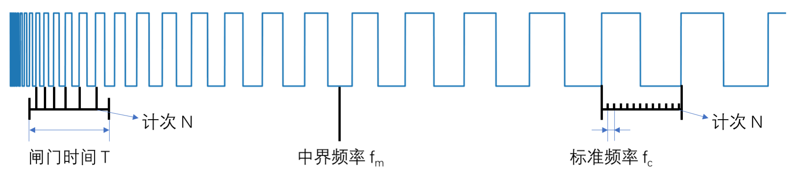

1. 测量频率通常有两种方法可以进行：一是**测频法**，二是**测周法**。 测频法适合测量高频信号，而测周法适合测量低频信号。
	* **测频法**就是在闸门时间T内，对上升沿计次，得到N，则频率为 f_x = N / T。 
	* **测周法**就是在两个上升沿内，以标准频率fc计次，得到N ，则频率为 f_x = f_c / N 。

2. 方法选择要根据中界频率来判断：**中界频率**是指测频法与测周法误差相等的频率点。这个频率点可以利用下面的公式来计算：

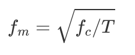

* 当**待测信号频率小于中界频率**时，测周法误差更小，选用测周法更合适；
* 当**待测信号频率大于中界频率**时，测频法误差更小，选用测频法更为合适。
## （3）主从触发模式

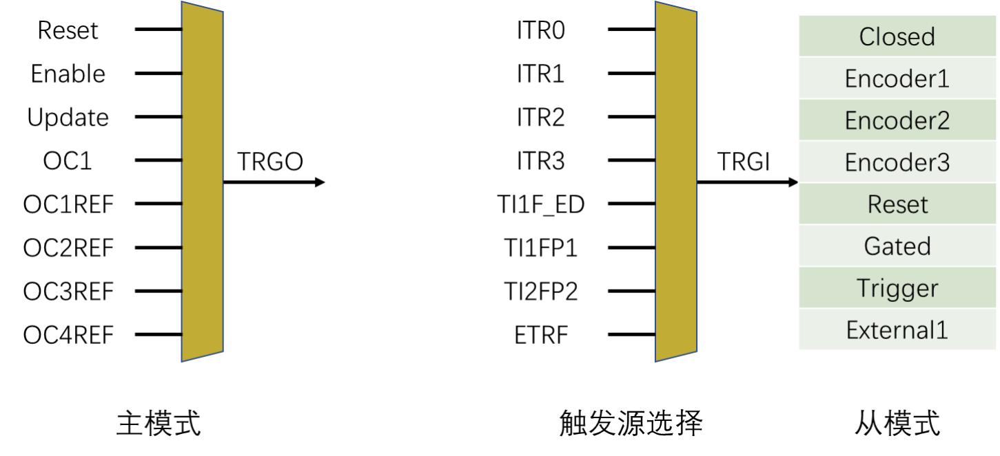

* **主从触发模式**就是主模式、从模式和触发源选择这三个功能的简称。
	* **主模式**，可以将定时器内部的信号映射到TRGO引脚，用于触发别的外设，所以这部分叫做主模式。
	* **从模式**，就是接收其他外设或者自身外设的一些信号，用于控制自身定时器的运行，也就是被别的信号控制，所以这部分叫从模式。
	* **触发源选择**，就是选择从模式的触发信号源的，可以认为它是从模式的一部分。触发源选择，选择指定的一个信号，得到TRGI，TRGI去触发从模式。从模式可以在图示列表里选择一项操作来自动执行。
## （4）输入捕获基本结构

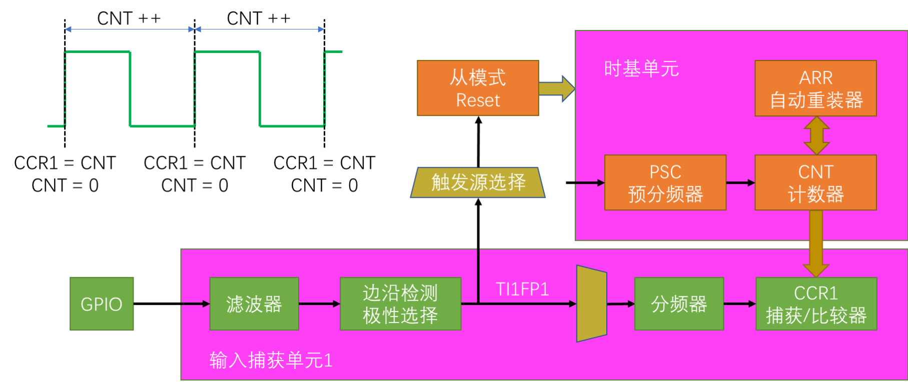

* 配置好时基单元后启动定时器，CNT计数器就会在经过预分频后的时钟频率的驱动下不断计数。
* 输入捕获通道1的GPIO口，输入一个方波信号，经过滤波器和边沿检测，选择TI1FP1为上升沿触发之后，进入输入捕获通道，分频器选择不分频。当TI1FP1出现上升沿之后，CNT的当前计数值转运到CCR1里。
* 同时定时器的触发源选择TI1FP1为触发信号，从模式选择Reset复位操作，这样TI1FP1的上升沿也会通过上面这一路去触发CNT清0。
* 先后顺序：一定是先转运CNT的值到CCR里去，然后再触发从模式给CNT清0，或者是非阻塞的同时转移。
## （5）输入捕获流程（测周法）
1. 上升沿到来
2. CCR捕获CNT的值
3. CNT触发清零，重新开始计数
4. 下一个上升沿到来，重复操作
5. 时基单元频率Fc，一个周期就是1/Fc，CCR捕获了多少个CNT的计数值N就代表在输入捕获的两个上升沿期间系统时钟走过了N个周期，也就是说输入捕获的波形的周期是N/Fc，那他的频率就是Fc/N
* **注意事项：** 
	1. CNT的值是有上限的，ARR一般设置为最大65535，那CNT最大也只能记65535个数，如果信号频率太低，CNT计数值可能会溢出。 
	2. 从模式的触发源选择，只有TI1FP1和TI2FP2，所以如果想使用从模式自动清零CNT，就只能用通道1和通道2。对于通道3和通道4，就只能开启捕获中断，在中断里手动清0了，但是这样程序就会处于频繁中断的状态，比较消耗资源。
## （6）示例代码：输入捕获测量PWM频率（测周法）
```c
void MyIC_Init(void){
	//1.开启时钟（定时器和对应输入捕获通道GPIO的时钟都要开）
	RCC_APB2PeriphClockCmd(RCC_APB2Periph_GPIOA,ENABLE);
	RCC_APB1PeriphClockCmd(RCC_APB1Periph_TIM3,ENABLE);
	
	//2.初始化GPIO
	GPIO_InitTypeDef GPIO_InitTypeStructure;
	GPIO_InitTypeStructure.GPIO_Mode = GPIO_Mode_IN_FLOATING;  //使用的是片上外设的输入捕获功能，浮空输入
	GPIO_InitTypeStructure.GPIO_Pin =GPIO_Pin_6;
	GPIO_InitTypeStructure.GPIO_Speed = GPIO_Speed_50MHz;
	GPIO_Init(GPIOA,&GPIO_InitTypeStructure);
	
	//3.时钟来源：内部时钟
	TIM_InternalClockConfig(TIM3);
	
	//4.初始化时基单元
	TIM_TimeBaseInitTypeDef TIM_TimeBaseInitTypeStructure;
	TIM_TimeBaseInitTypeStructure.TIM_ClockDivision = TIM_CKD_DIV1;//内部时钟不分频
	TIM_TimeBaseInitTypeStructure.TIM_CounterMode = TIM_CounterMode_Up;//向上计数
	TIM_TimeBaseInitTypeStructure.TIM_Period =65536-1 ;//ARR自动重装值（从0计数到65535就自动重装为0） 
	TIM_TimeBaseInitTypeStructure.TIM_Prescaler =72-1 ;//PSC预分频（72000000/72=1000000）
	TIM_TimeBaseInitTypeStructure.TIM_RepetitionCounter = 0;//不用重复计数
	//PSC之后的频率要大于被测频率->假设填写的72就是1MHz, 被测频率不能大于1MHz
	//被测频率不能小于多少? ->假设填写的72, 被测频率不能小于 1MHz/65536 == 15.258 Hz
	TIM_TimeBaseInit(TIM3,&TIM_TimeBaseInitTypeStructure);
	
	//5.清除初始化产生的事件标志位，以便能正常启动定时器
	TIM_ClearFlag(TIM3,TIM_FLAG_Update);
	
	//6.配置输入捕获通道
	TIM_ICInitTypeDef TIM_ICInitTypeStructure;
	TIM_ICInitTypeStructure.TIM_Channel = TIM_Channel_1;//通道1做输入捕获
	TIM_ICInitTypeStructure.TIM_ICFilter = 0xF ; //输入滤波
	TIM_ICInitTypeStructure.TIM_ICPolarity = TIM_ICPolarity_Rising; //上升沿触发
	TIM_ICInitTypeStructure.TIM_ICPrescaler = TIM_ICPSC_DIV1;//输入不分频
	TIM_ICInitTypeStructure.TIM_ICSelection = TIM_ICSelection_DirectTI; //直连，不交叉
	TIM_ICInit(TIM3,&TIM_ICInitTypeStructure);
	
	//7.设置触发源
	TIM_SelectInputTrigger(TIM3,TIM_TS_TI1FP1);
	
	//8.设置从模式
	TIM_SelectSlaveMode(TIM3,TIM_SlaveMode_Reset);//重置计数器
	
	//9.使能定时器，开始运行
	TIM_Cmd(TIM3,ENABLE);	
}

//10.获取通道1的频率
uint16_t MyIC_Freq(void)
{
	//TIM_GetCapture1函数用于获取对应输入捕获通道1内的CCR值
	return 72000000/72/(TIM_GetCapture1(TIM3)+1); //被测频率=Fc/N
} 

//11.可以用别的定时器输出比较产生一个PWM然后用线接到输入比较通道来测试输入捕获 
```
## （7）输入捕获PWMI模式测量频率（测周法）和占空比
### 1. PWMI模式是什么？ 
1. PWMI 模式是一种特殊的输入捕获模式，主要用于同时测量脉冲宽度和周期。
2. 通常利用定时器的两个输入捕获通道，一个通道用于捕获脉冲的上升沿，另一个通道用于捕获脉冲的下降沿。
3. 例如，对于一个 PWM信号输入，定时器在 PWMI 模式下可以同时获取 PWM 信号的高电平时间（脉冲宽度）和整个信号周期。假设通道 1 捕获上升沿，通道 2 捕获下降沿，当 PWM 信号的上升沿到来时，通道 1 捕获定时器计数值T1，下降沿到来时，通道 2 捕获计数值T2，那么脉冲宽度就是T2-T1，后续通过计算（结合定时器计数频率）就可以得到实际的脉冲宽度时间。
### 2. 示例代码：
```c
void MyIC_Init(void){
	//1. 开启时钟（定时器和对应输入捕获通道GPIO的时钟都要开）
	RCC_APB2PeriphClockCmd(RCC_APB2Periph_GPIOA,ENABLE);
	RCC_APB1PeriphClockCmd(RCC_APB1Periph_TIM3,ENABLE);
	
	//2.初始化GPIO
	GPIO_InitTypeDef GPIO_InitTypeStructure;
	GPIO_InitTypeStructure.GPIO_Mode = GPIO_Mode_IN_FLOATING;  //使用的是片上外设的输入捕获功能，浮空输入
	GPIO_InitTypeStructure.GPIO_Pin =GPIO_Pin_6;
	GPIO_InitTypeStructure.GPIO_Speed = GPIO_Speed_50MHz;
	GPIO_Init(GPIOA,&GPIO_InitTypeStructure);
	
	//3.时钟来源：内部时钟
	TIM_InternalClockConfig(TIM3);
	
	//4.初始化时基单元
	TIM_TimeBaseInitTypeDef TIM_TimeBaseInitTypeStructure;
	TIM_TimeBaseInitTypeStructure.TIM_ClockDivision = TIM_CKD_DIV1;//不分频
	TIM_TimeBaseInitTypeStructure.TIM_CounterMode = TIM_CounterMode_Up;//向上计数
	TIM_TimeBaseInitTypeStructure.TIM_Period =65536-1 ;//ARR自动重装值
	TIM_TimeBaseInitTypeStructure.TIM_Prescaler =72-1 ;//PSC预分频
	TIM_TimeBaseInitTypeStructure.TIM_RepetitionCounter = 0;//不用重复计数
	//PSC之后的频率要大于被测频率--->假设填写的72就是1MHz, 被测频率不能大于1MHz
	//被测频率不能小于多少? ---->   假设填写的72, 被测频率不能小于 1MHz/65536 == 15.258 Hz
	TIM_TimeBaseInit(TIM3,&TIM_TimeBaseInitTypeStructure);
	
	//5.清除初始化产生的事件标志位，以便能正常启动定时器
	TIM_ClearFlag(TIM3,TIM_FLAG_Update);
	
	//6.配置输入捕获通道
	TIM_ICInitTypeDef TIM_ICInitTypeStructure;
	TIM_ICInitTypeStructure.TIM_Channel = TIM_Channel_1;//通道1做输入捕获
	TIM_ICInitTypeStructure.TIM_ICFilter = 0xF ; //输入滤波 between 0x0 and 0xF
	TIM_ICInitTypeStructure.TIM_ICPolarity = TIM_ICPolarity_Rising; //上升沿
	TIM_ICInitTypeStructure.TIM_ICPrescaler = TIM_ICPSC_DIV1;//输入不分频
	TIM_ICInitTypeStructure.TIM_ICSelection = TIM_ICSelection_DirectTI; //直连，不交叉
	
	//7.开启定时器输入捕获PWMI模式，同时测量频率和占空比
	TIM_PWMIConfig(TIM3,&TIM_ICInitTypeStructure);
	
	//8.设置触发源
	TIM_SelectInputTrigger(TIM3,TIM_TS_TI1FP1);
	
	//9.设置从模式
	TIM_SelectSlaveMode(TIM3,TIM_SlaveMode_Reset);//重置计数器
	
	//10.使能定时器，开始运行
	TIM_Cmd(TIM3,ENABLE);
}

//11.获取通道1的捕获到的频率和周期
uint16_t MyIC_Freq(void)
{
	return 72000000/72/(TIM_GetCapture1(TIM3)+1);//被测频率=Fc/N，那周期就是N/Fc
} 

//12.获取PWMI模式下通道2捕获到的占空比
uint16_t MyIC_Duty(void)
{
	//通道2捕获的高电平时间/通道1捕获的周期，就是占空比，是个小数，乘以100显示成百分数
	return (TIM_GetCapture2(TIM3)+1)/(TIM_GetCapture1(TIM3)+1)*100;
} 

//13.可以用别的定时器输出比较产生一个PWM然后用线接到输入比较通道来测试输入捕获
```
# 四、定时器输出比较
## （1）PWM
* **PWM（Pulse Width Modulation）脉冲宽度调制**。PWM波形是一个数字输出信号，也是由高低电平组成的。
* 在具有惯性的系统中，可以通过对一系列脉冲的宽度进行调制，来等效地获得所需要的模拟参量，常应用于电机控速等领域
* **PWM参数：**   
    周期T（重复波形发生的最小间隔）
    频率 = 1 / T       （1秒内出现了多少个周期）              
    占空比 = Ton / Ts      （高电平占整个周期的比例）
    分辨率 = 占空比变化步距 （PWM最小能设定的高电平时间所占周期的比例，也即最小占空比）
## （2）什么是输出比较
* **OC（Output Compare）输出比较**。通过比较CNT与CCR寄存器值的关系，来对输出电平进行置1、置0或翻转的操作，用于输出一定频率和占空比的PWM波形。
* **CCR就是捕获/比较寄存器**，它是输入捕获和输出比较共用的。
	* 当使用输入捕获时，它就是捕获寄存器；
	* 当使用输出比较时，它就是比较寄存器。在输出比较时电路会比较CNT和CCR的值，CNT计数自增，CCR是预先给定的一个值，当CNT大于CCR，小于CCR或者等于CCR时，输出就会对应的置1或置0， 
## （3）输出比较框图
1. **高级定时器输出比较**

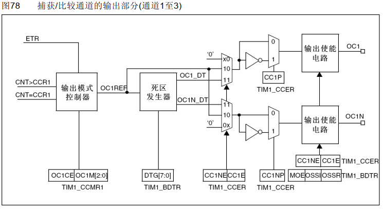
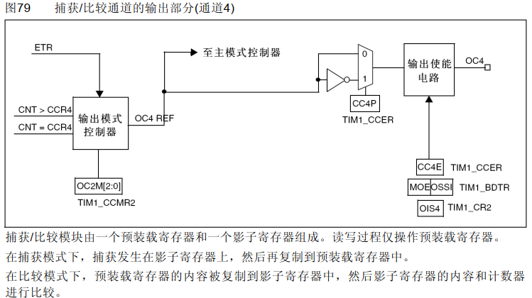

2. **通用定时器输出比较**

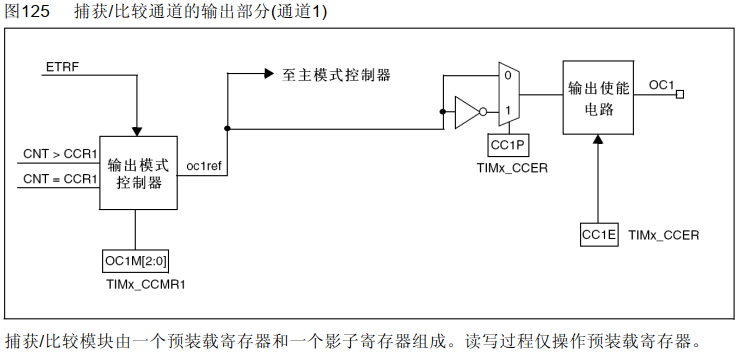

## （4）输出比较结构（PWM模式）

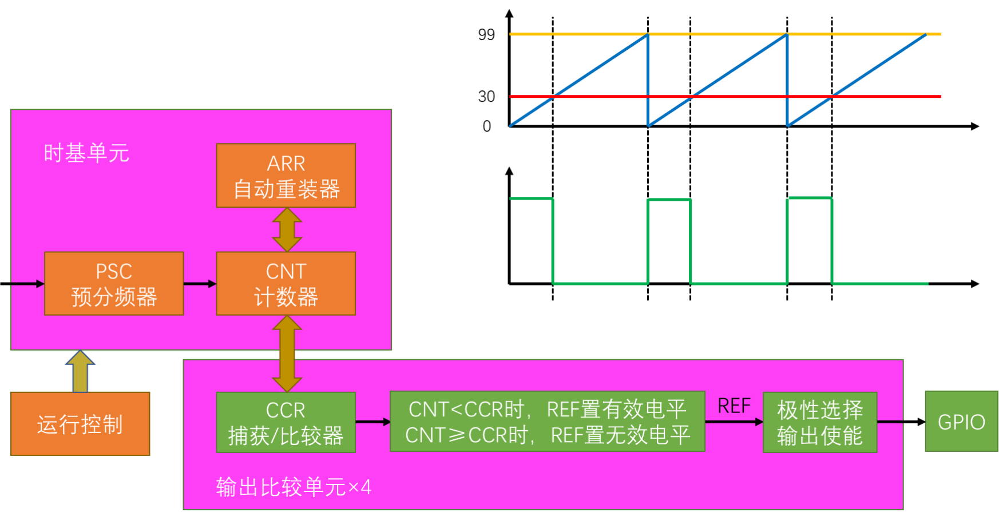

## （5）输出比较模式

|    模式    |                                          描述                                           |
| :------: | :-----------------------------------------------------------------------------------: |
|    冻结    |                                  CNT=CCR时，REF保持为原状态                                   |
| 匹配时置有效电平 |                                   CNT=CCR时，REF置有效电平                                   |
| 匹配时置无效电平 |                                   CNT=CCR时，REF置无效电平                                   |
| 匹配时电平翻转  |                                   CNT=CCR时，REF电平翻转                                    |
| 强制为无效电平  |                                 CNT与CCR无效，REF强制为无效电平                                  |
| 强制为有效电平  |                                 CNT与CCR无效，REF强制为有效电平                                  |
|  PWM模式1  | 向上计数：CNT<CCR时，REF置有效电平，CNT≥CCR时，REF置无效电平 <br>向下计数：CNT>CCR时，REF置无效电平，CNT≤CCR时，REF置有效电平 |
|  PWM模式2  | 向上计数：CNT<CCR时，REF置无效电平，CNT≥CCR时，REF置有效电平 <br>向下计数：CNT>CCR时，REF置有效电平，CNT≤CCR时，REF置无效电平 |

## （6）参数的计算
* **PWM频率：** Freq = CLK / (PSC + 1) / (ARR + 1)
* **PWM占空比：** Duty = CCR / (ARR + 1)
* **PWM分辨率：** Reso = 1 / (ARR + 1)
## （7）示例代码：高级定时器PWM模式使用默认复用引脚输出
* 定时器PWM函数
```c
//初始化定时器
void MyTimer_Init(void){
	//1.开启高级定时器1的时钟和使用的GPIO时钟
	RCC_APB2PeriphClockCmd(RCC_APB2Periph_TIM1,ENABLE);
	RCC_APB2PeriphClockCmd(RCC_APB2Periph_GPIOA,ENABLE);
	
	//2.时钟来源：内部时钟
	TIM_InternalClockConfig(TIM1);
	
	//3.初始化时基单元
	TIM_TimeBaseInitTypeDef TIM_TimeBaseInitTypeDefStructure;
	TIM_TimeBaseInitTypeDefStructure.TIM_ClockDivision = TIM_CKD_DIV1;
	TIM_TimeBaseInitTypeDefStructure.TIM_CounterMode = TIM_CounterMode_Up;
	TIM_TimeBaseInitTypeDefStructure.TIM_Period = 100-1;
	TIM_TimeBaseInitTypeDefStructure.TIM_Prescaler = 7200-1;
	TIM_TimeBaseInitTypeDefStructure.TIM_RepetitionCounter = 0;
	//初始化时基单元，会生成一个更新事件，立即重新加载预分频器和重复计数器的值。
	TIM_TimeBaseInit(TIM1,&TIM_TimeBaseInitTypeDefStructure);
	
	//4.清除初始化产生的事件标志位，以便能正常启动定时器
	TIM_ClearFlag(TIM1,TIM_FLAG_Update);
	
	//5.使能指定的定时器
	TIM_Cmd(TIM1,ENABLE);
	
	//6.配置定时器输出比较功能
	TIM_OCInitTypeDef TIM_OCInitTypeDefStructure;
	TIM_OCInitTypeDefStructure.TIM_OCMode = TIM_OCMode_PWM1;//PWM模式1
	TIM_OCInitTypeDefStructure.TIM_OCPolarity = TIM_OCPolarity_High;//输出极性为高电平有效
	TIM_OCInitTypeDefStructure.TIM_OutputState = TIM_OutputState_Enable;//使能定时器相应通道的输出功能
	TIM_OCInitTypeDefStructure.TIM_Pulse = 30;//CCR比较寄存器的值
	
	//7.初始化不同的输出比较通道（1-4）
	TIM_OC1Init(TIM1,&TIM_OCInitTypeDefStructure);
	TIM_OC2Init(TIM1,&TIM_OCInitTypeDefStructure);
	TIM_OC3Init(TIM1,&TIM_OCInitTypeDefStructure);
	TIM_OC4Init(TIM1,&TIM_OCInitTypeDefStructure);
	
	//8.高级定时器开启PWM输出模式的话需要额外调用这个函数使能
	TIM_CtrlPWMOutputs(TIM1, ENABLE);
	
	//9.初始化GPIO,因为使用的是默认复用引脚，所以需要用复用推挽输出
	GPIO_InitTypeDef GPIO_InitTypeStructure;
	GPIO_InitTypeStructure.GPIO_Mode = GPIO_Mode_AF_PP;
	GPIO_InitTypeStructure.GPIO_Pin = GPIO_Pin_8|GPIO_Pin_9|GPIO_Pin_10|GPIO_Pin_11;//对应各自输出比较通道1-4
	GPIO_InitTypeStructure.GPIO_Speed = GPIO_Speed_50MHz;
	GPIO_Init(GPIOA,&GPIO_InitTypeStructure);
}

//将传入的值设置到定时器TIM1相应输出比较通道对应的比较寄存器CCR中
void MyTimer_SetCompare(uint16_t newCompare)
{
	TIM_SetCompare1(TIM1,newCompare);//定时器1通道1
	TIM_SetCompare2(TIM1,newCompare);//定时器1通道2
	TIM_SetCompare3(TIM1,newCompare);//定时器1通道3
	TIM_SetCompare4(TIM1,newCompare);//定时器1通道4
}
```
* 主函数PWM呼吸灯
```c
int main(void)
{
	MyTimer_Init();
	while (1)
	{
		for(uint8_t i=0;i<100;i++)
		{
			MyTimer_SetCompare(i);
			Delay_ms(10);
		}
		for(uint8_t i=0;i<100;i++)
		{
			MyTimer_SetCompare(99-i);
			Delay_ms(10);
		}
		
	}
}
```

**注意： 使用F4xx芯片外设的AFIO时候（比如定时器、I2C、SPI、USART、CAN ......）要使用下面函数开启引脚复用AFIO功能**

```c
void GPIO_PinAFConfig(GPIO_TypeDef* GPIOx, uint16_t GPIO_PinSource, uint8_t GPIO_AF)
/*
在使用片上外设通过特定 GPIO 引脚进行其他复用功能操作时，需要配置引脚的复用功能，使得该引脚能够正确地作为外设的输出引脚。
*/
```

## （8）示例代码：通用定时器PWM模式使用引脚重映射输出
* 定时器PWM函数
```c
//初始化定时器
void MyTimer_Init(void){
	//1.开启TIM2时钟和它本身对应的GPIO时钟
	RCC_APB1PeriphClockCmd(RCC_APB1Periph_TIM2,ENABLE);
	RCC_APB2PeriphClockCmd(RCC_APB2Periph_GPIOA,ENABLE);
	
	//2.开启需要重映射的GPIO时钟和提供引脚重映射的AFIO时钟
	RCC_APB2PeriphClockCmd(RCC_APB2Periph_GPIOB,ENABLE);
	RCC_APB2PeriphClockCmd(RCC_APB2Periph_AFIO,ENABLE);
	
	//3.开启引脚重映射功能
	GPIO_PinRemapConfig(GPIO_PartialRemap2_TIM2,ENABLE);
	
	//4.时钟来源：内部时钟
	TIM_InternalClockConfig(TIM2);
	
	//5.初始化时基单元
	TIM_TimeBaseInitTypeDef TIM_TimeBaseInitTypeDefStructure;
	TIM_TimeBaseInitTypeDefStructure.TIM_ClockDivision = TIM_CKD_DIV1;
	TIM_TimeBaseInitTypeDefStructure.TIM_CounterMode = TIM_CounterMode_Up;
	TIM_TimeBaseInitTypeDefStructure.TIM_Period = 100-1;
	TIM_TimeBaseInitTypeDefStructure.TIM_Prescaler = 7200-1;
	TIM_TimeBaseInitTypeDefStructure.TIM_RepetitionCounter = 0;
	//初始化时基单元，会生成一个更新事件，立即重新加载预分频器和重复计数器的值。
	TIM_TimeBaseInit(TIM2,&TIM_TimeBaseInitTypeDefStructure);
	
	//6.清除初始化产生的事件标志位，以便能正常启动定时器
	TIM_ClearFlag(TIM2,TIM_FLAG_Update);
	
	//7.使能指定的定时器
	TIM_Cmd(TIM2,ENABLE);
	
	//8.配置定时器输出比较功能
	TIM_OCInitTypeDef TIM_OCInitTypeDefStructure;
	TIM_OCInitTypeDefStructure.TIM_OCMode = TIM_OCMode_PWM1;
	TIM_OCInitTypeDefStructure.TIM_OCPolarity = TIM_OCPolarity_High;
	TIM_OCInitTypeDefStructure.TIM_OutputState = TIM_OutputState_Enable;
	TIM_OCInitTypeDefStructure.TIM_Pulse = 30;
	
	//9.初始化不同的输出比较通道（1-4）
	TIM_OC1Init(TIM2,&TIM_OCInitTypeDefStructure);
	TIM_OC2Init(TIM2,&TIM_OCInitTypeDefStructure);
	TIM_OC3Init(TIM2,&TIM_OCInitTypeDefStructure);
	TIM_OC4Init(TIM2,&TIM_OCInitTypeDefStructure);
	
	//10.初始化GPIO,因为TIM2本身使用的是默认复用引脚，所以需要用复用推挽输出
	GPIO_InitTypeDef GPIO_InitTypeStructure;
	GPIO_InitTypeStructure.GPIO_Mode = GPIO_Mode_AF_PP;
	GPIO_InitTypeStructure.GPIO_Pin = GPIO_Pin_0|GPIO_Pin_1;
	GPIO_InitTypeStructure.GPIO_Speed = GPIO_Speed_50MHz;
	GPIO_Init(GPIOA,&GPIO_InitTypeStructure);
	
	//11.因为想把TIM2引脚重映射到PB10、PB11，所以要把重映射的引脚也初始化AFIO推挽输出
	GPIO_InitTypeDef GPIO_InitTypeStructure1;
	GPIO_InitTypeStructure1.GPIO_Mode = GPIO_Mode_AF_PP;
	GPIO_InitTypeStructure1.GPIO_Pin = GPIO_Pin_10|GPIO_Pin_11;
	GPIO_InitTypeStructure1.GPIO_Speed = GPIO_Speed_50MHz;
	GPIO_Init(GPIOB,&GPIO_InitTypeStructure1);
}

//将传入的值设置到定时器TIM2相应输出比较通道对应的比较寄存器CCR中
void MyTimer_SetCompare(uint16_t newCompare)
{
	TIM_SetCompare1(TIM2,newCompare);//定时器2通道1
	TIM_SetCompare2(TIM2,newCompare);//定时器2通道2
	TIM_SetCompare3(TIM2,newCompare);//定时器2通道3
	TIM_SetCompare4(TIM2,newCompare);//定时器2通道4
}
```
* 主函数PWM呼吸灯
```c
int main(void)
{
	MyTimer_Init();
	while (1)
	{
		for(uint8_t i=0;i<100;i++)
		{
			MyTimer_SetCompare(i);
			Delay_ms(10);
		}
		for(uint8_t i=0;i<100;i++)
		{
			MyTimer_SetCompare(99-i);
			Delay_ms(10);
		}
	}
}
```
# 五、定时器编码器接口
## （1）简介
* **编码器接口（Encoder Interface）**，编码器接口可接收增量（正交）编码器的信号，根据编码器旋转产生的正交信号脉冲，自动控制CNT自增或自减，从而指示编码器的位置、旋转方向和旋转速度。
* 每个高级定时器和通用定时器都拥有1个编码器接口，编码器的资源比较紧张，如果定时器配置了编码器接口，就不能做其他任务了。编码接口的两个输入引脚借用了输入捕获的通道1和通道2。
## （2）正交编码器

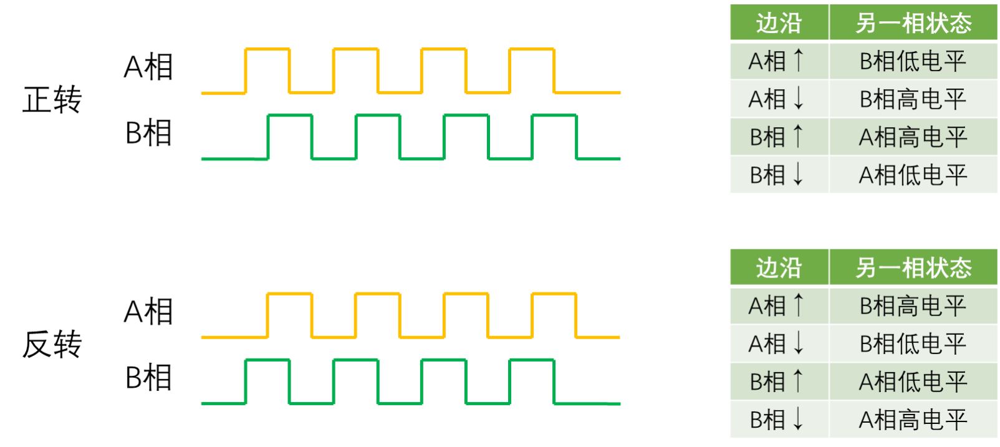

1. **正交编码器**一般可以测量位置或者带有方向的速度值，它一般有两个信号输出引脚，一个是A相，一个是B相。
2. **编码器接口**的设计逻辑就是首先把A相和B相的所有边沿作为计数器的计数时钟，出现边沿信号时，就计数自增或自减。是增还是减，这个计数的方向由另一相的状态来确定。当出现某个边沿时，判断另一相的高低电平，如果对应另一相的状态出现在上面正转的表里，那就是正转->计数器CNT自增；反之，另一相的状态出现在下面反转的表里，那就是反转->计数器CNT自减。
## （3）编码器接口结构

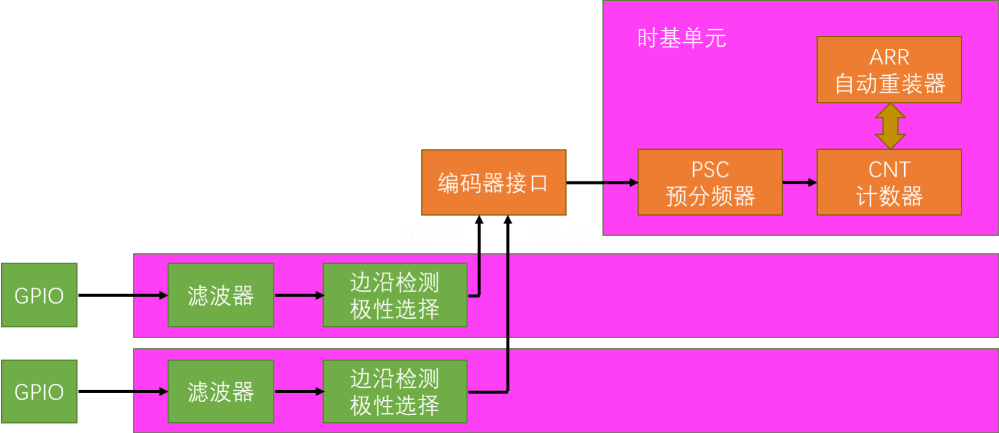

* 输入捕获的前两个通道，通过GPIO口接入编码器的A、B相，然后通过滤波器和边沿检测极性选择，产生TI1FP1和TI2FP2，通向编码器接口，编码器接口通过预分频器控制CNT计数器的时钟。同时编码器接口还根据编码器的旋转方向，控制CNT的计数方向。编码器正转时，CNT自增；编码器反转时，CNT自减。此外，ARR也是有效的，一般会设置ARR为65535最大量程。利用补码的特性，很容易得到负数，比如CNT初始为0，正转CNT自增0、1、2、3……等等。反转则CNT自减，就可以得到负数。
## （4）工作模式

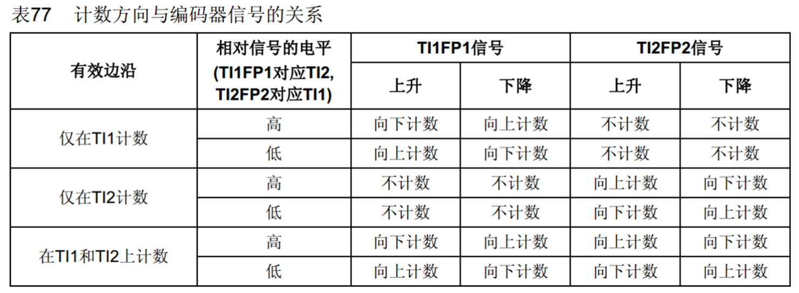

```c
void TIM_EncoderInterfaceConfig(TIM_TypeDef* TIMx, uint16_t TIM_EncoderMode, uint16_t TIM_IC1Polarity, uint16_t TIM_IC2Polarity);
/*
-功能：
这个函数主要用于将定时器设置为编码器模式，使定时器能够根据编码器输入的信号（通常是A相和B相）进行计数，从而实现对编码器位置和旋转方向的检测。 

-参数：
1. TIMx：这是一个指向TIM_TypeDef结构体的指针，用于指定要配置的定时器。
2. TIM_EncoderMode：这个参数用于指定编码器模式。它有以下几种取值：
	TIM_EncoderMode_TI1：仅使用TI1（通常是编码器的A相）作为计数输入，TI2（通常是编码器的B相）被忽略。在这种模式下，定时器根据TI1的边沿进行计数。
	TIM_EncoderMode_TI2：仅使用TI2作为计数输入，TI1被忽略。定时器根据TI2的边沿进行计数。 
	TIM_EncoderMode_TI12：这是最常用的正交编码器模式。同时使用TI1和TI2进行计数，定时器会根据A相和B相的信号变化来实现正交编码计数。在这种模式下，由于A相和B相的相位差为90度，定时器可以检测到A相和B相的上升沿和下降沿，从而实现4倍频计数，能够更精确地获取编码器的位置信息。 
3. TIM_IC1Polarity：用于指定TI1（A相）输入信号的极性。它可以取值为TIM_ICPolarity_Rising（上升沿有效）或TIM_ICPolarity_Falling（下降沿有效）。决定了定时器在TI1信号的何种边沿进行计数操作。 
4. TIM_IC2Polarity：用于指定TI2（B相）输入信号的极性，同样可以取值为TIM_ICPolarity_Rising或TIM_ICPolarity_Falling。当编码器旋转方向改变时，A相和B相的信号边沿顺序会发生变化，通过合理设置这两个极性参数，可以正确判断编码器的旋转方向。
*/
```
## （5）编码器接口示例代码
```c
//TIM3做输入捕获，A相 PA6，B相 PA7
void MyTimEncoder_Init(void)
{
	//1.开启时钟
	RCC_APB2PeriphClockCmd(RCC_APB2Periph_GPIOA,ENABLE);
	RCC_APB1PeriphClockCmd(RCC_APB1Periph_TIM3,ENABLE);
	
	//2.初始化GPIO
	GPIO_InitTypeDef GPIO_InitTypeStructure;
	GPIO_InitTypeStructure.GPIO_Mode = GPIO_Mode_IN_FLOATING;//使用的是片上外设的编码器接口功能，浮空输入
	GPIO_InitTypeStructure.GPIO_Pin =GPIO_Pin_6 | GPIO_Pin_7;
	GPIO_InitTypeStructure.GPIO_Speed = GPIO_Speed_50MHz;
	GPIO_Init(GPIOA,&GPIO_InitTypeStructure);
	
	//3.初始化时基单元
	TIM_TimeBaseInitTypeDef TIM_TimeBaseInitTypeStructure;
	TIM_TimeBaseInitTypeStructure.TIM_ClockDivision = TIM_CKD_DIV1;//编码器的输入不分频
	TIM_TimeBaseInitTypeStructure.TIM_CounterMode = TIM_CounterMode_Up;//向上计数
	TIM_TimeBaseInitTypeStructure.TIM_Period =65536-1 ;//ARR自动重装值   
	TIM_TimeBaseInitTypeStructure.TIM_Prescaler =1-1 ;//编码器输入的时钟不分频
	TIM_TimeBaseInitTypeStructure.TIM_RepetitionCounter = 0;//不用重复计数
	TIM_TimeBaseInit(TIM3,&TIM_TimeBaseInitTypeStructure);
	
	//4.清除初始化产生的事件标志位，以便能正常启动定时器
	TIM_ClearFlag(TIM3,TIM_FLAG_Update);
	
	//5.使能指定的定时器
	TIM_Cmd(TIM3,ENABLE);
	
	//6.配置输入捕获通道CH1
	TIM_ICInitTypeDef TIM_ICInitTypeStructure;
	TIM_ICInitTypeStructure.TIM_Channel = TIM_Channel_1;//通道1做输入捕获
	TIM_ICInitTypeStructure.TIM_ICFilter = 0xF ; //输入滤波
	TIM_ICInitTypeStructure.TIM_ICPolarity = TIM_ICPolarity_Rising; //上升沿
	TIM_ICInitTypeStructure.TIM_ICPrescaler = TIM_ICPSC_DIV1;//输入不分频
	TIM_ICInitTypeStructure.TIM_ICSelection = TIM_ICSelection_DirectTI; //直连，不交叉
	TIM_ICInit(TIM3,&TIM_ICInitTypeStructure);
	
	//7.配置输入捕获通道CH2
	TIM_ICInitTypeStructure.TIM_Channel = TIM_Channel_2;//通道2做输入捕获
	TIM_ICInitTypeStructure.TIM_ICFilter = 0x0 ; //输入滤波
	TIM_ICInitTypeStructure.TIM_ICPolarity = TIM_ICPolarity_Rising; //上升沿
	TIM_ICInitTypeStructure.TIM_ICPrescaler = TIM_ICPSC_DIV1;//输入不分频
	TIM_ICInitTypeStructure.TIM_ICSelection = TIM_ICSelection_DirectTI; //直连，不交叉
	TIM_ICInit(TIM3,&TIM_ICInitTypeStructure);
	
	//8.配置定时器为编码器模式，在TI1和TI2触发时都计数，TI1和TI2的极性都是上升沿
	TIM_EncoderInterfaceConfig(TIM3,TIM_EncoderMode_TI12,TIM_ICPolarity_Rising,TIM_ICPolarity_Rising);
	
	//9.把CNT的值设置为0，编码器从0开始
	TIM_SetCounter(TIM3,0); //立即生效
}

//10.强转为带符号数能表示正负数
int16_t MyTimEncoder_GetCNT(void)
{
	return (int16_t)TIM_GetCounter(TIM3)/4;//获取CNT的值，4倍频计数，所以除以4 
}
```
