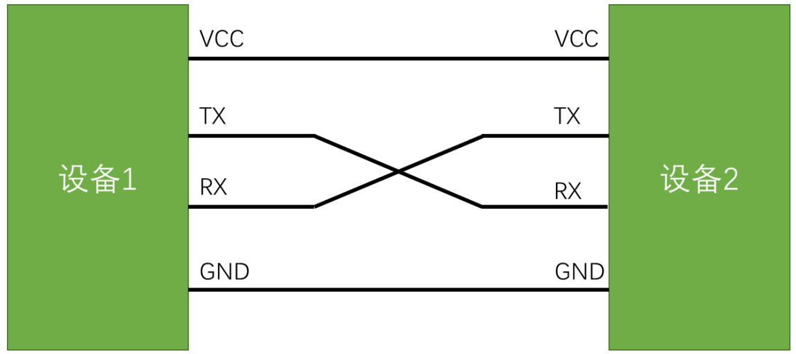
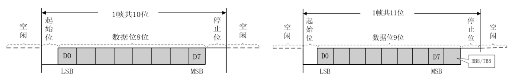
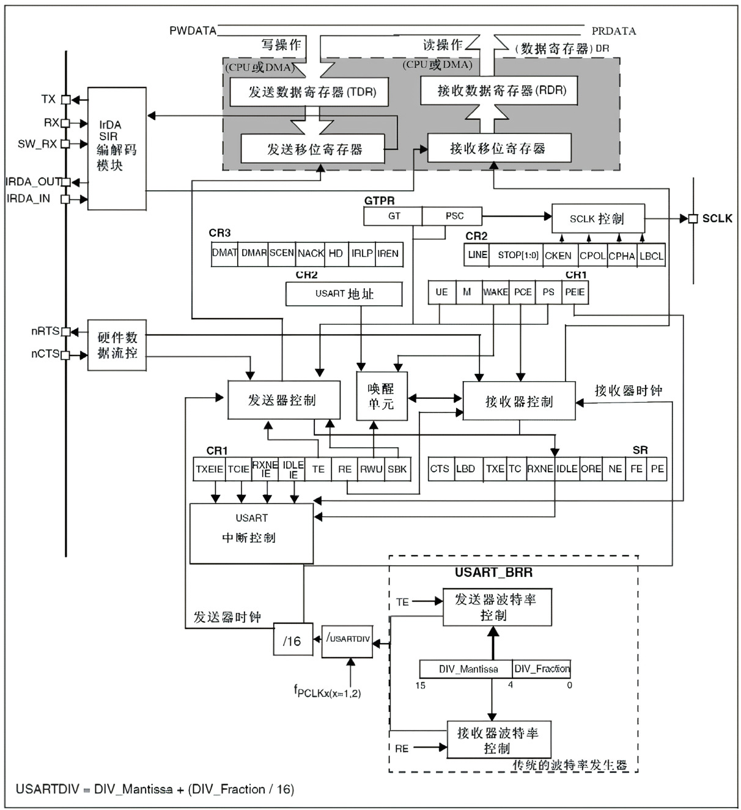
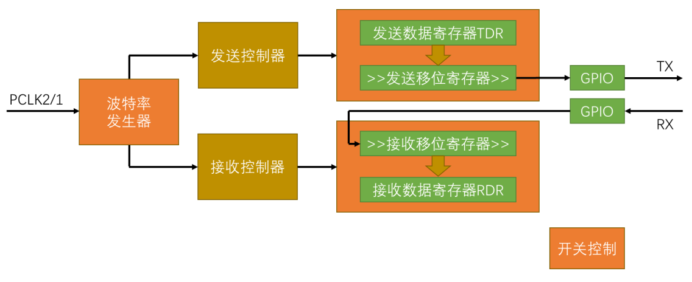
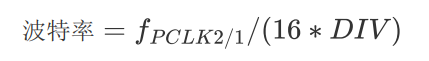
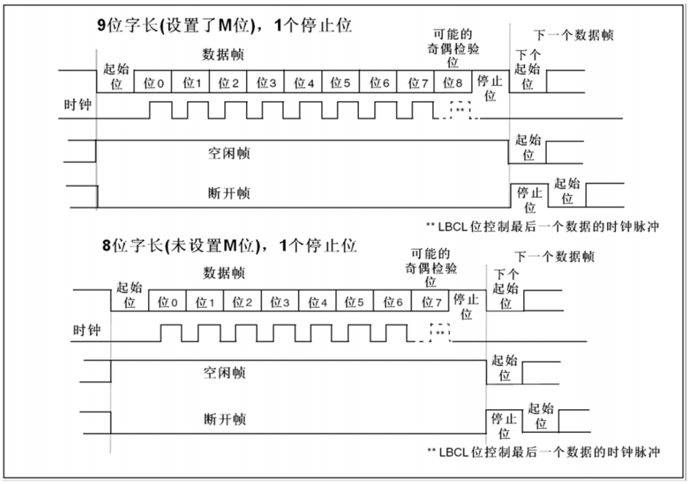
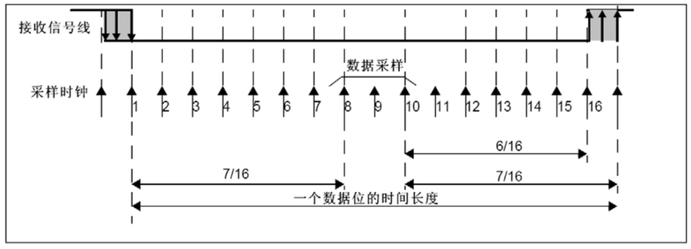
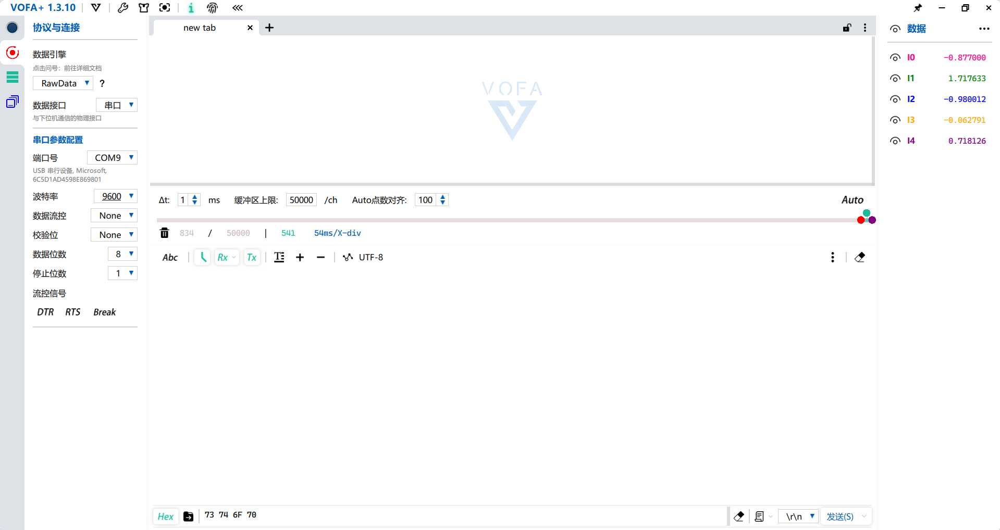

# 一、USART简介
## （1）USART是什么？
* USART（Universal Synchronous/Asynchronous Receiver/Transmitter）是一种**通用串行数据总线**，就是**通用同步/异步收发器**。这里S就是同步的意思，有时还会见到UART的写法，少了S就是异步收发器。一般串口通信很少用到同步的功能，所以USART和UART通常也没有太大的区别。而STM32的时钟同步只是时钟的输出，目的是为了兼容其他协议，并不支持两个USART外设之间进行同步通信，所以一般称它为UART串口通信。

|  名称   |  引脚   |      常用领域      | 双工  | 时钟  | 电 平 | 设备  |
| :---: | :---: | :------------: | :-: | :-: | :-: | :-: |
| USART | TX、RX | 单片机和PC,单片机和单片机 | 全双工 | 异步  | 单端  | 点对点 |

* **全双工：** 双向同时传输，数据可在两个方向上独立、并发地流动

## （2）硬件电路



## （3）电平标准

电平标准是数据1和数据0的表达方式，是传输线缆中人为规定的电压与数据的对应关系，串口常用的电平标准有如下三种：

>
> （1）**TTL电平：** 一般用在PCB上
> +3.3V或+5V表示1，0V表示0，这是一种最为常见的电平信号。
>
> （2）**RS232电平：** 短距离
> -3\~-15V表示1，+3\~+15V表示0。
>
> 一般在大型的机器上适用，由于环境可能比较恶劣，静电干扰比较大，所以电平的电压都比较大，而且允许波动的范围也很大。最远达到几十米。
>
> （3）**RS485电平：**
> 两线压差+2\~+6V表示1，-2\~-6V表示0（差分信号）。差分信号抗干扰能力非常强，使用RS485电平标准，通信距离可以达到上千米。
>
> 由于单片机属于低压小型设备，所以后续讲解使用的都是TTL电平。如果要做的设备需要其它的电平，就再加电平转换芯片就行了，因为在软件层面上，它们都属于串口，故而程序上并不会有什么区别。

## （4）串口参数以及时序

* **波特率：** 串口通信的速率( baud)，多长时间取一次电平数据。如果一个码元仅对应一个比特，则波特率直接等于比特率，即每秒钟传输的比特数。波特率越高传输越快，接收和发送要求波特率一样
	* **比特率**=比特数/传输时间（bit/s）（bps)  
	* **波特率**=数据帧个数/传输时间（Band）
* **起始位：** 标志一个数据帧的开始，固定为**低电平**。
* **数据位：** 数据帧的有效载荷，1为高电平，0为低电平，**低位先行**。
* **校验位：** 用于数据验证，根据数据位计算得来。
	1. **无校验（None）：** 规则：不添加校验位，数据帧仅包含起始位、数据位（通常为5、6、7、8位）和停止位。这是最简单的一种模式，不需要对数据进行额外的计算或检查。
	2. **奇校验（Odd Parity）：** 规则：在数据位之后附加一位奇校验位，使得整个数据帧（包括数据位和校验位）中“1”的个数为奇数。如果数据位中“1”的个数已经是奇数，则校验位为“0”，以保持奇数个“1”的总数；反之，若数据位中“1”的个数为偶数，则校验位为“1”，以使总“1”数变为奇数。
	3. **偶校验（Even Parity）：** 规则：同样在数据位之后附加一位偶校验位，使得整个数据帧中“1”的个数为偶数。如果数据位中“1”的个数已经是偶数，则校验位为“0”，保持偶数个“1”的总数；反之，若数据位中“1”的个数为奇数，则校验位为“1”，以使总“1”数变为偶数。
* **停止位：** 用于数据帧间隔，固定为**高电平**。



# 二、硬件单元
## （1）基本介绍
* USART是STM32内部的**集成硬件外设**，可根据数据寄存器的一个字节数据自动生成数据帧时序，从TX引脚发送出去，也可自动接收RX引脚的数据帧时序，拼接为一个字节数据，存放在数据寄存器里。自带波特率发生器，最高达4.5Mbits/s，可配置数据位长度（8/9）、停止位长度（0.5/1/1.5/2），可选校验位（无校验/奇校验/偶校验），支持同步模式、硬件流控制、DMA、智能卡、IrDA、LIN局域网通信等。
## （2）框图

## （3）基本结构

* 这里的PCLK是时钟信号，也就是APB1、APB2总线上面的时钟信号
## （4）波特率发生器
* 波特率发生器就是分频器，发送器和接收器的波特率由波特率寄存器BRR里的DIV确定。

# 三、串口数据包
## （1）数据模式
1. **HEX模式/十六进制模式/二进制模式：** 以原始数据的形式显示。
2. **文本模式/字符模式：** 以原始数据编码后的形式显示,转换规则根据ASCII码表一一对应。
## （2）数据帧


## （3）数据采样
* **16倍频过采样**


# 四、调试工具（建议使用PC端的VOFA+）
* **注意：** 波特率，时序等等要通信双方**设置一致**才可以通信！



# 五、代码示例（以与PC通信举例）
```c
#include "stm32f10x.h"                  // Device header
#include "serial.h"
#include "stdio.h"

void Serial1_Init(void){
    //打开时钟
    RCC_APB2PeriphClockCmd(RCC_APB2Periph_GPIOA,ENABLE);
    RCC_APB2PeriphClockCmd(RCC_APB2Periph_USART1,ENABLE);
    //初始化GPIO口
	GPIO_InitTypeDef GPIO_InitTypeStructure;
	GPIO_InitTypeStructure.GPIO_Mode = GPIO_Mode_AF_PP; // Tx 发送  -- 复用推挽
	GPIO_InitTypeStructure.GPIO_Pin = GPIO_Pin_9;
	GPIO_InitTypeStructure.GPIO_Speed = GPIO_Speed_50MHz;	
	GPIO_Init(GPIOA,&GPIO_InitTypeStructure);
    GPIO_InitTypeStructure.GPIO_Mode = GPIO_Mode_IPU; // Rx 接收  --  默认高 -- 上拉输入
	GPIO_InitTypeStructure.GPIO_Pin = GPIO_Pin_10;
	GPIO_InitTypeStructure.GPIO_Speed = GPIO_Speed_50MHz;	
	GPIO_Init(GPIOA,&GPIO_InitTypeStructure);
    //初始化USART1
    USART_InitTypeDef USART_InitTypeDefStructure;
    USART_InitTypeDefStructure.USART_BaudRate=9600;
    USART_InitTypeDefStructure.USART_WordLength=USART_WordLength_8b ;
    USART_InitTypeDefStructure.USART_StopBits=USART_StopBits_1;
    USART_InitTypeDefStructure.USART_Parity=USART_Parity_No;
    USART_InitTypeDefStructure.USART_Mode=USART_Mode_Rx|USART_Mode_Tx;
    USART_InitTypeDefStructure.USART_HardwareFlowControl=USART_HardwareFlowControl_None;
    USART_Init(USART1,&USART_InitTypeDefStructure);
    //开启USART1
	USART_Cmd(USART1,ENABLE);
	
	//开启接收中断RXNE
	USART_ITConfig(USART1,USART_IT_RXNE,ENABLE);
	//中断NVIC配置
	NVIC_InitTypeDef NVIC_InitTypeStructure;
	NVIC_InitTypeStructure.NVIC_IRQChannel = USART1_IRQn;
	NVIC_InitTypeStructure.NVIC_IRQChannelCmd = ENABLE;
	NVIC_InitTypeStructure.NVIC_IRQChannelPreemptionPriority = 1;
	NVIC_InitTypeStructure.NVIC_IRQChannelSubPriority = 1;	
	NVIC_Init(&NVIC_InitTypeStructure);
}

//发送一个字节数据
void Serial1_SendByte(uint8_t byte)
{
	while(USART_GetFlagStatus(USART1,USART_FLAG_TXE)==RESET);//等传输数据寄存器为空	
	USART_SendData(USART1,byte);//发送一个字节
}

//发送数组
void Serial1_SendArray(uint8_t *array,uint8_t lenght)
{
	for(uint8_t i=0;i<lenght;i++)
	{		
		Serial1_SendByte(array[i]);
	}
}

//发送字符串
void Serial1_SendString(char *string)
{
	for(uint16_t i=0;string[i]!='\0';i++)
	{	
		Serial1_SendByte(string[i]);
	}
}

//更改printf的底层实现，把打印的信息传送到Serial1.
int fputc(int ch, FILE *f) {
	Serial1_SendByte(ch);
	return ch;
}

char USART1_RxString[200]; //存储接收到的字符串
char USART1_RxStringIndex=0;//存储接收到第几个字符了
uint8_t USART1_RxStringComplate=0;//0就是没有接收完成，1就是接收完成

//接收USART1收到的数据字符串---以\r\n结束
void USART1_IRQHandler(void)
{
	if(USART_GetITStatus(USART1,USART_IT_RXNE)==SET)
	{
		//获取当前接收到的字节
		char rx_char = USART_ReceiveData(USART1);
		if(USART1_RxStringComplate !=1 && rx_char!='\r'&& rx_char!='\n')
		{
			USART1_RxString[USART1_RxStringIndex] = rx_char;
			USART1_RxStringIndex++;			
		}else if(rx_char!='\n')
		{
			USART1_RxStringComplate=1;//接收完成
			USART1_RxString[USART1_RxStringIndex]='\0';//把char USART1_RxString 变为字符串。
		}	
		
		//清楚中断
		USART_ClearITPendingBit(USART1,USART_IT_RXNE);
	}
}

uint8_t  USART1_RxStringGetComplateFlagStatus(void)
{
	return USART1_RxStringComplate;
}

char * USART1_RxStringGetData(void)
{
	//获取一次就清除接收完成标志位。
	USART1_RxStringComplate = 0;
	//接收数据的下标回到0
	USART1_RxStringIndex=0;
	return USART1_RxString;
}
```
* **下面是对应的main函数**
```c
#include "stm32f10x.h"  
#include "Delay.h"
#include "Serial.h"
#include "stdio.h"
#include "OLED.h"

int main(void)
{
	NVIC_PriorityGroupConfig(NVIC_PriorityGroup_2); //一个project中定义一次即可
	
	//初始化硬件
	OLED_Init();
	OLED_Clear();
	
	Serial1_Init();	
	
	while (1)
	{
		if(USART1_RxStringGetComplateFlagStatus()==1)
		{
			OLED_Clear();
			OLED_ShowString(1,1,USART1_RxStringGetData());
		}
	}
}
```