# 一、下载标准库

1. **网站：**
***
**[STM32标准外设软件库 - 意法半导体STMicroelectronics](https://www.st.com.cn/zh/embedded-software/stm32-standard-peripheral-libraries.html)**
***

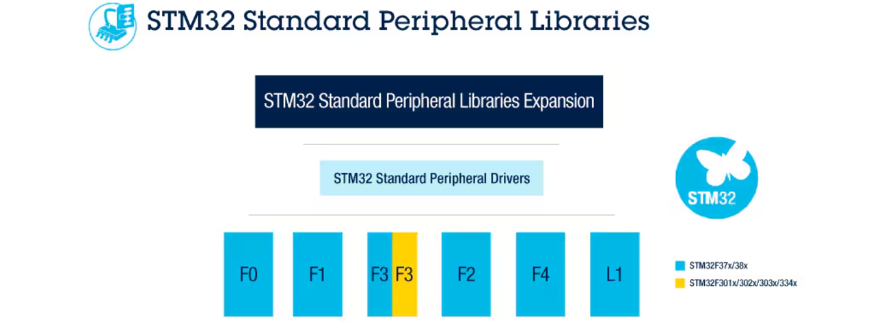

2. **点击对应的芯片系列，进入后滚动到最下面点下载**

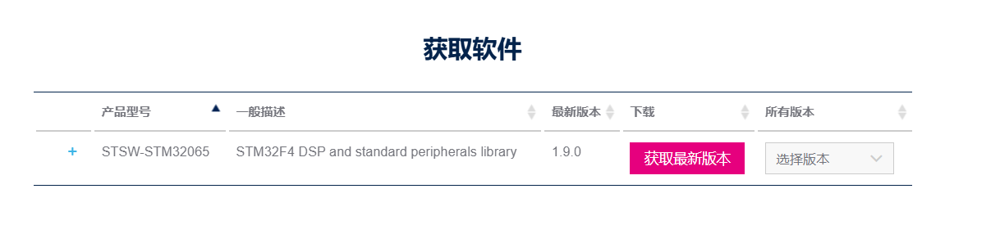

3. **解压到当前文件夹**
4. **解压后文件夹名字一般为：STM32Fxxxxxx_StdPeriph_Lib_V1.9.0**
# 二、下载并安装对应的芯片支持包（以F407举例）
1. **网站：**
***
**[Arm Keil | Devices](https://www.keil.arm.com/devices/)**

***

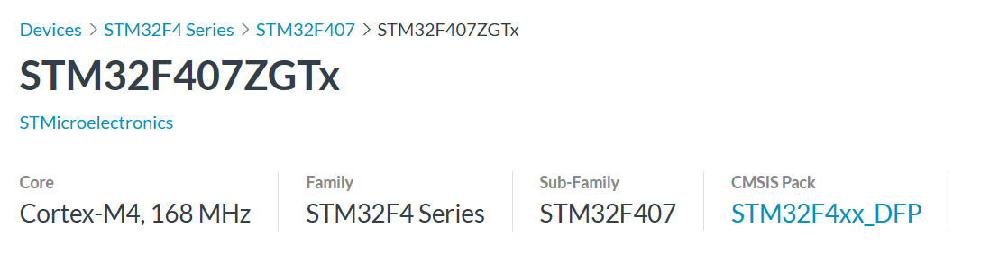

2. **以F407ZGT6举例，下载最右边这个DFP文件并安装**

# 三、建立模版工程文件夹Template

1. **参考文献：**
***
**[STM32F407zgt6--基于固件库的新建工程模板-CSDN博客](https://blog.csdn.net/m0_70465845/article/details/142105291)**
***
2. **需要建立以下文件夹：**

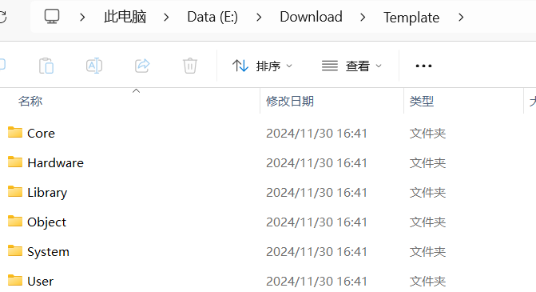

3. **具体文件说明（STM32F4xx）：在解压后的标准库文件夹内寻找对应的文件并复制进模版文件夹**
	* **Core：存放内核启动文件**
		* startup_stm32f40_41xxx.s（这个文件决定了使用的F4系列的芯片型号，换芯片的话换这个文件就行，用哪个加哪个，具体怎么选择可以百度，工程里不要有冗余的文件）
		* core_cm4.h
		* core_cmFunc.h
		* core_cmInstr.h
		* core_cmSimd.h
	* **Hardware：存放自己写的驱动文件**
	* **Library：存放标准外设库文件**
		* inc文件夹
		* src文件夹
	* **Objects：存放系统输出的.hex文件**
	* **System：存放使用率比较高的常用函数与串口程序**
	* **User：存放main函数以及一些附属的文件**
		* stm32f4xx.h
		* system_stm32f4xx.h
		* main.c
		* main.h
		* stm32f4xx.conf.h
		* stm32f4xx.it.c
		* stm32f4xx.it.h
		* system_stm32f4xx.c
4. **具体文件说明（STM32F1xx）：在解压后的标准库文件夹内寻找对应的文件并复制进模版文件夹**
	* **Core：存放内核启动文件**
		* startup_stm32f10x_md.s（这个文件决定了使用的F1系列的芯片型号，换芯片的话换这个文件就行，用哪个加哪个，工程里不要有冗余的文件）
		* core_cm3.h
		* core_cm3.c
	* **Hardware：存放自己写的驱动文件**
	* **Library：存放标准外设库文件**
		* inc文件夹
		* src文件夹
	* **Objects：存放系统输出的.hex文件**
	* **System：存放使用率比较高的常用函数与串口程序**
	* **User：存放main函数以及一些附属的文件**
		* main.c
		* stm32f10x.h
		* stm32f10x_conf.h
		* stm32f10x_it.c
		* stm32f10x_it.h
		* system_stm32f10x.c
		* system_stm32f10x.h
1. **拷贝进来的文件很有可能是只读类型的，要修改的时候记得取消掉，不然不能在软件内修改代码，改完了记得调回来，防止误操作修改了库文件导致工程出错！！！**
# 四、打开Keil新建工程到Template文件夹内
1. **Project -> New Project -> 名字就叫Project就行 -> 选择对应的芯片型号 -> OK**
2. **添加文件**

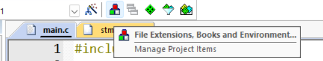

3. **添加Core里的文件进去**

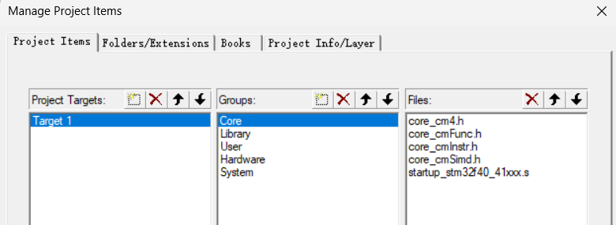

4. **添加library的时候把inc和src里的文件都添加进去就行（.c和.h放一起就行）**
	* **注意：** 需要把Library里面的stm32f4xx_fmc.c和stm32f4xx_fmc.h文件删掉，点击那个红叉就可以删除，因为STM32f407ZGT6是没有FMC这个外设的，不删掉会报错

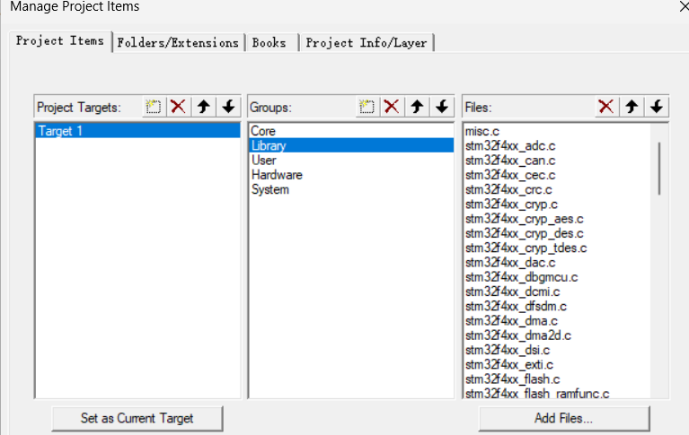

5. **添加User文件**

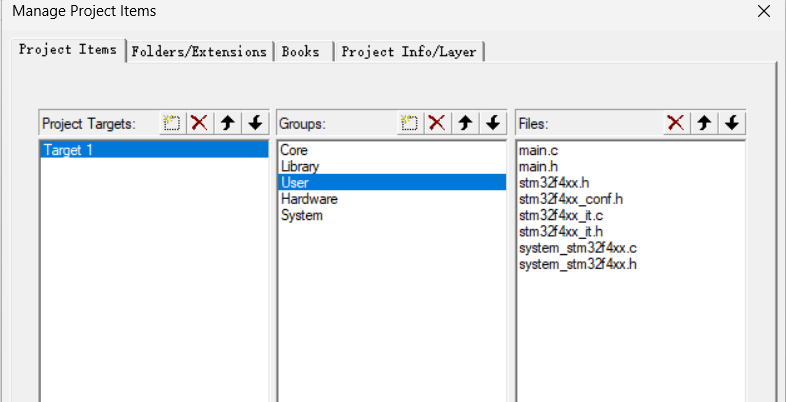

6. **添加Hardware文件**
7. **添加System文件**
# 五、配置工程&添加全局宏定义标识
## 1、**配置工程**

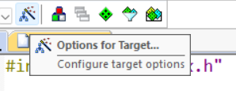

## 2、**标准库工程的编译器要选择AC5编译器**

* **注意：** AC5需要下载并安装到Keil5的ARM目录下面新建一个ARMCC文件夹用来放AC5
***
**[Arm Compiler 5.06__ARM编译器官网下载, 安装及使用说明( 保姆级教程, 官网下载和注册链接跳转异常问题, 附官网安装包 )-CSDN博客](https://blog.csdn.net/weixin_44807874/article/details/128627528)**
***

* **安装完了之后要在Keil内添加编译器**

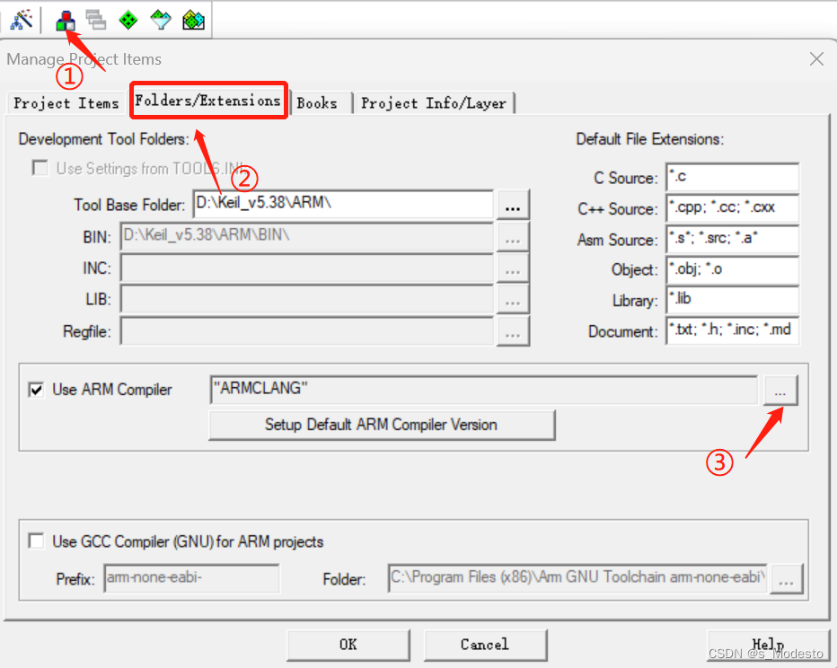

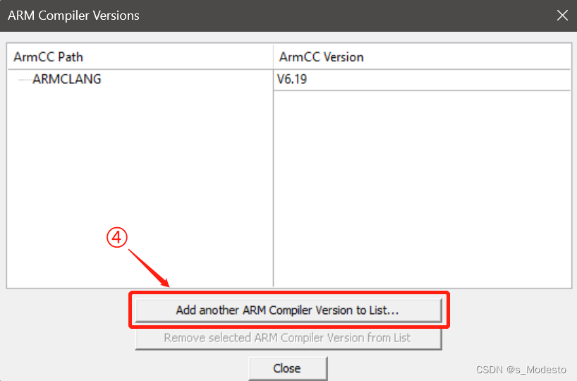

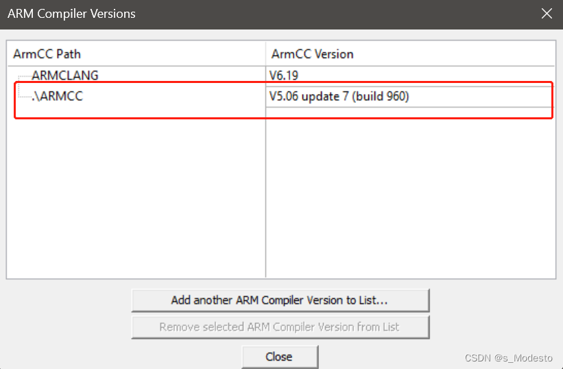

## 3、**勾选MicroLIB可以使用一些C语言的常见库**

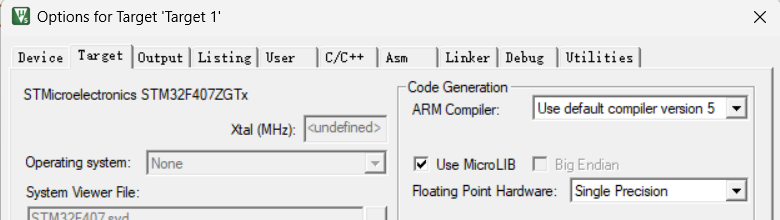

## 4、**勾选生成HEX文件并设置生成路径到我们新建的Objects**

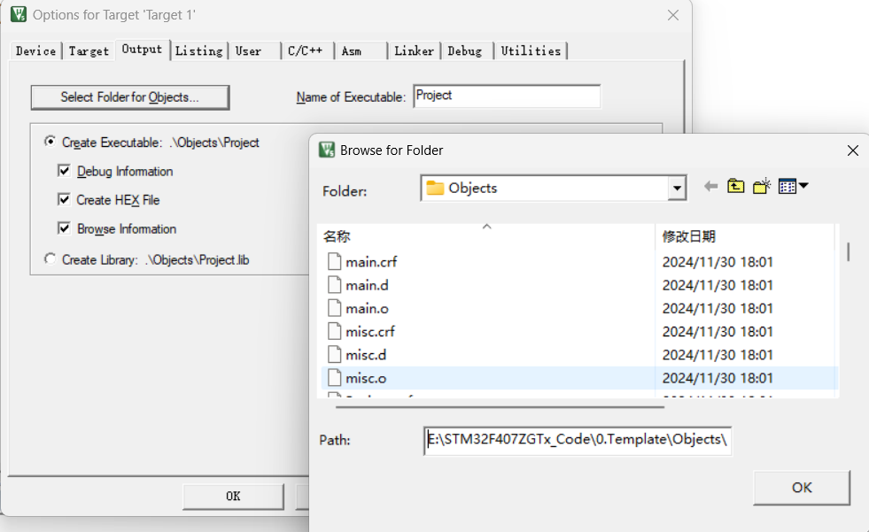

## 5、**添加全局宏定义标识**
**宏定义标识（STM32F4xx）： STM32F40_41xxx,USE_STDPERIPH_DRIVER**
**宏定义标识（STM32F1xx）： STM32F10X_MD,USE_STDPERIPH_DRIVER**

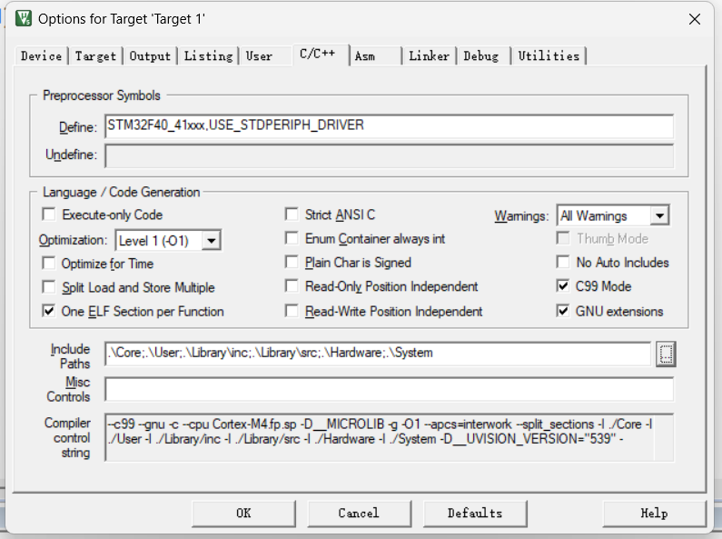

## 6、**设置文件路径**

* **注意：** 设置的时候选后面三个点可以直接选择路径，不要自己输入

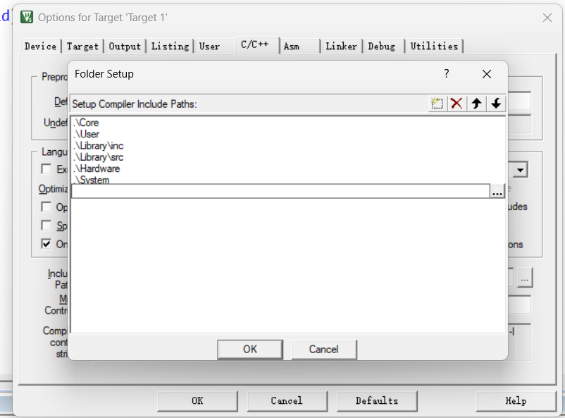

## 7、**选择调试工具，我这里用的是DAP**

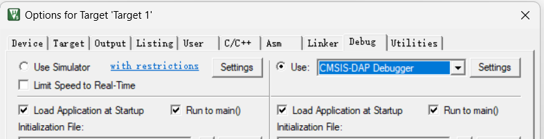
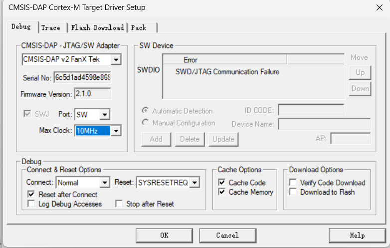
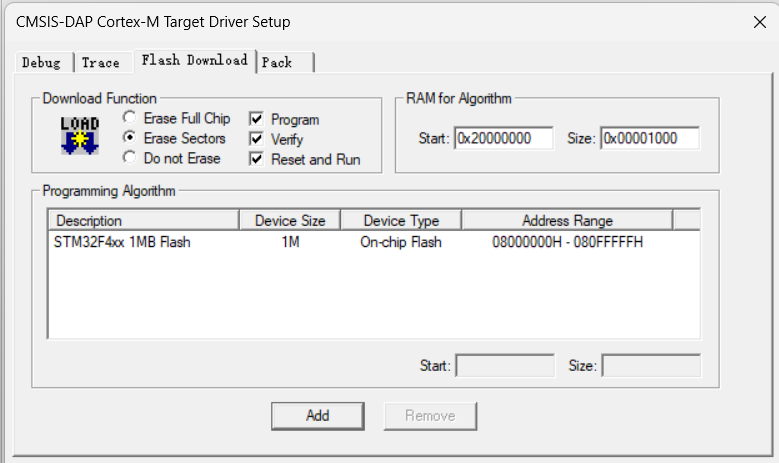
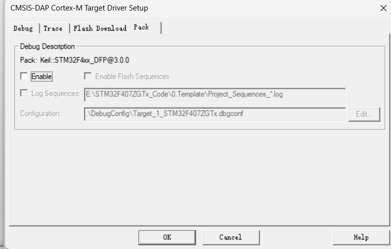

# 六、调整代码消除报错
1. **更改main.c的内容**
	* **头文件（STM32F4xx）：#include "stm32f4xx.h"**
	* **头文件（STM32F10x）：#include "stm32f10x.h"**
```c
#include "stm32f4xx.h"

int main(void)
{
	while(1)
	{
		
	}
}
//末尾要加新行，不然在Keil5里会报错

```
2. **（STM32F4xx）现在直接编译的话会出错，因为我们把main.c中的内容全部删除了，但是有个文件调用了main.c原有的东西，它找不到就报错了，在stm32f4xx_it.c文件中，我们注释掉它调用的函数**

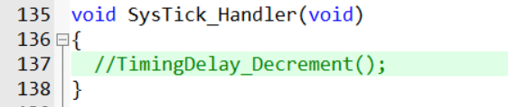

3. **（STM32F4xx）编译并消除警告**
	* **编译会出现很多警告，这里是因为在stm32f4xxx.h中的声明重复了，把下面那组注释掉就行了**

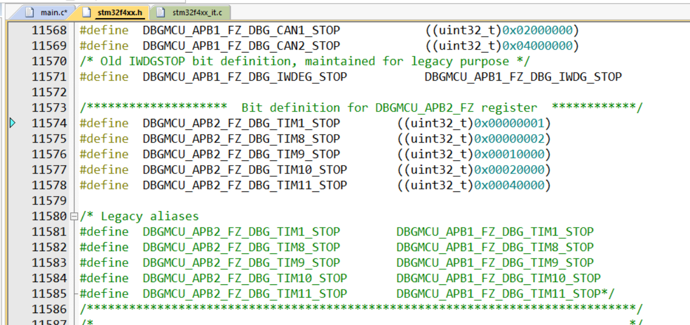

