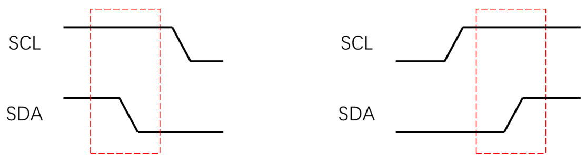
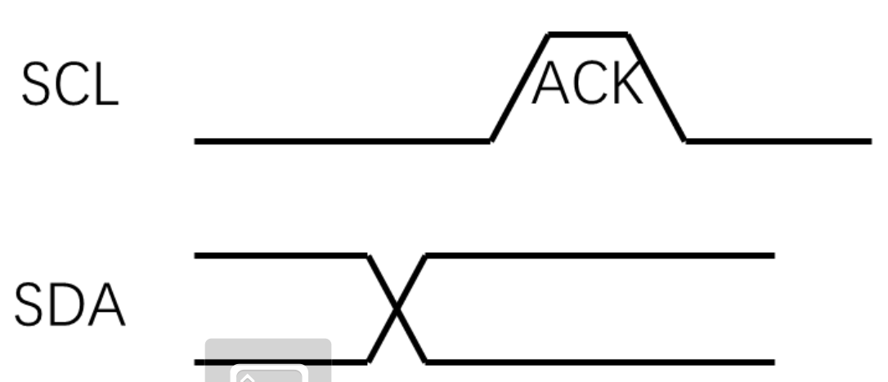
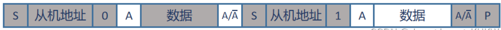
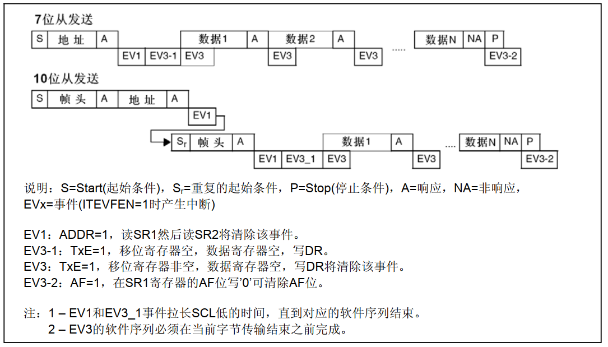

# 一、I2C简介
## （1）I2C是什么？
* **IIC**（Inter-Integrated Circuit）即集成电路总线。它是一种**串行通信总线**，使用多主从架构，通常由两根线组成——**SDA**（串行数据线）和**SCL**（串行时钟线）和上拉电阻。
* 常用于需要许多不同部件（例如传感器、引脚、扩展和驱动程序）协同工作的项目，因为I2C可以将**多达 128 个设备连接**到主板，同时保持清晰的通信路径！它用于将各种低速设备连接在一起，如微控制器、EEPROM、A/D 和 D/A 转换器等。
* 与 UART 和 SPI 不同，I2C 总线驱动器是**开漏输出**的，可防止总线争用并消除驱动器损坏的机会。
* I2C 中的每条信号线都包含**上拉电阻**，当没有设备将其拉低时，可自行恢复至线路的高电平。
* 所有传输均由“主设备”发起和终止；“主设备”可以向一个或多个“从设备”写入数据，或者向“从设备”请求数据。“**主设备**”和“**从设备**”在系统中并不是固定的。实际上，任何设备只要配置了适当的硬件或固件，都可以用作“主设备”或“从设备”。
* 数据以**一个字节**传输，每个字节后跟一个**1位握手信号**作为ACK/NACK位（确认/无响应）。

| 名称  |   引脚    |  常用领域   | 双工  | 时钟  | 电平  | 设备  |
| :-: | :-----: | :-----: | :-: | :-: | :-: | :-: |
| I2C | SCL、SDA | 单片机和单片机 | 半双工 | 同步  | 单端  | 多设备 |
* **半双工：** 允许信号在两个方向上传输，但某一时刻只允许信号在一个信道上单向传输。
## （2）I2C的优点
* I2C总线目前仍然是各种电路常用的通信外设，且实现简单。无论总线上连接多少个设备，只需要两条信号线（时钟SCL和数据SDA）。
* 它是真正的多主总线，优于SPI。
* I2C接口也很灵活，使其能够与慢速设备通信，同时还具有高速模式来传输大数据。标准模式下传输速率可达100kbit/s，快速模式下可达400kbit/s，高速模式下可达3.4Mbit/s；
* 由于其灵活性，I2C 将始终是连接设备的最佳通信外设之一。

| 线数 | 数据帧大小 |    速度     |    波特率    | 主设备数量 |          从设备数量          |
| :--: | :--------: | :---------: | :----------: | :--------: | :--------------------------: |
| SCL  | 8位数据包  | 标准100Kbps | 没有UART严格 |    无限    | 最多127（但电容可达 400 pf） |
| SDA  |            | 快速400Kbps |              |            |                              |
|      |            | 高速3.4Mbps |              |            |                              |

# 二、I2C通信步骤

## （1）通信步骤
1. 主设备产生一个**开始信号**，向其他设备发出信号，开始监听总线并准备接收数据。当发送启动信号条件时，总线将进入繁忙状态，其中当前数据传输仅限于选定的主设备和从设备。只有在产生停止条件后，总线才会被释放并再次处于空闲模式。
2. 主设备向每个设备发送一个**7位设备地址**加上**1位读写数据帧**。该位还将指示下一个数据传输的方向。**0 = 主设备向从设备写入数据，1 = 主设备向从设备读取数据**。
3. 每个从机将主机发送的地址与自己的地址进行比较。成功**匹配地址**的从设备通过拉低 SDA 线**返回 ACK 位**。
4. 当主设备收到从设备的确认信号后，**开始发送或接收数据**。下图是向指定设备传输数据的过程图。 
5. 接收设备接收每个数据帧后，向发送方**返回另一个ACK位**，以确认该帧已成功接收，然后发送方继续发送该数据帧，以此类推。
6. 当数据传输完成后，主设备会向其他设备发出**停止信号，释放总线**，总线进入空闲状态。
## （2）消息的传递格式
- I2C 数据在消息中传输，消息被分解为**数据帧**（每8位一个数据帧）。
- 每条消息包含：
    - 启动条件
    - 停止条件
    - 读取和写入位（0 = 主设备向从设备写入数据，1 = 主设备向从设备读取数据）
    - ACK/NACK 位（0表示应答ACK，1表示非应答NACK）
    - 从机地址
    - 数据帧
## （3）启动条件与终止条件
* **启动条件：主机将SDA先拉低，SCL后拉低**
	* 向其他从属设备发出信号，表明传输即将发生。
	* 如果两个主机同时发送启动条件想要获得总线的所有权，那么谁先将 SDA 拉低，谁就“获胜”
* **终止条件：主机将SCL先拉高，SDA后拉高**
	* 所有数据帧发送完毕后，将发送停止条件。
	* 在正常数据写入操作期间，当 SCL 为高电平时，SDA 上的值不能更改！可能会导致错误发出停止信号或者从机读取到错误数据。


## （4）发送一个字节
* **SCL低电平**期间，**主机将一位数据位放到SDA线上（高位先行）**，然后拉高SCL，从机将在SCL高电平期间读取数据位，所以SCL高电平期间SDA不允许有数据变化，依次循环上述过程8次，即可发送一个字节


## （5）接收一个字节
* **SCL低电平**期间，**从机将一位数据放到SDA线上（高位先行）**，然后主机拉高SCL，主机将在SCL高电平期间读取数据位，所以SCL高电平期间SDA不允许有数据变化，依次循环上述过程8次，即可接收一个字节 **（主机在接收之前，需要释放SDA，但是SCL的控制权要一直在主机！！！）**。


## （6）发送应答
* **数据接收方**接收完每个数据帧后的SCL低电平期间放一位数据到SDA中，向发送方返回另一个ACK位，以确认该帧已成功接收，然后发送方继续发送数据帧，否则停止发送，以此类推。（数据0表示应答ACK，数据1表示非应答NACK）



## （7）接收应答
* **数据发送方**在发送完一个字节之后，在下一个时钟高电平期间接收一位数据，判断从机是否应答，数据0表示应答ACK，数据1表示非应答NACK（主机在接收之前，需要释放SDA）。


# 三、I2C时序图
* **注意： S：起始信号，A：应答信号，A非表示非应答，0是写，1是读，P：终止信号**
* **阴影部分**表示数据由主机向从机传送，**无阴影部分**表示从机向主机发送数据。
* 数据传输**中途转换发送方向**，不用发P停止信号，就不会释放总线，直接再发起始信号。
## （1）主机向从机发送数据


## （2）主机向从机读取数据


## （3）主机先向从机发送数据，然后从机再向主机发送数据



# 四、软件实现I2C（以与MPU6050通信举例）
```c
#include "stm32f10x.h"                  // Device header
#include "softwareI2C.h"
#include "Delay.h"

//SCL GPIO_Pin_12  时钟线为PB12
//SDA GPIO_Pin_13  数据线为PB13

//设置时钟信号的函数，参数为Bit_RESET,Bit_SET（一主多从的I2C中只能在主机端设置时钟！）
void My_I2C_SCL_Set(uint8_t BitVal){
    GPIO_WriteBit(GPIOB,GPIO_Pin_12,(BitAction)BitVal);
    Delay_us(10);//采用I2C标准模式：100KHz的频率,也就是10微妙一个时钟周期
}

//向数据线中写一位信号的函数，参数为Bit_RESET,Bit_SET
void My_I2C_SDA_Write(uint8_t BitVal){
    GPIO_WriteBit(GPIOB,GPIO_Pin_13,(BitAction)BitVal);
    Delay_us(10);//采用I2C标准模式：100KHz的频率,也就是10微妙一个时钟周期
}

//从数据线中读取一位数据，返回值只有0/1两种,也就是电平的状态
uint8_t MyI2C_SDA_ReadBit(void)
{
    return GPIO_ReadInputDataBit(GPIOB,GPIO_Pin_13);
}

//初始化软件I2C，初始化用于实现功能的管脚
void MyI2C_Init(void){
    //开时钟
	RCC_APB2PeriphClockCmd(RCC_APB2Periph_GPIOB,ENABLE);
	//初始化GPIO
	GPIO_InitTypeDef GPIO_InitTypeStructure;
	GPIO_InitTypeStructure.GPIO_Mode = GPIO_Mode_Out_OD; //开漏 , 在开漏模式下可以读取引脚的高低电平,用推挽会导致短路
	GPIO_InitTypeStructure.GPIO_Pin = GPIO_Pin_12 | GPIO_Pin_13;
	GPIO_InitTypeStructure.GPIO_Speed = GPIO_Speed_50MHz;	
	GPIO_Init(GPIOB,&GPIO_InitTypeStructure);
	//给引脚默认值,因为在不传输的时候I2C总线默认是高电平
	My_I2C_SCL_Set(1);
    My_I2C_SDA_Write(1);   	
}

//协议开始传输，要把两条线从高电平拉低,SDL先拉低，SCL后拉低
void MyI2C_Start(void){
    //因为终止信号是SCL先拉高，所以起始的时候要反过来，不然会发送一个终止信号
    My_I2C_SDA_Write(1);
    My_I2C_SCL_Set(1);
	//SDA先拉低，发送起始信号
    My_I2C_SDA_Write(0);
    My_I2C_SCL_Set(0);
}

//协议传输一个字节的数据
void MyI2C_SendByte(uint8_t byte){
    //SCL低电平期间主机放入信号，然后拉高SCL，从机会在SCL高电平期间读取，因为第一次传输的时候是从开始传输函数执行过后的，故不需拉低SCL
	for(uint8_t i=0;i<8;i++)
	{
		My_I2C_SDA_Write(byte&(0x80>>i)); //发送数据是高位先行的，八个二进制数与1000 0000 相当于只保留高位，下一次让1右移就是保留次高位
		My_I2C_SCL_Set(1);//拉高SCL等待从机接收
		My_I2C_SCL_Set(0);//从机接收后就拉低SCL，继续进行下次主机放入数据	
	}	
    //重复八次，成功传入一个字节数据到总线中
}

//发送地址到总线中,区分读写模式
void MyI2C_SendAddr(uint8_t addr,ModeType mode){
	if(mode == Mode_Write){
		MyI2C_SendByte(addr&0xFE);//写的时候要在七位地址（地址是已经左移处理过的7位数据）后面加一个0，设置最低位为0
	}else if (mode == Mode_Read){
		MyI2C_SendByte(addr|0x01);//读的时候要在七位地址（地址是已经左移处理过的7位数据）后面加一个1，设置最低位为1
	}
}

//协议接收一个字节的数据
uint8_t MyI2C_ReadByte(void){
	uint8_t recByte = 0x00;//初始化缓冲区
	My_I2C_SDA_Write(1);//主机设置SDA为1，因为是开漏模式，这样从机才能自由拉高拉低电平
	for(uint8_t i=0;i<8;i++)
	{
        //SCL低电平的时候从机会将数据放到SDA，主机拉高SCL电平，在高电平期间接收数据
		My_I2C_SCL_Set(1);
		recByte|=MyI2C_SDA_ReadBit()<<(7-i);//接受数据的时候也是高位先行，因此接收到的1左移7位相当于1000 0000，下一次左移就是次高位
		My_I2C_SCL_Set(0);		
	}
	return recByte;//返回缓冲区保存的8位（一个字节）数据
}

//发送响应ack,数据0表示应答，数据1表示非应答。
//主机在接收完一个字节之后，在下一个时钟发送一位数据，数据0表示应答，数据1表示非应答。
void MyI2C_SendACK(uint8_t ack){
	My_I2C_SDA_Write(ack);//发送完一个字节后SCL低电平，在此期间主机放入应答数据
	My_I2C_SCL_Set(1);	//拉高SCL等待从机读取ack（应答）
	My_I2C_SCL_Set(0);	//拉低SCL等待下一个周期
}

//接收响应ack，主机在发送完一个字节之后，在下一个时钟接收一位数据，判断从机是否应答，数据0表示应答，数据1
//表示非应答（主机在接收之前，需要释放SDA）。
uint8_t MyI2C_RecACK(void){
	My_I2C_SDA_Write(1);//主机设置SDA为1，因为是开漏模式，这样从机才能自由拉高拉低电平
	My_I2C_SCL_Set(1);//拉高SCL,主机在高电平期间读取ACK
	uint8_t ack=MyI2C_SDA_ReadBit();//主机从数据线中读取一位应答信息
	My_I2C_SCL_Set(0);//拉低SCL，主机应答接收完毕
	return ack;//返回应答包
}

//协议停止,终止信号是SCL先拉高，SDA后拉高
void MyI2C_Stop(void){
	My_I2C_SDA_Write(0);//在接收从机应答后SDA状态不确定确保SDA是低电平，然后发送终止信号才可以
	My_I2C_SCL_Set(1);//先拉高SCL
	My_I2C_SDA_Write(1);//拉高SDA结束
}

```
# 五、硬件实现I2C（以与MPU6050通信举例）
* **注意：** STM32中使用I2C硬件实现I2C的话需要参照参考手册中的**传送序列图**来编写程序，其中涉及到等待标志位或者事件，与软件实现略有不同，但是由专门的硬件实现的I2C性能更好，不会占用CPU资源

## （1）主发送器传送序列图


## （2）主接收器传送序列图


## （3）从发送器传送序列图



## （4）从接收器传送序列图


## （5）代码实现
```c
#include "stm32f10x.h"                  // Device header
#ifndef MPU6050_H
#define MPU6050_H

//MPU6050其I2C从机地址固定为1101 0000（也就是十六进制D0）,看起来是8位地址，实际上是7位，最后一位0是读写位,是由硬件设定的
//其I2C从机地址固定为11010000（D0融入读写位的，如果不融入读写位，那地址应该是110 1000 就是0x68）
//可以通过AD0引脚接入高低电平来修改低位地址。当AD0引脚接入低电平时，地址为1101000，当AD0引脚接入高电平时，地址为1101001。
#define MPU6050_Addr 0x68  //MPU6050设备的7位地址

// 自定义MPU6050寄存器地址宏定义
#define MPU6050_SMPLRT_DIV 0x19
#define MPU6050_CONFIG 0x1A
#define MPU6050_GYRO_CONFIG 0x1B
#define MPU6050_ACCEL_CONFIG 0x1C
#define MPU6050_ACCEL_XOUT_H 0x3B
#define MPU6050_ACCEL_XOUT_L 0x3C
#define MPU6050_ACCEL_YOUT_H 0x3D
#define MPU6050_ACCEL_YOUT_L 0x3E
#define MPU6050_ACCEL_ZOUT_H 0x3F
#define MPU6050_ACCEL_ZOUT_L 0x40
#define MPU6050_TEMP_OUT_H 0x41
#define MPU6050_TEMP_OUT_L 0x42
#define MPU6050_GYRO_XOUT_H 0x43
#define MPU6050_GYRO_XOUT_L 0x44
#define MPU6050_GYRO_YOUT_H 0x45
#define MPU6050_GYRO_YOUT_L 0x46
#define MPU6050_GYRO_ZOUT_H 0x47
#define MPU6050_GYRO_ZOUT_L 0x48
#define MPU6050_PWR_MGMT_1 0x6B
#define MPU6050_PWR_MGMT_2 0x6C
#define MPU6050_WHO_AM_I_REG 0x75

typedef struct{
	int16_t ACCEL_XOUT;  //X轴加速度   
	int16_t ACCEL_YOUT;  //Y轴加速度   
	int16_t ACCEL_ZOUT;  //Z轴加速度  
 
	int16_t GYRO_XOUT; //X轴角速度
	int16_t GYRO_YOUT; //Y轴角速度
	int16_t GYRO_ZOUT; //Z轴角速度	
}MPU6050_DataTypeDef;

void MPU6050_Init(void)
{
	//开启I2C对应的管脚和I2C对应的时钟
	RCC_APB2PeriphClockCmd(RCC_APB2Periph_GPIOB,ENABLE);
	RCC_APB1PeriphClockCmd(RCC_APB1Periph_I2C2,ENABLE);
	//初始化GPIO
	GPIO_InitTypeDef GPIO_InitTypeStructure;
	GPIO_InitTypeStructure.GPIO_Mode = GPIO_Mode_AF_OD; // 模式 -- 复用开漏
	GPIO_InitTypeStructure.GPIO_Pin = GPIO_Pin_10|GPIO_Pin_11;
	GPIO_InitTypeStructure.GPIO_Speed = GPIO_Speed_50MHz;
	GPIO_Init(GPIOB,&GPIO_InitTypeStructure);
	//初始化I2C
	I2C_InitTypeDef I2C_InitTypeDefStructure;
	I2C_InitTypeDefStructure.I2C_Ack = I2C_Ack_Enable;//自动应答，需要关闭的时候可以用别的函数关闭应答
	I2C_InitTypeDefStructure.I2C_AcknowledgedAddress = I2C_AcknowledgedAddress_7bit;//七位地址模式
	I2C_InitTypeDefStructure.I2C_ClockSpeed = 100000;//100KHz
	I2C_InitTypeDefStructure.I2C_DutyCycle = I2C_DutyCycle_2;//高低电平2/1
	I2C_InitTypeDefStructure.I2C_Mode = I2C_Mode_I2C;//I2C模式
	I2C_InitTypeDefStructure.I2C_OwnAddress1 = 0x11;//给自己起个地址名字
	I2C_Init(I2C2,&I2C_InitTypeDefStructure);
	//使能I2C
	I2C_Cmd(I2C2,ENABLE);

	//MPU6050的各种配置
    //1.电源管理1配置为陀螺仪时钟
    MPU6050_RegWrite(MPU6050_PWR_MGMT_1,0x01);		
	//2.电源管理2配置不待机
	MPU6050_RegWrite(MPU6050_PWR_MGMT_2,0x00);
	//3.采样分频配置，1分频，就是1KHz/1+1
	MPU6050_RegWrite(MPU6050_SMPLRT_DIV,0x01);	
	//4.配置寄存器
	MPU6050_RegWrite(MPU6050_CONFIG,0x03);
	//5.陀螺仪配置,满量程± 2000 °/s
	MPU6050_RegWrite(MPU6050_GYRO_CONFIG,0x18);
	//6.加速度配置，满量程 ± 16g
	MPU6050_RegWrite(MPU6050_ACCEL_CONFIG,0x18);
}

//向指定的寄存器中写入内容，以配置寄存器
void MPU6050_RegWrite(uint8_t regAddr,uint8_t regValue)
{
	//根据参考手册的主发送器传送序列图来编写程序
	//1.产生开始信号
	I2C_GenerateSTART(I2C2,ENABLE);
	//2.等待EV5事件
	while(I2C_CheckEvent(I2C2,I2C_EVENT_MASTER_MODE_SELECT)!=SUCCESS);
	//3.发送设备地址,记得让地址左移，后面要加读写位的
	I2C_Send7bitAddress(I2C2,MPU6050_Addr<<1,I2C_Direction_Transmitter);
	//4.硬件自动ACK
	//5.等待EV6事件,因为是发送所以选EV6的发送事件
	while(I2C_CheckEvent(I2C2,I2C_EVENT_MASTER_TRANSMITTER_MODE_SELECTED)!=SUCCESS);
	//6.发送要读写的寄存器地址（发送设备内寄存器的地址的时候不需要加读写位的,所以直接当数据发就行）
	I2C_SendData(I2C2,regAddr);
	//7.等待EV8事件
	while(I2C_CheckEvent(I2C2,I2C_EVENT_MASTER_BYTE_TRANSMITTING)!=SUCCESS);
	//8.硬件自动ACK
	//9.发送要传送的数据
	I2C_SendData(I2C2,regValue);
	//10.硬件自动ACK
	//11.等待EV8_2事件
	while(I2C_CheckEvent(I2C2,I2C_EVENT_MASTER_BYTE_TRANSMITTED)!=SUCCESS);
	//12.产生停止信号
	I2C_GenerateSTOP(I2C2,ENABLE);
}

//读寄存器中的内容，接收一个字节
uint8_t MPU6050_RegRead(uint8_t regAddr)
{
	//第一个步骤：指定地址写

	//根据参考手册的主发送器传送序列图来编写程序
	//1.产生开始信号
	I2C_GenerateSTART(I2C2,ENABLE);
	//2.等待EV5事件
	while(I2C_CheckEvent(I2C2,I2C_EVENT_MASTER_MODE_SELECT)!=SUCCESS);
	//3.发送设备地址,记得让地址左移，后面要加读写位的
	I2C_Send7bitAddress(I2C2,MPU6050_Addr<<1,I2C_Direction_Transmitter);
	//4.硬件自动ACK
	//5.等待EV6事件,因为是发送所以选EV6的发送事件
	while(I2C_CheckEvent(I2C2,I2C_EVENT_MASTER_TRANSMITTER_MODE_SELECTED)!=SUCCESS);
	//6.发送要读写的寄存器地址（发送设备内寄存器的地址的时候不需要加读写位的,所以直接当数据发就行）
	I2C_SendData(I2C2,regAddr);
	//7.写结束的时候要等待EV8_2事件
	while(I2C_CheckEvent(I2C2,I2C_EVENT_MASTER_BYTE_TRANSMITTED)!=SUCCESS);
	//8.硬件自动ACK
	//到此为止都是指定地址写的步骤，因为MPU6050内部有很多寄存器，你要指定一个寄存器才能读他的内容

	//第二个步骤：当前地址读

	//因为在上面已经指定过地址了，所以在当前地址读就行了，以下程序根据参考手册的主接收器接收序列图来编写程序
	//9.产生开始信号
	I2C_GenerateSTART(I2C2,ENABLE);
	//10.等待EV5事件
	while(I2C_CheckEvent(I2C2,I2C_EVENT_MASTER_MODE_SELECT)!=SUCCESS);
	//11.指定设备地址读模式
	I2C_Send7bitAddress(I2C2,MPU6050_Addr<<1,I2C_Direction_Receiver);
	//12.硬件自动ACK
	//13.等待EV6事件
	while(I2C_CheckEvent(I2C2,I2C_EVENT_MASTER_RECEIVER_MODE_SELECTED)!=SUCCESS);
	//14.从时序图可以看出来在接受最后一个字节的数据前要设置EV7_1事件，所以提前关闭自动应答并设置停止信号
	I2C_AcknowledgeConfig(I2C2,DISABLE);
	I2C_GenerateSTOP(I2C2,ENABLE);
	//15.等待EV7，接收寄存器的值
	while(I2C_CheckEvent(I2C2,I2C_EVENT_MASTER_BYTE_RECEIVED)!=SUCCESS);
	uint8_t regValue = I2C_ReceiveData(I2C2);
	//17.恢复自动应答
	I2C_AcknowledgeConfig(I2C2,ENABLE); //恢复到默认值
	return regValue;
}

//获取角速度和加速度
void MPU6050_Read_ACCEL_GYRO(MPU6050_DataTypeDef *data)
{
   //获取x轴的加速度
	int16_t ACCEL_XOUT = 0x0000;
	ACCEL_XOUT |= MPU6050_RegRead(MPU6050_ACCEL_XOUT_H)<<8; //高8位
	ACCEL_XOUT |= MPU6050_RegRead(MPU6050_ACCEL_XOUT_L);//低8位
	data->ACCEL_XOUT = ACCEL_XOUT;
	
	//获取y轴的加速度
	int16_t ACCEL_YOUT = 0x0000;
	ACCEL_YOUT |= MPU6050_RegRead(MPU6050_ACCEL_YOUT_H)<<8; //高8位
	ACCEL_YOUT |= MPU6050_RegRead(MPU6050_ACCEL_YOUT_L);//低8位
	data->ACCEL_YOUT = ACCEL_YOUT;
	
	//获取Z轴的加速度
	int16_t ACCEL_ZOUT = 0x0000;
	ACCEL_ZOUT |= MPU6050_RegRead(MPU6050_ACCEL_ZOUT_H)<<8; //高8位
	ACCEL_ZOUT |= MPU6050_RegRead(MPU6050_ACCEL_ZOUT_L);//低8位
	data->ACCEL_ZOUT = ACCEL_ZOUT;
	
	//获取X轴的角速度
	int16_t GYRO_XOUT = 0x0000;
	GYRO_XOUT |= MPU6050_RegRead(MPU6050_GYRO_XOUT_H)<<8; //高8位
	GYRO_XOUT |= MPU6050_RegRead(MPU6050_GYRO_XOUT_L);//低8位
	data->GYRO_XOUT = GYRO_XOUT;
	
	//获取Y轴的角速度
	int16_t GYRO_YOUT = 0x0000;
	GYRO_YOUT |= MPU6050_RegRead(MPU6050_GYRO_YOUT_H)<<8; //高8位
	GYRO_YOUT |= MPU6050_RegRead(MPU6050_GYRO_YOUT_L);//低8位
	data->GYRO_YOUT = GYRO_YOUT;
	
	//获取Z轴的角速度
	int16_t GYRO_ZOUT = 0x0000;
	GYRO_ZOUT |= MPU6050_RegRead(MPU6050_GYRO_ZOUT_H)<<8; //高8位
	GYRO_ZOUT |= MPU6050_RegRead(MPU6050_GYRO_ZOUT_L);//低8位
	data->GYRO_ZOUT = GYRO_ZOUT;
}
```