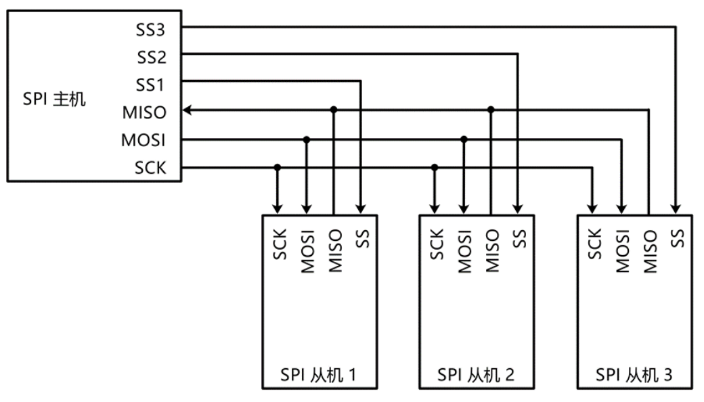

# 一、SPI简介
## （1）SPI是什么？
* SPI（Serial Peripheral Interface），也叫**串行外设接口**。是Motorola公司开发的一种**通用数据总线**，和I2C一样都是通用的数据通信总线，都是用于主控和外挂芯片之间的通信，应用领域也非常相似。当然SPI和I2C也是各有优势的。

| 名称  |        引脚         |  常用领域   | 双工  | 时钟  | 电平  | 设备  |
| :-: | :---------------: | :-----: | :-: | :-: | :-: | :-: |
| SPI | SCLK、MOSI、MISO、SS | 单片机和单片机 | 全双工 | 同步  | 单端  | 多设备 |

## （2） SPI优点

* I2C无论是硬件电路还是软件时序设计，都是比较复杂。硬件上需要配置为开漏外加上拉的模式，一根通信线兼具数据收发，应答位的收发，寻址机制的设计等等，通过这么多的设计使得I2C通信的性价比非常高。I2C可以在消耗最低硬件资源的情况下，实现最多的功能。在硬件上无论挂载多少个设备，都只需要两根通信线。在软件上数据双向通信，应答位都可以实现。但是I2C由于开漏外加上拉电阻的电路结构，使得通信线高电平的驱动能力比较弱，这就会导致通信线由低电平变到高电平的时候，上升沿耗时比较长，这会限制I2C的最大通信速度。所以I2C的标准模式只有100KHz的时钟频率，快速模式也只有400KHz。通过改进电路，设计出来的高速模式可以达到3.4MHz。但是高速模式目前普及程度并不是很高。所以一般情况下，大多认为I2C的时钟速度最多就是400KHz这个速度。而对于**SPI**而言，还是慢了很多的。**SPI传输更快**，SPI协议**并没有严格规定最大传输速度**。这个**最大传输速度**取决于芯片厂商的设计需求，比如后面要学习的W25Q64存储器芯片，其**SPI时钟频率最大可达80MHz**。
## （3）信号线
1. **MOSI（Master Output Slave Input：主机输出从机输入）**
2. **MISO（Master Input Slave Output：主机输入从机输出）**
3. **CLK（时钟线）**
4. **SS（片选线：有时候叫C/S，只是名字不同,每多一个设备就要多一根片选线）**



## （4）移位通信原理图
* SPI的通信有点像**交换数据**，你给我一位我给你一位，环形流动。
* SPI的通信基础是交换一个字节。有了交换一个字节，就可以实现发送一个字节，接收一个字节，和发送同时接收一个字节这三种功能。从这些可以看出，SPI在只执行发送或只执行接收的时候，会存在一些资源浪费的现象。但是全双工的通信本来就会有浪费的情况发生，对于SPI来说这个浪费无所谓。


# 二、SPI通信步骤
## （1）起始条件和终止条件
* **起始条件：** SS从高电平切换到低电平。


* **终止条件：** SS从低电平切换到高电平。


## （2）交换数据的模式（是针对从机的）
* **模式0**
CPOL=0 ( 时钟极性 Clock polarity)：空闲状态时，SCK为低电平。
CPHA=0（时钟相位Clock phase）：从机在SCK第一个边沿移入数据（采样），从机在在第二个边沿移出数据。


* **模式1**
CPOL=0：空闲状态时，SCK为低电平。
CPHA=1：从机在SCK第一个边沿移出数据，从机在第二个边沿移入数据。


* **模式2**
CPOL=1：空闲状态时，SCK为高电平。
CPHA=0：从机在SCK第一个边沿移入数据，从机在第二个边沿移出数据。


* **模式3**
CPOL=1：空闲状态时，SCK为高电平。
CPHA=1：从机在SCK第一个边沿移出数据，从机在第二个边沿移入数据。


# 三、SPI时序
* 在SPI中，通常采用的是**指令码加读写数据**的模型。这个过程就是SPI起始后，第一个交换发送给从机的数据，一般叫做指令码。在从机中对应的会定义一个指令集，当我们需要发送什么指令时，就可以在起始后第一个字节发送指令集里面的数据，这样就能指导从机完成相应的功能。不同的指令可以有不同的数据个数。有的指令只需要一个字节的指令码就可以完成，比如， W25Q64的写使能，写失能等指令。而有的指令，后面就需要再跟要读写的数据，比如，W25Q64的写数据，读数据等。写数据，指令后面就得跟上写的位置和写什么数据。读数据，指令后面就得跟读的位置和读什么数据。这就是指令码加读写数据的模型。在SPI从机的芯片手册里，都会定义好指令集。什么指令对应什么功能，什么指令后面得跟上什么数据这些内容。
* 具体**读数据**和**写数据**还有**时钟**的**先后顺序**，则**与交换数据的模式有关**，参照上面的模式时序图即可

# 四、软件实现SPI（以与W25Q64通信举例）

* **软件实现SPI的代码部分MYSPI.c**
```c
#include "stm32f10x.h"                  // Device header
#include "MYSPI.h"

//操作一个设备需要使用4根线
//SS:片选 PB12  --- 主机输出高或低 --推挽
//SCK: 时钟 PB13  ---主机输出高或低  --推挽
//MOSI: 主机输出从机输入 PB14  ---主机输出高或低  --推挽
//MISO：主机输入从机输出 PB15  ----主机读取电平,从机没有被片选输出高阻态（悬空） ---上拉输入

//控制片选SS
void MySPI_SS_W(uint8_t bitValue)
{
	GPIO_WriteBit(GPIOB,GPIO_Pin_12,(BitAction)bitValue);
}

//控制时钟SCK
void MySPI_SCK_W(uint8_t bitValue)
{
	GPIO_WriteBit(GPIOB,GPIO_Pin_13,(BitAction)bitValue);
}

//控制主机输出从机输入MOSI
void MySPI_MOSI_W(uint8_t bitValue)
{
	GPIO_WriteBit(GPIOB,GPIO_Pin_14,(BitAction)bitValue);
}

//控制主机输入从机输出MISO
uint8_t MySPI_MISO_R(void)
{
	return GPIO_ReadInputDataBit(GPIOB,GPIO_Pin_15);
}

void MySPI_Init(void)
{
	//开启时钟
	RCC_APB2PeriphClockCmd(RCC_APB2Periph_GPIOB,ENABLE);
	//初始化GPIO口
	GPIO_InitTypeDef GPIO_InitTypeStructure;
	GPIO_InitTypeStructure.GPIO_Mode= GPIO_Mode_Out_PP; //模式：推挽输出 
	GPIO_InitTypeStructure.GPIO_Pin = GPIO_Pin_12 | GPIO_Pin_13 | GPIO_Pin_14;
	GPIO_InitTypeStructure.GPIO_Speed = GPIO_Speed_50MHz;	
	GPIO_Init(GPIOB,&GPIO_InitTypeStructure);
	
	GPIO_InitTypeStructure.GPIO_Mode= GPIO_Mode_IN_FLOATING; //MISO模式： 浮空输入
	GPIO_InitTypeStructure.GPIO_Pin = GPIO_Pin_15;
	GPIO_InitTypeStructure.GPIO_Speed = GPIO_Speed_50MHz;	
	GPIO_Init(GPIOB,&GPIO_InitTypeStructure);

	//给线路默认值
	MySPI_SS_W(1);//片选默认高电平,因为拉低是起始信号，需要的时候再拉低就行
	MySPI_SCK_W(0);//选用SPI模式0通讯（模式0空闲状态SCK为低电平）	
}

//协议开始
void MySPI_Start(void)
{
	MySPI_SS_W(0);
}

//协议结束
void MySPI_Stop(void)
{
	MySPI_SS_W(1);
}

//交换数据:交换一个字节
uint8_t MySPI_SwapByte(uint8_t byteValue)
{
	for(uint8_t i=0;i<8;i++)
	{
		MySPI_MOSI_W((byteValue&0x80)>>7);//放入最高位到MOSI中		
		byteValue=byteValue<<1; //空出最低位	
		MySPI_SCK_W(1);//拉高时钟
		byteValue |= MySPI_MISO_R();//获取从机给主机的最高位,放入最低位，不用左移是因为下次循环的时候会左移一次的
		MySPI_SCK_W(0);//拉低时钟
	}
	return byteValue;	
}
```
* **实现利用SPI与W25Q64通信的代码部分W25Q64.c**
```c
#include "stm32f10x.h"                  // Device header
#include "W25Q64.h"
#include "MYSPI.h"

// 自定义W25Q64寄存器地址宏定义
#define W25Q64_WRITE_ENABLE 0x06
#define W25Q64_WRITE_DISABLE 0x04
#define W25Q64_READ_STATUS_REGISTER_1 0x05
#define W25Q64_READ_STATUS_REGISTER_2 0x35
#define W25Q64_WRITE_STATUS_REGISTER 0x01
#define W25Q64_PAGE_PROGRAM 0x02
#define W25Q64_QUAD_PAGE_PROGRAM 0x32
#define W25Q64_BLOCK_ERASE_64KB 0xD8
#define W25Q64_BLOCK_ERASE_32KB 0x52
#define W25Q64_SECTOR_ERASE_4KB 0x20
#define W25Q64_CHIP_ERASE 0xC7
#define W25Q64_ERASE_SUSPEND 0x75
#define W25Q64_ERASE_RESUME 0x7A
#define W25Q64_POWER_DOWN 0xB9
#define W25Q64_HIGH_PERFORMANCE_MODE 0xA3
#define W25Q64_CONTINUOUS_READ_MODE_RESET 0xFF
#define W25Q64_RELEASE_POWER_DOWN_HPM_DEVICE_ID 0xAB
#define W25Q64_MANUFACTURER_DEVICE_ID 0x90
#define W25Q64_READ_UNIQUE_ID 0x4B
#define W25Q64_JEDEC_ID 0x9Fmain.c
#define W25Q64_READ_DATA 0x03
#define W25Q64_FAST_READ 0x0B
#define W25Q64_FAST_READ_DUAL_OUTPUT 0x3B
#define W25Q64_FAST_READ_DUAL_IO 0xBB
#define W25Q64_FAST_READ_QUAD_OUTPUT 0x6B
#define W25Q64_FAST_READ_QUAD_IO 0xEB
#define W25Q64_OCTAL_WORD_READ_QUAD_IO 0xE3
#define W25Q64_DUMMY_BYTE 0xFF

void W25Q64_Init(void)
{
	//协议初始化
	MySPI_Init();
}

//读取JEDECID 
void W25Q64_JEDECID(uint8_t *ManufacturerID,uint16_t *DeviceID)
{
    //开始信号
	MySPI_Start();
	//以交换数据的形式把指令0x9F发过去
	MySPI_SwapByte(0x9F);
	//存储ManufacturerID
	*ManufacturerID = MySPI_SwapByte(0xFF);//抛转引玉，0xFF就是我抛出的值，因为SPI通信是以交换的形式，我给他8个1把他的有效数据换过来
	//存储DeviceID
	*DeviceID = MySPI_SwapByte(0xFF)<<8; //填充高8位
	*DeviceID |= MySPI_SwapByte(0xFF);//读取低8位
}

//等设备不忙
void W25Q64_WaitBusy(void)
{
	//开始信号
	MySPI_Start();
	//发送指令：读状态寄存器1
	MySPI_SwapByte(W25Q64_READ_STATUS_REGISTER_1);
	//读状态寄存器里的标志位如果BUSY是1就一直等;
	while((MySPI_SwapByte(W25Q64_DUMMY_BYTE)&0x01)==1);
	//结束信号
	MySPI_Stop();
}

//写使能：解除写保护
void W25Q64_WriteEnable(void)
{
	//开始信号
	MySPI_Start();
	//发送指令：写使能
	MySPI_SwapByte(W25Q64_WRITE_ENABLE);
	//结束信号
	MySPI_Stop();
}

//选择扇区进行擦除
void W25Q64_Selector_Erase(uint32_t selectorAddr)
{
	W25Q64_WaitBusy();//等设备不忙
	W25Q64_WriteEnable();//开写使能
	MySPI_Start();
	MySPI_SwapByte(W25Q64_SECTOR_ERASE_4KB);//擦除扇区指令,会把数据全部擦除成1
	//传送3个字节的地址，先是高位再是低位，因为地址是24位的，要右移成八位的然后发送一个字节过去
	MySPI_SwapByte((selectorAddr&0x00FF0000)>>16);
	MySPI_SwapByte((selectorAddr&0x0000FF00)>>8); 
	MySPI_SwapByte((selectorAddr&0x000000FF)); 
	MySPI_Stop();
}

//写入一个扇区
void W25Q64_Page_Program(uint32_t PageAddr,uint8_t *arrary,uint8_t length)
{
	W25Q64_WaitBusy();//等设备不忙
	W25Q64_WriteEnable();//开写使能
	MySPI_Start();
	MySPI_SwapByte(W25Q64_PAGE_PROGRAM);//页编程指令
	//传送3个字节的地址，先是高位再是低位
	MySPI_SwapByte((PageAddr&0x00FF0000)>>16);  // 0x80   0x01  右移多少次？ 7次
	MySPI_SwapByte((PageAddr&0x0000FF00)>>8); 
	MySPI_SwapByte((PageAddr&0x000000FF)); 
	//传送写入的数据
	for(uint8_t i=0;i<length;i++)
	{
		MySPI_SwapByte(arrary[i]);
	}	
	MySPI_Stop();	
}

//读取一个页
void W25Q64_Read_Data(uint32_t PageAddr,uint8_t *arrary,uint8_t length)
{
	W25Q64_WaitBusy();//等设备不忙
	MySPI_Start();
	MySPI_SwapByte(W25Q64_READ_DATA);//发送读指令
	//传送3个字节的地址，先是高位再是低位
	MySPI_SwapByte((PageAddr&0x00FF0000)>>16);
	MySPI_SwapByte((PageAddr&0x0000FF00)>>8); 
	MySPI_SwapByte((PageAddr&0x000000FF)); 	
	//存储设备发的数据
	for(uint8_t i=0;i<length;i++)
	{
		arrary[i] = MySPI_SwapByte(arrary[i]);
	}	
	MySPI_Stop();
}
```

# 五、硬件实现SPI（以与W25Q64通信举例）

* **利用STM32的硬件实现SPI的代码部分MYSPI.c**
```c
#include "stm32f10x.h"                  // Device header
#include "MYSPI.h"

//4根线  -- 用硬件SPI1
//SS:片选 PA4  ---  推挽,硬件SPI也一般用软件控制片选，因为方便，而且SPI1只有一个SS，我要控制多个设备就不行了
//SCK: 时钟 PA5 ---  复用的推挽
//MOSI: 主机输出从机输入 PA7  --- 复用的推挽
//MISO：主机输入从机输出 PA6 ----  上拉输入


//控制片选SS
void MySPI_SS_W(uint8_t bitValue)
{
	GPIO_WriteBit(GPIOA,GPIO_Pin_4,(BitAction)bitValue);
}

//硬件SPI初始化
void MySPI_Init(void)
{
	//开启时钟
	RCC_APB2PeriphClockCmd(RCC_APB2Periph_GPIOA,ENABLE);
	RCC_APB2PeriphClockCmd(RCC_APB2Periph_SPI1,ENABLE);
	
	//初始化GPIO口
	GPIO_InitTypeDef GPIO_InitTypeStructure;
	GPIO_InitTypeStructure.GPIO_Mode= GPIO_Mode_Out_PP; //SS模式：推挽输出 
	GPIO_InitTypeStructure.GPIO_Pin = GPIO_Pin_4 ;
	GPIO_InitTypeStructure.GPIO_Speed = GPIO_Speed_50MHz;	
	GPIO_Init(GPIOA,&GPIO_InitTypeStructure);
	
	GPIO_InitTypeStructure.GPIO_Mode= GPIO_Mode_AF_PP; //SCLK,MOSI模式： 复用推挽
	GPIO_InitTypeStructure.GPIO_Pin = GPIO_Pin_5 | GPIO_Pin_7;
	GPIO_InitTypeStructure.GPIO_Speed = GPIO_Speed_50MHz;	
	GPIO_Init(GPIOA,&GPIO_InitTypeStructure);
	
	GPIO_InitTypeStructure.GPIO_Mode= GPIO_Mode_IN_FLOATING; //MISO模式： 浮空输入
	GPIO_InitTypeStructure.GPIO_Pin = GPIO_Pin_6;
	GPIO_InitTypeStructure.GPIO_Speed = GPIO_Speed_50MHz;	
	GPIO_Init(GPIOA,&GPIO_InitTypeStructure);

	//给线路默认值
	MySPI_SS_W(1);//片选默认高电平,因为拉低是起始信号，需要的时候再拉低就行

	//初始化硬件SPI1
	SPI_InitTypeDef SPI_InitTypeDefStructure;
	SPI_InitTypeDefStructure.SPI_BaudRatePrescaler = SPI_BaudRatePrescaler_2;
	SPI_InitTypeDefStructure.SPI_CPHA = SPI_CPHA_1Edge;
	SPI_InitTypeDefStructure.SPI_CPOL = SPI_CPOL_Low;
	SPI_InitTypeDefStructure.SPI_CRCPolynomial = 0x07; //CRC calculation.  不用 ，填写个默认值
	SPI_InitTypeDefStructure.SPI_DataSize = SPI_DataSize_8b;
	SPI_InitTypeDefStructure.SPI_Direction = SPI_Direction_2Lines_FullDuplex;
	SPI_InitTypeDefStructure.SPI_FirstBit =  SPI_FirstBit_MSB;
	SPI_InitTypeDefStructure.SPI_Mode = SPI_Mode_Master;
	SPI_InitTypeDefStructure.SPI_NSS = SPI_NSS_Soft;
	SPI_Init(SPI1,&SPI_InitTypeDefStructure);
	
	//使能SPI
	SPI_Cmd(SPI1,ENABLE);
}

//协议开始
void MySPI_Start(void)
{
	MySPI_SS_W(0);
}

//协议结束
void MySPI_Stop(void)
{
	MySPI_SS_W(1);
}

//交换数据:交换一个字节
uint8_t MySPI_SwapByte(uint8_t byteValue)
{
	//等TxE置位
	while(SPI_I2S_GetFlagStatus(SPI1,SPI_I2S_FLAG_TXE)!=SET);
	//发送数据
	SPI_I2S_SendData(SPI1,byteValue);
	//等待RXNE 置位
	while(SPI_I2S_GetFlagStatus(SPI1,SPI_I2S_FLAG_RXNE)!=SET);
	//返回读取的数据
	return SPI_I2S_ReceiveData(SPI1);
}
```
* **实现利用SPI与W25Q64通信的代码部分与上面的软件实现是一样的，参考上面代码即可W25Q64.c**