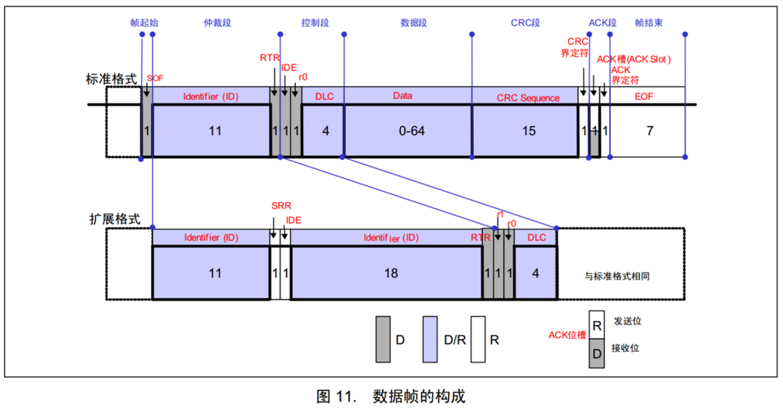

# 一、CAN的5种帧

| **帧类型** | **用途**                               |
| ---------- | -------------------------------------- |
| 数据帧     | 发送设备主动发送数据（广播式）         |
| 遥控帧     | 接收设备主动请求数据（请求式）         |
| 错误帧     | 某个设备检测出错误时向其他设备通知错误 |
| 过载帧     | 接收设备通知其尚未做好接收准备         |
| 帧间隔     | 用于将数据帧及遥控帧与前面的帧分离开   |

# 二、帧格式

## 1. 数据帧

### 1.1 用途

发送设备主动发送数据，属于广播式的通信