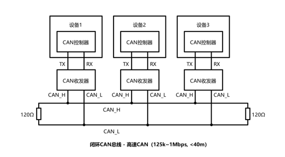
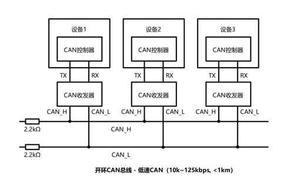
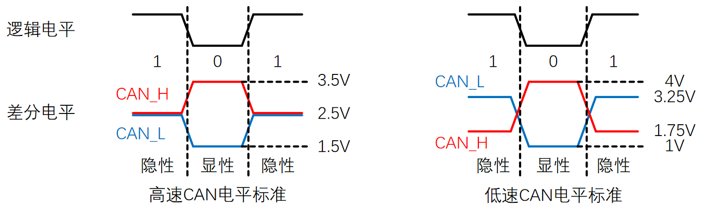

# 一、简介

## 1. CAN总线简介

> **CAN总线（Controller Area Network Bus）控制器局域网总线：**CAN总线是由BOSCH公司开发的一种简洁易用、传输速度快、易扩展、可靠性高的串行通信总线，广泛应用于汽车、嵌入式、工业控制等领域

| **名称** |   **引脚**   | **双工** | **时钟** | **电平** | **设备** | 数据发送 |   **应用场景**   |
| :------: | :----------: | :------: | :------: | :------: | :------: | :------: | :--------------: |
|   CAN    | CAN_H、CAN_L |  半双工  |   异步   |   差分   |  多设备  |   高位   | 多个主控互相通信 |

## 2. CAN总线特征

* 两根通信线（CAN_H、CAN_L），线路少
* 差分信号通信，抗干扰能力强
* 高速CAN（ISO11898）：125k~1Mbps, <40m
* 低速CAN（ISO11519）：10k~125kbps, <1km
* 异步，无需时钟线，通信速率由设备各自约定
* 半双工，可挂载多设备，多设备同时发送数据时通过仲裁判断先后顺序
* 11位/29位报文ID，用于区分消息功能，同时决定优先级
* 可配置1~8字节的有效载荷
* 可实现广播式和请求式两种传输方式
* 应答、CRC校验、位填充、位同步、错误处理等特性

# 二、CAN硬件电路

> * **每个设备通过CAN收发器挂载在CAN总线网络上,CAN收发器提供电平转换、输出驱动、输入采样功能**
> * **MCU/SOC的CAN控制器引出的TX和RX与CAN收发器芯片相连，CAN收发器引出的CAN_H和CAN_L分别与总线的CAN_H和CAN_L相连**
> * **高速CAN使用闭环网络，CAN_H和CAN_L两端添加120Ω的终端电阻，终端电阻防止回波反射，没有设备操作总线的时候可以收紧总线**
>
> * **低速CAN使用开环网络，CAN_H和CAN_L其中一端添加2.2kΩ的终端电阻，终端电阻防止回波反射**

## 1. 高速CAN

## 2. 低速CAN

*[PS] 从硬件可以看出来，高速CAN总线回归隐性要快，所以自然就速度快*

## 3. 电平标准

* CAN总线采用差分信号，即两线电压差（VCAN_H-VCAN_L）传输数据位，**显性电平**需要设备撑开总线，顾名思义显性，**隐性电平**不需要设备撑开，是默认电平，顾名思义隐性
* **高速CAN规定：**	
  * 电压差为0V时表示逻辑 1（隐性电平）	
  * 电压差为2V时表示逻辑 0（显性电平）
* **低速CAN规定：**	
  * 电压差为-1.5V时表示逻辑 1（隐性电平）	
  * 电压差为3V时表示逻辑 0（显性电平）

