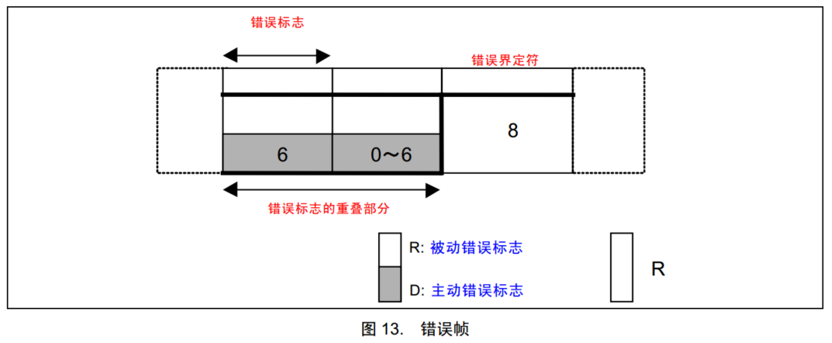
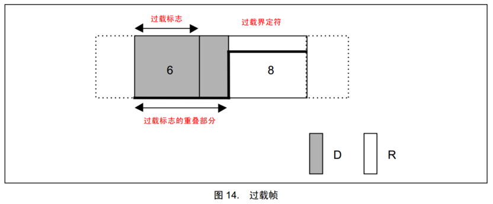
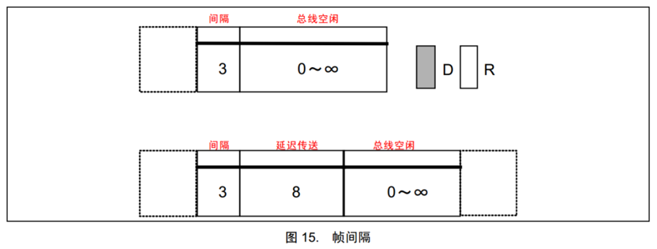

# 一、CAN的5种帧

| **帧类型** | **用途**                               |
| ---------- | -------------------------------------- |
| 数据帧     | 发送设备主动发送数据（广播式）         |
| 遥控帧     | 接收设备主动请求数据（请求式）         |
| 错误帧     | 某个设备检测出错误时向其他设备通知错误 |
| 过载帧     | 接收设备通知其尚未做好接收准备         |
| 帧间隔     | 用于将数据帧及遥控帧与前面的帧分离开   |

# 二、帧格式

## 1. 数据帧

显性（0）：Dominant（D）

隐性（1）：Recessive（R）

### 1.1 用途

发送设备主动发送数据，属于广播式的通信

### 1.2 数据帧拆解

* SOF（Start of Frame）：帧起始，表示后面一段波形为传输的数据位
* ID（Identify）：标识符，区分功能，同时决定优先级
* RTR（Remote Transmission Request ）：远程请求位，区分数据帧和遥控帧（数据帧是显性0遥控帧是隐性1）
* IDE（Identifier Extension）：扩展标志位，区分标准格式和扩展格式
* SRR（Substitute Remote Request）：替代RTR，协议升级时留下的无意义位
* r0/r1（Reserve）：保留位，为后续协议升级留下空间
* DLC（Data Length Code）：数据长度，指示数据段有几个字节（一个字节是8位）
* Data：数据段的1~8个字节有效数据
* CRC（Cyclic Redundancy Check）：循环冗余校验，校验数据是否正确
* ACK（Acknowledgement）：应答位，判断数据有没有被接收方接收,发送方发送隐性1释放总线，接收方发送显性0拉开总线，这个时候发送方检测到总线被拉开，说明接收方应答成功
* CRC/ACK界定符：为应答位前后发送方和接收方释放总线留下时间
* EOF（End of Frame ）：帧结束，表示数据位已经传输完毕

## 2. 遥控帧

### 2.1 用途

遥控帧广播式发送，收到对应ID的设备会在遥控帧之后用数据帧向外发送数据

### 2.2 遥控帧特点

* 遥控帧的ID表示要请求的数据，响应请求的一方会用相同的ID发送反馈数据

* 遥控帧的RTR是隐性1、遥控帧没有数据段，DLC后面直接就是CRC，其他部分都和数据帧一模一样

* 遥控帧的RTR是隐性1，而数据帧的RTR是显性0，所以具有相同ID的遥控帧和数据帧在同时发生的时候一定是数据帧有更高的优先级

* 遥控帧的DLC可以表示我需要请求多少个数据，实际上数据帧有多少个数据应该是规定好了的，只要有ID号和RTR位就可以完成遥控帧了，DLC有时候也可以利用起来传递一些数据

## 3. 错误帧

### 3.1 用途

总线上所有设备都会监督总线的数据，一旦发现“位错误”或“填充错误”或“CRC错误”或“格式错误”或“应答错误” ，这些设备便会发出错误帧来破坏数据，同时终止当前的发送设备

### 3.2 错误帧特点

* 错误分为主动错误和被动错误，所有设备默认处于主动错误状态
* 在**主动错误**下，设备发现总线错误后会连续发送6个显性0，由于CAN总线发送隐性1是释放总线，也就是说在有设备发送显性0拉开总线的时候0和1相遇总是处于显性0，这是CAN总线的**线与**特性
* 6个连续的显性位一定会破坏正常传输的数据，其他设备检测到错误标志（连续6个显性0）就会抛弃当前数据
* 主动错误产生的太频繁了，设备会进入**被动错误**状态,在被动错误状态下检测到错误时候会发送6个隐性1，不会拉开总线，不会破坏其他设备的数据，只会破坏自己发送的数据
* 错误标志后面延长的0~6位错误标志，是因为一个设备发出的错误标志可能引起其他设备连带产生错误标志，所以会叠加一段时间，这样的话错误标志就不止6位了

## 4. 过载帧

### 4.1 用途

当接收方收到大量数据而无法处理时，接收方可以发出过载帧，延缓发送方的数据发送，以平衡总线负载，避免数据丢失

### 4.2 过载帧特点

* 其实过载帧的帧格式和错误帧是一样的，而且也是用线与的特性发送显性0来打破坏总线数据，只是过载帧和错误帧的产生条件和意义不同

## 5. 帧间隔

### 5.1 用途

将数据帧和遥控帧（远程帧）与前面的帧分离开

### 5.2 帧间隔特点

* 主动错误状态的设备帧间隔是三位
* 被动错误状态的设备帧间隔是三位加八位延迟传输
* 被动状态表示设备不太可靠，不可靠就不急着发送数据，延迟传输的话会导致设备在仲裁的时候处于不利的状态，尽量减少此设备干扰总线

