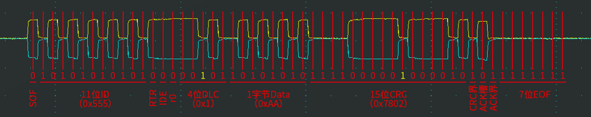
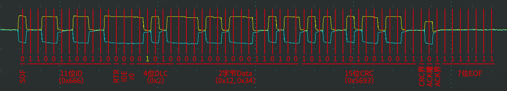
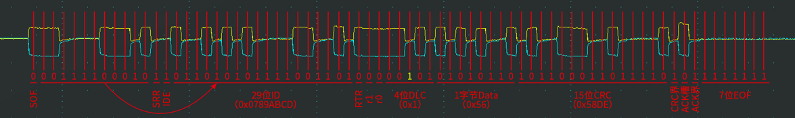
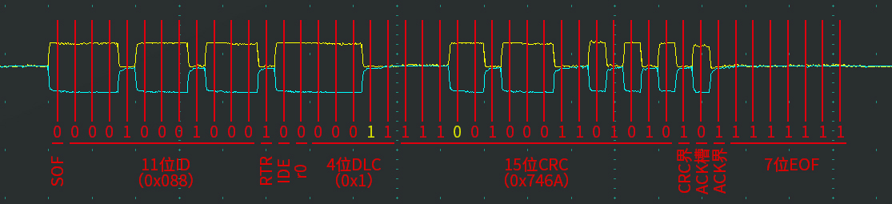

# 一、位填充简介

>  CAN协议规定在发送方连续发送五个相同的电平后会自动追加一个相反的填充位，这就是位填充规则

* 位填充规则：发送方每发送5个相同电平后，自动追加一个相反电平的填充位，接收方检测到填充位时，会自动移除填充位，恢复原始数据，发送方可以视为从前到后循序填充，接收方可以视为从前向后循序移除

* 例如：

  |            |              |                   |                     |
  | ---------- | ------------ | ----------------- | ------------------- |
  | 即将发送   | 100000110    | 10000011110       | 0111111111110       |
  | 实际发送   | 100000`1`110 | 100000`1`1111`0`0 | 011111`0`11111`0`10 |
  | 实际接收   | 100000`1`110 | 100000`1`1111`0`0 | 011111`0`11111`0`10 |
  | 移除填充后 | 100000110    | 10000011110       | 011111`0`11111`0`10 |

* 位填充作用：
  * 增加波形的定时信息，利于接收方执行“再同步”，防止波形长时间无变化，导致接收方不能精确掌握数据采样时机
  * 将正常数据流与“错误帧”和“过载帧”区分开，标志“错误帧”和“过载帧”的特异性
  * 保持CAN总线在发送正常数据流时的活跃状态，防止被误认为总线空闲，因为CAN总线规定总线出现连续11个隐性1后认为总线空闲，如果发送的数据包里真的有很多1，加入了位填充规则后就能避免总线出现错误的空闲状态

# 二、位填充波形图

1. 标准数据帧，报文ID为0x555，数据长度1字节，数据内容为0xAA

2. 标准数据帧，报文ID为0x666，数据长度2字节，数据内容为0x12, 0x34

3. 扩展数据帧，报文ID为0x0789ABCD，数据长度1字节，数据内容为0x56

4. 标准遥控帧，报文ID为0x088，数据长度1字节，无数据内容

